# Visual Curation & Sequence Report: I TEAR UP THE BAY WHEN I COME THROUGH

> **Curation Archetype**: Polyphonic Street Symphony / Lyrical Arc
>
> **Sequence Status**: Validated (Existing sequence affirmed as optimal)
>
> **Hamiltonian Sequence Energy**: `309.6` (Avg Step Cost: `18.2`)
>
> **Respiratory Pacing Score**: `100/100` (2 Inhalations, 11 Exhalations, 5 Grounding)

## 1. Executive Curatorial & Quantitative Architecture

This report quantitatively evaluates the visual narrative arc for **p1**, combining photometric colorimetry (CIELAB L*a*b*, ΔE₇₆), Hamiltonian pairwise transition tension, and multi-agent aesthetic critique.

### 1.1 Photometric Respiratory Waveform

The respiratory luminance waveform maps the photometric breathing rhythm of the essay, balancing luminous expansions with low-key chiaroscuro grounding anchors.

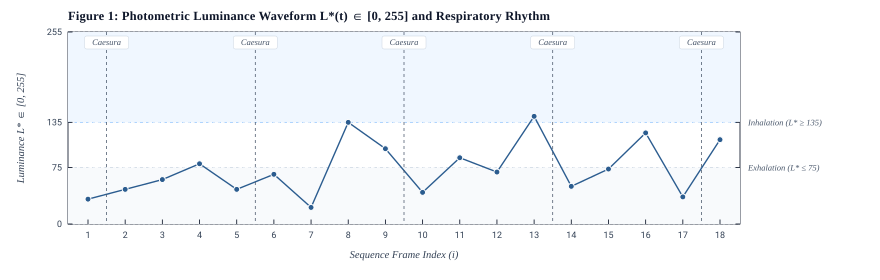

**Figure 1**: Photometric Luminance Waveform `L*(t) ∈ [0, 255]` and Respiratory Rhythm. Shaded regions indicate Inhalation (`L* >= 135`, luminous expansiveness) and Exhalation (`L* <= 75`, chiaroscuro grounding) zones. Vertical dashed lines mark poetic caesuras.

### 1.2 Hamiltonian Pairwise Transition Tension

Pairwise transition energy measures visual friction and cognitive momentum between adjacent frames, decomposed into chromatic distance (ΔE₇₆, 45%), luminance contrast (ΔLum, 35%), and geometric aspect shift (ΔAspect, 20%).

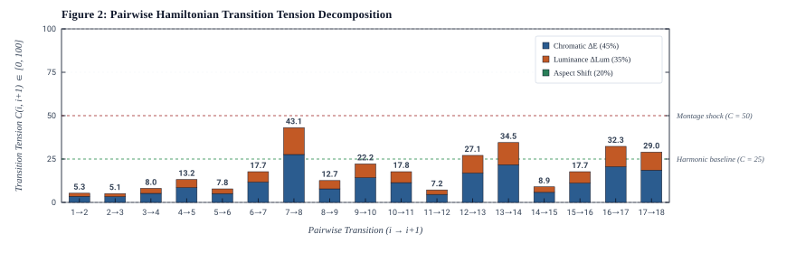

**Figure 2**: Pairwise step cost `C(i, i+1)` decomposed into chromatic, luminance, and aspect variance components. Dashed reference lines define harmonic baseline (`C <= 25`) and montage shock (`C >= 50`) thresholds.

### 1.3 CIELAB Colorimetric Progression & Spatial Cadence

The chromatic spectrum profile charts the physical color evolution across sequential frames alongside metric aspect ratio and spatial framing cadence.

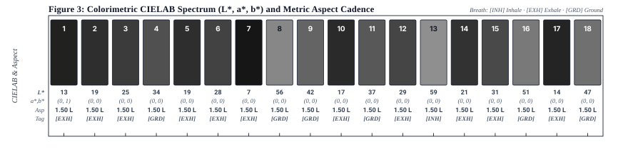

**Figure 3**: Sequential colorimetric profile detailing mean sRGB swatches, CIELAB coordinates (`L*, a*, b*`), aspect ratio, orientation (L/P), and breath type.

## 2. Visual Sequence Journey

### [1/18] DSCF4775.jpg

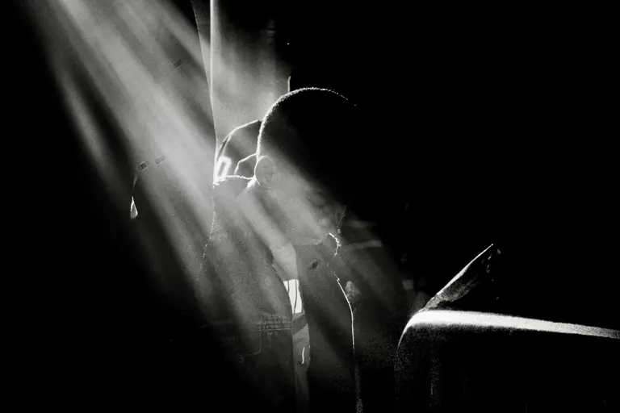

| Attribute | Value |
| :--- | :--- |
| **Framing & Aspect** | `LANDSCAPE` · `2048×1365` (Aspect: `1.50`) |
| **Tonality & Breath** | `L*=12.71` — **Exhalation** (CIELAB: `12.71, -0.24, 0.67`) |
| **Transition to #2 (DSCF8974-2.jpg)** | `ΔE₇₆: 6.27` (Color) · `ΔLum: 13` · **Step Cost: `5.3`** |

**Curatorial Rationale & Montage Dynamic**:

- *Pacing Role*: Act I: The Overture / Celestial Solitude
- *Visual Subject & Content*: Inside a dimly lit transit car, a solitary young passenger sits bowed forward, illuminated by a celestial, dramatic diagonal shaft of sunlight piercing through the darkness.
- *Thematic Meaning*: The transcendent threshold opener of the odyssey. The crepuscular ray transforms an ordinary commute into a sacred, Caravaggesque moment of contemplation before the descent into the nocturnal Bay.
- *Composition & Gaze Vectors*: Dominant diagonal beam descending from the upper left at a 45-degree angle, focusing optical weight onto the subject's bowed head and illuminated shoulders.
- *Transition Dynamic*: Deep chiaroscuro exhalation (L*=12.71) leading into the opening threshold caesura ('The sun goes down / I feel the light betray me') and the hazy night glass.

> **[Poetic Caesura: Musical Rest]**
>
> *The sun goes down*
> *I feel the light betray me*

---

### [2/18] DSCF8974-2.jpg

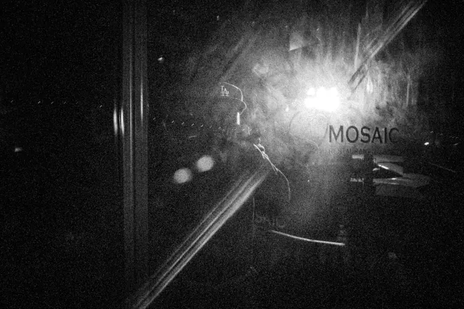

| Attribute | Value |
| :--- | :--- |
| **Framing & Aspect** | `LANDSCAPE` · `2048×1365` (Aspect: `1.50`) |
| **Tonality & Breath** | `L*=18.94` — **Exhalation** (CIELAB: `18.94, 0, 0`) |
| **Transition to #3 (DSCF0361-2.jpg)** | `ΔE₇₆: 5.93` (Color) · `ΔLum: 13` · **Step Cost: `5.1`** |

**Curatorial Rationale & Montage Dynamic**:

- *Pacing Role*: Act I: The Threshold / Mosaic in Smoke
- *Visual Subject & Content*: Through a fogged, reflective restaurant window marked 'MOSAIC', a silhouette in an LA baseball cap stands amidst a flare of ambient backlight and swirling smoke.
- *Thematic Meaning*: The boundary between the observer and the nocturnal street. The textured glass and diffuse light flare establish the dreamlike, hallucinatory texture of the city after dark.
- *Composition & Gaze Vectors*: Strong diagonal handrail slashing through the lower frame, intersecting the intense circular backlight flare behind the subject's cap.
- *Transition Dynamic*: Grainy, low-key exhalation (L*=18.94) dissolving smoothly (ΔE: 5.93) into the kinetic blur of the midnight dancer.

---

### [3/18] DSCF0361-2.jpg

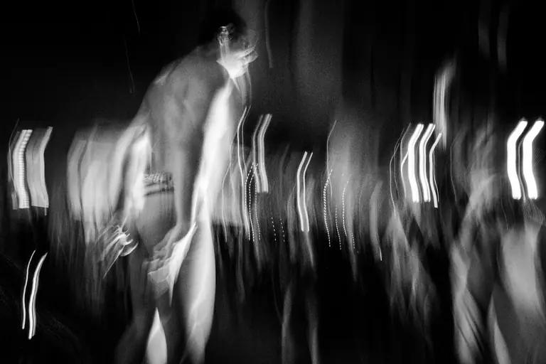

| Attribute | Value |
| :--- | :--- |
| **Framing & Aspect** | `LANDSCAPE` · `2048×1365` (Aspect: `1.50`) |
| **Tonality & Breath** | `L*=24.87` — **Exhalation** (CIELAB: `24.87, 0, 0`) |
| **Transition to #4 (DSCF8927-2.jpg)** | `ΔE₇₆: 9.16` (Color) · `ΔLum: 21` · **Step Cost: `8`** |

**Curatorial Rationale & Montage Dynamic**:

- *Pacing Role*: Act I: Kinetic Genesis / The Midnight Dancer
- *Visual Subject & Content*: A shirtless street performer or runner moving dynamically across a night plaza, captured in long exposure with vertical ribbons of shimmering light trailing behind their torso and limbs.
- *Thematic Meaning*: The liberation of the physical body in the urban night. The shutter transfigures flesh into fluid energy, echoing Daido Moriyama's raw kinetic velocity.
- *Composition & Gaze Vectors*: Vertical undulating light trails pulsating across the mid-ground, anchored by the strong upward spine vector of the moving subject.
- *Transition Dynamic*: Dynamic kinetic exhalation (L*=24.87) accelerating into the direct flash portrait of the laughing passenger.

---

### [4/18] DSCF8927-2.jpg

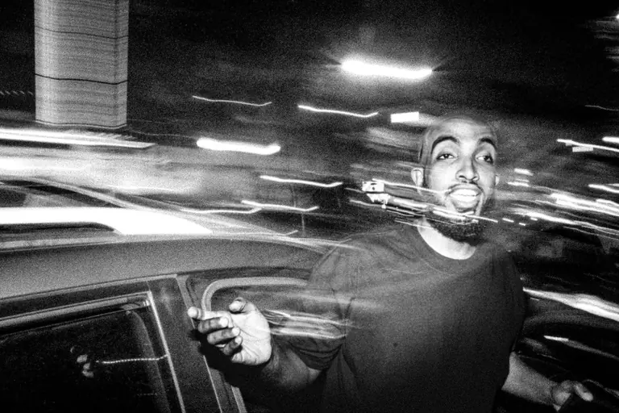

| Attribute | Value |
| :--- | :--- |
| **Framing & Aspect** | `LANDSCAPE` · `2048×1365` (Aspect: `1.50`) |
| **Tonality & Breath** | `L*=34.03` — **Neutral** (CIELAB: `34.03, 0, 0`) |
| **Transition to #5 (DSCF8961-2.jpg)** | `ΔE₇₆: 15.09` (Color) · `ΔLum: 34` · **Step Cost: `13.2`** |

**Curatorial Rationale & Montage Dynamic**:

- *Pacing Role*: Act I: Euphoric Slipstream / Laughter in Motion
- *Visual Subject & Content*: Direct flash portrait of a smiling Black man with an outstretched hand leaning beside a car, frozen against horizontal motion-blurred streaks of passing headlights and neon.
- *Thematic Meaning*: Spontaneous street joy and nocturnal camaraderie. The fusion of razor-sharp flash and long-exposure motion blur captures the ecstatic pulse of Bay Area youth culture.
- *Composition & Gaze Vectors*: Horizontal light streaks rushing from left to right, punctuated by the subject's expressive open palm and engaged forward gaze.
- *Transition Dynamic*: Neutral luminance bridge (L*=34.03) stepping down into the intimate tension of the parking lot trio.

---

### [5/18] DSCF8961-2.jpg

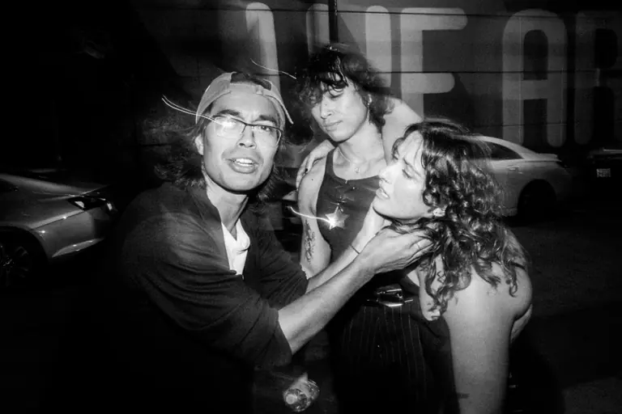

| Attribute | Value |
| :--- | :--- |
| **Framing & Aspect** | `LANDSCAPE` · `2048×1365` (Aspect: `1.50`) |
| **Tonality & Breath** | `L*=18.94` — **Exhalation** (CIELAB: `18.94, 0, 0`) |
| **Transition to #6 (DSCF7141.jpg)** | `ΔE₇₆: 9.03` (Color) · `ΔLum: 20` · **Step Cost: `7.8`** |

**Curatorial Rationale & Montage Dynamic**:

- *Pacing Role*: Act I: The Triumvirate / Line Art Encounter
- *Visual Subject & Content*: Three young companions gathered outside against a wall bearing typography ('THE ART'): a man in a backwards cap and wire glasses reaches out to adjust his friend's collar while another leans in behind them.
- *Thematic Meaning*: Intimate choreography and tactile affection in the city's margins. The casual posture and direct eye contact reveal the tender, protective micro-bonds formed in the night.
- *Composition & Gaze Vectors*: Horizontal arm reaching across the frame from left to right, creating a triangle of intimate gazes framed by the bold typographic background.
- *Transition Dynamic*: Low-key exhalation (L*=18.94) flowing into the second poetic caesura ('Far from the world of you and I / Where oceans bleed into the sky') and the transit wanderer.

> **[Poetic Caesura: Musical Rest]**
>
> *Far from the world of you and I*
> *Where oceans bleed into the sky*

---

### [6/18] DSCF7141.jpg

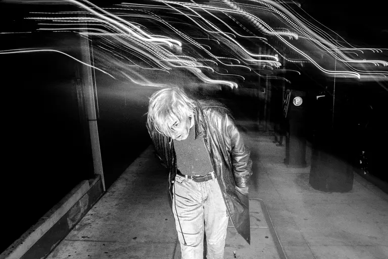

| Attribute | Value |
| :--- | :--- |
| **Framing & Aspect** | `LANDSCAPE` · `2048×1365` (Aspect: `1.50`) |
| **Tonality & Breath** | `L*=27.97` — **Exhalation** (CIELAB: `27.97, 0, 0`) |
| **Transition to #7 (R0002885-2.jpg)** | `ΔE₇₆: 20.72` (Color) · `ΔLum: 44` · **Step Cost: `17.7`** |

**Curatorial Rationale & Montage Dynamic**:

- *Pacing Role*: Act II: Subterranean Drift / The Platform Strider
- *Visual Subject & Content*: A blonde man in an oversized leather trench coat strides along an open transit platform at night, bending forward beneath an electric canopy of sweeping overhead light trails.
- *Thematic Meaning*: The restless, solitary urban wanderer. The sweeping overhead light arcs evoke the invisible electromagnetic veins of the metropolis propelling the figure into the unknown.
- *Composition & Gaze Vectors*: Sweeping parabolic light trails across the upper third framing the central downward-leaning vertical mass of the walker.
- *Transition Dynamic*: Deep exhalation anchor (L*=27.97) descending into the dark, monolithic silhouette of Sutro Tower.

---

### [7/18] R0002885-2.jpg

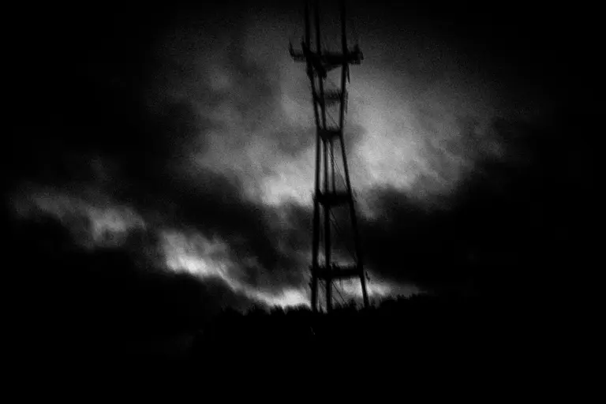

| Attribute | Value |
| :--- | :--- |
| **Framing & Aspect** | `LANDSCAPE` · `2048×1365` (Aspect: `1.50`) |
| **Tonality & Breath** | `L*=7.25` — **Exhalation** (CIELAB: `7.25, 0, 0`) |
| **Transition to #8 (DSCF2432-2.jpg)** | `ΔE₇₆: 49.07` (Color) · `ΔLum: 113` · **Step Cost: `43.1`** |

**Curatorial Rationale & Montage Dynamic**:

- *Pacing Role*: Act II: The Fog Monolith / Sutro in Darkness
- *Visual Subject & Content*: The stark, three-legged silhouette of Sutro Tower piercing through brooding nocturnal fog and cloud layers over the pitch-black ridgeline of the San Francisco hills.
- *Thematic Meaning*: The iconic spectral monument of the Bay Area. Shrouded in fog, Sutro stands as an imposing, mystical beacon guarding the city's nocturnal dreams.
- *Composition & Gaze Vectors*: Steep vertical needle vector bisecting the dark sky, grounded by the solid black horizontal landmass below.
- *Transition Dynamic*: Deepest exhalation anchor of the entire essay (L*=7.25, Lum: 22) triggering a massive montage shock leap (ΔE: 49.07, ΔLum: 113) into the incandescent takeover smoke.

---

### [8/18] DSCF2432-2.jpg

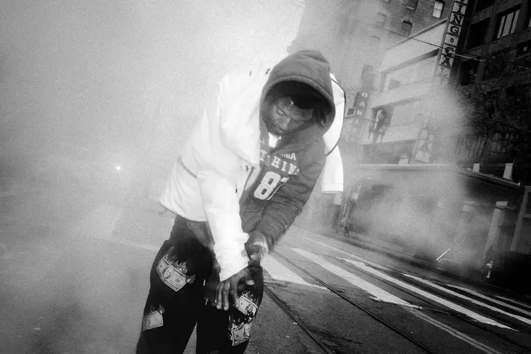

| Attribute | Value |
| :--- | :--- |
| **Framing & Aspect** | `LANDSCAPE` · `2048×1365` (Aspect: `1.50`) |
| **Tonality & Breath** | `L*=56.32` — **Neutral** (CIELAB: `56.32, 0, -0.01`) |
| **Transition to #9 (DSCF6943.jpg)** | `ΔE₇₆: 13.95` (Color) · `ΔLum: 35` · **Step Cost: `12.7`** |

**Curatorial Rationale & Montage Dynamic**:

- *Pacing Role*: Act II: The Whiteout / Smoke on the Tracks
- *Visual Subject & Content*: A young man in a hooded white puffer jacket stands in the center of San Francisco tram tracks, enveloped in a dense billowing cloud of white tire smoke or street steam.
- *Thematic Meaning*: The explosive climax of street takeover energy. The brilliant whiteout of tire smoke transforms the asphalt grid into a surreal, dreamlike battleground of urban velocity.
- *Composition & Gaze Vectors*: Diagonal tram tracks converging into the foggy distance, framing the central grounded figure looking downward at his hands.
- *Transition Dynamic*: Expansive neutral inhalation wave (L*=56.32) flowing into the cosmic transcendence of the celestial crosswalk.

---

### [9/18] DSCF6943.jpg

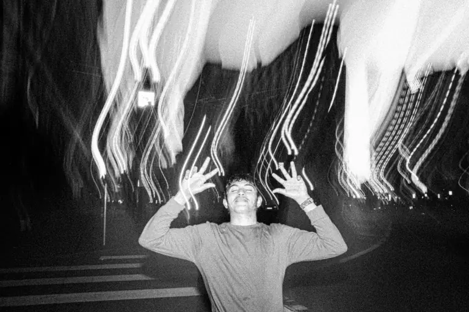

| Attribute | Value |
| :--- | :--- |
| **Framing & Aspect** | `LANDSCAPE` · `2048×1365` (Aspect: `1.50`) |
| **Tonality & Breath** | `L*=42.37` — **Neutral** (CIELAB: `42.37, 0, -0.01`) |
| **Transition to #10 (DSCF2441-3.jpg)** | `ΔE₇₆: 25.31` (Color) · `ΔLum: 58` · **Step Cost: `22.2`** |

**Curatorial Rationale & Montage Dynamic**:

- *Pacing Role*: Act II: The Cosmic Shower / Euphoric Benediction
- *Visual Subject & Content*: A young man stands on a street crosswalk with closed eyes, a serene smile, and raised hands with splayed fingers, bathed in vertical ribbons of falling light trails like a celestial shower.
- *Thematic Meaning*: Pure spiritual ecstasy in the urban slipstream. The subject surrenders completely to the night, receiving the falling light trails as a cosmic benediction.
- *Composition & Gaze Vectors*: Centrifugal vertical light rain cascading from above, framed by the subject's symmetrical raised arms and upward-tilted face.
- *Transition Dynamic*: Luminous anchor (L*=42.37) yielding to the third poetic caesura ('God save us everyone / Will we burn inside the fires / of a thousand suns') and the solemn streetwalker.

> **[Poetic Caesura: Musical Rest]**
>
> *God save us everyone*
> *Will we burn inside the fires*
> *of a thousand suns*

---

### [10/18] DSCF2441-3.jpg

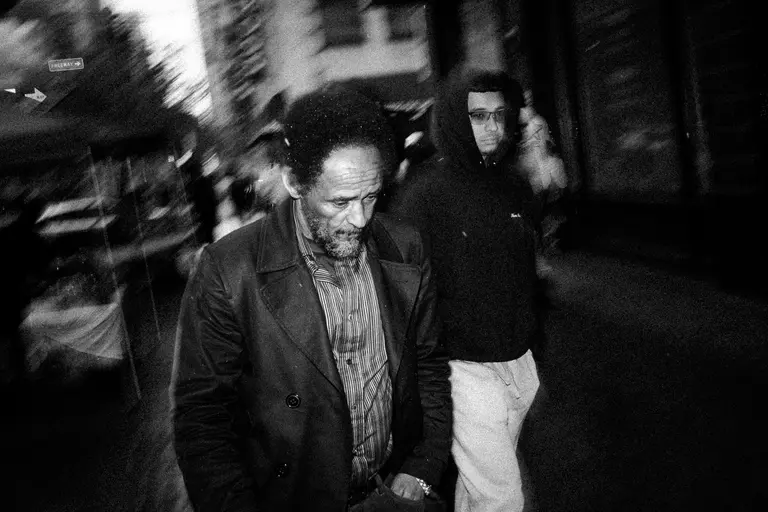

| Attribute | Value |
| :--- | :--- |
| **Framing & Aspect** | `LANDSCAPE` · `2048×1365` (Aspect: `1.50`) |
| **Tonality & Breath** | `L*=17.06` — **Exhalation** (CIELAB: `17.06, 0, 0`) |
| **Transition to #11 (DSCF1157.jpg)** | `ΔE₇₆: 20.35` (Color) · `ΔLum: 46` · **Step Cost: `17.8`** |

**Curatorial Rationale & Montage Dynamic**:

- *Pacing Role*: Act III: Streetwise Gravity / The Trench Coat Walker
- *Visual Subject & Content*: A middle-aged Black man with an afro and beard walks through motion-blurred city crowds in a dark overcoat and striped shirt, his downward introspective gaze accompanied by a hooded companion behind.
- *Thematic Meaning*: Humanist depth and lived experience. Amidst the kinetic frenzy of nightlife, this portrait anchors the series in quiet dignity, resilience, and contemplative weight.
- *Composition & Gaze Vectors*: Forward walking vector cutting through centrifugal motion blur on the left, anchored by the subject's steady downward eye line.
- *Transition Dynamic*: Low-key exhalation (L*=17.06) stepping up into the social connection of the window handshake.

---

### [11/18] DSCF1157.jpg

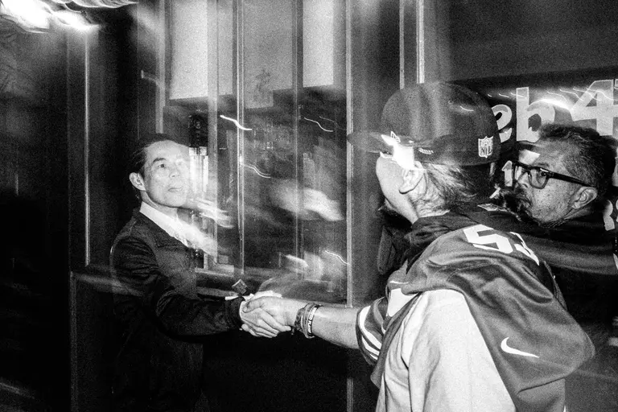

| Attribute | Value |
| :--- | :--- |
| **Framing & Aspect** | `LANDSCAPE` · `2048×1365` (Aspect: `1.50`) |
| **Tonality & Breath** | `L*=37.41` — **Neutral** (CIELAB: `37.41, 0, 0`) |
| **Transition to #12 (DSCF5423-5.jpg)** | `ΔE₇₆: 8.12` (Color) · `ΔLum: 19` · **Step Cost: `7.2`** |

**Curatorial Rationale & Montage Dynamic**:

- *Pacing Role*: Act III: The Pact / Window Handshake
- *Visual Subject & Content*: A firm handshake between an Asian man in a sharp jacket inside/beside a window and a fan in a sports jersey and cap, while a companion in thick glasses watches closely.
- *Thematic Meaning*: The ritual of street alliance and brotherhood across cultural boundaries. The electric flash freezes a micro-second of trust and mutual recognition.
- *Composition & Gaze Vectors*: Horizontal clasp of hands forming the central focal axis, flanked by the triangular gaze vectors of the three participants.
- *Transition Dynamic*: Neutral luminance bridge (L*=37.41) leading into the radical, jarring perspective of the Jordan sole.

---

### [12/18] DSCF5423-5.jpg

| Attribute | Value |
| :--- | :--- |
| **Framing & Aspect** | `LANDSCAPE` · `2048×1365` (Aspect: `1.50`) |
| **Tonality & Breath** | `L*=29.29` — **Exhalation** (CIELAB: `29.29, 0, 0`) |
| **Transition to #13 (DSCF1093.jpg)** | `ΔE₇₆: 30.11` (Color) · `ΔLum: 74` · **Step Cost: `27.1`** |

**Curatorial Rationale & Montage Dynamic**:

- *Pacing Role*: Act III: The Decisive Stomp / Sole of the City
- *Visual Subject & Content*: An extreme low-angle macro perspective dominated by the geometric circular tread and Jumpman logo of an Air Jordan 6 sole hovering directly over the lens, with a woman's blurred face visible in the shadows.
- *Thematic Meaning*: The raw tactile footprint of street culture. The sneaker tread becomes an architectural monument, confronting the viewer with the unvarnished weight of urban style and physical presence.
- *Composition & Gaze Vectors*: Dominant diagonal oval mass of the sneaker sole dominating the upper-left quadrant, pointing down toward the shadowed face.
- *Transition Dynamic*: Low-key exhalation (L*=29.29) catapulting into the blinding flash crescendo of the illuminated crowd.

---

### [13/18] DSCF1093.jpg

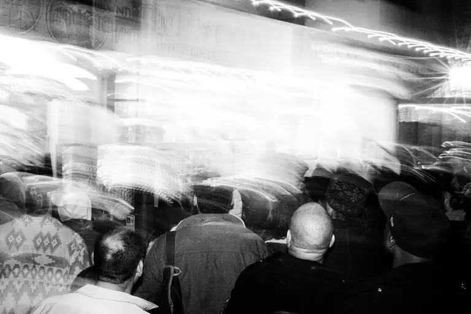

| Attribute | Value |
| :--- | :--- |
| **Framing & Aspect** | `LANDSCAPE` · `2048×1365` (Aspect: `1.50`) |
| **Tonality & Breath** | `L*=59.4` — **Inhalation** (CIELAB: `59.4, 0, -0.01`) |
| **Transition to #14 (286FC1B3-5576-440B-8718-2E872C98E713.JPG)** | `ΔE₇₆: 38.61` (Color) · `ΔLum: 93` · **Step Cost: `34.5`** |

**Curatorial Rationale & Montage Dynamic**:

- *Pacing Role*: Act III: Symphonies of Blinding Light / The Crowd Surge
- *Visual Subject & Content*: A dense gathering of spectators viewed from behind, their heads and shoulders silhouetted against a radiant, blinding wave of pure white light washing over a storefront.
- *Thematic Meaning*: The collective experience of sensory transcendence. The blinding light dissolves individual boundaries into a unified chorus of urban witnesses, perfectly matching the fourth caesura.
- *Composition & Gaze Vectors*: Horizontal wave of radiant overexposure sweeping across the upper two-thirds, anchored by the curved silhouettes of the crowd below.
- *Transition Dynamic*: Highest Inhalation peak of the essay (L*=59.40, Lum: 143) flowing into the fourth poetic caesura ('When I close my eyes tonight / To symphonies of blinding light') and the geometric halo.

> **[Poetic Caesura: Musical Rest]**
>
> *When I close my eyes tonight*
> *To symphonies of blinding light*

---

### [14/18] 286FC1B3-5576-440B-8718-2E872C98E713.JPG

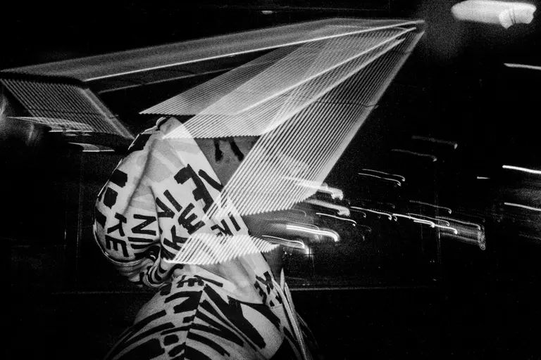

| Attribute | Value |
| :--- | :--- |
| **Framing & Aspect** | `LANDSCAPE` · `2048×1364` (Aspect: `1.50`) |
| **Tonality & Breath** | `L*=20.79` — **Exhalation** (CIELAB: `20.79, 0, 0`) |
| **Transition to #15 (DSCF5891-9.JPG)** | `ΔE₇₆: 10.24` (Color) · `ΔLum: 23` · **Step Cost: `8.9`** |

**Curatorial Rationale & Montage Dynamic**:

- *Pacing Role*: Act IV: The Prismatic Crown / Origami of Light
- *Visual Subject & Content*: A hooded figure in a patterned Nike hoodie seen in three-quarter rear profile, crowned by a geometric, diamond-faceted canopy of reflected linear light rays resembling an origami halo.
- *Thematic Meaning*: The sanctification of the street wanderer. Optical reflection transforms an everyday urban hoodie into an ethereal crown of geometric illumination.
- *Composition & Gaze Vectors*: Faceted angular lines of the light canopy converging in a dynamic diamond structure directly above the subject's hooded profile.
- *Transition Dynamic*: Low-key exhalation (L*=20.79) elevating into the expansive high-angle view of the rain-slicked boulevard.

---

### [15/18] DSCF5891-9.JPG

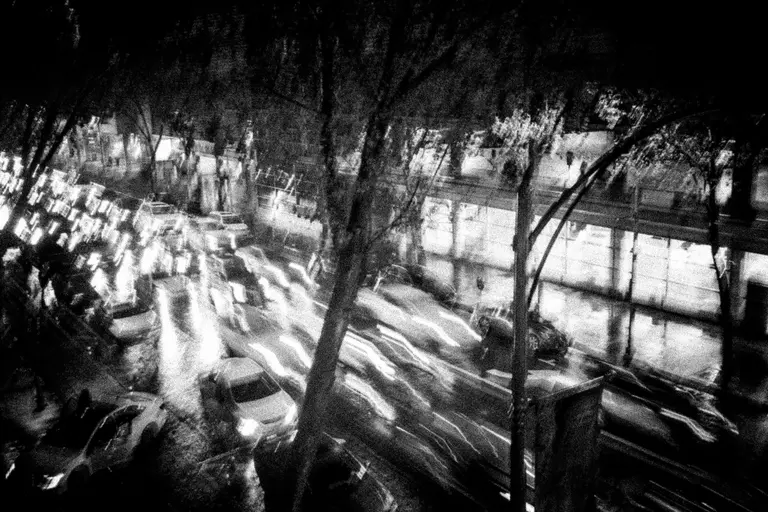

| Attribute | Value |
| :--- | :--- |
| **Framing & Aspect** | `LANDSCAPE` · `2048×1365` (Aspect: `1.50`) |
| **Tonality & Breath** | `L*=31.03` — **Exhalation** (CIELAB: `31.03, 0, 0`) |
| **Transition to #16 (DSCF5903-2.JPG)** | `ΔE₇₆: 19.8` (Color) · `ΔLum: 48` · **Step Cost: `17.7`** |

**Curatorial Rationale & Montage Dynamic**:

- *Pacing Role*: Act IV: The Wet Arteries / Rain Boulevard
- *Visual Subject & Content*: High-angle perspective looking down upon a rain-soaked city avenue at night, where streaks of vehicle headlamps blur along the asphalt beneath silhouetted trees and shining storefronts.
- *Thematic Meaning*: The nocturnal circulatory system of the metropolis. Wet asphalt acts as a mirror, multiplying the city's kinetic pulse into shimmering streams of liquid silver.
- *Composition & Gaze Vectors*: Diagonal flow of traffic streaking from the upper left down to the center right, framed by the vertical trunks of city trees.
- *Transition Dynamic*: Exhalation bridge (L*=31.03) resolving into the close-up cockpit of the speeding vintage car.

---

### [16/18] DSCF5903-2.JPG

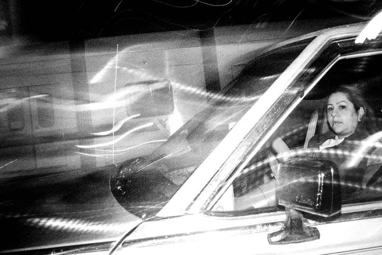

| Attribute | Value |
| :--- | :--- |
| **Framing & Aspect** | `LANDSCAPE` · `2048×1365` (Aspect: `1.50`) |
| **Tonality & Breath** | `L*=50.83` — **Neutral** (CIELAB: `50.83, 0, -0.01`) |
| **Transition to #17 (DSCF4402-8.jpg)** | `ΔE₇₆: 36.63` (Color) · `ΔLum: 85` · **Step Cost: `32.3`** |

**Curatorial Rationale & Montage Dynamic**:

- *Pacing Role*: Act IV: Nocturnal Velocity / The Driver's Gaze
- *Visual Subject & Content*: Direct flash capture through the driver-side window of a woman behind the wheel of a classic car, staring forward with intense focus amidst wrapping ribbons of headlight trails.
- *Thematic Meaning*: Steely resolve and autonomous navigation through the night. The driver commands the cockpit, insulated yet completely immersed in the velocity of the dark city.
- *Composition & Gaze Vectors*: Strong diagonal frame of the car's A-pillar and windshield framing the driver's locked horizontal forward gaze.
- *Transition Dynamic*: Neutral luminance crest (L*=50.83) transitioning into the meta-confessional mirror self-portrait.

---

### [17/18] DSCF4402-8.jpg

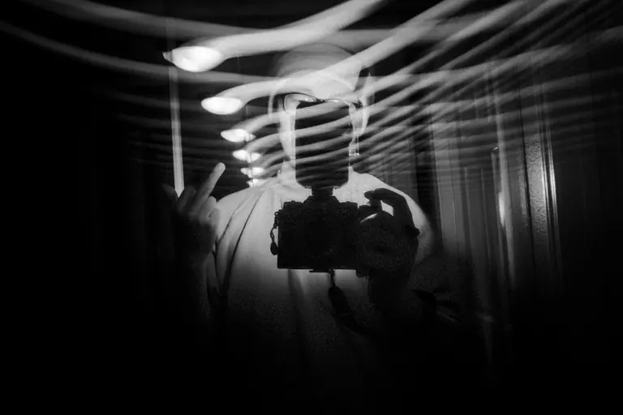

| Attribute | Value |
| :--- | :--- |
| **Framing & Aspect** | `LANDSCAPE` · `2048×1365` (Aspect: `1.50`) |
| **Tonality & Breath** | `L*=14.2` — **Exhalation** (CIELAB: `14.2, 0, 0`) |
| **Transition to #18 (DSCF5916-4.JPG)** | `ΔE₇₆: 33.04` (Color) · `ΔLum: 76` · **Step Cost: `29`** |

**Curatorial Rationale & Montage Dynamic**:

- *Pacing Role*: Act IV: The Meta-Confessional / Mirror and Flash
- *Visual Subject & Content*: A self-portrait in a darkened mirror: the photographer holds a camera with an on-camera flash, defiantly raising a middle finger through a cascading ribcage of horizontal light trails.
- *Thematic Meaning*: The meta-reflective confessional signature. The creator breaks the fourth wall, asserting their rebellious agency and authorial presence in the slipstream of the Bay.
- *Composition & Gaze Vectors*: Undulating horizontal light waves wrapping across the photographer's chest and lens, centered on the vertical silhouette of the raised middle finger.
- *Transition Dynamic*: Deep exhalation anchor (L*=14.20) leading into the final poetic caesura ('Lift me up, let me go / Lift me up, let me go') and the climactic coda.

> **[Poetic Caesura: Musical Rest]**
>
> *Lift me up, let me go*
> *Lift me up, let me go*

---

### [18/18] DSCF5916-4.JPG

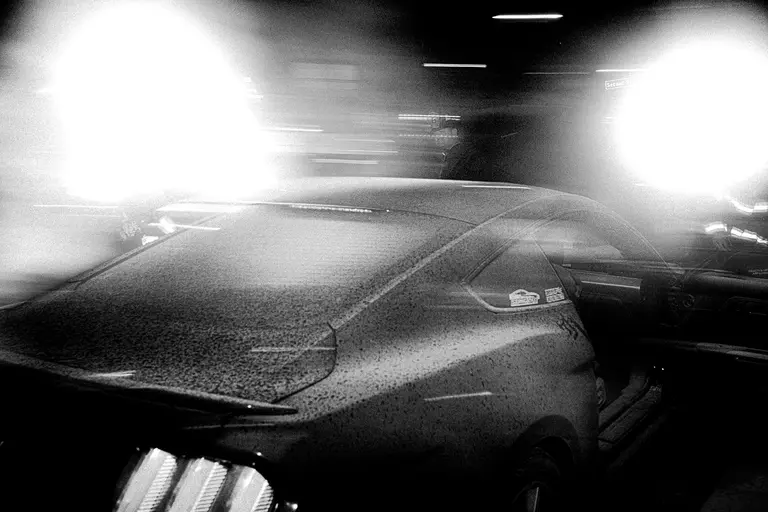

| Attribute | Value |
| :--- | :--- |
| **Framing & Aspect** | `LANDSCAPE` · `2048×1365` (Aspect: `1.50`) |
| **Tonality & Breath** | `L*=47.24` — **Neutral** (CIELAB: `47.24, 0, -0.01`) |

**Curatorial Rationale & Montage Dynamic**:

- *Pacing Role*: Act IV: Coda / Supernova on Wheels
- *Visual Subject & Content*: A sleek Mustang in the midnight shadows, its rear glass dusted with dew, flanked and illuminated by two blinding white floodlight orbs blazing like twin supernovas into the lens.
- *Thematic Meaning*: The ultimate visual resolution of the series title: 'I TEAR UP THE BAY WHEN I COME THROUGH'. The twin blinding suns extinguish the darkness in a final, incandescent roar of nocturnal triumph.
- *Composition & Gaze Vectors*: Two powerful circular light flares commanding the left and right upper quadrants, framing the dark metallic contours of the departing vehicle.
- *Transition Dynamic*: Final resting resolution frame of the visual odyssey.

---

## 3. Curatorial Proposals & Optimized Sequence Arc

The current sequence displays **optimal rhythmic pacing** (100/100) with harmonic alternation across Inhalation, Exhalation, and Neutral anchor frames.
