# Visual Curation & Sequence Report: I DO NOT CARE IF WE GO DOWN IN HISTORY AS BARBARIANS

> **Curation Archetype**: Polyphonic Street Symphony / Lyrical Arc
>
> **Sequence Status**: Validated (Existing sequence affirmed as optimal)
>
> **Hamiltonian Sequence Energy**: `373.0` (Avg Step Cost: `18.6`)
>
> **Respiratory Pacing Score**: `100/100` (3 Inhalations, 6 Exhalations, 12 Grounding)

## 1. Executive Curatorial & Quantitative Architecture

This report quantitatively evaluates the visual narrative arc for **p2**, combining photometric colorimetry (CIELAB `L*a*b*`, ΔE₇₆), Hamiltonian pairwise transition tension, and multi-agent aesthetic critique.

### 1.1 Photometric Respiratory Waveform

The respiratory luminance waveform maps the photometric breathing rhythm of the essay, balancing luminous expansions with low-key chiaroscuro grounding anchors.

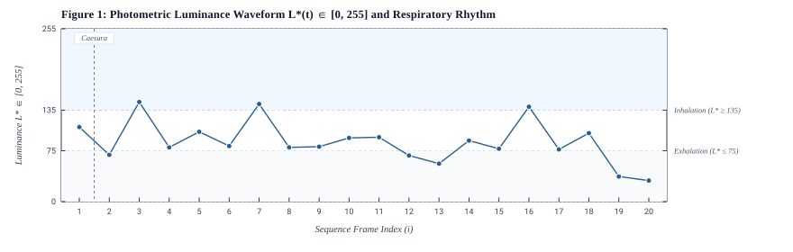

**Figure 1**: Photometric Luminance Waveform `L*(t) ∈ [0, 255]` and Respiratory Rhythm. Shaded regions indicate Inhalation (`L* >= 135`, luminous expansiveness) and Exhalation (`L* <= 75`, chiaroscuro grounding) zones. Vertical dashed lines mark poetic caesuras.

### 1.2 Hamiltonian Pairwise Transition Tension

Pairwise transition energy measures visual friction and cognitive momentum between adjacent frames, decomposed into chromatic distance (ΔE₇₆, 45%), luminance contrast (ΔLum, 35%), and geometric aspect shift (ΔAspect, 20%).

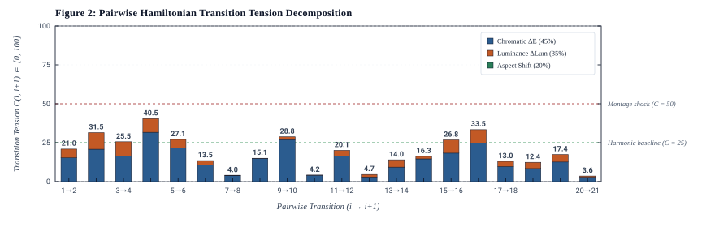

**Figure 2**: Pairwise step cost `C(i, i+1)` decomposed into chromatic, luminance, and aspect variance components. Dashed reference lines define harmonic baseline (`C <= 25`) and montage shock (`C >= 50`) thresholds.

### 1.3 CIELAB Colorimetric Progression & Spatial Cadence

The chromatic spectrum profile charts the physical color evolution across sequential frames alongside metric aspect ratio and spatial framing cadence.

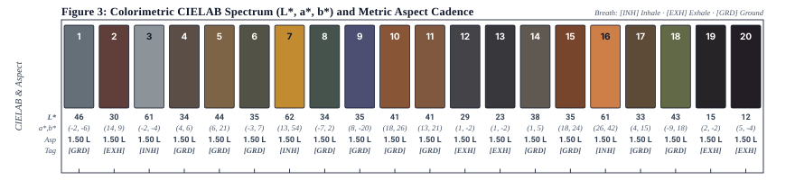

**Figure 3**: Sequential colorimetric profile detailing mean sRGB swatches, CIELAB coordinates (`L*, a*, b*`), aspect ratio, orientation (L/P), and breath type.

## 2. Visual Sequence Journey

### [1/21] DSCF4295-2.JPG

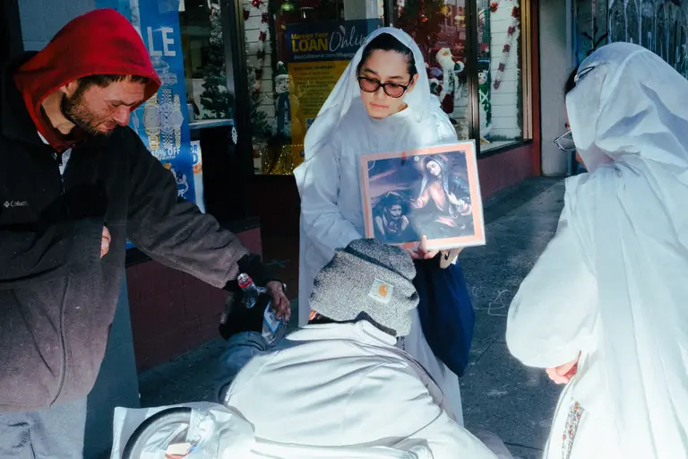

| Attribute | Value |
| :--- | :--- |
| **Framing & Aspect** | `LANDSCAPE` · `2048×1365` (Aspect: `1.50`) |
| **Tonality & Breath** | `L*=46.3` — **Neutral** (CIELAB: `46.3, -1.73, -6.27`) |
| **Transition to #2 (R0002358.JPG)** | `ΔE₇₆: 27.27` (Color) · `ΔLum: 41` · **Step Cost: `21`** |

**Curatorial Rationale & Montage Dynamic**:

- *Pacing Role*: Act I: The Overture / The Manifesto / The Moral Crossroad
- *Visual Subject & Content*: Outside a commercial storefront under sale banners, two women in white religious habits hold a sacred icon of the Madonna and Child before a man in a wheelchair, while a companion in a red hood passes him a bottle of alcohol.
- *Thematic Meaning*: The foundational manifesto of the series: the visceral collision between institutional spiritual promises and immediate, earthly survival. The subject chooses the tangible solidarity of liquor over ethereal dogma, establishing the defiant 'barbarian' ethos.
- *Composition & Gaze Vectors*: Triangular confrontation between the standing white-robed proselytizers, the leaning man in the red hood, and the central seated figure in the grey beanie.
- *Transition Dynamic*: Harmonic bridge into the curatorial manifesto, followed by the weary gazes of the bar window.

> **[Poetic Caesura: Musical Rest]**
>
> *In the first photograph, the man in a beanie was making a choice. When being offered the spiritual solace of religion and God, he decided to opt for the ephemeral material comfort of alcohol from his fellow man. Zhuang pressed the shutter as he strongly felt that the beanie man was voicing out a manifesto, and he wanted to deliver the message far and wide. We are the people; we are the drowned; we are the terribly forgotten and forsaken. Our dreams, beliefs, and prides are long long gone. And guess what’s the deal? We do not care if we go down in history as barbarians, not anymore.*

---

### [2/21] R0002358.JPG

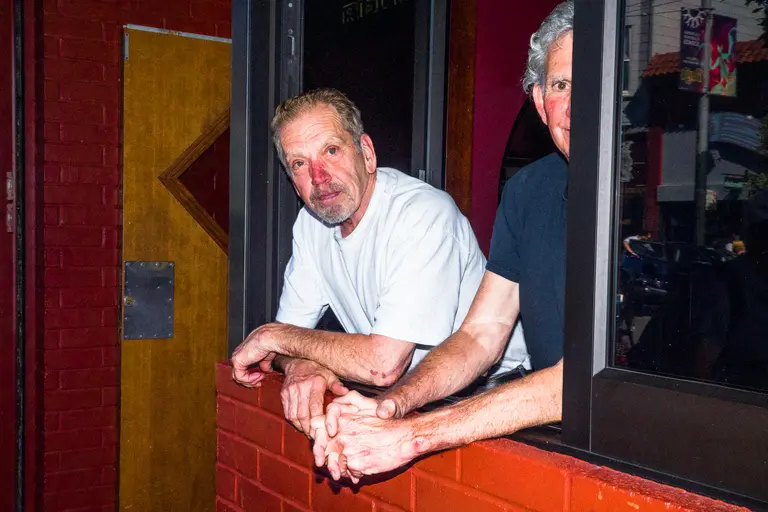

| Attribute | Value |
| :--- | :--- |
| **Framing & Aspect** | `LANDSCAPE` · `2048×1365` (Aspect: `1.50`) |
| **Tonality & Breath** | `L*=30` — **Exhalation** (CIELAB: `30, 14.34, 8.56`) |
| **Transition to #3 (DSCF0883-3.jpg)** | `ΔE₇₆: 37.01` (Color) · `ΔLum: 78` · **Step Cost: `31.5`** |

**Curatorial Rationale & Montage Dynamic**:

- *Pacing Role*: Act I: Working-Class Stoicism / The Bar Window
- *Visual Subject & Content*: Two middle-aged men leaning out of a red brick bar window, hands tightly clasped over the sill. The foreground man in a plain white t-shirt gazes directly into the lens with bloodshot, weathered eyes, while his companion watches with a sly grin.
- *Thematic Meaning*: An unvarnished look at working-class exhaustion and camaraderie in the urban margins. Their clasped hands and world-weary gazes capture raw human vulnerability and quiet resilience.
- *Composition & Gaze Vectors*: Horizontal sill dividing the frame, with the prominent interlocking hands anchoring the lower quadrant and direct eye contact commanding the upper half.
- *Transition Dynamic*: Deep exhalation anchor (`L*=30.00`) leading into the luminous skyward fervor of street evangelism.

---

### [3/21] DSCF0883-3.jpg

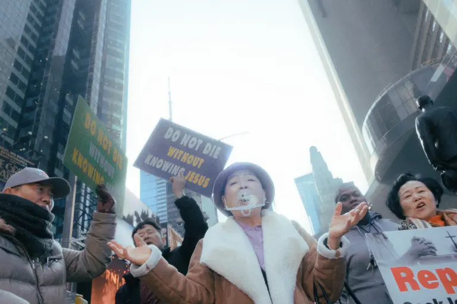

| Attribute | Value |
| :--- | :--- |
| **Framing & Aspect** | `LANDSCAPE` · `2048×1365` (Aspect: `1.50`) |
| **Tonality & Breath** | `L*=60.86` — **Inhalation** (CIELAB: `60.86, -1.64, -4.16`) |
| **Transition to #4 (DSCF5163-8.JPG)** | `ΔE₇₆: 29.07` (Color) · `ΔLum: 67` · **Step Cost: `25.5`** |

**Curatorial Rationale & Montage Dynamic**:

- *Pacing Role*: Act I: The Street Revival / Do Not Die Without Jesus
- *Visual Subject & Content*: Low-angle street perspective looking up at towering skyscrapers: an older woman in a clear protective visor raises her hands in ecstatic prayer, flanked by street preachers holding vibrant signs reading 'DO NOT DIE WITHOUT KNOWING JESUS'.
- *Thematic Meaning*: Spiritual angst in the shadow of high finance. The fervent, desperate plea for salvation collides visually with the gleaming, impassive glass monoliths of the financial district.
- *Composition & Gaze Vectors*: Dramatic upward perspective vectors along the soaring skyscraper facades, framed by the outstretched praying hands pointing skyward.
- *Transition Dynamic*: Luminous inhalation (`L*=60.86`) descending into the sleek, high-contrast sunlight of the commercial boulevard.

---

### [4/21] DSCF5163-8.JPG

| Attribute | Value |
| :--- | :--- |
| **Framing & Aspect** | `LANDSCAPE` · `2048×1365` (Aspect: `1.50`) |
| **Tonality & Breath** | `L*=34.14` — **Neutral** (CIELAB: `34.14, 3.7, 5.97`) |
| **Transition to #5 (DSCF8444-3.jpg)** | `ΔE₇₆: 56.35` (Color) · `ΔLum: 64` · **Step Cost: `40.5`** |

**Curatorial Rationale & Montage Dynamic**:

- *Pacing Role*: Act II: Consumerist Runway / The Sunlight Strut
- *Visual Subject & Content*: A woman in dark sunglasses, an ornate cream blouse, and a diaphanous pink tulle skirt strides forward carrying a shopping bag, flanked by male companions in sharp jackets in high-contrast afternoon sunlight.
- *Thematic Meaning*: The theater of urban vanity. Fashion and consumerism operate as armor against urban existential angst, bathed in the sharp, revealing chiaroscuro of downtown light.
- *Composition & Gaze Vectors*: Direct forward vector of the walking figures bisecting deep diagonal wall shadows, creating strong planar depth.
- *Transition Dynamic*: High-contrast daylight strut leaps into the golden underground velocity and defiant gaze of the BART platform.

---

### [5/21] DSCF8444-3.jpg

| Attribute | Value |
| :--- | :--- |
| **Framing & Aspect** | `LANDSCAPE` · `2048×1365` (Aspect: `1.50`) |
| **Tonality & Breath** | `L*=61.78` — **Inhalation** (CIELAB: `61.78, 12.62, 54.26`) |
| **Transition to #6 (DSCF8593-3.jpg)** | `ΔE₇₆: 38.19` (Color) · `ΔLum: 41` · **Step Cost: `27.1`** |

**Curatorial Rationale & Montage Dynamic**:

- *Pacing Role*: Act II: Underground Defiance / The BART Platform
- *Visual Subject & Content*: A young Black traveler in a mustard-yellow jacket and backpack stands on a subway platform with crossed arms, casting a piercing, defiant backward glance as a golden BART train blurs past.
- *Thematic Meaning*: A quintessential decisive moment of street defiance. The subject's steady, unyielding gaze cuts through the subterranean speed of transit, demanding recognition.
- *Composition & Gaze Vectors*: Strong horizontal velocity vector of the moving train contrasted against the rigid vertical posture and locked gaze of the commuter.
- *Transition Dynamic*: High-key chromatic burst (`L*=61.78`) cascades into the frenetic kinetic streaks of Chinatown crosswalks.

---

### [6/21] DSCF8593-3.jpg

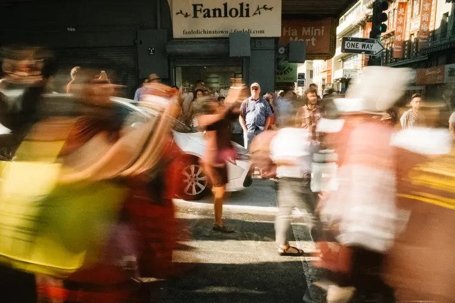

| Attribute | Value |
| :--- | :--- |
| **Framing & Aspect** | `LANDSCAPE` · `2048×1365` (Aspect: `1.50`) |
| **Tonality & Breath** | `L*=44.22` — **Neutral** (CIELAB: `44.22, 6.15, 20.97`) |
| **Transition to #7 (DSCF8402-3.jpg)** | `ΔE₇₆: 18.81` (Color) · `ΔLum: 21` · **Step Cost: `13.5`** |

**Curatorial Rationale & Montage Dynamic**:

- *Pacing Role*: Act II: Urban Velocity / Chinatown Slipstream
- *Visual Subject & Content*: Long-exposure motion blur capturing a flurry of pedestrians rushing across a Chinatown intersection under 'Fanloli' and 'One Way' street signs, with a stationary man in a blue shirt standing calm in the background.
- *Thematic Meaning*: The disorienting speed and density of modern metropolis life. The frantic, smeared limbs of the crowd contrast with the motionless stillness of the observer, visualizing the fugitive tempo of urban existence.
- *Composition & Gaze Vectors*: Centrifugal streaks of red, yellow, and white clothing sweeping horizontally across the asphalt.
- *Transition Dynamic*: Kinetic blur resolves into the solemn, solitary crosswalk walk of the commuter.

---

### [7/21] DSCF8402-3.jpg

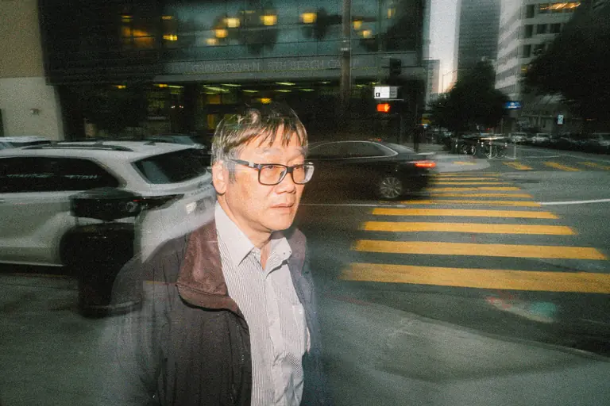

| Attribute | Value |
| :--- | :--- |
| **Framing & Aspect** | `LANDSCAPE` · `2048×1365` (Aspect: `1.50`) |
| **Tonality & Breath** | `L*=34.85` — **Neutral** (CIELAB: `34.85, -3.03, 7.49`) |
| **Transition to #8 (DSCF3433.jpg)** | `ΔE₇₆: 6.7` (Color) · `ΔLum: 2` · **Step Cost: `4`** |

**Curatorial Rationale & Montage Dynamic**:

- *Pacing Role*: Act II: The Weary Commuter / Financial Crosswalk
- *Visual Subject & Content*: An older Asian man in wire glasses and a dark jacket walks across a bold yellow zebra crossing at twilight, with corporate office lobbies and sleek vehicles looming in the reflective background.
- *Thematic Meaning*: The quiet alienation of the modern worker. Amidst corporate architecture and crosswalk markers, the subject carries an introspective, weary gravity.
- *Composition & Gaze Vectors*: Horizontal yellow crosswalk stripes receding into the distance, intersected by the solitary upright figure walking forward.
- *Transition Dynamic*: Twilight crosswalk harmonizes seamlessly (ΔE: 6.70) into the nocturnal freedom of the car roof.

---

### [8/21] DSCF3433.jpg

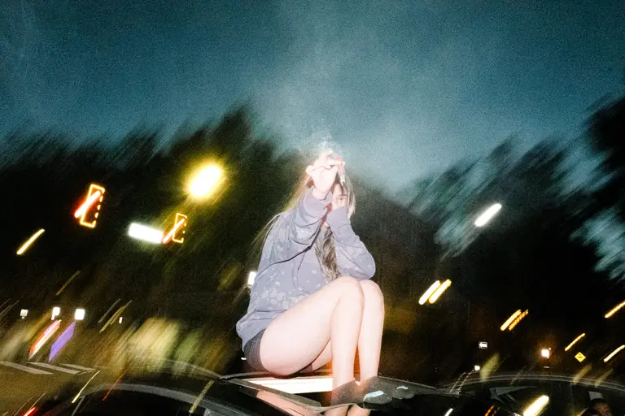

| Attribute | Value |
| :--- | :--- |
| **Framing & Aspect** | `LANDSCAPE` · `2048×1365` (Aspect: `1.50`) |
| **Tonality & Breath** | `L*=33.93` — **Neutral** (CIELAB: `33.93, -7.11, 2.26`) |
| **Transition to #9 (A20E2E39-AF83-4FD0-A6F7-3D2243A753DC.JPG)** | `ΔE₇₆: 26.57` (Color) · `ΔLum: 1` · **Step Cost: `15.1`** |

**Curatorial Rationale & Montage Dynamic**:

- *Pacing Role*: Act III: Nocturnal Defiance / The Sunroof Rebel
- *Visual Subject & Content*: A young woman in an oversized grey sweatshirt sits perched on the sunroof of a vehicle at night, raising a joint or lighter toward the sky as glowing yellow streetlights streak around her.
- *Thematic Meaning*: Youthful transgression and nocturnal liberation. Escaping the confines of the vehicle cabin, the subject commands the city night in a spontaneous act of carefree ecstasy.
- *Composition & Gaze Vectors*: Vertical seated posture rising above the roofline, surrounded by radial motion-blurred light trails.
- *Transition Dynamic*: Kinetic vehicle velocity settles into the contemplative neon stillness of the stoop.

---

### [9/21] A20E2E39-AF83-4FD0-A6F7-3D2243A753DC.JPG

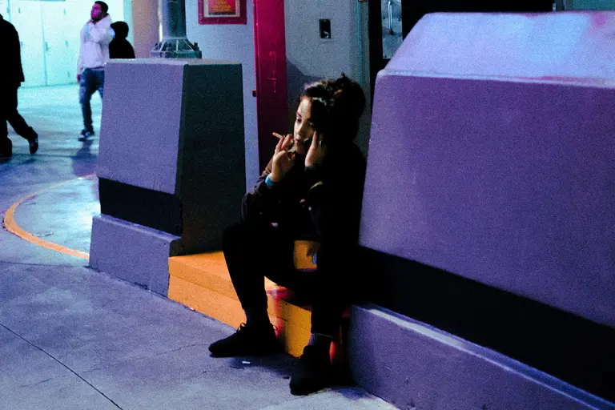

| Attribute | Value |
| :--- | :--- |
| **Framing & Aspect** | `LANDSCAPE` · `2048×1364` (Aspect: `1.50`) |
| **Tonality & Breath** | `L*=34.64` — **Neutral** (CIELAB: `34.64, 7.54, -19.89`) |
| **Transition to #10 (DSCF0406-2.JPG)** | `ΔE₇₆: 47.97` (Color) · `ΔLum: 13` · **Step Cost: `28.8`** |

**Curatorial Rationale & Montage Dynamic**:

- *Pacing Role*: Act III: Neon Solitude / The Stoop Smoke
- *Visual Subject & Content*: A young woman in dark attire sits alone on a yellow concrete curb under atmospheric magenta and violet neon lighting outside a doorway, smoking a cigarette while on a phone call.
- *Thematic Meaning*: Cinematic isolation in the neon-lit metropolis. The intense chromatic palette evokes Todd Hido and Edward Hopper, capturing the private, intimate melancholy of city nights.
- *Composition & Gaze Vectors*: Triangular seated silhouette anchored by the bright yellow step, framed by massive purple architectural pylons.
- *Transition Dynamic*: Cool neon stillness transitions into the warm, swirling fire of street light painting.

---

### [10/21] DSCF0406-2.JPG

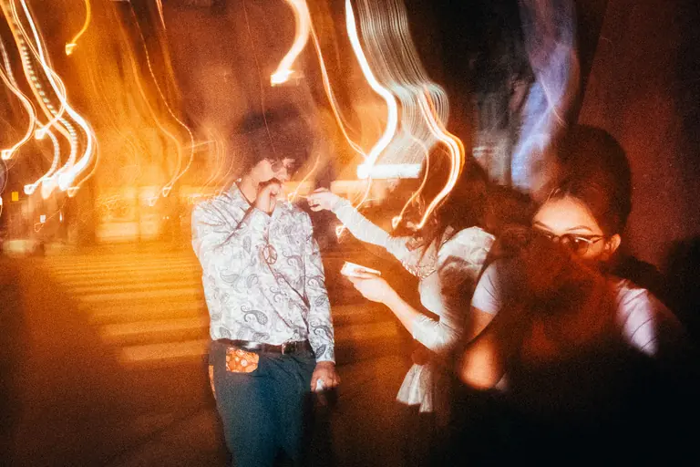

| Attribute | Value |
| :--- | :--- |
| **Framing & Aspect** | `LANDSCAPE` · `2048×1365` (Aspect: `1.50`) |
| **Tonality & Breath** | `L*=41.36` — **Neutral** (CIELAB: `41.36, 18.41, 26.35`) |
| **Transition to #11 (DSCF7203-9.jpg)** | `ΔE₇₆: 7.28` (Color) · `ΔLum: 1` · **Step Cost: `4.2`** |

**Curatorial Rationale & Montage Dynamic**:

- *Pacing Role*: Act III: Nocturnal Alchemy / Paisley and Fire
- *Visual Subject & Content*: A man in an afro, round spectacles, and a vintage paisley shirt lights a cigarette on a night crosswalk, surrounded by companions and dynamic amber ribbon-like light streaks.
- *Thematic Meaning*: The transfiguration of night street life into glowing ritual. Direct flash combined with long exposure transforms a casual smoke into an alchemical, magical-realist tableau.
- *Composition & Gaze Vectors*: Parabolic amber light ribbons cascading down from above, framing the central figure and outstretched hands.
- *Transition Dynamic*: Harmonic chromatic bridge into the smoldering red haze of the casino strip.

---

### [11/21] DSCF7203-9.jpg

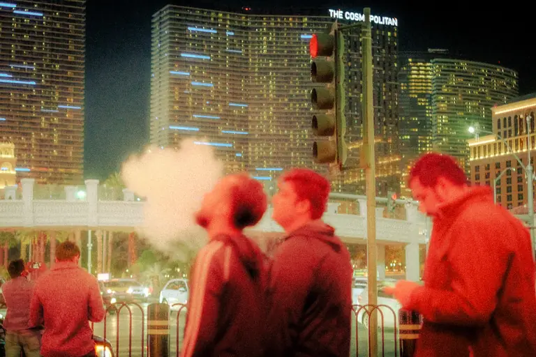

| Attribute | Value |
| :--- | :--- |
| **Framing & Aspect** | `LANDSCAPE` · `2048×1365` (Aspect: `1.50`) |
| **Tonality & Breath** | `L*=41.1` — **Neutral** (CIELAB: `41.1, 13.39, 21.08`) |
| **Transition to #12 (DSCF5150-4.JPG)** | `ΔE₇₆: 29.09` (Color) · `ΔLum: 27` · **Step Cost: `20.1`** |

**Curatorial Rationale & Montage Dynamic**:

- *Pacing Role*: Act III: Crimson Smog / The Cosmopolitan Exhalation
- *Visual Subject & Content*: Outside 'The Cosmopolitan' skyscraper under glowing red traffic signals, a man tilts his head back to exhale a dense white plume of vape smoke into the night air as bystanders in red outerwear look on.
- *Thematic Meaning*: Sensory overload and synthetic escape in the entertainment capital. The crimson saturation and billowing exhalation embody the feverish, hyper-real atmosphere of nocturnal spectacle.
- *Composition & Gaze Vectors*: Vertical smoke plume rising toward the traffic light, balanced by the horizontal line of the bridge railing.
- *Transition Dynamic*: Crimson fever yields to the cool, dignified chiaroscuro of the elderly walker.

---

### [12/21] DSCF5150-4.JPG

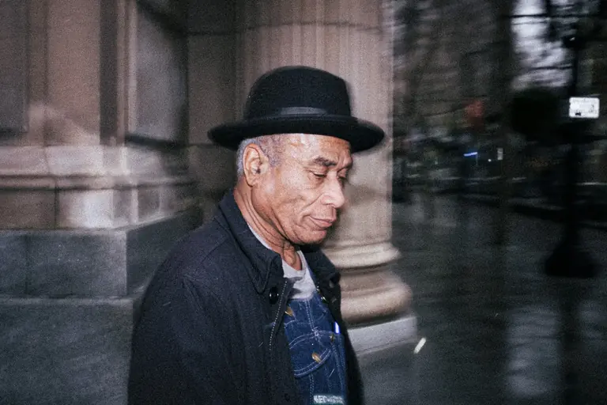

| Attribute | Value |
| :--- | :--- |
| **Framing & Aspect** | `LANDSCAPE` · `2048×1365` (Aspect: `1.50`) |
| **Tonality & Breath** | `L*=28.64` — **Exhalation** (CIELAB: `28.64, 1.32, -2.27`) |
| **Transition to #13 (DSCF8772.jpg)** | `ΔE₇₆: 5.34` (Color) · `ΔLum: 12` · **Step Cost: `4.7`** |

**Curatorial Rationale & Montage Dynamic**:

- *Pacing Role*: Act IV: Timeless Dignity / The Fedora in the Rain
- *Visual Subject & Content*: Chiaroscuro profile of an elderly Black gentleman wearing a black fedora and denim overalls, walking past classical fluted stone columns on a wet, reflective city pavement.
- *Thematic Meaning*: Quiet grace and enduring resilience. The subject's etched facial profile and vintage attire evoke a timeless human dignity that transcends modern urban alienation.
- *Composition & Gaze Vectors*: Diagonal forward momentum of the walker echoing the vertical fluting of the classical stone columns.
- *Transition Dynamic*: Deep exhalation anchor (`L*=28.64`) stepping into the shadowed alcove of the forsaken.

---

### [13/21] DSCF8772.jpg

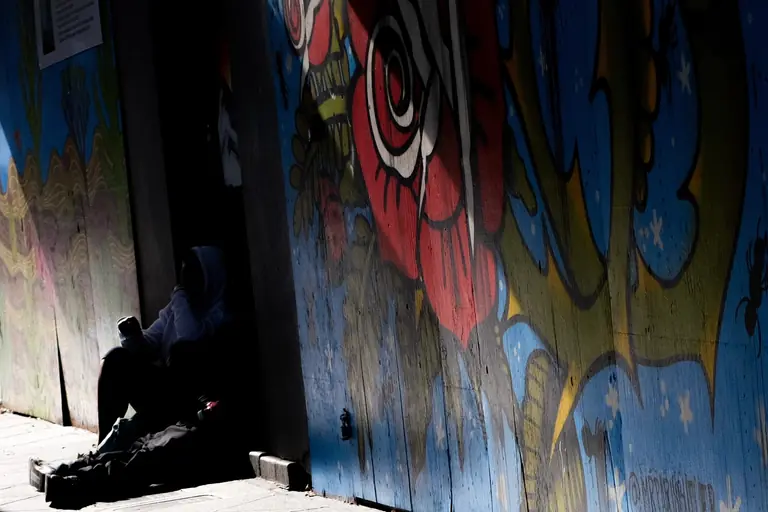

| Attribute | Value |
| :--- | :--- |
| **Framing & Aspect** | `LANDSCAPE` · `1676×1117` (Aspect: `1.50`) |
| **Tonality & Breath** | `L*=23.3` — **Exhalation** (CIELAB: `23.3, 1.37, -2.34`) |
| **Transition to #14 (DSCF3495-2.jpg)** | `ΔE₇₆: 16.56` (Color) · `ΔLum: 34` · **Step Cost: `14`** |

**Curatorial Rationale & Montage Dynamic**:

- *Pacing Role*: Act IV: The Forsaken Corner / Weeping Rose
- *Visual Subject & Content*: A hooded figure sits curled in deep black shadow in a narrow street doorway, juxtaposed against a brightly colored mural featuring a weeping red rose and blue wooden panels.
- *Thematic Meaning*: A poignant visual embodiment of the 'drowned, terribly forgotten and forsaken'. The harsh contrast between the vibrant public mural and the swallowed human shadow speaks directly to the core manifesto.
- *Composition & Gaze Vectors*: Deep vertical wedge of black shadow slicing between the sunlit sidewalk and the painted blue wooden wall.
- *Transition Dynamic*: Deep low-key exhalation (`L*=23.30`) leading into the introspective sidewalk smoker.

---

### [14/21] DSCF3495-2.jpg

| Attribute | Value |
| :--- | :--- |
| **Framing & Aspect** | `LANDSCAPE` · `1860×1240` (Aspect: `1.50`) |
| **Tonality & Breath** | `L*=38.18` — **Neutral** (CIELAB: `38.18, 1.06, 4.91`) |
| **Transition to #15 (DSCF0418-2.JPG)** | `ΔE₇₆: 26` (Color) · `ΔLum: 12` · **Step Cost: `16.3`** |

**Curatorial Rationale & Montage Dynamic**:

- *Pacing Role*: Act IV: Grated Sanctuary / The Night Smoker
- *Visual Subject & Content*: A young Black man with dreadlocks under a black hoodie stands beside a security gate, smoking with a golden watch glistening on his wrist amidst streaking red and white car light trails.
- *Thematic Meaning*: Streetwise vigilance and self-possession. Leaning against the metal grate, the subject maintains a calm, observant eye amidst the surrounding city chaos.
- *Composition & Gaze Vectors*: Strong vertical axis of the figure and security gate juxtaposed with horizontal kinetic light streaks.
- *Transition Dynamic*: Kinetic energy builds into the chaotic roadside incident.

---

### [15/21] DSCF0418-2.JPG

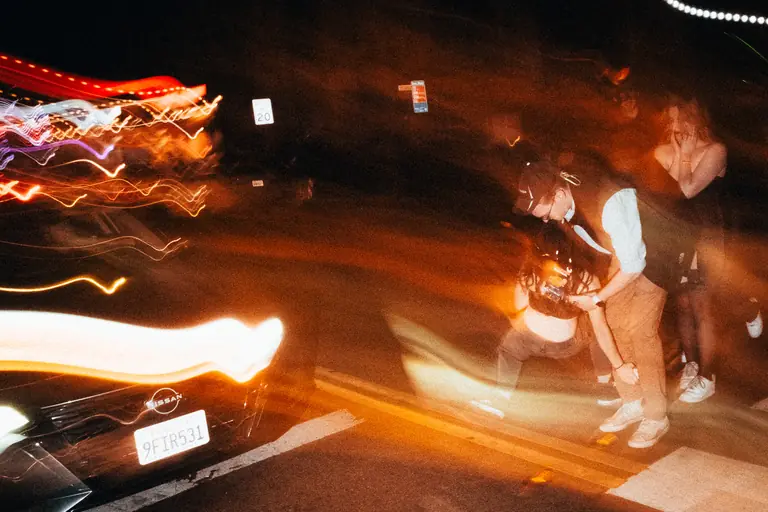

| Attribute | Value |
| :--- | :--- |
| **Framing & Aspect** | `LANDSCAPE` · `2048×1365` (Aspect: `1.50`) |
| **Tonality & Breath** | `L*=34.58` — **Neutral** (CIELAB: `34.58, 18.45, 23.9`) |
| **Transition to #16 (DSCF8739.jpg)** | `ΔE₇₆: 32.56` (Color) · `ΔLum: 62` · **Step Cost: `26.8`** |

**Curatorial Rationale & Montage Dynamic**:

- *Pacing Role*: Act IV: Roadside Vulnerability / The Fallen Moment
- *Visual Subject & Content*: Flash capture of a sudden commotion behind a black Nissan: friends rush to assist a woman on the asphalt as streaking red tail-lights and orange headlight flares slice across the frame.
- *Thematic Meaning*: The precarious edge of nightlife. Behind the gloss and celebration lies immediate vulnerability, physical misstep, and the hasty support of companions in the dark.
- *Composition & Gaze Vectors*: Chaotic diagonal light trails streaking across the upper frame, pointing down to the crouching figures on the pavement.
- *Transition Dynamic*: Roadside commotion accelerates into the defiant glare of the Yukon driver.

---

### [16/21] DSCF8739.jpg

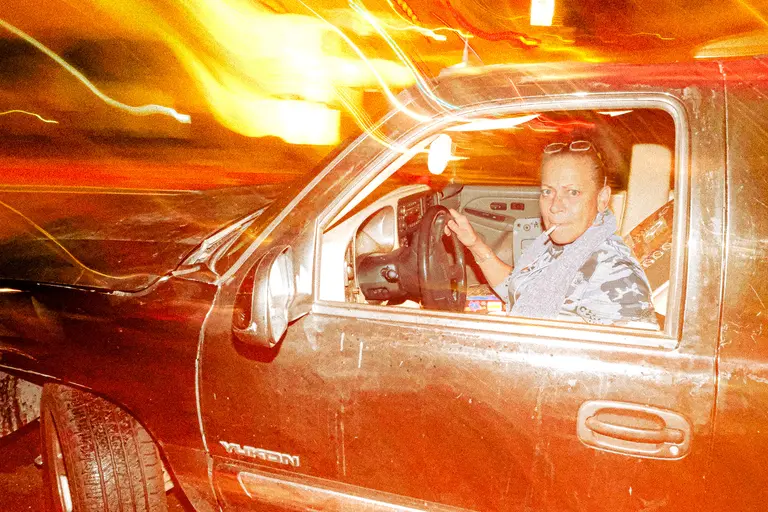

| Attribute | Value |
| :--- | :--- |
| **Framing & Aspect** | `LANDSCAPE` · `2048×1365` (Aspect: `1.50`) |
| **Tonality & Breath** | `L*=60.58` — **Inhalation** (CIELAB: `60.58, 25.6, 42.15`) |
| **Transition to #17 (DSCF3487-3.jpg)** | `ΔE₇₆: 44.12` (Color) · `ΔLum: 63` · **Step Cost: `33.5`** |

**Curatorial Rationale & Montage Dynamic**:

- *Pacing Role*: Act IV: Incandescent Defiance / The Yukon Cockpit
- *Visual Subject & Content*: An older woman with glasses on her forehead and a cigarette in her mouth commands the steering wheel of a GMC Yukon truck, captured in intense direct flash against swirling yellow and orange light trails.
- *Thematic Meaning*: Raw, unapologetic defiance. Pounding the pavement behind heavy machinery, the driver stares down the camera with unvarnished authenticity—a living avatar of the 'barbarian' spirit.
- *Composition & Gaze Vectors*: Strong horizontal mass of the truck door and window framing the driver's locked gaze and hands on the wheel.
- *Transition Dynamic*: High-key inhalation crest (`L*=60.58`) transitioning into the collective street ritual of the midnight haircut.

---

### [17/21] DSCF3487-3.jpg

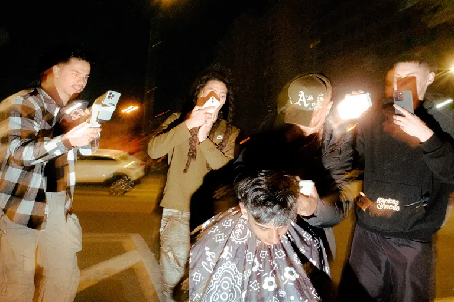

| Attribute | Value |
| :--- | :--- |
| **Framing & Aspect** | `LANDSCAPE` · `2048×1365` (Aspect: `1.50`) |
| **Tonality & Breath** | `L*=33.21` — **Neutral** (CIELAB: `33.21, 4.42, 14.78`) |
| **Transition to #18 (DSCF3445-2.jpg)** | `ΔE₇₆: 17.22` (Color) · `ΔLum: 24` · **Step Cost: `13`** |

**Curatorial Rationale & Montage Dynamic**:

- *Pacing Role*: Act V: Nocturnal Ritual / The Street Barber
- *Visual Subject & Content*: A young man seated in a patterned cape receives a haircut on a dark city street, surrounded by four friends holding up mobile phone flashlights and camera gimbals to illuminate the barber's clippers.
- *Thematic Meaning*: Improvisational community ritual. Grooming becomes an act of collective street theater, transforming an asphalt corner into an illuminated stage of fraternal care.
- *Composition & Gaze Vectors*: Centripetal convergence of phone flashlights and gazes pointing inward toward the seated youth's head.
- *Transition Dynamic*: Community warmth shifts to the weathered, solitary green-wall portrait.

---

### [18/21] DSCF3445-2.jpg

| Attribute | Value |
| :--- | :--- |
| **Framing & Aspect** | `LANDSCAPE` · `2048×1365` (Aspect: `1.50`) |
| **Tonality & Breath** | `L*=42.91` — **Neutral** (CIELAB: `42.91, -9.4, 18.14`) |
| **Transition to #19 (DSCF7452.JPG)** | `ΔE₇₆: 14.89` (Color) · `ΔLum: 29` · **Step Cost: `12.4`** |

**Curatorial Rationale & Montage Dynamic**:

- *Pacing Role*: Act V: Weathered Watchfulness / The Green Wall
- *Visual Subject & Content*: Direct flash portrait of an older blonde woman with vibrant red lipstick in a flecked sweater, crossing her arms defensively against a textured deep-green exterior wall.
- *Thematic Meaning*: Survival and protective self-containment. Her intense gaze and crossed arms reflect a lifetime of weathering urban storms, holding her ground in the modern city.
- *Composition & Gaze Vectors*: Compact central triangular posture anchored against the flat, unadorned olive-green plane.
- *Transition Dynamic*: Grounded human portrait yields to the harsh transactional isolation of the automated parking station.

---

### [19/21] DSCF7452.JPG

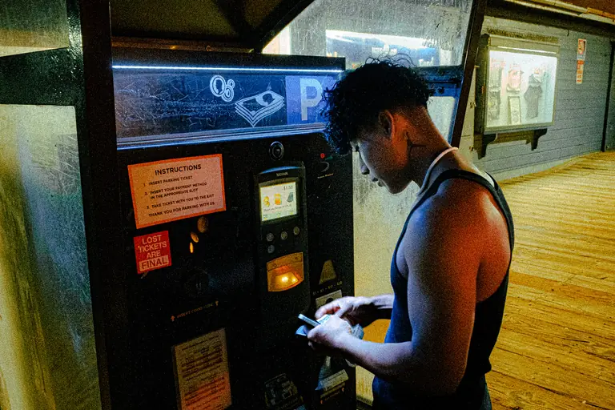

| Attribute | Value |
| :--- | :--- |
| **Framing & Aspect** | `LANDSCAPE` · `2048×1365` (Aspect: `1.50`) |
| **Tonality & Breath** | `L*=30.86` — **Exhalation** (CIELAB: `30.86, -2.19, 13.2`) |
| **Transition to #20 (R0004664.JPG)** | `ΔE₇₆: 22.43` (Color) · `ΔLum: 35` · **Step Cost: `17.4`** |

**Curatorial Rationale & Montage Dynamic**:

- *Pacing Role*: Act V: Transactional Alienation / Lost Tickets Are Final
- *Visual Subject & Content*: A young man in a black tank top stands under harsh fluorescent lighting feeding dollar bills into an automated parking pay station on a wooden boardwalk at night, flanked by stark warning signs reading 'LOST TICKETS ARE FINAL'.
- *Thematic Meaning*: The bureaucratic and mechanical alienation of contemporary urban life. The individual is reduced to transactional inputs amidst warning labels and cold vending machinery, capturing the quiet existential dread of modern systems.
- *Composition & Gaze Vectors*: Sharp vertical machine chassis bisecting the frame, with the subject's bent neck and hands creating an intimate diagonal convergence toward the glowing cash slot.
- *Transition Dynamic*: Mechanical urban isolation expands outward into the sublime cosmic sky of the cloud fissure.

> **[Poetic Caesura: Musical Rest]**
>
> *All those moments will be lost in time*
> *Like tears in rain*

---

### [20/21] R0004664.JPG

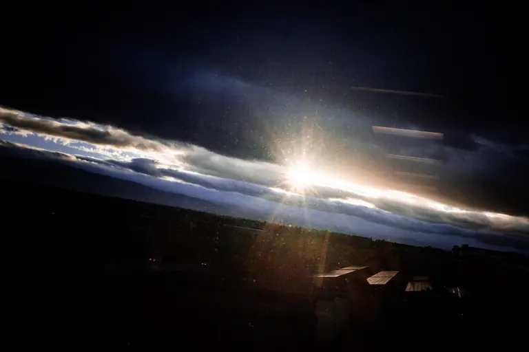

| Attribute | Value |
| :--- | :--- |
| **Framing & Aspect** | `LANDSCAPE` · `2048×1365` (Aspect: `1.50`) |
| **Tonality & Breath** | `L*=14.51` — **Exhalation** (CIELAB: `14.51, 1.66, -1.66`) |
| **Transition to #21 (DSCF2862-3.jpg)** | `ΔE₇₆: 5` (Color) · `ΔLum: 6` · **Step Cost: `3.6`** |

**Curatorial Rationale & Montage Dynamic**:

- *Pacing Role*: Act V: The Cosmic Rift / Sunlight and Storm
- *Visual Subject & Content*: High-altitude horizon view of brilliant golden sunlight bursting through a narrow slit between massive indigo storm clouds over the darkening silhouette of the city below.
- *Thematic Meaning*: A moment of sublime, cosmic transcendence. The radiant solar tear in the storm sky offers a brief, spiritual breath of hope above the troubled streets before the final sirens.
- *Composition & Gaze Vectors*: Strong horizontal cloud fissure slicing the dark sky in half, radiating brilliant outward light rays.
- *Transition Dynamic*: Sublime natural light collides sharply with the synthetic emergency sirens of the final frame.

---

### [21/21] DSCF2862-3.jpg

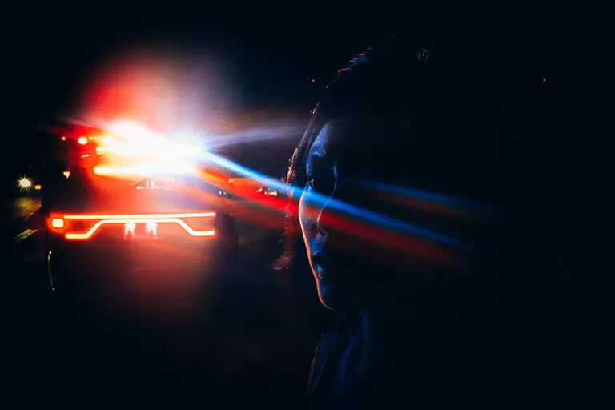

| Attribute | Value |
| :--- | :--- |
| **Framing & Aspect** | `LANDSCAPE` · `2048×1365` (Aspect: `1.50`) |
| **Tonality & Breath** | `L*=11.75` — **Exhalation** (CIELAB: `11.75, 4.84, -4.36`) |

**Curatorial Rationale & Montage Dynamic**:

- *Pacing Role*: Act IV: Coda / The Final Reckoning / Police Siren Flare
- *Visual Subject & Content*: Deep chiaroscuro close-up profile of a face illuminated only by the horizontal, blinding red and cyan glare of police cruiser emergency lights cutting through the total darkness.
- *Thematic Meaning*: The ultimate resolution of the series. The subject's shadowed, contemplative profile against the flashing red and blue sirens leaves the viewer in the tense, unresolved grip of urban reality—a final, uncompromising testament to those who do not care if they go down in history as barbarians.
- *Composition & Gaze Vectors*: Horizontal red and blue light rays slashing across the dark profile from left to right, locking the viewer in high-stakes nocturnal tension.
- *Transition Dynamic*: Final contemplative resting frame of the visual essay.

---

## 3. Curatorial Proposals & Optimized Sequence Arc

The current sequence displays **optimal rhythmic pacing** (100/100) with harmonic alternation across Inhalation, Exhalation, and Neutral anchor frames.
