# Visual Curation & Sequence Report: AEROBATIC ACTIVITIES

> **Curation Archetype**: Polyphonic Street Symphony / Lyrical Arc
>
> **Sequence Status**: Validated (Existing sequence affirmed as optimal)
>
> **Hamiltonian Sequence Energy**: `377.0` (Avg Step Cost: `17.1`)
>
> **Respiratory Pacing Score**: `100/100` (7 Inhalations, 3 Exhalations, 13 Grounding)

## 1. Executive Curatorial & Quantitative Architecture

This report quantitatively evaluates the visual narrative arc for **p3**, combining photometric colorimetry (CIELAB `L*a*b*`, ΔE₇₆), Hamiltonian pairwise transition tension, and multi-agent aesthetic critique.

### 1.1 Photometric Respiratory Waveform

The respiratory luminance waveform maps the photometric breathing rhythm of the essay, balancing luminous expansions with low-key chiaroscuro grounding anchors.

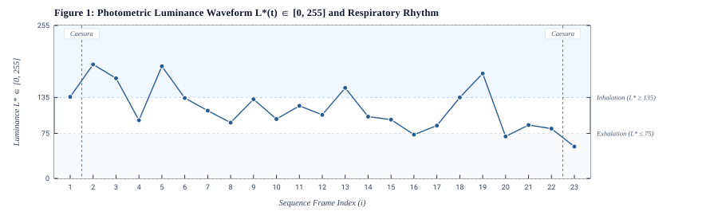

**Figure 1**: Photometric Luminance Waveform `L*(t) ∈ [0, 255]` and Respiratory Rhythm. Shaded regions indicate Inhalation (`L* >= 135`, luminous expansiveness) and Exhalation (`L* <= 75`, chiaroscuro grounding) zones. Vertical dashed lines mark poetic caesuras.

### 1.2 Hamiltonian Pairwise Transition Tension

Pairwise transition energy measures visual friction and cognitive momentum between adjacent frames, decomposed into chromatic distance (ΔE₇₆, 45%), luminance contrast (ΔLum, 35%), and geometric aspect shift (ΔAspect, 20%).

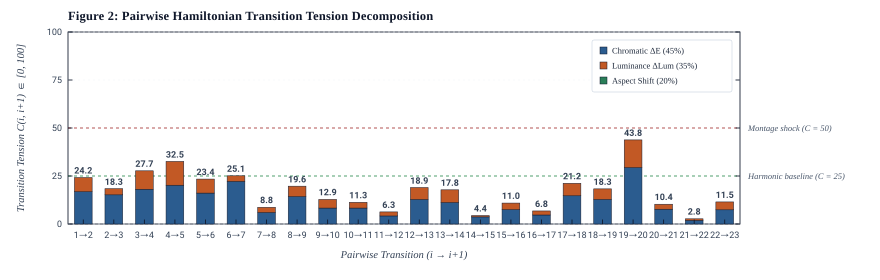

**Figure 2**: Pairwise step cost `C(i, i+1)` decomposed into chromatic, luminance, and aspect variance components. Dashed reference lines define harmonic baseline (`C <= 25`) and montage shock (`C >= 50`) thresholds.

### 1.3 CIELAB Colorimetric Progression & Spatial Cadence

The chromatic spectrum profile charts the physical color evolution across sequential frames alongside metric aspect ratio and spatial framing cadence.

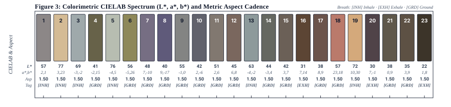

**Figure 3**: Sequential colorimetric profile detailing mean sRGB swatches, CIELAB coordinates (`L*, a*, b*`), aspect ratio, orientation (L/P), and breath type.

## 2. Visual Sequence Journey

### [1/23] DSCF7765.jpg

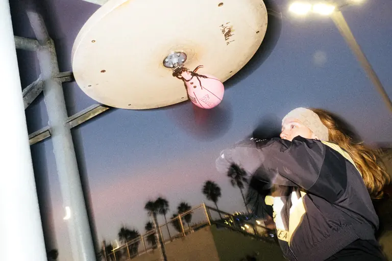

| Attribute | Value |
| :--- | :--- |
| **Framing & Aspect** | `LANDSCAPE` · `2048×1365` (Aspect: `1.50`) |
| **Tonality & Breath** | `L*=56.74` — **Inhalation** (CIELAB: `56.74, 1.87, 0.66`) |
| **Transition to #2 (DSCF7728.jpg)** | `ΔE₇₆: 29.93` (Color) · `ΔLum: 54` · **Step Cost: `24.2`** |

**Curatorial Rationale & Montage Dynamic**:

- *Pacing Role*: Act I: The Overture / The Twilight Decisive Strike
- *Visual Subject & Content*: A female boxer landing a crisp punch against a pink speed bag mounted beneath a circular wooden rebound disc, set against a twilight gradient sky and silhouette palm fronds.
- *Thematic Meaning*: Establishes the foundational thesis of Aerobatic Activities: the transfiguration of athletic discipline and physical momentum into visual poetry. The twilight atmosphere and high-speed flash illuminate the fleeting intersection of grit, rhythm, and grace.
- *Composition & Gaze Vectors*: Dynamic upward-right vector from the boxer's arm driving into the pink focal point of the speed bag, counterbalanced by the heavy vertical white pillar on the left margin.
- *Transition Dynamic*: Harmonic transition bridging into the Threshold Caesura, followed by the luminous golden ritual of the marigold monument.

> **[Poetic Caesura: Musical Rest]**
>
> *The street photography series Aerobatic Activities presents a sophisticated visual ethnography, dedicated to delineating the vibrant, often fugitive, choreographies of West Coast street culture. The series transcends verisimilitude, functioning instead as a visual exploration that endeavors to transfigure the quotidian by imbuing it with the spectral luminosity of magical realism, thereby inviting a re-evaluation of the familiar.*

---

### [2/23] DSCF7728.jpg

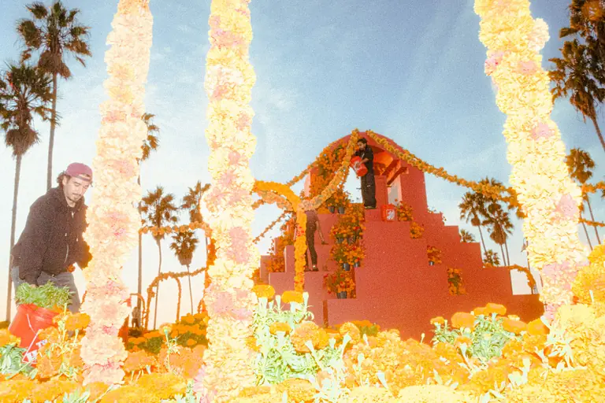

| Attribute | Value |
| :--- | :--- |
| **Framing & Aspect** | `LANDSCAPE` · `2048×1365` (Aspect: `1.50`) |
| **Tonality & Breath** | `L*=77.11` — **Inhalation** (CIELAB: `77.11, 3.24, 22.54`) |
| **Transition to #3 (DSCF7753-3.jpg)** | `ΔE₇₆: 26.99` (Color) · `ΔLum: 23` · **Step Cost: `18.3`** |

**Curatorial Rationale & Montage Dynamic**:

- *Pacing Role*: Act I: Cultural Elevation / The Marigold Pyramid
- *Visual Subject & Content*: A towering stepped altar drenched in golden marigolds (cempasúchil) for Día de los Muertos, with artisans and participants arranging offerings beneath a clear blue sky and soaring palm trees.
- *Thematic Meaning*: Grounds the series in sacred community ritual and public cultural architecture. Saturated yellow hues and monumental verticality evoke celebration, remembrance, and the transcendent spirit of West Coast heritage.
- *Composition & Gaze Vectors*: Vertical floral garlands and triangular stepped pyramid directing the gaze skyward, anchored by the working figure in the lower left foreground.
- *Transition Dynamic*: Luminous tonal expansion (`L*=77.11`) carrying the viewer upward before soaring into mid-air suspension.

---

### [3/23] DSCF7753-3.jpg

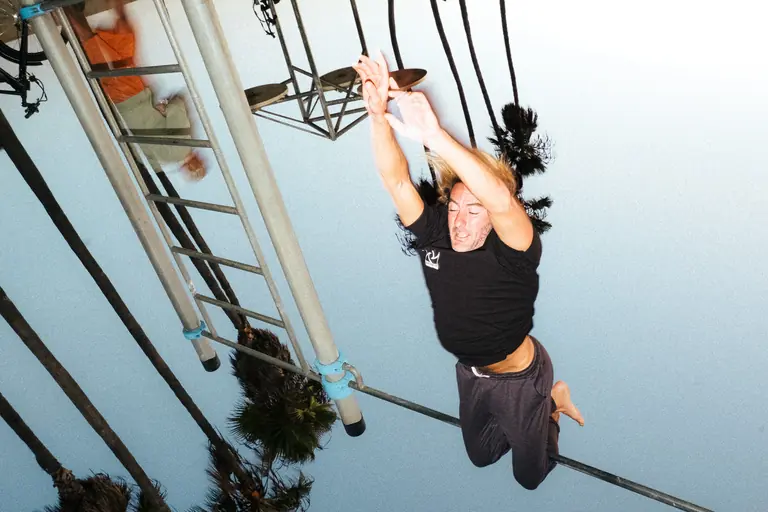

| Attribute | Value |
| :--- | :--- |
| **Framing & Aspect** | `LANDSCAPE` · `2048×1365` (Aspect: `1.50`) |
| **Tonality & Breath** | `L*=68.52` — **Inhalation** (CIELAB: `68.52, -3.11, -2.25`) |
| **Transition to #4 (DSCF7186-2.jpg)** | `ΔE₇₆: 32.16` (Color) · `ΔLum: 70` · **Step Cost: `27.7`** |

**Curatorial Rationale & Montage Dynamic**:

- *Pacing Role*: Act I: The Aerial Climax / Defying Gravity
- *Visual Subject & Content*: An acrobat hanging suspended upside down from high-flying trapeze cords against a pale sky, framed by structural climbing ladders and palm silhouettes.
- *Thematic Meaning*: The literal zenith of the 'aerobatic' motif—a human body inverted in mid-flight, capturing the tension between radical vulnerability and absolute physical mastery.
- *Composition & Gaze Vectors*: Powerful vertical inversion with arms reaching downward into empty space, echoing the diagonal ladder strut on the left.
- *Transition Dynamic*: Dramatic tonal shift (ΔLum: 70) plunging from midday sky into the shadowy chiaroscuro of nocturnal street folklore.

---

### [4/23] DSCF7186-2.jpg

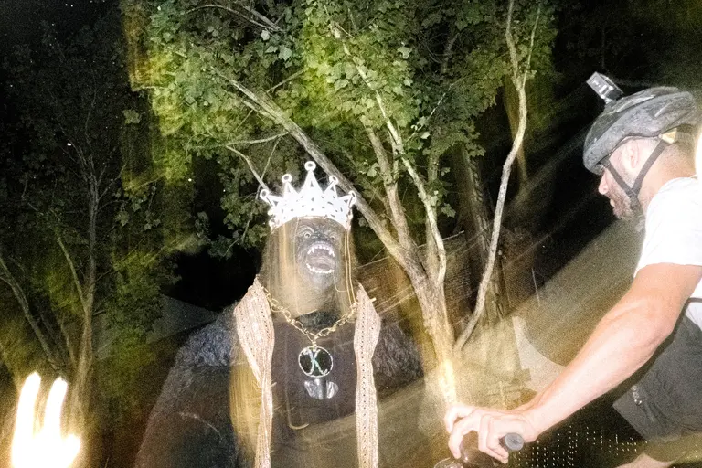

| Attribute | Value |
| :--- | :--- |
| **Framing & Aspect** | `LANDSCAPE` · `2048×1365` (Aspect: `1.50`) |
| **Tonality & Breath** | `L*=41.37` — **Neutral** (CIELAB: `41.37, -2.44, 14.98`) |
| **Transition to #5 (DSCF3435.JPG)** | `ΔE₇₆: 35.85` (Color) · `ΔLum: 90` · **Step Cost: `32.5`** |

**Curatorial Rationale & Montage Dynamic**:

- *Pacing Role*: Act II: Nocturnal Folklore / The Crowned Beast
- *Visual Subject & Content*: A costumed gorilla figure adorned with a glittering rhinestone crown and gold medallion ('K') encountering a cyclist with a helmet-mounted light in a dark city park.
- *Thematic Meaning*: The threshold into magical realism: West Coast street culture as a theatrical masquerade where urban mythology, nocturnal play, and surreal encounters coexist.
- *Composition & Gaze Vectors*: Diagonal interaction axis between the masked figure's roaring mouth and the cyclist's observing gaze, bisected by kinetic flash flare.
- *Transition Dynamic*: Harmonic step into the kinetic slipstream of the street walker.

---

### [5/23] DSCF3435.JPG

| Attribute | Value |
| :--- | :--- |
| **Framing & Aspect** | `LANDSCAPE` · `2048×1365` (Aspect: `1.50`) |
| **Tonality & Breath** | `L*=75.85` — **Inhalation** (CIELAB: `75.85, -4.29, 5.33`) |
| **Transition to #6 (DSCF6946.jpg)** | `ΔE₇₆: 28.6` (Color) · `ΔLum: 53` · **Step Cost: `23.4`** |

**Curatorial Rationale & Montage Dynamic**:

- *Pacing Role*: Act II: Nocturnal Comradeship / The Sidewalk Companions
- *Visual Subject & Content*: Two men outside at night against a luminous wall with a Mexican flag, one adjusting gear in a blue SF fitted cap while the other in glasses and jacket looks calmly at the camera.
- *Thematic Meaning*: Captures informal street brotherhood and cultural heritage in the nocturnal urban landscape. The soft illuminated wall and direct gaze introduce human warmth amidst the nighttime carnival.
- *Composition & Gaze Vectors*: Diagonal balance between the foreground figure's downward focus and the standing companion's direct eye contact, framed by subtle flash flare.
- *Transition Dynamic*: Bridges masked nocturnal folklore into intimate street camaraderie before the kinetic light trails.

---

### [6/23] DSCF6946.jpg

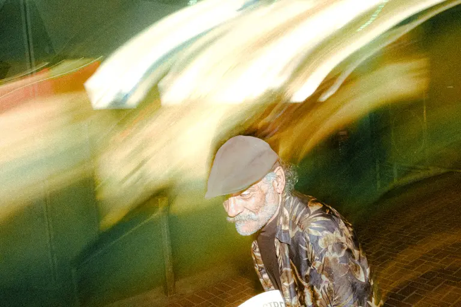

| Attribute | Value |
| :--- | :--- |
| **Framing & Aspect** | `LANDSCAPE` · `2048×1365` (Aspect: `1.50`) |
| **Tonality & Breath** | `L*=56.17` — **Neutral** (CIELAB: `56.17, -5.18, 26.07`) |
| **Transition to #7 (8B0245DC-4C12-4CD1-A6B0-96883BFAF25B.JPG)** | `ΔE₇₆: 39.53` (Color) · `ΔLum: 21` · **Step Cost: `25.1`** |

**Curatorial Rationale & Montage Dynamic**:

- *Pacing Role*: Act II: Time Dilation / The Luminous Slipstream
- *Visual Subject & Content*: An elder gentleman in a flat cap and floral-patterned shirt navigating an urban corridor, shadowed by sweeping amber and emerald kinetic light trails streaking overhead.
- *Thematic Meaning*: Visualizes the passage of time as physical energy. The static dignity of the subject contrasts with the hyper-kinetic velocity of the modern metropolis.
- *Composition & Gaze Vectors*: Sweeping parabolic light streaks cutting from top left to bottom right across the upper half, framing the downward contemplative gaze of the walker.
- *Transition Dynamic*: Kinetic momentum accelerates into stroboscopic double-exposure euphoria.

---

### [7/23] 8B0245DC-4C12-4CD1-A6B0-96883BFAF25B.JPG

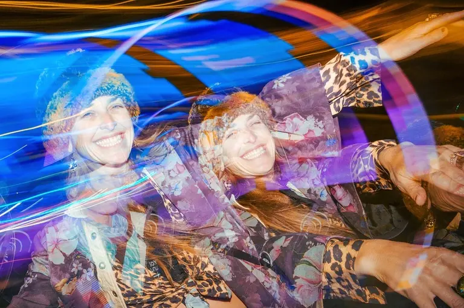

| Attribute | Value |
| :--- | :--- |
| **Framing & Aspect** | `LANDSCAPE` · `1363×907` (Aspect: `1.50`) |
| **Tonality & Breath** | `L*=47.81` — **Neutral** (CIELAB: `47.81, 7.48, -10.43`) |
| **Transition to #8 (DSCF5338.JPG)** | `ΔE₇₆: 10.71` (Color) · `ΔLum: 20` · **Step Cost: `8.8`** |

**Curatorial Rationale & Montage Dynamic**:

- *Pacing Role*: Act II: Ecstatic Synesthesia / The Neon Halo
- *Visual Subject & Content*: A woman laughing ecstatically in a fur-trimmed cap and floral jacket, multiplied by stroboscopic flash and encircled by radiant neon-blue and violet light ribbons.
- *Thematic Meaning*: Pure emotional release and sensory intoxication. The repetition of the laughing face embodies the multi-layered, fugacious joy of nighttime revelry.
- *Composition & Gaze Vectors*: Swirling elliptical light vectors orbiting the laughing subject, generating an expansive circular centrifugal vortex.
- *Transition Dynamic*: Cool chromatic resonance (ΔE: 10.71) echoing into the night basketball court.

---

### [8/23] DSCF5338.JPG

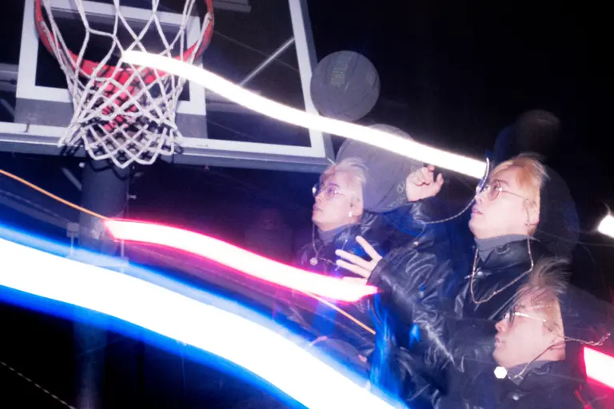

| Attribute | Value |
| :--- | :--- |
| **Framing & Aspect** | `LANDSCAPE` · `2048×1365` (Aspect: `1.50`) |
| **Tonality & Breath** | `L*=39.83` — **Neutral** (CIELAB: `39.83, 9.39, -17.31`) |
| **Transition to #9 (DSCF0490.JPG)** | `ΔE₇₆: 25.38` (Color) · `ΔLum: 39` · **Step Cost: `19.6`** |

**Curatorial Rationale & Montage Dynamic**:

- *Pacing Role*: Act II: Nocturnal Geometry / The Levitating Court
- *Visual Subject & Content*: Stroboscopic multiple exposure of young athletes on a night basketball court, eyes locked on a floating black ball beneath the backboard amidst slashing cyan and magenta light trails.
- *Thematic Meaning*: Transforms everyday asphalt recreation into a cosmic geometry of motion. The suspended ball becomes an astronomical orb amidst trails of energetic light.
- *Composition & Gaze Vectors*: Linear light ribbons slashing diagonally across the hoop, converging on the floating sphere and upward-stretched hands.
- *Transition Dynamic*: Shift from dynamic ground-level athletics to elevated architectural voyeurism.

---

### [9/23] DSCF0490.JPG

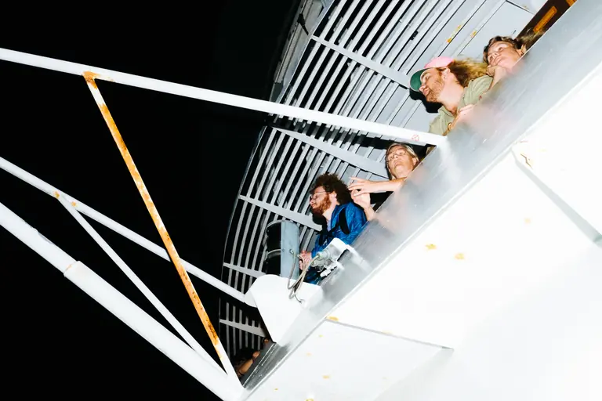

| Attribute | Value |
| :--- | :--- |
| **Framing & Aspect** | `LANDSCAPE` · `2048×1365` (Aspect: `1.50`) |
| **Tonality & Breath** | `L*=55.04` — **Neutral** (CIELAB: `55.04, -0.57, 0.4`) |
| **Transition to #10 (R0001972-4.JPG)** | `ΔE₇₆: 14.82` (Color) · `ΔLum: 33` · **Step Cost: `12.9`** |

**Curatorial Rationale & Montage Dynamic**:

- *Pacing Role*: Act II: The Elevated Deck / Nocturnal Spectators
- *Visual Subject & Content*: Low-angle architectural perspective looking up at ship or observation deck railings where spectators in colorful caps and jackets lean forward against a black sky.
- *Thematic Meaning*: Introduces the voyeuristic gaze: the audience observing the spectacle from the superstructure, framed by rigid industrial white beams that isolate human curiosity against the void.
- *Composition & Gaze Vectors*: Steep upward diagonal vectors of the white steel railing leading the eye from lower left to upper right.
- *Transition Dynamic*: Architectural starkness transitions into the intimate interior of lowrider royalty.

---

### [10/23] R0001972-4.JPG

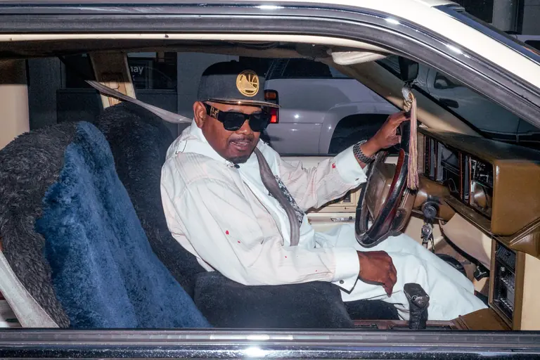

| Attribute | Value |
| :--- | :--- |
| **Framing & Aspect** | `LANDSCAPE` · `2048×1365` (Aspect: `1.50`) |
| **Tonality & Breath** | `L*=41.78` — **Neutral** (CIELAB: `41.78, 1.8, -5.78`) |
| **Transition to #11 (DSCF4237-2.jpg)** | `ΔE₇₆: 14.67` (Color) · `ΔLum: 22` · **Step Cost: `11.3`** |

**Curatorial Rationale & Montage Dynamic**:

- *Pacing Role*: Act III: Street Royalty / The Lowrider Cockpit
- *Visual Subject & Content*: A man in a Golden State Warriors championship cap, gold-framed sunglasses, and white attire commanding the wheel of a classic automobile lined with plush blue shearling.
- *Thematic Meaning*: An intimate tribute to West Coast lowrider heritage and automotive pride. The car is both sanctuary and throne, celebrating sovereignty, style, and unyielding self-definition.
- *Composition & Gaze Vectors*: Horizontal framing of the car window framing the driver's steady, composed posture and hands on the wheel.
- *Transition Dynamic*: Intimate car cabin rhythm transitions seamlessly to the open-air daytime basketball tournament.

---

### [11/23] DSCF4237-2.jpg

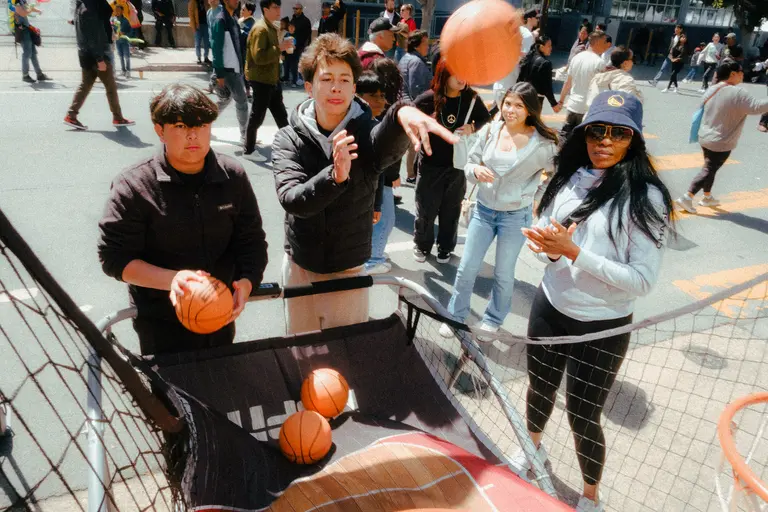

| Attribute | Value |
| :--- | :--- |
| **Framing & Aspect** | `LANDSCAPE` · `2048×1365` (Aspect: `1.50`) |
| **Tonality & Breath** | `L*=51` — **Neutral** (CIELAB: `51, 1.98, 5.63`) |
| **Transition to #12 (IMG_4582.jpg)** | `ΔE₇₆: 7.46` (Color) · `ΔLum: 15` · **Step Cost: `6.3`** |

**Curatorial Rationale & Montage Dynamic**:

- *Pacing Role*: Act III: Polyphonic Rhythm / The Pop-a-Shot Jubilee
- *Visual Subject & Content*: A vibrant daytime street arcade scene where youth shoot mini-basketballs and a woman in a Warriors bucket hat claps in celebration, with basketballs suspended mid-bounce.
- *Thematic Meaning*: Community cohesion and generational play. The rhythmic bounce of basketballs echoes the series' continuous celebration of athletic joy in public plazas.
- *Composition & Gaze Vectors*: Divergent vectors of tossed basketballs suspended at different elevations, framed by the cheering crowd's rhythmic clapping hands.
- *Transition Dynamic*: Rhythmic crowd energy flows into the synchronized stride of urban youth.

---

### [12/23] IMG_4582.jpg

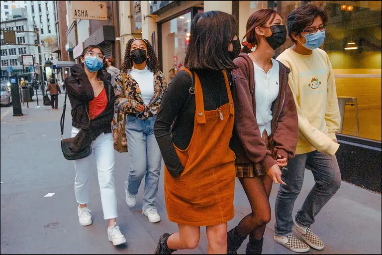

| Attribute | Value |
| :--- | :--- |
| **Framing & Aspect** | `LANDSCAPE` · `2048×1364` (Aspect: `1.50`) |
| **Tonality & Breath** | `L*=45.15` — **Neutral** (CIELAB: `45.15, 6.02, 7.88`) |
| **Transition to #13 (B5B35521-9A08-4B1C-AAB3-429D75A3769E.JPG)** | `ΔE₇₆: 22.68` (Color) · `ΔLum: 45` · **Step Cost: `18.9`** |

**Curatorial Rationale & Montage Dynamic**:

- *Pacing Role*: Act III: Urban Cadence / The Sidewalk Catwalk
- *Visual Subject & Content*: A cohort of stylish youth walking abreast down a sunlit city pavement past storefronts, sporting masks, layered jackets, and distinctive personal aesthetics.
- *Thematic Meaning*: Visual ethnography of contemporary urban youth culture. The synchronized forward march captures solidarity, fashion as armor, and shared generational identity.
- *Composition & Gaze Vectors*: Direct frontal vector with five figures moving forward in unison toward the viewer, creating planar depth along the sidewalk corridor.
- *Transition Dynamic*: Walking momentum ascends directly into the elevated celebratory fervor of the championship balcony.

---

### [13/23] B5B35521-9A08-4B1C-AAB3-429D75A3769E.JPG

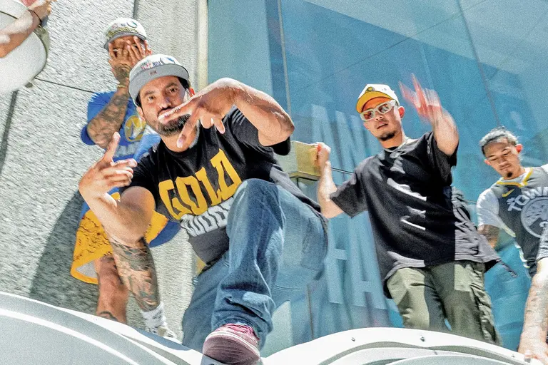

| Attribute | Value |
| :--- | :--- |
| **Framing & Aspect** | `LANDSCAPE` · `2048×1364` (Aspect: `1.50`) |
| **Tonality & Breath** | `L*=62.63` — **Inhalation** (CIELAB: `62.63, -4.41, -2.12`) |
| **Transition to #14 (DSCF8563-5.jpg)** | `ΔE₇₆: 19.98` (Color) · `ΔLum: 48` · **Step Cost: `17.8`** |

**Curatorial Rationale & Montage Dynamic**:

- *Pacing Role*: Act III: The Fanfare / Gold-Blooded Swagger
- *Visual Subject & Content*: Low-angle view of celebratory fans on an elevated ledge gesturing towards the camera in 'GOLD BLOODED' attire against a mirrored glass skyscraper facade.
- *Thematic Meaning*: The triumphant crest of collective civic celebration. Bold hand gestures, sun-drenched architecture, and unabashed swagger reflect Bay Area sports culture at its peak.
- *Composition & Gaze Vectors*: Extreme low-to-high diagonal perspective pointing up at the gesturing hands and dynamic crouched figures.
- *Transition Dynamic*: Brilliant high-noon daylight (`L*=62.63`) yields to multi-layered, contemplative street reflections.

---

### [14/23] DSCF8563-5.jpg

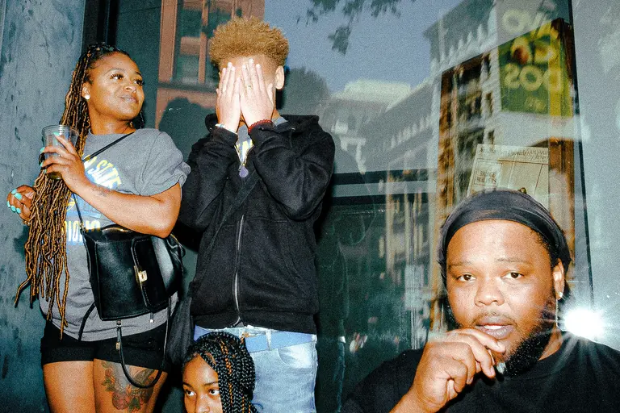

| Attribute | Value |
| :--- | :--- |
| **Framing & Aspect** | `LANDSCAPE` · `2048×1365` (Aspect: `1.50`) |
| **Tonality & Breath** | `L*=43.55` — **Neutral** (CIELAB: `43.55, -2.59, 3.53`) |
| **Transition to #15 (DSCF8671.JPG)** | `ΔE₇₆: 6.56` (Color) · `ΔLum: 5` · **Step Cost: `4.4`** |

**Curatorial Rationale & Montage Dynamic**:

- *Pacing Role*: Act III: Multi-Planar Tension / The Sidewalk Tableau
- *Visual Subject & Content*: A complex multi-figure street scene outside a storefront window: a woman with dreadlocks holding a beverage, a boy hiding his face in his hands, and a man in a durag smoking a cigar in the foreground.
- *Thematic Meaning*: Classic Alex Webb multi-plane street layering where overlapping narratives, hidden gazes, and reflective glass create a rich tapestry of urban interiority.
- *Composition & Gaze Vectors*: Triangular tension between the woman's rightward gaze, the central youth's averted face, and the foreground man's direct contemplative stare.
- *Transition Dynamic*: Cool sidewalk reflections transition into the warm, sacred intimacy of the neighborhood barbershop.

---

### [15/23] DSCF8671.JPG

| Attribute | Value |
| :--- | :--- |
| **Framing & Aspect** | `LANDSCAPE` · `2048×1365` (Aspect: `1.50`) |
| **Tonality & Breath** | `L*=41.5` — **Neutral** (CIELAB: `41.5, 2.75, 6.74`) |
| **Transition to #16 (DSCF3632.JPG)** | `ΔE₇₆: 13.37` (Color) · `ΔLum: 25` · **Step Cost: `11`** |

**Curatorial Rationale & Montage Dynamic**:

- *Pacing Role*: Act III: Shared Focus / The Digital Agora
- *Visual Subject & Content*: A man in a sharp tailored suit and a woman with bright golden curls nestled in a dense festive crowd, leaning together in deep concentration over a smartphone screen.
- *Thematic Meaning*: Explores the tender micro-narratives within massive civic gatherings. High-contrast flash captures the quiet bubble of shared human connection amidst a moving sea of celebratory citizens.
- *Composition & Gaze Vectors*: Converging downward gazes and hand gestures over the screen, contrasting against the kinetic flow of the surrounding crowd.
- *Transition Dynamic*: Transitions from multi-planar street observations into an intimate duo before entering the barbershop sanctuary.

---

### [16/23] DSCF3632.JPG

| Attribute | Value |
| :--- | :--- |
| **Framing & Aspect** | `LANDSCAPE` · `2048×1365` (Aspect: `1.50`) |
| **Tonality & Breath** | `L*=31.3` — **Exhalation** (CIELAB: `31.3, 7.31, 14.08`) |
| **Transition to #17 (DSCF1137.jpg)** | `ΔE₇₆: 8.38` (Color) · `ΔLum: 15` · **Step Cost: `6.8`** |

**Curatorial Rationale & Montage Dynamic**:

- *Pacing Role*: Act III: The Sanctum / The Barber's Mirror Star
- *Visual Subject & Content*: Direct flash portrait of a barber in a red beanie and denim apron staring into the lens, with a mirror behind him reflecting the camera's starburst specular highlight.
- *Thematic Meaning*: The barbershop as a cultural cornerstone and sacred masculine sanctuary. The direct gaze and optical flash reflection acknowledge the photographer's presence in a decisive moment of mutual recognition.
- *Composition & Gaze Vectors*: Piercing central gaze vector locked directly on the lens, anchored by the dazzling 18-point starburst flare behind his head.
- *Transition Dynamic*: Deep exhalation anchor (`L*=31.30`) resetting the perceptual baseline before the wild nocturnal climax.

---

### [17/23] DSCF1137.jpg

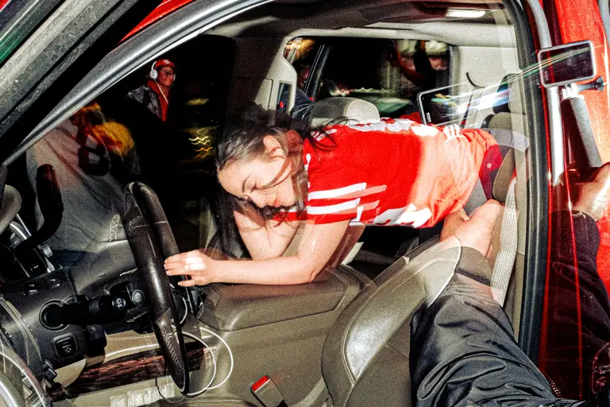

| Attribute | Value |
| :--- | :--- |
| **Framing & Aspect** | `LANDSCAPE` · `2048×1365` (Aspect: `1.50`) |
| **Tonality & Breath** | `L*=37.91` — **Neutral** (CIELAB: `37.91, 8.49, 9.06`) |
| **Transition to #18 (DSCF7672-2.JPG)** | `ΔE₇₆: 26.22` (Color) · `ΔLum: 47` · **Step Cost: `21.2`** |

**Curatorial Rationale & Montage Dynamic**:

- *Pacing Role*: Act IV: The Kinetic Rush / Cockpit Scramble
- *Visual Subject & Content*: A woman in a red 49ers jersey scrambling over the center console and seats inside a crowded vehicle at night, captured from the driver's perspective.
- *Thematic Meaning*: Spontaneous, unvarnished nocturnal mayhem. The tight confines of the car interior become a playground of motion, celebrating unrestrained youth and spontaneous celebration.
- *Composition & Gaze Vectors*: Sharp diagonal movement from right to left as the body scrambles over the leather upholstery.
- *Transition Dynamic*: Accelerates the tempo into high-energy double exposure and patriotic irony.

---

### [18/23] DSCF7672-2.JPG

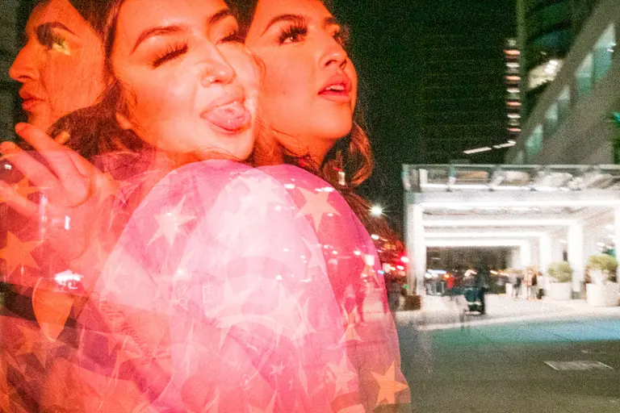

| Attribute | Value |
| :--- | :--- |
| **Framing & Aspect** | `LANDSCAPE` · `2048×1365` (Aspect: `1.50`) |
| **Tonality & Breath** | `L*=57.48` — **Neutral** (CIELAB: `57.48, 23.18, 18.49`) |
| **Transition to #19 (DSCF1113.jpg)** | `ΔE₇₆: 22.82` (Color) · `ΔLum: 40` · **Step Cost: `18.3`** |

**Curatorial Rationale & Montage Dynamic**:

- *Pacing Role*: Act IV: Chromatic Irony / The Translucent Flag
- *Visual Subject & Content*: Close-up double exposure of a smiling woman sticking her tongue out, layered across a translucent field of American flag stars against an illuminated corporate entrance.
- *Thematic Meaning*: Playful, irreverent subversion of national iconography. The youthful gesture superimposed on the star-spangled banner reflects an informal, lived reinterpretation of American identity.
- *Composition & Gaze Vectors*: Overlapping facial contours and diagonal flag stripes blending into a rich coral and magenta field.
- *Transition Dynamic*: Rising tonal crescendo (`L*=57.48`) building toward the incandescent solar light vortex.

---

### [19/23] DSCF1113.jpg

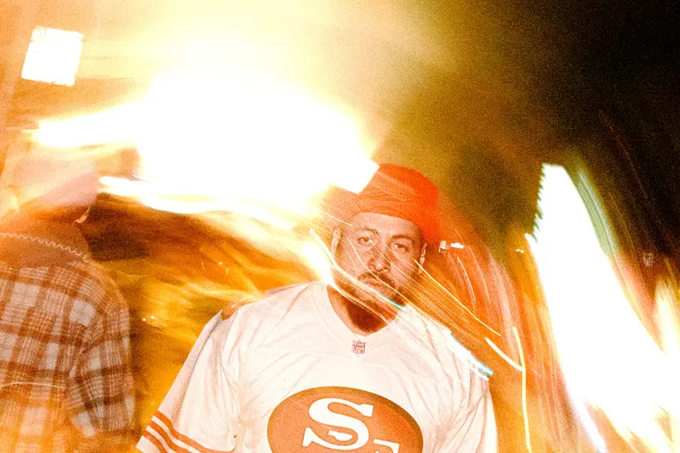

| Attribute | Value |
| :--- | :--- |
| **Framing & Aspect** | `LANDSCAPE` · `2048×1365` (Aspect: `1.50`) |
| **Tonality & Breath** | `L*=72.1` — **Inhalation** (CIELAB: `72.1, 9.72, 29.71`) |
| **Transition to #20 (DSCF3579.JPG)** | `ΔE₇₆: 52.27` (Color) · `ΔLum: 105` · **Step Cost: `43.8`** |

**Curatorial Rationale & Montage Dynamic**:

- *Pacing Role*: Act IV: The Solar Halo / Man in the Fire Vortex
- *Visual Subject & Content*: A man in a 49ers jersey and red knit hat centered in the frame, enveloped by a swirling halo of golden, amber, and white kinetic light trails.
- *Thematic Meaning*: The visual climax of magical realism in the series: the ordinary street hero transfigured by light painting into a solar deity, glowing with warm celestial fire.
- *Composition & Gaze Vectors*: Centripetal swirling light vortex framing the calm, resolute central face.
- *Transition Dynamic*: Maintains high-energy chromatic intensity as the golden fire dissolves into ethereal white mist.

---

### [20/23] DSCF3579.JPG

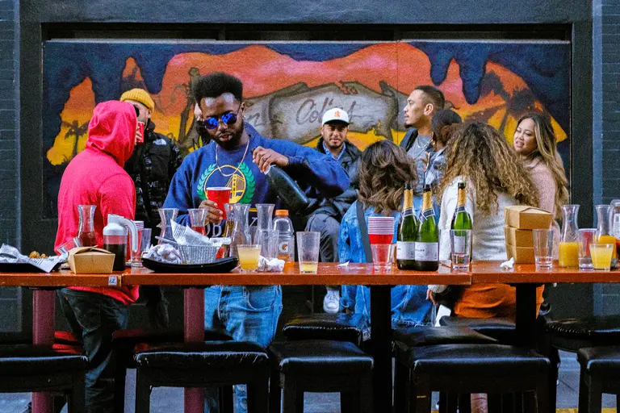

| Attribute | Value |
| :--- | :--- |
| **Framing & Aspect** | `LANDSCAPE` · `2048×1365` (Aspect: `1.50`) |
| **Tonality & Breath** | `L*=29.88` — **Exhalation** (CIELAB: `29.88, 6.55, -0.95`) |
| **Transition to #21 (DSCF7318-3.jpg)** | `ΔE₇₆: 13.77` (Color) · `ΔLum: 19` · **Step Cost: `10.4`** |

**Curatorial Rationale & Montage Dynamic**:

- *Pacing Role*: Act V: Communal Libation / The Barricade Banquet
- *Visual Subject & Content*: A man in a blue Warriors sweatshirt pouring champagne into a red solo cup at an outdoor patio table lined with bottles, attended by friends in bright hoodies before a colorful mural.
- *Thematic Meaning*: The return to community communion. Pouring libations becomes a sacred street ritual of friendship, shared victory, and mutual resilience.
- *Composition & Gaze Vectors*: Horizontal picnic table dividing the frame, with the downward arc of sparkling wine centering the composition.
- *Transition Dynamic*: Harmonic transition from celebratory drinks to the permanent craftsmanship of the tattoo studio.

---

### [21/23] DSCF7318-3.jpg

| Attribute | Value |
| :--- | :--- |
| **Framing & Aspect** | `LANDSCAPE` · `6240×4160` (Aspect: `1.50`) |
| **Tonality & Breath** | `L*=37.7` — **Neutral** (CIELAB: `37.7, 0.41, 8.57`) |
| **Transition to #22 (DSCF5759-5.jpg)** | `ΔE₇₆: 3.43` (Color) · `ΔLum: 6` · **Step Cost: `2.8`** |

**Curatorial Rationale & Montage Dynamic**:

- *Pacing Role*: Act V: Indelible Ink / The Studio Ritual
- *Visual Subject & Content*: A man reclining on a tattoo table getting tattooed on his back while holding a beer, framed in the immediate foreground by a hand holding an iconic glass Coca-Cola bottle.
- *Thematic Meaning*: The rite of passage: inscribing memory, heritage, and identity permanently into skin. The foreground Coca-Cola bottle anchors the scene in raw, tactile Americana.
- *Composition & Gaze Vectors*: Steep foreground-to-background spatial compression from the glass bottle on the left to the reclining figure on the right.
- *Transition Dynamic*: Interior craftsmanship steps outward into the cool evening air for the vehicle silhouette.

---

### [22/23] DSCF5759-5.jpg

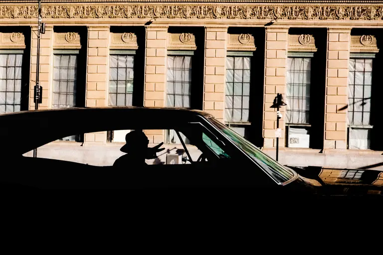

| Attribute | Value |
| :--- | :--- |
| **Framing & Aspect** | `LANDSCAPE` · `4675×3117` (Aspect: `1.50`) |
| **Tonality & Breath** | `L*=35.26` — **Neutral** (CIELAB: `35.26, 2.64, 9.47`) |
| **Transition to #23 (DSCF5719-3.jpg)** | `ΔE₇₆: 13.15` (Color) · `ΔLum: 30` · **Step Cost: `11.5`** |

**Curatorial Rationale & Montage Dynamic**:

- *Pacing Role*: Act V: Iconic Gesture / The Colonnade Silhouette
- *Visual Subject & Content*: A silhouette of a driver flashing a hand sign through the window of a sleek classic vehicle, juxtaposed against the textured stone columns and historic windows of a monumental building.
- *Thematic Meaning*: The definitive West Coast signature: the interplay between classical architectural permanence and the fluid, passing rebellion of car culture.
- *Composition & Gaze Vectors*: Horizontal black silhouette of the automobile slashed by the rectangular window frame, with the hand sign pointing forward.
- *Transition Dynamic*: Precedes the second poetic caesura, setting a contemplative tempo for the final intimate coda.

> **[Poetic Caesura: Musical Rest]**
>
> *I've been laying*
> *Waiting for your next mistake*

---

### [23/23] DSCF5719-3.jpg

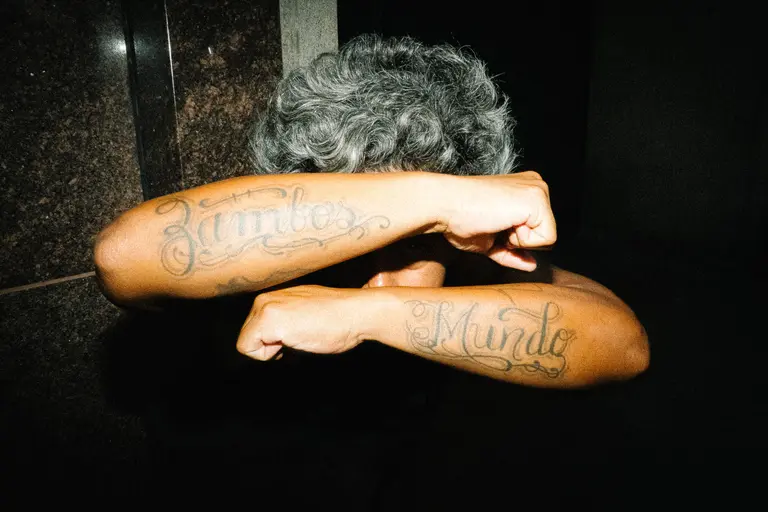

| Attribute | Value |
| :--- | :--- |
| **Framing & Aspect** | `LANDSCAPE` · `2048×1365` (Aspect: `1.50`) |
| **Tonality & Breath** | `L*=22.22` — **Exhalation** (CIELAB: `22.22, 1.47, 8.27`) |

**Curatorial Rationale & Montage Dynamic**:

- *Pacing Role*: Act V: The Coda / Zambos Mundo
- *Visual Subject & Content*: Low-key chiaroscuro flash portrait of a silver-haired man crossing his forearms in a protective 'X' over his eyes, revealing calligraphic tattoos reading 'Zambos' and 'Mundo'.
- *Thematic Meaning*: The ultimate resolution of Aerobatic Activities. In concealing his gaze, the subject elevates the tattooed words to universal symbols of identity, struggle, and worldhood ('Mundo'). A powerful, dignified closing statement on street endurance.
- *Composition & Gaze Vectors*: Dominant diagonal 'X' formed by the crossed forearms, creating an impenetrable visual seal across the face.
- *Transition Dynamic*: Final contemplative resting frame of the visual essay.

---

## 3. Curatorial Proposals & Optimized Sequence Arc

The current sequence displays **optimal rhythmic pacing** (100/100) with harmonic alternation across Inhalation, Exhalation, and Neutral anchor frames.

## 4. Unsequenced Candidates & Outtakes (1)

### Candidate: DSCF2056-2.jpg

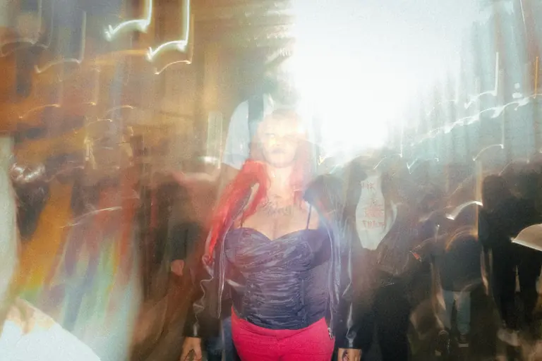

- **Metrics**: `LANDSCAPE` · `2048×1365` · `L*=60.82` (Inhalation)
- **Optimal Integration Slot**: Position #5 (`DSCF7186-2.jpg` → **`DSCF2056-2.jpg`** → `DSCF3435.JPG`)
- **Pacing Impact**: Net ΔEnergy `+1.1` · Local Step Cost `16.8` · Pacing Score `100/100`
- **Curatorial Suggestion**: Integrates smoothly between #4 (DSCF7186-2.jpg) and #5 (DSCF3435.JPG)
- **Curatorial Status**: Unsequenced candidate (review placement simulation above before integrating).
