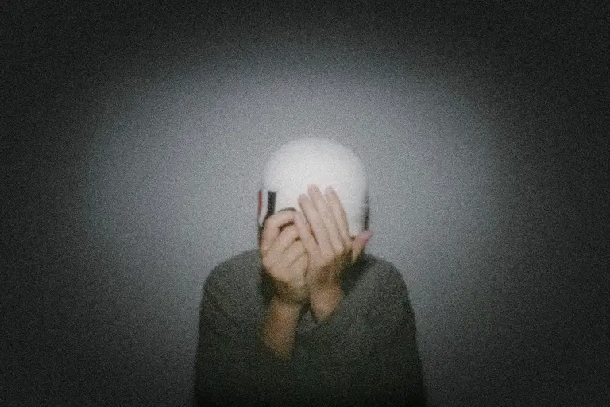
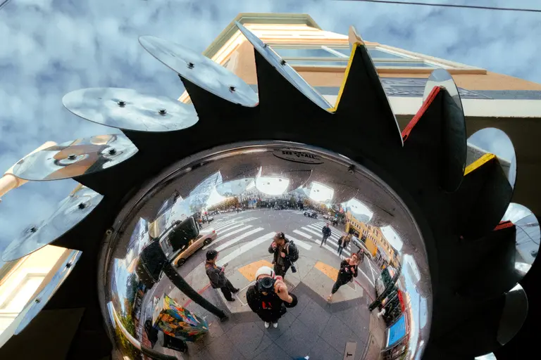
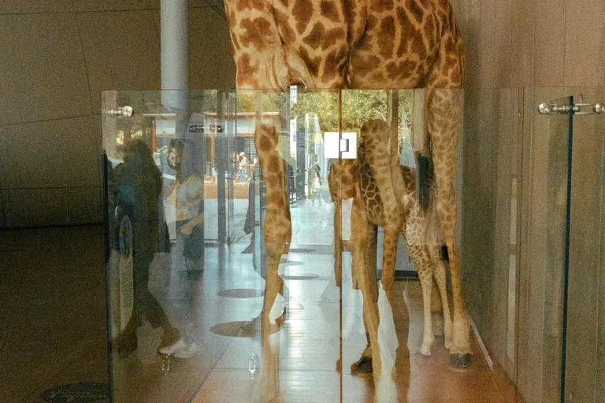
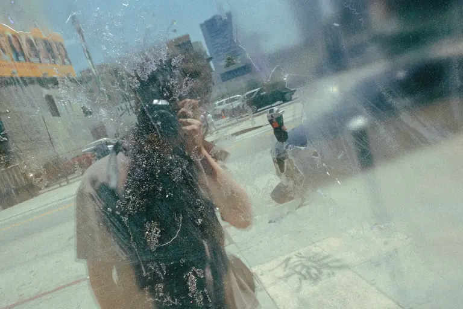
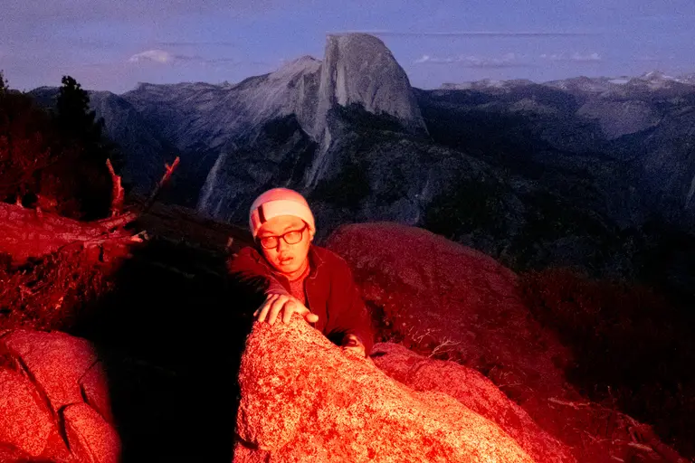
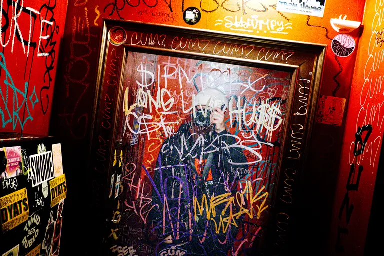
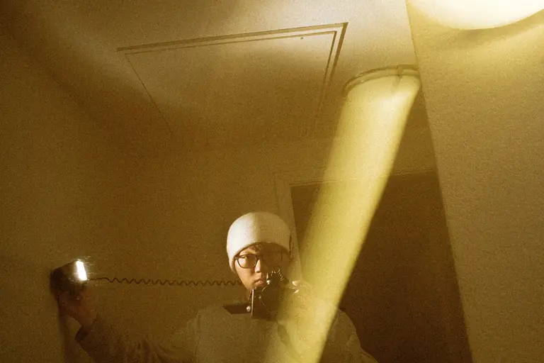
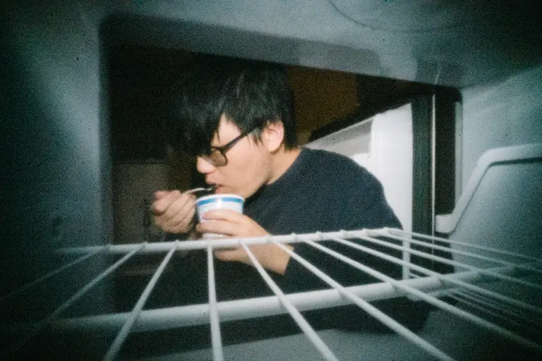

# Visual Curation & Sequence Report: SELF PORTRAITS AND BEHIND THE SCENES

> **Curation Archetype**: Polyphonic Street Symphony / Lyrical Arc
>
> **Sequence Status**: Validated (Existing sequence affirmed as optimal)
>
> **Hamiltonian Sequence Energy**: `318.1` (Avg Step Cost: `28.9`)
>
> **Respiratory Pacing Score**: `100/100` (3 Inhalations, 5 Exhalations, 4 Grounding)

## 1. Executive Curatorial Architecture

This report visually illustrates the recommended image sequence for **p5**, embedding high-resolution photographs directly in markdown alongside technical colorimetry (CIELAB L*a*b*, ΔE₇₆), respiratory pacing waveforms, and multi-agent aesthetic rationale.

## 2. Visual Sequence Journey

### [1/12] DSCF9004-3.jpg

| Attribute | Value |
| :--- | :--- |
| **Framing & Aspect** | `LANDSCAPE` · `1946×1297` (Aspect: `1.50`) |
| **Tonality & Breath** | `L*=28.64` — **Exhalation** (CIELAB: `28.64, -1.05, 0.31`) |
| **Transition to #2 (2025-05-11-0020.JPG)** | `ΔE₇₆: 38.62` (Color) · `ΔLum: 93` · **Step Cost: `34.7`** |

**Curatorial Rationale & Montage Dynamic**:

- *Pacing Role*: Act I: The Overture / The Concealed Self
- *Visual Subject & Content*: Monochrome, high-grain self-portrait of the photographer wearing a white helmet with both hands covering the face.
- *Thematic Meaning*: Anchors the central thesis of the entire essay: a street photographer is an obsessive observer who resists being observed. The physical mask is an opening statement of vulnerability and resistance.
- *Composition & Gaze Vectors*: Centered, inward-collapsing hand gesture creating a closed psychological container.
- *Transition Dynamic*: High-contrast jump from low-key interior grain into bright daylight public space.

> 💬 **[Poetic Caesura / Musical Rest]**
>
> *A street photographer is an obsessive spectator who hates being looked at.*
> *To turn the lens on oneself is either an accident of reflection or a mild confession.*

---

### [2/12] 2025-05-11-0020.JPG

| Attribute | Value |
| :--- | :--- |
| **Framing & Aspect** | `LANDSCAPE` · `3079×2045` (Aspect: `1.51`) |
| **Tonality & Breath** | `L*=66.18` — **Inhalation** (CIELAB: `66.18, 3.98, 7.86`) |
| **Caption / Photo Credit** | `@photo.initiator` |
| **Transition to #3 (DSCF8059.JPG)** | `ΔE₇₆: 22.12` (Color) · `ΔLum: 49` · **Step Cost: `19.4`** |

**Curatorial Rationale & Montage Dynamic**:

- *Pacing Role*: Act I: Movement / Playful Irony
- *Visual Subject & Content*: Photographer in daylight holding a 'Chinese for Beginners' textbook over their face outside a building, camera hanging from wrist.
- *Thematic Meaning*: Daytime mirror of Frame #1: the desire to hide transforms from existential concealment into playful, witty street irony.
- *Composition & Gaze Vectors*: Upward diagonal tilt of the green book breaking the horizontal sidewalk plane.
- *Transition Dynamic*: Smooth transition from flat facade into expansive curved optics.

---

### [3/12] DSCF8059.JPG

| Attribute | Value |
| :--- | :--- |
| **Framing & Aspect** | `LANDSCAPE` · `2048×1365` (Aspect: `1.50`) |
| **Tonality & Breath** | `L*=47.2` — **Neutral** (CIELAB: `47.2, -1.84, -1.9`) |
| **Transition to #4 (DSCF1557-3.JPG)** | `ΔE₇₆: 20.45` (Color) · `ΔLum: 7` · **Step Cost: `12.5`** |

**Curatorial Rationale & Montage Dynamic**:

- *Pacing Role*: Act II: The Convex Street / Expansion of the Self
- *Visual Subject & Content*: A sunburst traffic mirror capturing a bustling intersection, pedestrians, open sky, and the photographer at the center focal point with camera raised.
- *Thematic Meaning*: The self is no longer hiding; the photographer's reflection expands outward and integrates with the collective flow of the city.
- *Composition & Gaze Vectors*: Radiating starburst spokes drawing the viewer's eye into the center convex reflection.
- *Transition Dynamic*: Harmonic step from outdoor street optics to museum interior glass.

---

### [4/12] DSCF1557-3.JPG

| Attribute | Value |
| :--- | :--- |
| **Framing & Aspect** | `LANDSCAPE` · `2048×1365` (Aspect: `1.50`) |
| **Tonality & Breath** | `L*=44.5` — **Neutral** (CIELAB: `44.5, 0.44, 18.24`) |
| **Transition to #5 (DSCF5407-2.jpg)** | `ΔE₇₆: 22.73` (Color) · `ΔLum: 34` · **Step Cost: `17.5`** |

**Curatorial Rationale & Montage Dynamic**:

- *Pacing Role*: Act II: Spatial Layering / The Museum Reflection
- *Visual Subject & Content*: Museum display of giraffe legs with transparent glass reflecting visitors, architectural columns, and exterior daylight.
- *Thematic Meaning*: The street photographer's eye finds accidental surrealism: natural history juxtaposed against contemporary urban glass.
- *Composition & Gaze Vectors*: Strong vertical columns and animal limbs dividing the frame into three visual planes.
- *Transition Dynamic*: Harmonic shift from structured museum glass to fluid, water-streaked glass.

---

### [5/12] DSCF5407-2.jpg

| Attribute | Value |
| :--- | :--- |
| **Framing & Aspect** | `LANDSCAPE` · `1960×1306` (Aspect: `1.50`) |
| **Tonality & Breath** | `L*=58.04` — **Inhalation** (CIELAB: `58.04, -4.8, 0.75`) |
| **Transition to #6 (DSCF8149-7.JPG)** | `ΔE₇₆: 43.12` (Color) · `ΔLum: 86` · **Step Cost: `36.1`** |

**Curatorial Rationale & Montage Dynamic**:

- *Pacing Role*: Act II: The Dissolving Boundary / Rain & Dust
- *Visual Subject & Content*: Self-portrait through textured, rain-spattered window glass reflecting street pavement and distant skyline towers.
- *Thematic Meaning*: Dissolution of physical barriers. The tactile texture of water and dust merges the photographer's body into the city texture.
- *Composition & Gaze Vectors*: Diagonal dispersion of raindrops scattering the light.
- *Transition Dynamic*: Threshold transition from daytime observation to nocturnal theater.

> 💬 **[Poetic Caesura / Musical Rest]**
>
> *Photography by day is observation;*
> *By night, it is theater.*

---

### [6/12] DSCF8149-7.JPG

| Attribute | Value |
| :--- | :--- |
| **Framing & Aspect** | `LANDSCAPE` · `2048×1365` (Aspect: `1.50`) |
| **Tonality & Breath** | `L*=23.45` — **Exhalation** (CIELAB: `23.45, 20.95, 1.02`) |
| **Transition to #7 (DSCF8231.JPG)** | `ΔE₇₆: 16.65` (Color) · `ΔLum: 11` · **Step Cost: `10.9`** |

**Curatorial Rationale & Montage Dynamic**:

- *Pacing Role*: Act III: Nocturnal Theater / Yosemite Volta
- *Visual Subject & Content*: Photographer on a granite boulder at dusk overlooking Yosemite's Half Dome, illuminated by saturated, theatrical red light.
- *Thematic Meaning*: Direct realization of the caesura quote ('By night, it is theater'). Nature's monumental landscape becomes an avant-garde stage.
- *Composition & Gaze Vectors*: Granite ledge leading the eye diagonally up toward the Half Dome peak.
- *Transition Dynamic*: Intense chromatic bridge from natural twilight red to urban punk neon red.

---

### [7/12] DSCF8231.JPG

| Attribute | Value |
| :--- | :--- |
| **Framing & Aspect** | `LANDSCAPE` · `2048×1365` (Aspect: `1.50`) |
| **Tonality & Breath** | `L*=28.79` — **Exhalation** (CIELAB: `28.79, 21.07, 16.79`) |
| **Transition to #8 (DSCF0525.jpg)** | `ΔE₇₆: 33.86` (Color) · `ΔLum: 75` · **Step Cost: `29.3`** |

**Curatorial Rationale & Montage Dynamic**:

- *Pacing Role*: Act III: Urban Red / Saturated Subculture
- *Visual Subject & Content*: Framed bar bathroom mirror covered in dense graffiti tags, stickers, and scrawls, reflecting the photographer taking a mirror selfie.
- *Thematic Meaning*: The camera penetrates underground spaces, turning chaotic street typography and sticker culture into a framing device.
- *Composition & Gaze Vectors*: Dense multi-layered rectangular frame within a frame.
- *Transition Dynamic*: Chiaroscuro breath: stepping out of the dense graffiti bar into expansive night atmosphere.

---

### [8/12] DSCF0525.jpg

| Attribute | Value |
| :--- | :--- |
| **Framing & Aspect** | `LANDSCAPE` · `2048×1365` (Aspect: `1.50`) |
| **Tonality & Breath** | `L*=57.91` — **Inhalation** (CIELAB: `57.91, 3.87, 15.14`) |
| **Transition to #9 (849BDEFE-8868-48A8-B31D-ADB58F0161022.JPG)** | `ΔE₇₆: 77.93` (Color) · `ΔLum: 87` · **Step Cost: `55.8`** |

**Curatorial Rationale & Montage Dynamic**:

- *Pacing Role*: Act III: The Luminous Inhalation / Valley Lights
- *Visual Subject & Content*: Aerial high-angle nightscape of glowing city lights across a valley floor under falling snow dust.
- *Thematic Meaning*: The vital respiratory reset (L*=57.91). A silent, expansive cosmic breath of fresh air amidst the nocturnal heat.
- *Composition & Gaze Vectors*: Soft horizontal golden glow anchoring the lower third of the frame.
- *Transition Dynamic*: Dramatic counterpoint from serene golden valley to electric strobe energy.

---

### [9/12] 849BDEFE-8868-48A8-B31D-ADB58F0161022.JPG

| Attribute | Value |
| :--- | :--- |
| **Framing & Aspect** | `LANDSCAPE` · `2048×1364` (Aspect: `1.50`) |
| **Tonality & Breath** | `L*=25.8` — **Exhalation** (CIELAB: `25.8, 41.33, -45.18`) |
| **Transition to #10 (DSCF6274.JPG)** | `ΔE₇₆: 89.71` (Color) · `ΔLum: 50` · **Step Cost: `51.9`** |

**Curatorial Rationale & Montage Dynamic**:

- *Pacing Role*: Act III: Psychedelic Fragment / Strobe Kinetics
- *Visual Subject & Content*: Multiple-exposure stroboscopic motion blur in electric cobalt blue and magenta neon, showing the photographer's face repeated with a coiled sync cord.
- *Thematic Meaning*: The fragmentation of identity through photographic mechanics. Time and shutter speed become painterly brushstrokes.
- *Composition & Gaze Vectors*: Horizontal rhythm of repeated facial echoes moving across the frame.
- *Transition Dynamic*: Shift from cool neon kinetics to warm tungsten lighting mechanics.

---

### [10/12] DSCF6274.JPG

| Attribute | Value |
| :--- | :--- |
| **Framing & Aspect** | `LANDSCAPE` · `2048×1365` (Aspect: `1.50`) |
| **Tonality & Breath** | `L*=44.13` — **Neutral** (CIELAB: `44.13, 6.59, 35.47`) |
| **Transition to #11 (IMG760.jpg)** | `ΔE₇₆: 46.63` (Color) · `ΔLum: 57` · **Step Cost: `34.7`** |

**Curatorial Rationale & Montage Dynamic**:

- *Pacing Role*: Act III: The Lighting Mechanics / Exposed Apparatus
- *Visual Subject & Content*: Photographer in beanie holding an off-camera flash in one hand connected by a coiled wire to the camera, illuminated by a warm diagonal ceiling beam.
- *Thematic Meaning*: Demystification of the craft. The photographer exposes the wires and flash that fabricate the nocturnal illusion.
- *Composition & Gaze Vectors*: Striking diagonal tungsten light beam cutting across the ceiling directly into the photographer.
- *Transition Dynamic*: Transition from staged mechanics to raw, spontaneous street interaction.

> 💬 **[Poetic Caesura / Musical Rest]**
>
> *Not known*
> *Because not looked for*
> *But heard, half heard*
> *In the stillness*
> *Between two waves of the sea*
>
> — **T. S. Eliot**

---

### [11/12] IMG760.jpg

| Attribute | Value |
| :--- | :--- |
| **Framing & Aspect** | `LANDSCAPE` · `3475×2268` (Aspect: `1.53`) |
| **Tonality & Breath** | `L*=18.44` — **Exhalation** (CIELAB: `18.44, 6.35, -3.45`) |
| **Caption / Photo Credit** | `@photo.initiator` |
| **Transition to #12 (DSCF9159.jpg)** | `ΔE₇₆: 18.4` (Color) · `ΔLum: 32` · **Step Cost: `15.3`** |

**Curatorial Rationale & Montage Dynamic**:

- *Pacing Role*: Act IV: The Street Encounter / Visceral Exchange
- *Visual Subject & Content*: An outstretched hand presenting a religious pamphlet ('DIOS ES AMOR') directly in front of the lens with an SFPD cruiser behind.
- *Thematic Meaning*: The street answers back. The observer is confronted by the human reality of the city—a direct plea for the photographer's soul.
- *Composition & Gaze Vectors*: Aggressive foreground foreshortening thrusting the pamphlet into the viewer's space.
- *Transition Dynamic*: Final contrast from chaotic exterior night street to quiet, private sanctuary.

---

### [12/12] DSCF9159.jpg

| Attribute | Value |
| :--- | :--- |
| **Framing & Aspect** | `LANDSCAPE` · `1937×1291` (Aspect: `1.50`) |
| **Tonality & Breath** | `L*=32.65` — **Neutral** (CIELAB: `32.65, -4.68, 0.41`) |

**Curatorial Rationale & Montage Dynamic**:

- *Pacing Role*: Act IV: The Coda / Private Sanctuary
- *Visual Subject & Content*: Shot from inside the refrigerator looking out at the photographer eating yogurt with a spoon late at night, glasses askew.
- *Thematic Meaning*: The ultimate anti-heroic resolution. After all the artistic personas, mountain stages, and street encounters, the work concludes on quiet, unadorned humanity.
- *Composition & Gaze Vectors*: Receding refrigerator shelving wire lines framing the subject in soft kitchen glow.
- *Transition Dynamic*: Final contemplative resting point of the entire photo essay.

---

## 3. Curatorial Proposals & Optimized Sequence Arc

The current sequence displays **optimal rhythmic pacing** (100/100) with harmonic alternation across Inhalation, Exhalation, and Neutral anchor frames.
