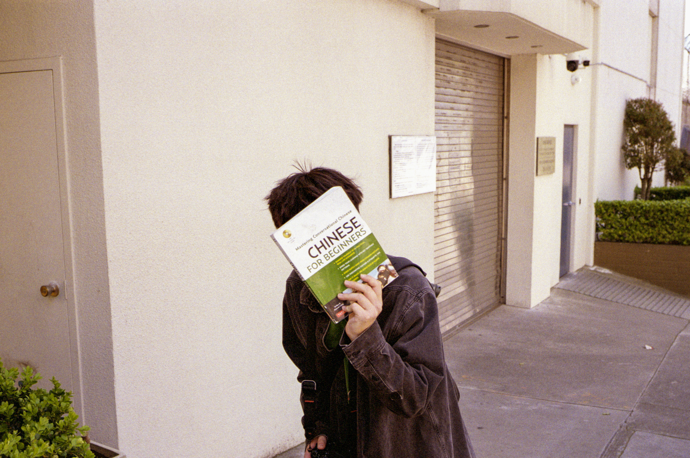
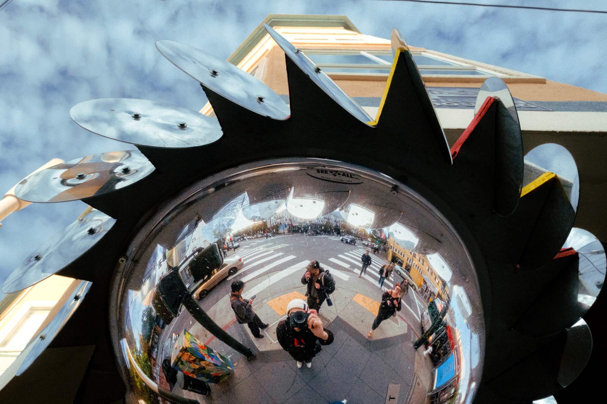
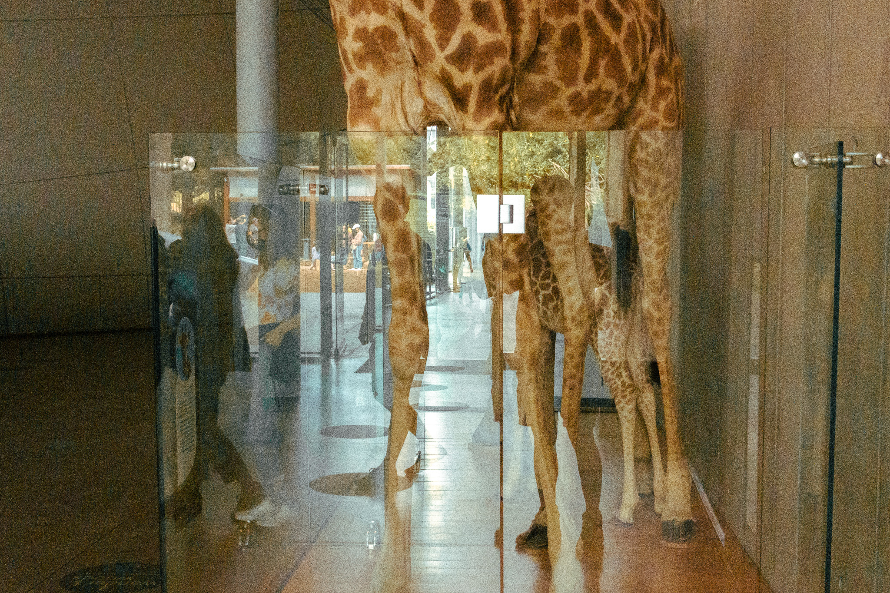
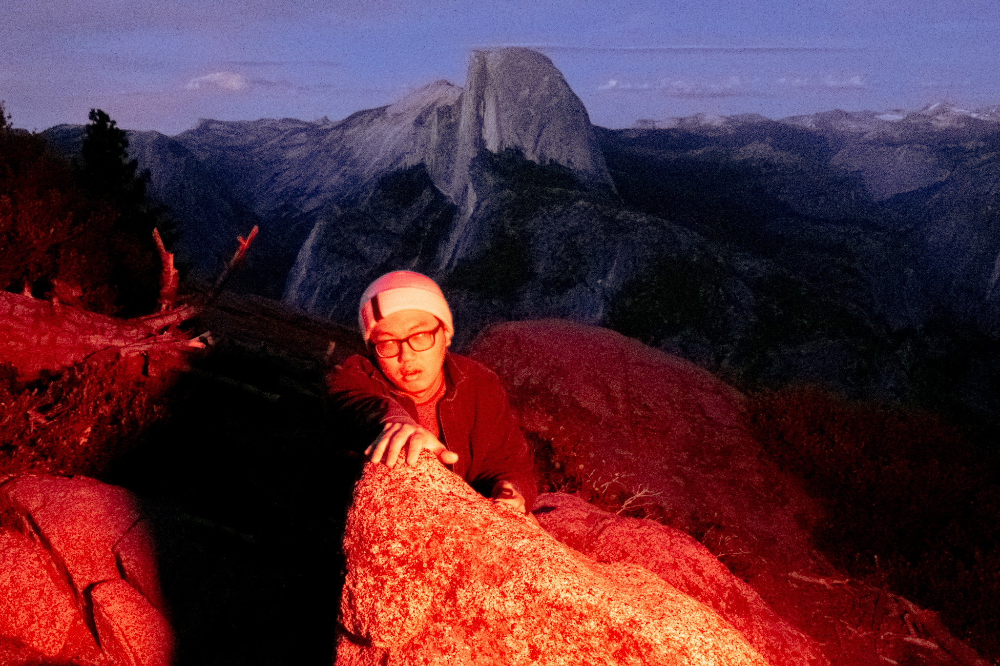
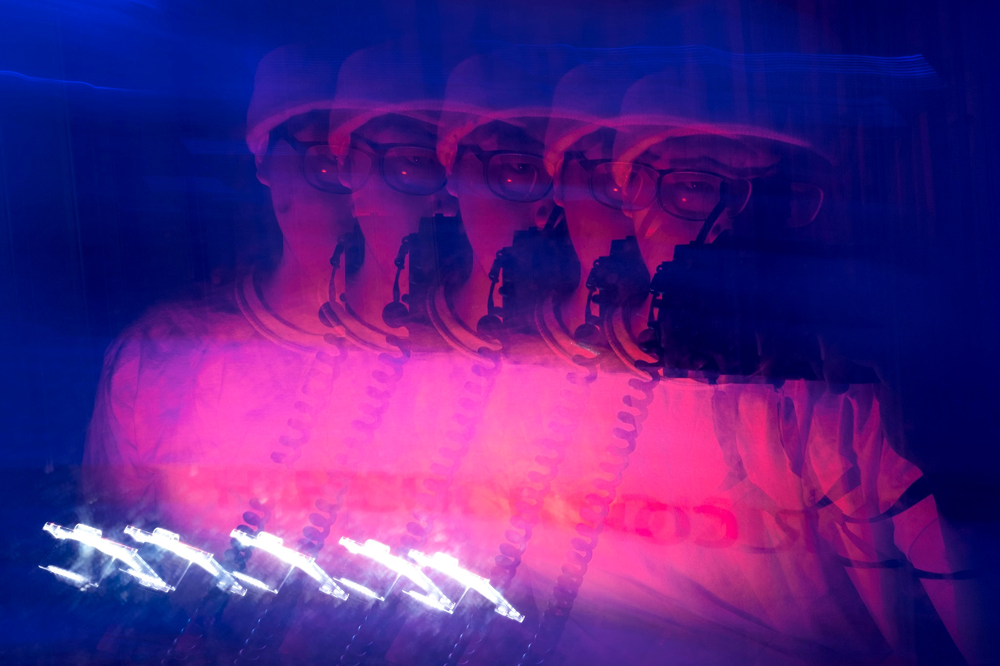
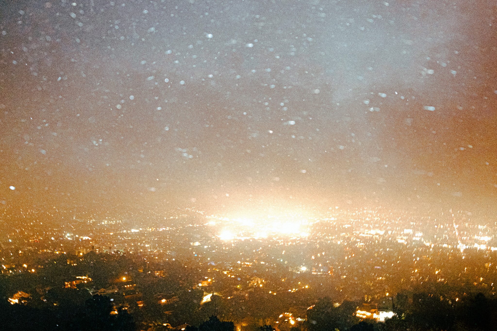
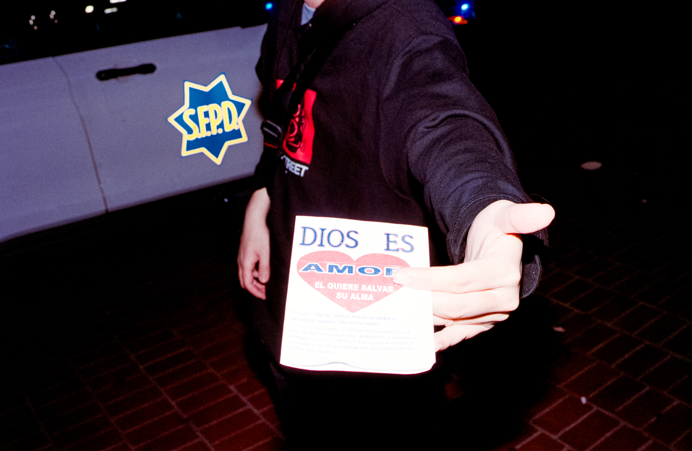
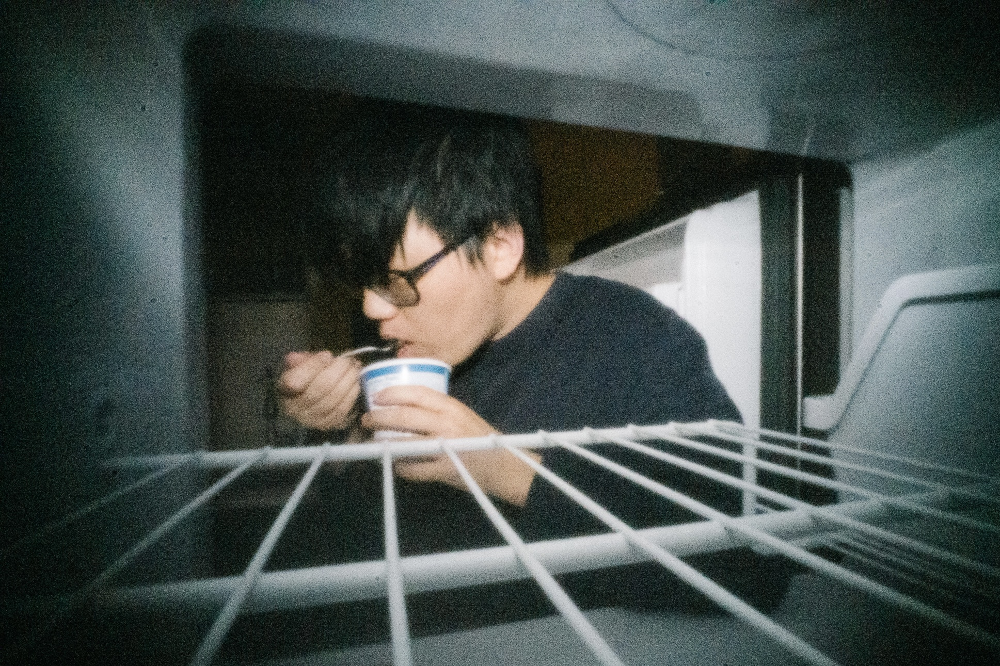

# Visual Curation & Sequence Report: SELF PORTRAITS AND BEHIND THE SCENES

> **Curation Archetype**: Polyphonic Street Symphony / Lyrical Arc
>
> **Hamiltonian Sequence Energy**: `294.3` (Avg Step Cost: `26.8`)
>
> **Respiratory Pacing Score**: `85/100` (3 Inhalations, 5 Exhalations, 4 Grounding)

## 1. Executive Curatorial Architecture

This report visually illustrates the recommended image sequence for **p5**, embedding high-resolution photographs directly in markdown alongside technical colorimetry (CIELAB L*a*b*, ΔE₇₆), respiratory pacing waveforms, and multi-agent aesthetic rationale.

### ⚠️ Respiratory Rhythm Alerts

- **Frame #8 (849BDEFE-8868-48A8-B31D-ADB58F0161022.JPG)** — *Suffocating Weight*: 3 consecutive low-key exhalation frames—consider an open luminous interlude.

## 2. Visual Sequence Journey

### [1/12] DSCF9004-3.jpg


| Attribute | Value |
| :--- | :--- |
| **Framing & Aspect** | `LANDSCAPE` · `1946×1297` (Aspect: `1.50`) |
| **Tonality & Breath** | `L*=28.64` — **Exhalation** (CIELAB: `28.64, -1.05, 0.31`) |
| **Transition to #2 (2025-05-11-0020.JPG)** | `ΔE₇₆: 38.62` (Color) · `ΔLum: 93` · **Step Cost: `34.7`** |

**Curatorial Rationale & Montage Dynamic**:

- *Pacing Role*: Act I: The Overture / Sequence Opener
- *Tonal Dynamic*: Low-key exhalation grounding the viewer with chiaroscuro mass.
- *Transition*: High-contrast tonal step with step cost of 34.7.

> 💬 **[Poetic Caesura / Musical Rest]**
>
> *"A street photographer is an obsessive spectator who hates being looked at.  To turn the lens on oneself is either an accident of reflection or a mild confession."*

---

### [2/12] 2025-05-11-0020.JPG



| Attribute | Value |
| :--- | :--- |
| **Framing & Aspect** | `LANDSCAPE` · `3079×2045` (Aspect: `1.51`) |
| **Tonality & Breath** | `L*=66.18` — **Inhalation** (CIELAB: `66.18, 3.98, 7.86`) |
| **Caption / Photo Credit** | `@photo.initiator` |
| **Transition to #3 (DSCF8059.JPG)** | `ΔE₇₆: 22.12` (Color) · `ΔLum: 49` · **Step Cost: `19.4`** |

**Curatorial Rationale & Montage Dynamic**:

- *Pacing Role*: Sequence Movement (Frame #2)
- *Tonal Dynamic*: Luminous inhalation providing expansive perceptual breathing space.
- *Transition*: High-contrast tonal step with step cost of 19.4.

---

### [3/12] DSCF8059.JPG



| Attribute | Value |
| :--- | :--- |
| **Framing & Aspect** | `LANDSCAPE` · `2048×1365` (Aspect: `1.50`) |
| **Tonality & Breath** | `L*=47.2` — **Neutral** (CIELAB: `47.2, -1.84, -1.9`) |
| **Transition to #4 (DSCF1557-3.JPG)** | `ΔE₇₆: 20.45` (Color) · `ΔLum: 7` · **Step Cost: `12.5`** |

**Curatorial Rationale & Montage Dynamic**:

- *Pacing Role*: Sequence Movement (Frame #3)
- *Tonal Dynamic*: Neutral midpoint maintaining narrative continuity.
- *Transition*: Harmonic chromatic transition with step cost of 12.5.

---

### [4/12] DSCF1557-3.JPG



| Attribute | Value |
| :--- | :--- |
| **Framing & Aspect** | `LANDSCAPE` · `2048×1365` (Aspect: `1.50`) |
| **Tonality & Breath** | `L*=44.5` — **Neutral** (CIELAB: `44.5, 0.44, 18.24`) |
| **Transition to #5 (DSCF5407-2.jpg)** | `ΔE₇₆: 22.73` (Color) · `ΔLum: 34` · **Step Cost: `17.5`** |

**Curatorial Rationale & Montage Dynamic**:

- *Pacing Role*: Sequence Movement (Frame #4)
- *Tonal Dynamic*: Neutral midpoint maintaining narrative continuity.
- *Transition*: Harmonic chromatic transition with step cost of 17.5.

---

### [5/12] DSCF5407-2.jpg


| Attribute | Value |
| :--- | :--- |
| **Framing & Aspect** | `LANDSCAPE` · `1960×1306` (Aspect: `1.50`) |
| **Tonality & Breath** | `L*=58.04` — **Inhalation** (CIELAB: `58.04, -4.8, 0.75`) |
| **Transition to #6 (DSCF8149-7.JPG)** | `ΔE₇₆: 43.12` (Color) · `ΔLum: 86` · **Step Cost: `36.1`** |

**Curatorial Rationale & Montage Dynamic**:

- *Pacing Role*: Sequence Movement (Frame #5)
- *Tonal Dynamic*: Luminous inhalation providing expansive perceptual breathing space.
- *Transition*: High-contrast tonal step with step cost of 36.1.

> 💬 **[Poetic Caesura / Musical Rest]**
>
> *"Photography by day is observation;   By night, it is theater."*

---

### [6/12] DSCF8149-7.JPG



| Attribute | Value |
| :--- | :--- |
| **Framing & Aspect** | `LANDSCAPE` · `2048×1365` (Aspect: `1.50`) |
| **Tonality & Breath** | `L*=23.45` — **Exhalation** (CIELAB: `23.45, 20.95, 1.02`) |
| **Transition to #7 (DSCF8231.JPG)** | `ΔE₇₆: 16.65` (Color) · `ΔLum: 11` · **Step Cost: `10.9`** |

**Curatorial Rationale & Montage Dynamic**:

- *Pacing Role*: Sequence Movement (Frame #6)
- *Tonal Dynamic*: Low-key exhalation grounding the viewer with chiaroscuro mass.
- *Transition*: Harmonic chromatic transition with step cost of 10.9.

---

### [7/12] DSCF8231.JPG


| Attribute | Value |
| :--- | :--- |
| **Framing & Aspect** | `LANDSCAPE` · `2048×1365` (Aspect: `1.50`) |
| **Tonality & Breath** | `L*=28.79` — **Exhalation** (CIELAB: `28.79, 21.07, 16.79`) |
| **Transition to #8 (849BDEFE-8868-48A8-B31D-ADB58F0161022.JPG)** | `ΔE₇₆: 65.27` (Color) · `ΔLum: 12` · **Step Cost: `38.4`** |

**Curatorial Rationale & Montage Dynamic**:

- *Pacing Role*: Sequence Movement (Frame #7)
- *Tonal Dynamic*: Low-key exhalation grounding the viewer with chiaroscuro mass.
- *Transition*: Harmonic chromatic transition with step cost of 38.4.

---

### [8/12] 849BDEFE-8868-48A8-B31D-ADB58F0161022.JPG



| Attribute | Value |
| :--- | :--- |
| **Framing & Aspect** | `LANDSCAPE` · `2048×1364` (Aspect: `1.50`) |
| **Tonality & Breath** | `L*=25.8` — **Exhalation** (CIELAB: `25.8, 41.33, -45.18`) |
| **Transition to #9 (DSCF0525.jpg)** | `ΔE₇₆: 77.93` (Color) · `ΔLum: 87` · **Step Cost: `55.8`** |

**Curatorial Rationale & Montage Dynamic**:

- *Pacing Role*: Sequence Movement (Frame #8)
- *Tonal Dynamic*: Low-key exhalation grounding the viewer with chiaroscuro mass.
- *Transition*: High-contrast tonal step with step cost of 55.8.

---

### [9/12] DSCF0525.jpg



| Attribute | Value |
| :--- | :--- |
| **Framing & Aspect** | `LANDSCAPE` · `2048×1365` (Aspect: `1.50`) |
| **Tonality & Breath** | `L*=57.91` — **Inhalation** (CIELAB: `57.91, 3.87, 15.14`) |
| **Transition to #10 (DSCF6274.JPG)** | `ΔE₇₆: 24.71` (Color) · `ΔLum: 37` · **Step Cost: `19`** |

**Curatorial Rationale & Montage Dynamic**:

- *Pacing Role*: Sequence Movement (Frame #9)
- *Tonal Dynamic*: Luminous inhalation providing expansive perceptual breathing space.
- *Transition*: Harmonic chromatic transition with step cost of 19.

---

### [10/12] DSCF6274.JPG


| Attribute | Value |
| :--- | :--- |
| **Framing & Aspect** | `LANDSCAPE` · `2048×1365` (Aspect: `1.50`) |
| **Tonality & Breath** | `L*=44.13` — **Neutral** (CIELAB: `44.13, 6.59, 35.47`) |
| **Transition to #11 (IMG760.jpg)** | `ΔE₇₆: 46.63` (Color) · `ΔLum: 57` · **Step Cost: `34.7`** |

**Curatorial Rationale & Montage Dynamic**:

- *Pacing Role*: Sequence Movement (Frame #10)
- *Tonal Dynamic*: Neutral midpoint maintaining narrative continuity.
- *Transition*: High-contrast tonal step with step cost of 34.7.

> 💬 **[Poetic Caesura / Musical Rest]**
>
> *"Not known   Because not looked for   But heard, half heard   In the stillness   Between two waves of the sea      T. S. Eliot"*

---

### [11/12] IMG760.jpg



| Attribute | Value |
| :--- | :--- |
| **Framing & Aspect** | `LANDSCAPE` · `3475×2268` (Aspect: `1.53`) |
| **Tonality & Breath** | `L*=18.44` — **Exhalation** (CIELAB: `18.44, 6.35, -3.45`) |
| **Caption / Photo Credit** | `@photo.initiator` |
| **Transition to #12 (DSCF9159.jpg)** | `ΔE₇₆: 18.4` (Color) · `ΔLum: 32` · **Step Cost: `15.3`** |

**Curatorial Rationale & Montage Dynamic**:

- *Pacing Role*: Sequence Movement (Frame #11)
- *Tonal Dynamic*: Low-key exhalation grounding the viewer with chiaroscuro mass.
- *Transition*: Harmonic chromatic transition with step cost of 15.3.

---

### [12/12] DSCF9159.jpg



| Attribute | Value |
| :--- | :--- |
| **Framing & Aspect** | `LANDSCAPE` · `1937×1291` (Aspect: `1.50`) |
| **Tonality & Breath** | `L*=32.65` — **Neutral** (CIELAB: `32.65, -4.68, 0.41`) |

**Curatorial Rationale & Montage Dynamic**:

- *Pacing Role*: Act IV: Coda / Sequence Resolution
- *Tonal Dynamic*: Neutral midpoint maintaining narrative continuity.
- *Transition*: Final contemplative resting frame.

---

## 3. Curatorial Proposals & Optimized Sequence Arc

### 💡 Recommended Interlude & Rhythm Solutions

#### ⚡ Resolving Frame #8 (849BDEFE-8868-48A8-B31D-ADB58F0161022.JPG) — *Suffocating Weight*

##### Option A: Poetic Caesura (Text Interlude)

Insert a contemplative musical rest before Frame #8 to give the viewer cognitive breathing space:

> In the darkroom of the night street, every reflection is an accidental double.
>
> — **Daido Moriyama**

##### Option B: Visual Resequencing (Luminous Inhalation Wave) [Recommended]

Move **`DSCF0525.jpg`** (L*=57.91, Inhalation) into position #8 between the dark nocturnes to create a Chiaroscuro wave.

| Metric | Current Sequence | Proposed Sequence (Option B) |
| :--- | :--- | :--- |
| **Respiratory Pacing Score** | `85/100` | **`100/100`** |
| **Cadence Warnings** | `1` (Suffocating Weight) | **`0` (Harmonic Breath Cycles)** |
| **Hamiltonian Total Energy** | `294.3` | **`318.1`** |

**Proposed `index.md` Layout**:

```markdown
DSCF9004-3.jpg
2025-05-11-0020.JPG | @photo.initiator
DSCF8059.JPG
DSCF1557-3.JPG
DSCF5407-2.jpg
DSCF8149-7.JPG
DSCF8231.JPG
DSCF0525.jpg
849BDEFE-8868-48A8-B31D-ADB58F0161022.JPG
DSCF6274.JPG
IMG760.jpg | @photo.initiator
DSCF9159.jpg
```
