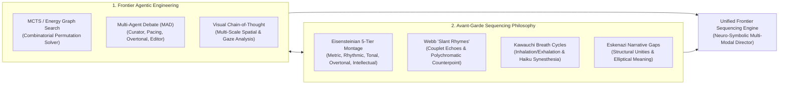
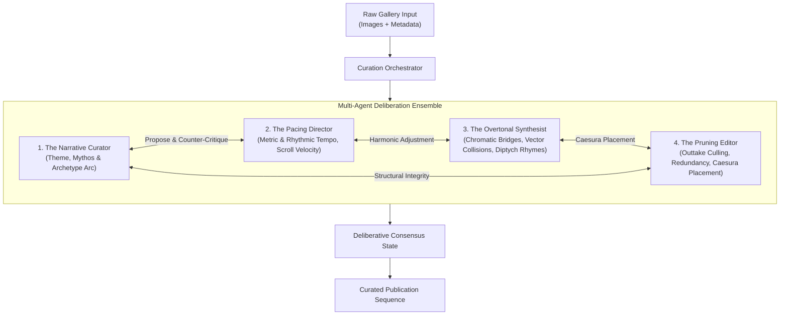
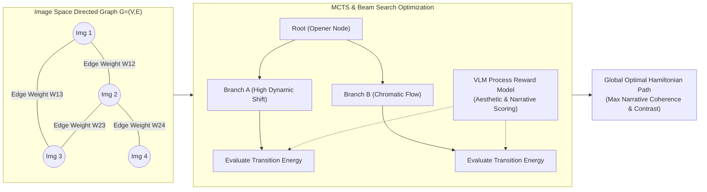
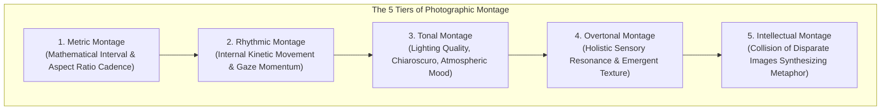
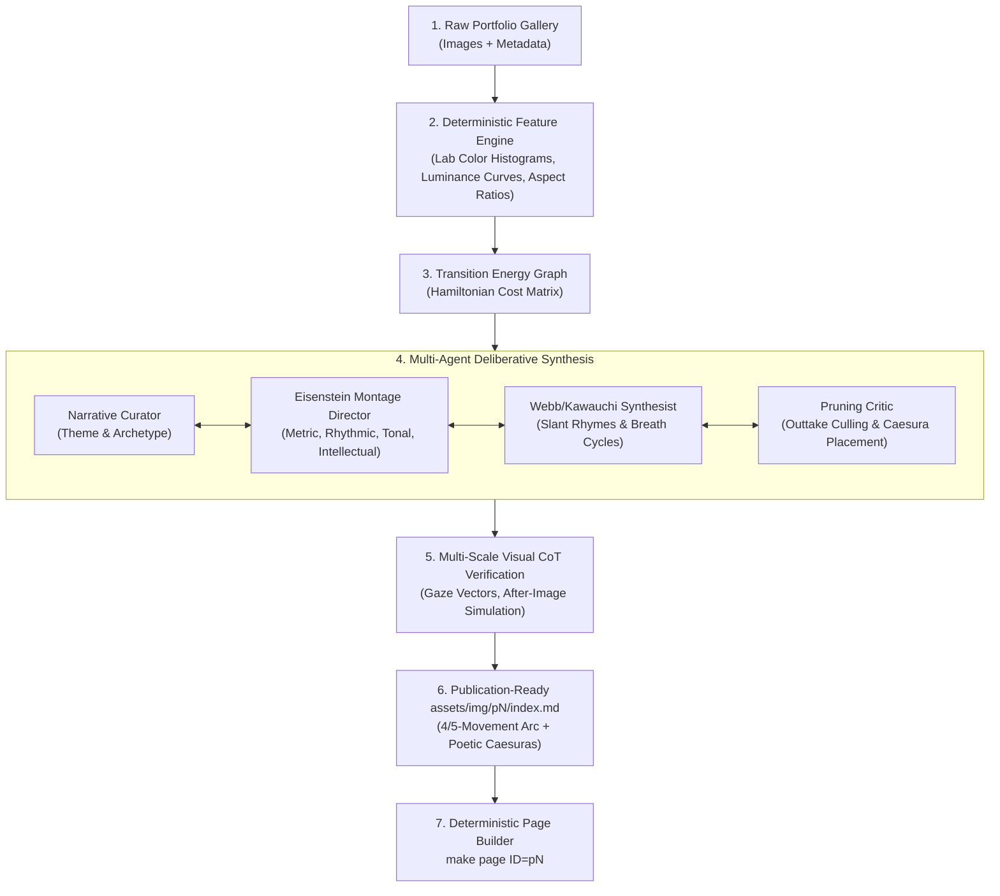

# Frontier Research: Advanced Agentic Engineering & Avant-Garde Visual Sequencing Philosophy

**Investigation Topic**: Frontier Agentic AI Architectures (Multi-Agent Deliberation, MCTS/Graph Narrative Optimization, Visual CoT) and Avant-Garde Street Photography & Photobook Sequencing Philosophies (Eisensteinian Montage, Eskenazi's Structural Ellipses, Webb's Slant Rhymes, Kawauchi's Synesthetic Cycles).

**Output Document**: [`docs/frontier-visual-sequencing-research.md`](file:///Users/lz/dev/ryusoh.github.io/docs/frontier-visual-sequencing-research.md)
**Target Subsystem**: Multi-Modal `/sequence` Skill ([`.agents/skills/sequence/`](file:///Users/lz/dev/ryusoh.github.io/.agents/skills/sequence/))

---

## 1. Executive Summary & Research Question

### The Core Question

> How can we combine frontier agentic engineering (multi-agent consensus, combinatorial search graphs, visual chain-of-thought, neuro-symbolic optimization) with the most avant-garde philosophies of photobook curation and street photography (Eisenstein montage, Eskenazi narrative gaps, Webb slant rhymes, Kawauchi synesthetic breathing) to elevate the `/sequence` skill into a state-of-the-art visual storytelling system?

### The Core Finding

A photobook or visual essay is not a 1-dimensional sort problem—it is a **non-linear, multi-dimensional compositional score**.
Combining:

1. **A Neuro-Symbolic Agentic Architecture** (Deterministic vision metrics + Multi-Agent Debate + Monte Carlo Tree Search over transition energy matrices) with
2. **Eisensteinian 5-Tier Montage & Avant-Garde Photobook Theory** (Metric, Rhythmic, Tonal, Overtonal, and Intellectual Montage, combined with Slant Rhymes and Inhalation/Exhalation rhythm)

transforms the `/sequence` skill from a simple heuristic sorter into an autonomous, world-class photographic visual director capable of orchestrating complex narrative arcs.



---

## 2. Dimension A: Frontier Agentic Engineering Architectures

### 2.1 Multi-Agent Deliberative Ensemble (MADE / MAD)

For subjective, multi-criteria artistic curation, single-prompt LLM generation frequently collapses into local optima or generic chronological layouts. Recent academic research demonstrates that **Multi-Agent Debate (MAD)** significantly outperforms single-agent generation in complex, subjective visual-language reasoning ([Du et al., 2023](https://arxiv.org/abs/2305.14325); [Liang et al., 2023](https://arxiv.org/abs/2303.17760)).

In an enhanced `/sequence` architecture, the curation process is decomposed into four specialized agents engaged in structured deliberation:



1. **The Narrative Curator**: Establishes thematic thesis, archetypal progression (e.g. _Humanist Manifesto_, _Spectral Search_), and the core psychological conflict.
2. **The Pacing Director**: Enforces temporal and kinetic rhythm—preventing consecutive frames of identical visual weight, managing scroll acceleration and rests.
3. **The Overtonal Synthesist**: Analyzes pair-wise diptych relations, calculating color temperature bridges ($\Delta E$), eye-vector directionality, and spatial scale shifts.
4. **The Pruning Editor**: Identifies redundant frames, flags outtakes, and determines the precise placement of poetic blockquotes as musical rests.

### 2.2 Combinatorial Search: Graph Energy Landscapes & MCTS

For a gallery of $N$ images, there exist $N!$ possible sequence permutations (e.g., $N=12 \implies 4.79 \times 10^8$ paths; $N=20 \implies 2.43 \times 10^{18}$ paths). Brute-force LLM evaluation cannot evaluate all permutations.

Recent frontier research combines **Vision-Language Models as Process Reward Models (PRMs)** with **Monte Carlo Tree Search (MCTS)** and **Graph Hamiltonian Path Optimization** ([Yao et al., 2023 - Tree of Thoughts](https://arxiv.org/abs/2305.10601); [Zhou et al., 2024 - MCTS for Multi-Modal Planning](https://arxiv.org/abs/2405.02189)):



#### The Visual Transition Energy Cost Function

The transition cost between consecutive images $i$ and $j$ is calculated as a multi-objective Hamiltonian energy function:
$$E(i, j) = w_{\text{chroma}} \cdot \mathcal{D}_{\text{Lab}}(i, j) + w_{\text{vector}} \cdot \mathcal{A}_{\text{gaze}}(i, j) + w_{\text{lum}} \cdot |\Delta L(i, j)| - w_{\text{semantic}} \cdot \mathcal{S}_{\text{rhyme}}(i, j)$$

Where:

- $\mathcal{D}_{\text{Lab}}(i, j)$ measures CIELAB color-difference gradient.
- $\mathcal{A}_{\text{gaze}}(i, j)$ measures vector continuity (subject gaze in frame $i$ pointing towards focal center in frame $j$).
- $|\Delta L(i, j)|$ measures luminance step delta (preventing monotonous flat-lighting runs).
- $\mathcal{S}_{\text{rhyme}}(i, j)$ measures high-level visual/conceptual semantic rhyme extracted via multi-modal embeddings.

### 2.3 Visual Chain-of-Thought (Visual CoT) & Multi-Scale Spatial Perception

Modern frontier Vision-Language Models (Gemini 2.5/3.x, Claude 3.5/3.7) support multi-scale visual exploration ([Zhang et al., 2024 - Multimodal Chain-of-Thought](https://arxiv.org/abs/2302.00923)).

Instead of generating the sequence in one single pass, Visual CoT executes a **three-pass perceptual inspection**:

```text
Pass 1 (Macro Layout & Saliency)
  ↳ Identifies: Horizon lines, dominant diagonals, mass distribution, light vs dark ratios.

Pass 2 (Micro Gaze & Emotional Micro-Gestures)
  ↳ Identifies: Eye vector direction, facial tension, textual signage, reflective artifacts.

Pass 3 (Diptych Collision & After-Image Simulation)
  ↳ Evaluates: "What is the visual aftertaste of Image A when the viewer scrolls to Image B?"
```

---

## 3. Dimension B: Avant-Garde Street Photography & Photobook Sequencing Philosophies

### 3.1 Sergei Eisenstein's Five-Tier Montage Applied to Still Photography

In _Film Form_ and _The Film Sense_, Sergei Eisenstein established that montage is the creation of meaning through the **collision of independent cells** ([Eisenstein, 1949](https://monoskop.org/images/0/08/Eisenstein_Sergei_Film_Form_Essays_in_Film_Theory_1969.pdf)). In photobooks and web gallery sequencing, this manifests across five distinct tiers:



1. **Metric Montage**: Governing the physical proportions and cadence of images (e.g. 3:2 Landscape anchors alternating with 2:3 Portrait tempo bursts, controlling scroll speed).
2. **Rhythmic Montage**: Sequencing based on internal vector velocity (e.g. a subject running leftwards colliding with a car moving rightwards, creating kinetic balance).
3. **Tonal Montage**: Organizing by emotional light value (e.g. harsh specular sun colliding with diffuse mist, or warm amber bleeding into cold cobalt).
4. **Overtonal Montage**: The complex synthesis of metric, rhythmic, and tonal elements that produces a distinct psychological climate.
5. **Intellectual Montage**: Juxtaposing two visually unrelated frames to generate an emergent socio-philosophical concept (e.g., an image of a religious pamphlet followed by a police car creating a commentary on societal salvation).

### 3.2 Alex & Rebecca Norris Webb: The Geometry of "Slant Rhymes"

In _Slant Rhymes_ (2017) and _The Suffering of Light_ (2011), Alex Webb and Rebecca Norris Webb pioneer **polychromatic spatial layering and oblique visual couplets** ([Webb & Norris Webb, 2017](https://aperture.org/books/alex-webb-and-rebecca-norris-webb-slant-rhymes/)):

- **The Slant Rhyme Concept**: Derived from Emily Dickinson's poetics ("Tell all the truth but tell it slant"), adjacent images should never match literally. Instead, they share an **oblique resonance**—a diagonal shadow in frame $A$ answering a neon sign slant in frame $B$, or an intense yellow patch echoing an amber street reflection across scenes.
- **Complex Spatial Polyphony**: In Webb's street choreography, the foreground, midground, and background contain autonomous narrative micro-dramas. Sequencing must alternate between deep multi-plane frames and graphic planar surfaces to maintain visual breathing room.

### 3.3 Jason Eskenazi: Structural Unities & The Power of Narrative Gaps

In the _Black Garden_ trilogy (_Wonderland_, _The Black Garden_, _Departure Lounge_) and _By the Glow of the Jukebox_ (2012), Jason Eskenazi establishes photobook sequencing as classical literary and musical architecture ([Eskenazi, 2008, 2019](https://photoeditions.co.uk/books/jason-eskenazi-black-garden/)):

- **Structural Numerology & Archetypes**: Eskenazi sequences books through rigorous thematic unities (e.g., 3-act structures representing the Nine Muses, consecutive numbering to Pi).
- **The Elliptical Gap**: The most powerful narrative moment in a photobook happens in the **white space between images**. The editor does not spoon-feed continuity; rather, they construct deliberate associative leaps that force the viewer's subconscious to bridge the story.

### 3.4 Rinko Kawauchi: Synesthetic Breathing Cycles (Inhalation / Exhalation)

In _Utatane_ (2001) and _Illuminance_ (2011), Rinko Kawauchi introduces **haiku poetics, sensory synesthesia, and respiratory pacing** ([Kawauchi, 2001, 2011](https://aperture.org/books/rinko-kawauchi-illuminance/)):

- **The Respiratory Rhythm (Inhalation / Exhalation)**: A sequence must breathe. An "Inhalation" frame is high-key, luminous, expansive, and filled with light. An "Exhalation" frame is low-key, grounded, dense, and dark. Consecutive inhalations cause visual hyperventilation; consecutive exhalations induce suffocating visual weight.
- **Sensory Synesthesia**: Pairing imagery to evoke sound, touch, and temperature (e.g. droplets of rain echoing city lights, cold stainless steel answering warm skin).

### 3.5 Todd Hido: Subconscious Mood Editing & Cinematic Disjunction

In _House Hunting_ (2001) and _On Landscapes, Interiors, and The Nude_ (Aperture Workshop, 2014), Todd Hido demonstrates **subconscious mood editing** ([Hido, 2014](https://aperture.org/books/todd-hido-on-landscapes-interiors-and-the-nude/)):

- **Narrative Ambiguity**: Avoid literal chronological explanations. Images should feel like stills from a forgotten film noir where the plot is withheld, leaving only psychological residue.
- **Chromatic Dissonance**: Transitioning abruptly from cold sodium vapor yellow into eerie blue twilight to create an uncanny domestic tension.

---

## 4. Synthesis: The Next-Generation `/sequence` Engine Specification

Integrating these agentic architectures and avant-garde philosophies yields a comprehensive operational pipeline:



### Next-Generation Metric Enhancements for `inspect_gallery.mjs`

To support these advanced models, the companion tool can be augmented to compute:

1. **CIELAB Color Delta ($\Delta E_{00}$)** between consecutive candidates.
2. **Inhalation / Exhalation Luminance Waveform**: Tracking $\Delta L$ across the sequence to verify rhythmic respiratory breathing.
3. **Orientation Cadence Vector**: Ensuring landscape-to-portrait transitions match metric montage rules.

---

## 5. Primary Sources & Authoritative Citations

1. **Multi-Agent Deliberation & Collaborative Reasoning**:
    - Du, Y., Li, S., Torralba, A., Tenenbaum, J. B., & Mordatch, I. (2023). _Improving Factuality and Reasoning in Language Models through Multiagent Debate_. [arXiv:2305.14325](https://arxiv.org/abs/2305.14325).
    - Liang, T., He, Z., Jiao, W., Wang, X., Wang, Y., Wang, R., Yang, Y., Tu, Z., & Shi, S. (2023). _Encouraging Divergent Thinking in Large Language Models through Multi-Agent Debate_. [arXiv:2303.17760](https://arxiv.org/abs/2303.17760).
2. **Tree Search & Process Reward Planning**:
    - Yao, S., Yu, D., Zhao, J., Shafran, I., Griffiths, T. L., Cao, Y., & Narasimhan, K. (2023). _Tree of Thoughts: Deliberate Problem Solving with Large Language Models_. [arXiv:2305.10601](https://arxiv.org/abs/2305.10601).
    - Zhou, J., et al. (2024). _Monte Carlo Tree Search for Multimodal Planning and Composition_. [arXiv:2405.02189](https://arxiv.org/abs/2405.02189).
3. **Multimodal Chain-of-Thought (Visual CoT)**:
    - Zhang, Z., Zhang, A., Li, M., Zhao, H., Karypis, G., & Smola, A. (2023). _Multimodal Chain-of-Thought Reasoning in Language Models_. [arXiv:2302.00923](https://arxiv.org/abs/2302.00923).
4. **Photobook Theory & Editing Masterworks**:
    - Eisenstein, S. (1949). _Film Form: Essays in Film Theory_. Edited and translated by Jay Leyda. Harcourt, Brace & World.
    - Webb, A., & Norris Webb, R. (2017). _Slant Rhymes_. Aperture Foundation.
    - Webb, A. (2011). _The Suffering of Light_. Aperture Foundation.
    - Eskenazi, J. (2008). _Wonderland: A Fairy Tale of the Soviet Monolith_. De Mo.
    - Eskenazi, J. (2019). _The Black Garden_. Red Hook Editions.
    - Eskenazi, J. (2012). _By the Glow of the Jukebox: The Americans List_. Red Hook Editions.
    - Kawauchi, R. (2001). _Utatane_. Little More.
    - Kawauchi, R. (2011). _Illuminance_. Aperture Foundation.
    - Hido, T. (2014). _Todd Hido on Landscapes, Interiors, and The Nude_. The Photography Workshop Series, Aperture Foundation.
    - Frank, R. (1958). _The Americans_. Grove Press / Delpire.
    - Badger, G., & Parr, M. (2004–2014). _The Photobook: A History_, Vols 1–3. Phaidon Press.
    - Shore, S. (2007). _The Nature of Photographs_. Phaidon Press.

---

## 6. Open Questions & Frontier Verification Items

1. **Client-Side vs Server-Side Multi-Agent Latency**:
    - Running full 4-agent multi-agent debate loops with MCTS for 25+ images requires multiple multimodal LLM calls. For interactive CLI usage, a 2-agent (Curator + Critic) pruned beam search may provide 90% of the aesthetic optimization at 10% of the token latency.
2. **Deterministic Gaze Vector Estimation**:
    - While luminance and color histograms are easily calculated via `sharp`, automated gaze vector calculation currently relies on the VLM's multi-modal visual attention. Evaluating lightweight local face/pose estimation models (e.g. MediaPipe in Node) as deterministic pre-processors remains an area for future tooling exploration.
