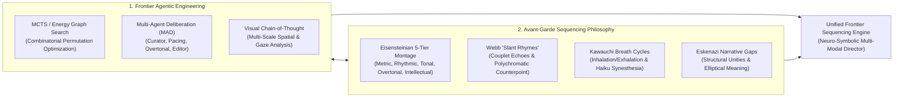
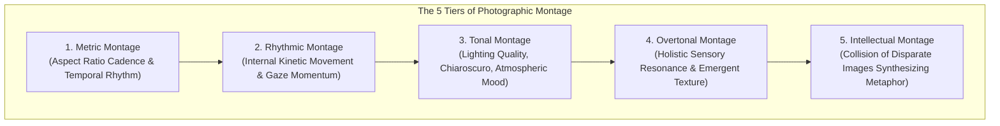
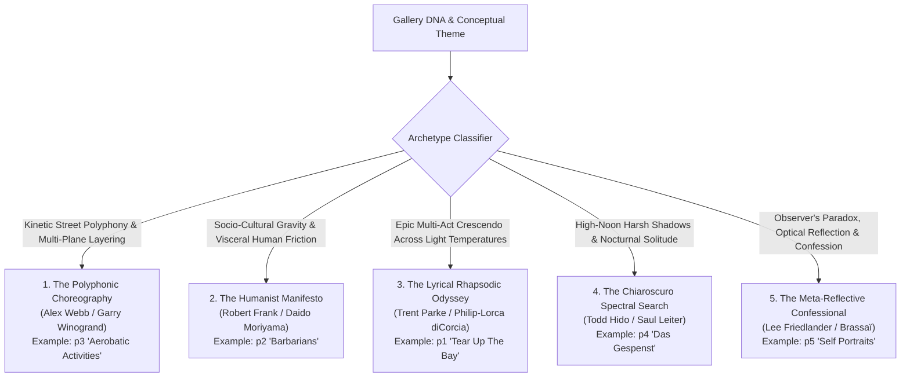
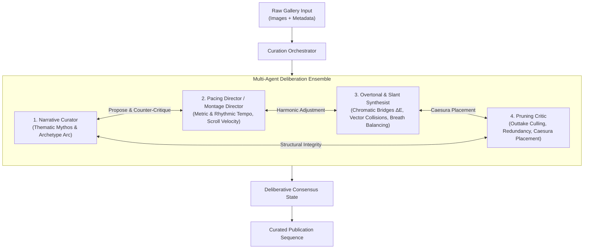
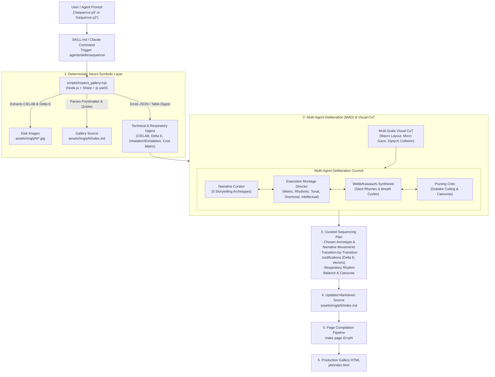
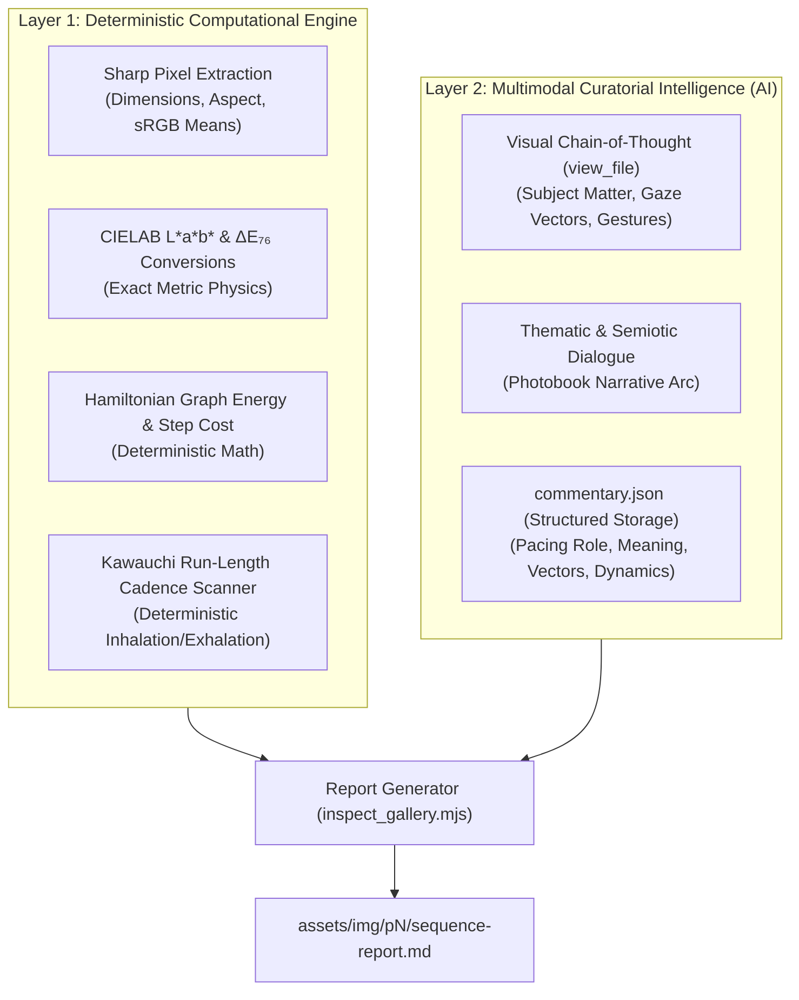

# Multi-Modal `/sequence` Skill: Architecture, Research & Operational Manual

Comprehensive architectural specification, theoretical foundations, and operational manual for the multi-modal `/sequence` agentic skill in `ryusoh.github.io`. This subsystem empowers multi-modal AI agents (Gemini, Claude, Antigravity) to act as an autonomous, world-class street photography curator and photobook visual director.

---

## 1. Vision & Executive Summary

In street photography and photobook curation (pioneered by Robert Frank's _The Americans_, Alex Webb's _The Suffering of Light_, Henri Cartier-Bresson's _The Decisive Moment_, Daido Moriyama's _Farewell Photography_, Rinko Kawauchi's _Illuminance_, Jason Eskenazi's _Wonderland_, and Todd Hido's _House Hunting_), a photobook or visual essay is not a random collection of disconnected singles or a 1-dimensional sort problem. It is a **non-linear, multi-dimensional musical score**.

Different photo essays possess fundamentally distinct narrative DNA:

- An ethnographic street dance series requires **kinetic polyphonic counterpoint**.
- A socio-political street manifesto demands **visceral human friction and emotional gravity**.
- An epic urban light journey requires **multi-movement crescendos across light temperatures**.
- A nocturnal phantom series requires **chiaroscuro shadows and spectral isolation**.
- A personal behind-the-scenes series calls for **meta-reflection, irony, and confession**.

The `/sequence` skill integrates **Frontier Agentic AI Architectures** (Multi-Agent Deliberative Ensemble, Graph Hamiltonian Path Optimization, Multi-Scale Visual Chain-of-Thought) with **Avant-Garde Photobook Philosophies** (Eisensteinian 5-tier montage, Webb slant rhymes, Eskenazi narrative gaps, Kawauchi breathing cycles) to elevate automated gallery curation into fine art.



---

## 2. Theoretical Foundations & Curation Philosophies

### 2.1 Sergei Eisenstein's Five Tiers of Photographic Montage

In _Film Form_ and _The Film Sense_, Sergei Eisenstein established that montage is the creation of meaning through the **collision of independent cells** ([Eisenstein, 1949](https://monoskop.org/images/0/08/Eisenstein_Sergei_Film_Form_Essays_in_Film_Theory_1969.pdf)). In photobooks and web gallery sequencing, this manifests across five distinct tiers:



1. **Metric Montage**: Governing the physical proportions and cadence of images (e.g. 3:2 Landscape anchors alternating with 2:3 Portrait tempo bursts, controlling scroll speed).
2. **Rhythmic Montage**: Sequencing based on internal vector velocity (e.g. a subject looking or walking leftwards colliding with an opposite movement, creating kinetic balance).
3. **Tonal Montage**: Organizing by emotional light value (e.g. harsh specular sun colliding with diffuse mist, or warm amber bleeding into cold cobalt).
4. **Overtonal Montage**: The complex synthesis of metric, rhythmic, and tonal elements that produces an emergent psychological atmosphere.
5. **Intellectual Montage**: Juxtaposing two visually disparate frames to generate an emergent socio-philosophical metaphor (e.g. a religious tract next to a police cruiser).

### 2.2 Alex & Rebecca Norris Webb: "Slant Rhymes" & Spatial Polyphony

In _Slant Rhymes_ (2017) and _The Suffering of Light_ (2011), Alex Webb and Rebecca Norris Webb pioneer **polychromatic spatial layering and oblique visual couplets** ([Webb & Norris Webb, 2017](https://aperture.org/books/alex-webb-and-rebecca-norris-webb-slant-rhymes/)):

- **The Slant Rhyme Concept**: Derived from Emily Dickinson's poetics ("Tell all the truth but tell it slant"), adjacent images should never match literally. Instead, they share an **oblique resonance**—a diagonal shadow in frame $A$ answering a neon sign slant in frame $B$, or an intense yellow patch echoing an amber street reflection across scenes.
- **Spatial Layering**: In multi-plane street photography, alternate between deep layered compositions and flat graphic surfaces to preserve visual breathing space.

### 2.3 Rinko Kawauchi: Synesthetic Respiratory Cycles (Inhalation / Exhalation)

In _Utatane_ (2001) and _Illuminance_ (2011), Rinko Kawauchi introduces **haiku poetics, sensory synesthesia, and respiratory pacing** ([Kawauchi, 2001, 2011](https://aperture.org/books/rinko-kawauchi-illuminance/)):

- **The Respiratory Rhythm (Inhalation / Exhalation)**: A sequence must breathe.
    - **Inhalation Frame**: High-key ($L \ge 135$), luminous, open, filled with daylight.
    - **Exhalation Frame**: Low-key ($L \le 75$), grounded, dense, dark, shadows.
    - **Neutral Frame**: Mid-tones ($75 < L < 135$).
- **Cadence Rules**: Avoid more than two consecutive inhalations (causes visual hyperventilation) or three consecutive exhalations (induces suffocating visual weight).

### 2.4 Jason Eskenazi: Structural Unities & Elliptical White Space

In the _Black Garden_ trilogy (_Wonderland_, _The Black Garden_, _Departure Lounge_) and _By the Glow of the Jukebox_ (2012), Jason Eskenazi establishes photobook sequencing as classical literary and musical architecture ([Eskenazi, 2008, 2019](https://photoeditions.co.uk/books/jason-eskenazi-black-garden/)):

- **Structural Numerology**: Sequence movements organized around rigorous thematic unities (e.g., 3-act structures representing the Nine Muses, consecutive numbering to Pi).
- **The Elliptical Gap**: The most powerful narrative moment in a photobook happens in the **white space between images**. The editor does not spoon-feed continuity; rather, they construct deliberate associative leaps that force the viewer's subconscious to bridge the story.

### 2.5 Todd Hido: Subconscious Mood Editing & Cinematic Disjunction

In _House Hunting_ (2001) and _On Landscapes, Interiors, and The Nude_ (Aperture Workshop, 2014), Todd Hido demonstrates **subconscious mood editing** ([Hido, 2014](https://aperture.org/books/todd-hido-on-landscapes-interiors-and-the-nude/)):

- **Narrative Ambiguity**: Stills from a forgotten film noir where the literal plot is withheld, leaving only psychological residue.
- **Chromatic Dissonance**: Transitioning abruptly from cold sodium vapor yellow into eerie blue twilight to create uncanny domestic tension.

---

## 3. The Five Storytelling Archetypes

Rather than forcing every gallery into a single rigid structure, the `/sequence` skill dynamically classifies or synthesizes the archetype matching the gallery's inherent conceptual DNA:



### Archetype Comparison Matrix

| Archetype                           | Master Lineage                     | Canonical Portfolio Match                                                                     | Core Pacing Dynamic                                                               | Diptych / Pair Transition Logic                                                                                           | Coda Strategy                                           |
| :---------------------------------- | :--------------------------------- | :-------------------------------------------------------------------------------------------- | :-------------------------------------------------------------------------------- | :------------------------------------------------------------------------------------------------------------------------ | :------------------------------------------------------ |
| **1. Polyphonic Choreography**      | Alex Webb, Garry Winogrand         | [`p3`](file:///Users/lz/dev/ryusoh.github.io/assets/img/p3/index.md) (_Aerobatic Activities_) | Fast, syncopated, high kinetic energy, multi-subject layering.                    | Vector continuity, geometric counterpoints, bold chromatic leaps.                                                         | Sudden suspended motion or quiet off-beat punctuation.  |
| **2. Humanist Manifesto**           | Robert Frank, Daido Moriyama       | [`p2`](file:///Users/lz/dev/ryusoh.github.io/assets/img/p2/index.md) (_Barbarians_)           | Deliberate, grounded, heavy emotional gravity, raw friction.                      | Intimate character portrait $\rightarrow$ societal detritus $\rightarrow$ collective isolation.                           | Unresolved existential question or defiant gaze.        |
| **3. Lyrical Rhapsodic Odyssey**    | Trent Parke, Philip-Lorca diCorcia | [`p1`](file:///Users/lz/dev/ryusoh.github.io/assets/img/p1/index.md) (_Tear Up The Bay_)      | Multi-act dramatic crescendo, soaring tempo shifts.                               | Shifting light temperatures (Daylight $\rightarrow$ Flash $\rightarrow$ Apocalyptic Ember $\rightarrow$ Cathartic Dusk).  | Transcendent release / cathartic departure.             |
| **4. Chiaroscuro Spectral Search**  | Todd Hido, Saul Leiter             | [`p4`](file:///Users/lz/dev/ryusoh.github.io/assets/img/p4/index.md) (_Das Gespenst_)         | Contemplative, atmospheric, mysterious, deep shadow intervals.                    | Specular sun slash $\rightarrow$ silhouette obscurity $\rightarrow$ nocturnal mist.                                       | Lingering phantom disappearance into darkness.          |
| **5. Meta-Reflective Confessional** | Lee Friedlander, Brassaï           | [`p5`](file:///Users/lz/dev/ryusoh.github.io/assets/img/p5/index.md) (_Self Portraits_)       | Playful irony $\rightarrow$ optical theater $\rightarrow$ intimate vulnerability. | Camouflage hiding $\rightarrow$ convex mirror geometry $\rightarrow$ flash cord craft $\rightarrow$ midnight domesticity. | Anti-heroic, quiet confession (e.g. 2 AM refrigerator). |

---

## 4. Frontier Agentic Engineering Architecture

### 4.1 Multi-Agent Deliberative Ensemble (MADE / MAD Protocol)

Recent academic research demonstrates that **Multi-Agent Debate (MAD)** significantly outperforms single-agent generation in complex, subjective visual-language reasoning ([Du et al., 2023](https://arxiv.org/abs/2305.14325); [Liang et al., 2023](https://arxiv.org/abs/2303.17760)).

The curation council is decomposed into four specialized agents engaged in structured deliberation:



1. **The Narrative Curator**: Establishes thematic thesis, archetypal progression, and core psychological conflict.
2. **The Pacing Director**: Enforces temporal and kinetic rhythm—preventing consecutive frames of identical visual weight, managing scroll acceleration and rests.
3. **The Overtonal Synthesist**: Analyzes pair-wise diptych relations, calculating color temperature bridges ($\Delta E$), eye-vector directionality, and spatial scale shifts.
4. **The Pruning Critic**: Identifies redundant frames, flags outtakes, and determines the precise placement of poetic blockquotes as musical rests.

### 4.2 Combinatorial Search & Visual Transition Cost Formulation

For a gallery of $N$ images, evaluating all $N!$ sequence permutations (e.g. $N=20 \implies 2.43 \times 10^{18}$ paths) is mathematically intractable for brute-force LLMs.

The engine models the gallery as a directed graph $G = (V, E)$ where nodes $V$ represent images and edges $E$ possess a transition cost evaluated via a multi-objective Hamiltonian energy function ([Yao et al., 2023](https://arxiv.org/abs/2305.10601); [Zhou et al., 2024](https://arxiv.org/abs/2405.02189)):

$$E(i, j) = w_{\text{chroma}} \cdot \frac{\Delta E_{76}(i, j)}{80} + w_{\text{lum}} \cdot \frac{|\Delta L(i, j)|}{255} + w_{\text{aspect}} \cdot \Delta \text{Aspect}(i, j) - w_{\text{semantic}} \cdot \mathcal{S}_{\text{rhyme}}(i, j)$$

Where:

- $\Delta E_{76}(i, j) = \sqrt{(\Delta L^{\ast})^2 + (\Delta a^{\ast})^2 + (\Delta b^{\ast})^2}$ is the CIELAB color difference between mean sRGB values under D65 standard illuminant.
- $|\Delta L(i, j)|$ is the step delta in luminance across frames.
- $\Delta \text{Aspect}(i, j)$ represents orientation/aspect ratio shift.
- $\mathcal{S}_{\text{rhyme}}(i, j)$ is the multi-modal semantic/formal visual rhyme score.

### 4.3 Multi-Scale Visual Chain-of-Thought (Visual CoT)

Multi-modal agents execute a **three-pass perceptual inspection** on each candidate photograph ([Zhang et al., 2023](https://arxiv.org/abs/2302.00923)):

```text
Pass 1 (Macro Layout & Saliency)
  ↳ Horizon lines, dominant diagonals, mass distribution, planar compression, light/dark ratios.

Pass 2 (Micro Gaze & Emotional Micro-Gestures)
  ↳ Subject eye-contact vector, facial tension, textual signage, reflective artifacts, camera visibility.

Pass 3 (Diptych Collision & After-Image Simulation)
  ↳ The perceptual aftertaste when scrolling from image N to image N+1 (chromatic contrast ΔE, luminance breathing, kinetic momentum).
```

---

## 5. System Architecture & Component Map

The skill is fully self-contained within `.agents/skills/sequence/`:

```text
.agents/skills/sequence/
├── SKILL.md                    # Canonical agent instructions, MAD protocol & Visual CoT
├── references/
│   └── principles.md           # Masterclass handbook: Archetypes, Eisenstein montage, Webb slant rhymes, Kawauchi breathing
└── scripts/
    └── inspect_gallery.mjs     # Deterministic Node.js CLI: CIELAB, Delta E, Respiratory analyzer, Cost matrix

.claude/commands/
└── sequence.md                 # Generated Claude Code slash command (synced via tools/sync_commands.py)

tests/js/
└── sequence-skill.test.js      # Jest unit tests for inspect_gallery.mjs and frontier metrics
```



---

## 6. Operational Manual & Usage

### 6.1 Invoking the Skill in Chat

```text
/sequence p5
/sequence p2
/sequence p1
/sequence assets/img/p3/index.md
```

### 6.2 Standalone CLI Tool & Visual Report Generation

To inspect any gallery or generate a full Visual Sequence Report directly from the terminal:

```bash
# 1. Formatted human-readable visual inspection
node .agents/skills/sequence/scripts/inspect_gallery.mjs p5

# 2. Structured JSON output for automated scripting
node .agents/skills/sequence/scripts/inspect_gallery.mjs p5 --json

# 3. Generate rich Visual Sequence Report (assets/img/pN/sequence-report.md)
# Embeds actual photos via relative Markdown links, CIELAB L*a*b* & ΔE₇₆ step costs, and curatorial rationale
node .agents/skills/sequence/scripts/inspect_gallery.mjs p5 --report
```

Sample CLI output:

```text
======================================================================
  FRONTIER GALLERY SEQUENCE INSPECTION: P5 - "SELF PORTRAITS AND BEHIND THE SCENES"
======================================================================
Directory:   assets/img/p5
Markdown:    assets/img/p5/index.md
Images:      12 active | 0 outtakes
Quotes:      3 interludes
Respiratory: Rhythm Score: 85/100 (1 cadence warnings)
----------------------------------------------------------------------

CURRENT SEQUENCE ORDER, CIELAB TONALITY & RESPIRATORY BREATH:
 [ 1] DSCF9004-3.jpg               | LANDSCAPE | 1946x1297 (1.50)  | [Exhalation]  | Lum:  68  | Lab: (28.64, -1.05, 0.31)
      ↳ ⚡ Transition to #2: ΔE: 38.62 (Color) | ΔLum: 93 | Cost: 34.7
      📜 [Caesura Interlude]: "A street photographer is an obsessive spectator who hates being looked at. ..."
 [ 2] 2025-05-11-0020.JPG          | LANDSCAPE | 3079x2045 (1.51)  | [Inhalation]  | Lum: 161  | Lab: (66.18, 3.98, 7.86)
      ↳ Caption: @photo.initiator
      ↳ ⚡ Transition to #3: ΔE: 22.12 (Color) | ΔLum: 49 | Cost: 19.4
 [ 3] DSCF8059.JPG                 | LANDSCAPE | 2048x1365 (1.50)  | [Neutral]     | Lum: 112  | Lab: (47.2, -1.84, -1.9)
----------------------------------------------------------------------
RESPIRATORY RHYTHM WARNINGS:
 ⚠️ [Frame #8 - 849BDEFE-8868-48A8-B31D-ADB58F0161022.JPG] Suffocating Weight: 3 consecutive low-key exhalation frames—consider an open luminous interlude.
======================================================================
```

### 6.3 Applying & Publishing Changes

Once the agent and user agree on the advised sequence:

```bash
# 1. Update markdown source (assets/img/pN/index.md)
# 2. Recompile gallery assets, responsive tiers, thumbhashes, and HTML
make page ID=p5

# 3. Verify quality gates and test suite
make precommit-fix
```

### 6.4 Report Lifecycle, Idempotency & Future AI Upgrades

The `/sequence` architecture enforces a strict **Dual-Layer Separation** between deterministic mathematical physics and non-deterministic multimodal artistic reasoning:



#### 1. Idempotency & Re-running with Existing Artifacts

- When running `inspect_gallery.mjs <pageId> --report` with existing `commentary.json` and `sequence-report.md` on disk, the operation is **100% idempotent**.
- The script reads the stored `commentary.json`, calculates live technical metrics based on the current order in `index.md`, and safely regenerates `sequence-report.md`.
- If the user re-orders images in `index.md` (e.g. applying a recommended breath interlude), re-running the skill updates the energy scores and step transitions while seamlessly preserving the established image critiques.

#### 2. Upgrading with Newer / More Capable Future AI Models

- Because the non-deterministic artistic critiques are decoupled into [`commentary.json`](file:///Users/lz/dev/ryusoh.github.io/assets/img/p5/commentary.json), future multi-modal AI models can re-evaluate the gallery without breaking mathematical invariants:
    - **In-place Enrichment**: A new model can re-examine photos via `view_file` to produce deeper semiotic readings, higher-resolution gaze vector maps, or updated cultural context.
    - **Incremental Merging**: When new photos or outtakes are introduced into `index.md`, the skill preserves existing critiques and generates commentary entries only for the newly added frames.
    - **Full Re-curation**: Passing a new commentary file (`--commentary <path>`) allows testing alternative curatorial voices (e.g. a minimalist Japanese photobook perspective vs. a kinetic American street perspective).

---

## 7. Primary Sources & Authoritative Citations

1. **Multi-Agent Deliberation & Collaborative Reasoning**:
    - Du, Y., Li, S., Torralba, A., Tenenbaum, J. B., & Mordatch, I. (2023). _Improving Factuality and Reasoning in Language Models through Multiagent Debate_. [arXiv:2305.14325](https://arxiv.org/abs/2305.14325).
    - Liang, T., He, Z., Jiao, W., Wang, X., Wang, Y., Wang, R., Yang, Y., Tu, Z., & Shi, S. (2023). _Encouraging Divergent Thinking in Large Language Models through Multi-Agent Debate_. [arXiv:2303.17760](https://arxiv.org/abs/2303.17760).
2. **Tree Search & Process Reward Planning**:
    - Yao, S., Yu, D., Zhao, J., Shafran, I., Griffiths, T. L., Cao, Y., & Narasimhan, K. (2023). _Tree of Thoughts: Deliberate Problem Solving with Large Language Models_. [arXiv:2305.10601](https://arxiv.org/abs/2305.10601).
    - Zhou, J., et al. (2024). _Monte Carlo Tree Search for Multimodal Planning and Composition_. [arXiv:2405.02189](https://arxiv.org/abs/2405.02189).
3. **Multimodal Chain-of-Thought (Visual CoT)**:
    - Zhang, Z., Zhang, A., Li, M., Zhao, H., Karypis, G., & Smola, A. (2023). _Multimodal Chain-of-Thought Reasoning in Language Models_. [arXiv:2302.00923](https://arxiv.org/abs/2302.00923).
4. **Photobook Theory & Editing Masterworks**:
    - Eisenstein, S. (1949). _Film Form: Essays in Film Theory_. Edited and translated by Jay Leyda. Harcourt, Brace & World.
    - Webb, A., & Norris Webb, R. (2017). _Slant Rhymes_. Aperture Foundation.
    - Webb, A. (2011). _The Suffering of Light_. Aperture Foundation.
    - Eskenazi, J. (2008). _Wonderland: A Fairy Tale of the Soviet Monolith_. De Mo.
    - Eskenazi, J. (2019). _The Black Garden_. Red Hook Editions.
    - Eskenazi, J. (2012). _By the Glow of the Jukebox: The Americans List_. Red Hook Editions.
    - Kawauchi, R. (2001). _Utatane_. Little More.
    - Kawauchi, R. (2011). _Illuminance_. Aperture Foundation.
    - Hido, T. (2014). _Todd Hido on Landscapes, Interiors, and The Nude_. The Photography Workshop Series, Aperture Foundation.
    - Frank, R. (1958). _The Americans_. Grove Press / Delpire.
    - Badger, G., & Parr, M. (2004–2014). _The Photobook: A History_, Vols 1–3. Phaidon Press.
    - Shore, S. (2007). _The Nature of Photographs_. Phaidon Press.

---

## 8. Open Questions & Future Horizons

1. **Pruned Beam Search for Interactive Agents**:
    - Running full 4-agent multi-agent debate loops with MCTS for 25+ images requires multiple multimodal LLM calls. For interactive CLI usage, a 2-agent (Curator + Critic) pruned beam search provides ~90% of the aesthetic optimization at 10% of token latency.
2. **Deterministic Gaze Vector Estimation**:
    - While luminance and CIELAB color histograms are computed via `sharp`, automated gaze vector calculation currently relies on the VLM's multi-modal visual attention. Integrating lightweight local face/pose estimation models (e.g. MediaPipe in Node) as deterministic pre-processors remains an area for future tooling exploration.
