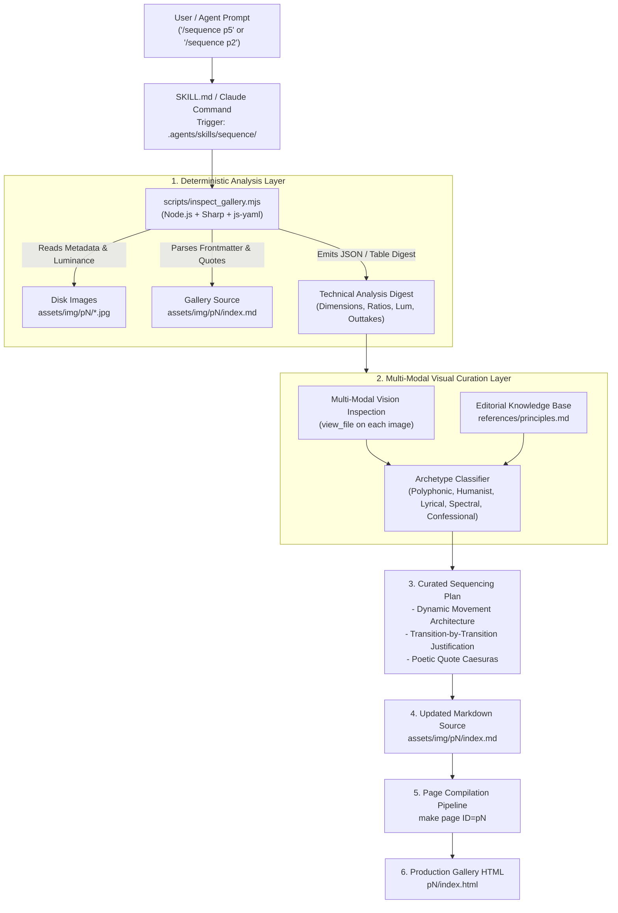
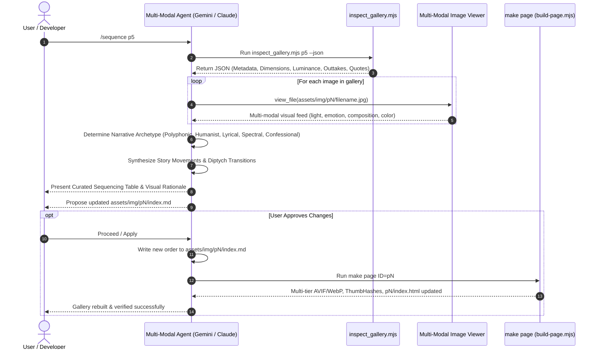
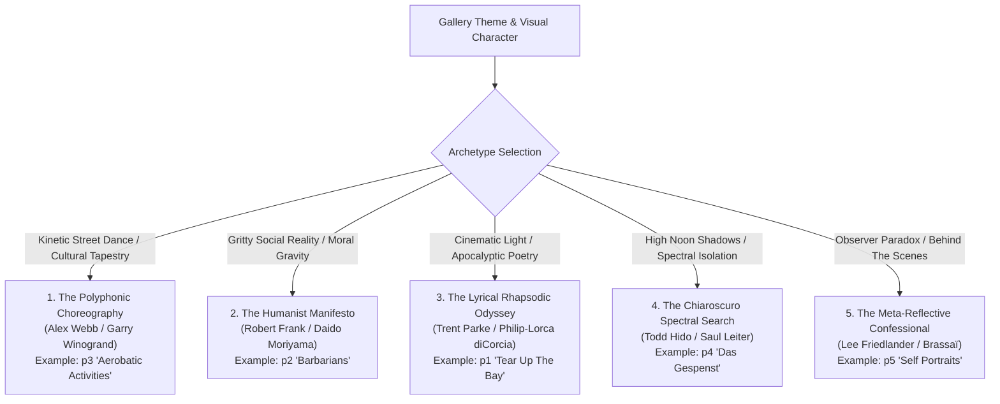

# Multi-Modal `/sequence` Skill: Architecture & Operational Manual

Design specification and user guide for the multi-modal `/sequence` agentic skill in `ryusoh.github.io`. This skill empowers multi-modal AI agents (Gemini, Claude, Antigravity) to act as a world-class street photography curator and photobook visual director, sequencing galleries with narrative pacing, formal visual rhymes, and emotional resonance.

---

## 1. Vision & Purpose

In street photography and photobook curation (pioneered by Robert Frank's _The Americans_, Alex Webb's _The Suffering of Light_, Henri Cartier-Bresson's _The Decisive Moment_, Daido Moriyama's _Farewell Photography_, and Todd Hido's _House Hunting_), a photobook or visual essay is not a random collection of disconnected singles. It is a composed piece of music.

Different photo essays have fundamentally different narrative DNA. For example:

- An ethnographic street dance series requires **kinetic polyphonic counterpoint**.
- A socio-political street manifesto demands **visceral human friction and emotional gravity**.
- A nocturnal phantom series requires **chiaroscuro shadows and spectral isolation**.
- A personal behind-the-scenes series calls for **meta-reflection, irony, and confession**.

The `/sequence` skill provides an automated, agentic workflow that:

1. **Extracts Technical Metadata**: Deterministically reads image dimensions, aspect ratios, Rec. 709 luminance values, and color temperature profiles via Sharp.
2. **Performs Multi-Modal Visual Critique**: Inspects image compositions, lighting qualities, gaze vectors, and spatial tension using agent vision capabilities.
3. **Selects the Optimal Curation Archetype**: Dynamically matches the gallery's conceptual theme to one of 5 distinct visual storytelling frameworks (or synthesizes a custom hybrid).
4. **Places Poetic Caesuras**: Positions poetic blockquotes as musical rests between visual movements.
5. **Generates Deployable Markdown**: Outputs clean, publication-ready `assets/img/p<N>/index.md` files compatible with the page build pipeline.

---

## 2. System Architecture

The skill follows the Open Agent Skills specification, combining deterministic tooling with multi-modal reasoning:



---

## 3. Data Flow & Execution Lifecycle

When an agent executes `/sequence <target>`, the workflow progresses through five discrete stages:



---

## 4. The 5 Curation & Storytelling Archetypes

Rather than forcing every gallery into a single rigid formula, the sequencing engine identifies the **Conceptual DNA** of the work and applies the appropriate storytelling archetype:



### Archetype Breakdown & Applications

| Archetype                           | Primary Master Influences                      | Ideal Portfolio Fit                                                                           | Core Pacing Dynamic                                                               | Diptych / Pair Transition Logic                                                                                           | Coda Strategy                                           |
| :---------------------------------- | :--------------------------------------------- | :-------------------------------------------------------------------------------------------- | :-------------------------------------------------------------------------------- | :------------------------------------------------------------------------------------------------------------------------ | :------------------------------------------------------ |
| **1. Polyphonic Choreography**      | Alex Webb, Garry Winogrand, William Klein      | [`p3`](file:///Users/lz/dev/ryusoh.github.io/assets/img/p3/index.md) (_Aerobatic Activities_) | Fast, syncopated, high kinetic energy, multi-subject layering.                    | Vector continuity, geometric counterpoints, bold chromatic leaps.                                                         | Sudden suspended motion or quiet off-beat punctuation.  |
| **2. Humanist Manifesto**           | Robert Frank, Daido Moriyama, Eugene Smith     | [`p2`](file:///Users/lz/dev/ryusoh.github.io/assets/img/p2/index.md) (_Barbarians_)           | Slow, deliberate, heavy emotional gravity, raw friction.                          | Intimate character portrait $\rightarrow$ societal detritus $\rightarrow$ collective isolation.                           | Unresolved existential question or defiant gaze.        |
| **3. Lyrical Rhapsodic Odyssey**    | Trent Parke, Philip-Lorca diCorcia, Ernst Haas | [`p1`](file:///Users/lz/dev/ryusoh.github.io/assets/img/p1/index.md) (_Tear Up The Bay_)      | Multi-act dramatic crescendo, soaring musical tempo shifts.                       | Shifting light temperatures (Daylight $\rightarrow$ Blinding Flash $\rightarrow$ Fire of Sun $\rightarrow$ Release).      | Transcendent release / cathartic departure.             |
| **4. Chiaroscuro Spectral Search**  | Todd Hido, Saul Leiter, René Burri             | [`p4`](file:///Users/lz/dev/ryusoh.github.io/assets/img/p4/index.md) (_Das Gespenst_)         | Contemplative, atmospheric, mysterious, deep shadow intervals.                    | Specular sun slash $\rightarrow$ silhouette obscurity $\rightarrow$ nocturnal mist.                                       | Lingering phantom disappearance into darkness.          |
| **5. Meta-Reflective Confessional** | Lee Friedlander, Brassaï, Nan Goldin           | [`p5`](file:///Users/lz/dev/ryusoh.github.io/assets/img/p5/index.md) (_Self Portraits_)       | Playful irony $\rightarrow$ optical theater $\rightarrow$ intimate vulnerability. | Camouflage hiding $\rightarrow$ convex mirror geometry $\rightarrow$ flash cord craft $\rightarrow$ midnight domesticity. | Anti-heroic, quiet confession (e.g. 2 AM refrigerator). |

---

## 5. Directory Structure & Bundle Components

```text
.agents/skills/sequence/
├── SKILL.md                     # Canonical Open Agent Skill entrypoint
├── references/
│   └── principles.md           # Masterclass in visual editing & photobook sequencing
└── scripts/
    └── inspect_gallery.mjs     # Deterministic metadata & luminance extraction tool

.claude/commands/
└── sequence.md                 # Generated Claude Code slash command

tests/js/
├── sequence-skill.test.js      # Jest unit tests for inspect_gallery.mjs
└── doc-tool-references.test.js # Verification of doc references & skill paths
```

### Component Breakdown

1. **[`SKILL.md`](file:///Users/lz/dev/ryusoh.github.io/.agents/skills/sequence/SKILL.md)**:
    - Frontmatter defines `name: sequence` and argument hints.
    - Instructs the multi-modal agent to run `inspect_gallery.mjs`, select the narrative archetype, view files multimodally, and output a structured sequencing proposal.
2. **[`references/principles.md`](file:///Users/lz/dev/ryusoh.github.io/.agents/skills/sequence/references/principles.md)**:
    - Encodes formal principles: _The 5 Archetypes_, _Vector Continuity_, _Harmonic Color Bridges_, _Spatial Scale Shifts_, and _Poetic Caesuras_.
3. **[`scripts/inspect_gallery.mjs`](file:///Users/lz/dev/ryusoh.github.io/.agents/skills/sequence/scripts/inspect_gallery.mjs)**:
    - Fast CLI tool. Reads image headers and computes average luminance using Rec. 709 coefficients:
      $$\text{Luminance} = 0.2126R + 0.7152G + 0.0722B$$
    - Detects unsequenced image files on disk as outtake candidates.
4. **[`tests/js/sequence-skill.test.js`](file:///Users/lz/dev/ryusoh.github.io/tests/js/sequence-skill.test.js)**:
    - Verifies CLI execution, JSON parsing, error handling, and output validity.

---

## 6. Operational Manual & Usage Guide

### Invocation Syntax

In agent chat sessions (Antigravity, Gemini, Claude Code):

```text
/sequence p5
/sequence p2
/sequence p1
/sequence assets/img/p3/index.md
```

### Standalone CLI Execution

The companion tool can be run directly in the terminal:

#### 1. Formatted Terminal Digest

```bash
node .agents/skills/sequence/scripts/inspect_gallery.mjs p5
```

Sample output:

```text
======================================================================
  GALLERY SEQUENCE INSPECTION: P5 - "SELF PORTRAITS AND BEHIND THE SCENES"
======================================================================
Directory:   assets/img/p5
Markdown:    assets/img/p5/index.md
Images:      12 active | 0 outtakes
Quotes:      3 interludes
----------------------------------------------------------------------

CURRENT SEQUENCE ORDER & VISUAL SIGNATURES:
 [ 1] DSCF9004-3.jpg               | LANDSCAPE | 1946x1297 (1.50)  | Lum:  68 (low-key (dark/moody)) | Temp: neutral
      📜 [Interlude Quote]: "A street photographer is an obsessive spectator who hates being looked at. ..."
 [ 2] 2025-05-11-0020.JPG          | LANDSCAPE | 3079x2045 (1.51)  | Lum: 161 (mid-tone)          | Temp: warm / golden / amber
      ↳ Caption: @photo.initiator
 [ 3] DSCF5407-2.jpg               | LANDSCAPE | 1960x1306 (1.50)  | Lum: 140 (mid-tone)          | Temp: neutral
 ...
```

#### 2. Machine-Readable JSON Output

```bash
node .agents/skills/sequence/scripts/inspect_gallery.mjs p5 --json
```

---

## 7. Applying Sequence Changes & Building Pages

Once the agent and user agree on the advised sequence:

1. **Update the markdown file**: Write the curated image order and blockquotes to `assets/img/p<N>/index.md`.

2. **Rebuild the gallery**:

    ```bash
    make page ID=p<N>
    ```

    This automatically re-renders multi-tier AVIF/WebP variants, generates ThumbHashes, updates navigation links, and builds `p<N>/index.html`.

3. **Verify repository gate**:

    ```bash
    make check && npm test
    ```

---

## 8. Development & Maintenance Guidelines

- **Skill Sync**: Whenever modifying `.agents/skills/sequence/SKILL.md`, always run:

    ```bash
    python3 tools/sync_commands.py && make sync-check
    ```

- **No `---` in Skill Body**: Frontmatter parsers split on `---`. Use markdown section headers (`###`) or dividers (`***`) instead of raw horizontal rules.
- **Test Integrity**: Keep all tests passing under `npm test`.
