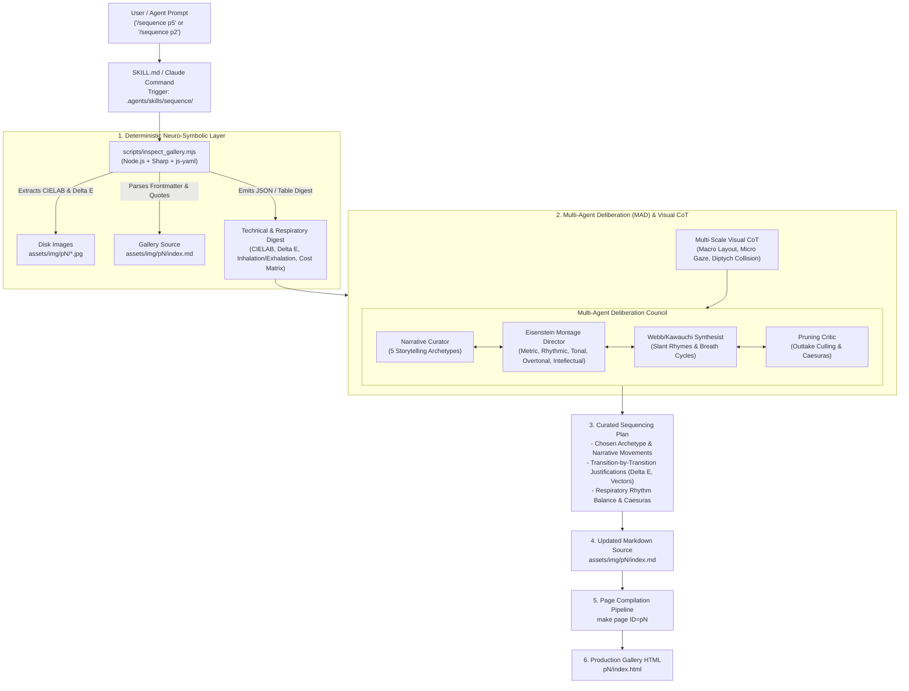
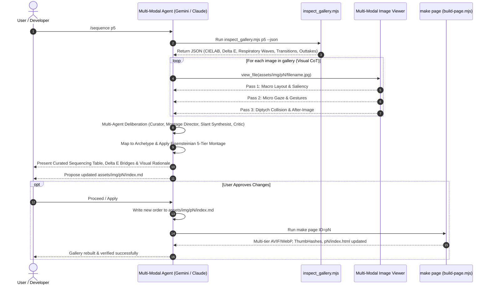
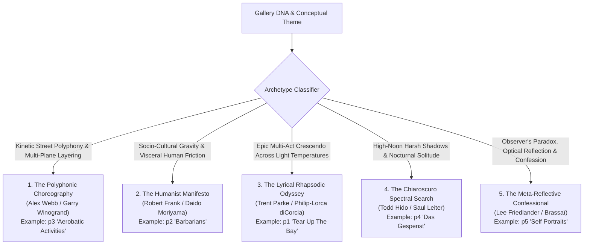

# Multi-Modal `/sequence` Skill: Architecture & Operational Manual

Design specification and user guide for the multi-modal `/sequence` agentic skill in `ryusoh.github.io`. This skill empowers multi-modal AI agents (Gemini, Claude, Antigravity) to act as a world-class street photography curator and photobook visual director, sequencing galleries with narrative pacing, formal visual rhymes, and emotional resonance.

---

## 1. Vision & Purpose

In street photography and photobook curation (pioneered by Robert Frank's _The Americans_, Alex Webb's _The Suffering of Light_, Henri Cartier-Bresson's _The Decisive Moment_, Daido Moriyama's _Farewell Photography_, Rinko Kawauchi's _Illuminance_, Jason Eskenazi's _Wonderland_, and Todd Hido's _House Hunting_), a photobook or visual essay is not a random collection of disconnected singles. It is a composed piece of music.

Different photo essays have fundamentally different narrative DNA. For example:

- An ethnographic street dance series requires **kinetic polyphonic counterpoint**.
- A socio-political street manifesto demands **visceral human friction and emotional gravity**.
- An epic urban light journey requires **multi-movement crescendos across light temperatures**.
- A nocturnal phantom series requires **chiaroscuro shadows and spectral isolation**.
- A personal behind-the-scenes series calls for **meta-reflection, irony, and confession**.

The `/sequence` skill provides an automated, neuro-symbolic agentic workflow that:

1. **Extracts Deterministic CIELAB & Respiratory Metrics**: Reads image dimensions, aspect ratios, CIELAB D65 ($L^*, a^*, b^*$) coordinates, pairwise chromatic distances ($\Delta E$), Kawauchi Inhalation/Exhalation breathing cycles, and transition cost matrices via Sharp.
2. **Executes Multi-Scale Visual Chain-of-Thought (Visual CoT)**: Inspects image compositions across macro layout, micro gaze vectors, and diptych after-image collisions.
3. **Simulates Multi-Agent Deliberative Synthesis (MAD Protocol)**: Engages specialized agents (Narrative Curator, Eisenstein Montage Director, Slant-Rhyme Synthesist, and Pruning Critic) to deliberate and resolve aesthetic tensions.
4. **Applies Sergei Eisenstein's Five-Tier Montage**: Formulates Metric (proportions), Rhythmic (kinetic motion), Tonal (chiaroscuro mood), Overtonal (emergent resonance), and Intellectual (conceptual collision) montage tiers.
5. **Places Poetic Caesuras**: Positions poetic blockquotes as musical rests (Threshold, Volta, or Meditative caesuras).
6. **Generates Deployable Markdown**: Outputs clean, publication-ready `assets/img/p<N>/index.md` files compatible with the page build pipeline (`make page ID=p<N>`).

---

## 2. System Architecture

The skill follows the Open Agent Skills specification, combining deterministic tooling with multi-modal deliberation:



---

## 3. Data Flow & Execution Lifecycle

When an agent executes `/sequence <target>`, the workflow progresses through five discrete stages:



---

## 4. The Five Storytelling Archetypes

Rather than forcing every gallery into a single rigid structure, the `/sequence` skill selects or synthesizes the archetype that matches the gallery's inherent character:



### Archetype Comparison Matrix

| Archetype                           | Master Lineage                     | Canonical Portfolio Match                                                                     | Core Pacing Dynamic                                                               | Diptych / Pair Transition Logic                                                                                           | Coda Strategy                                           |
| :---------------------------------- | :--------------------------------- | :-------------------------------------------------------------------------------------------- | :-------------------------------------------------------------------------------- | :------------------------------------------------------------------------------------------------------------------------ | :------------------------------------------------------ |
| **1. Polyphonic Choreography**      | Alex Webb, Garry Winogrand         | [`p3`](file:///Users/lz/dev/ryusoh.github.io/assets/img/p3/index.md) (_Aerobatic Activities_) | Fast, syncopated, high kinetic energy, multi-subject layering.                    | Vector continuity, geometric counterpoints, bold chromatic leaps.                                                         | Sudden suspended motion or quiet off-beat punctuation.  |
| **2. Humanist Manifesto**           | Robert Frank, Daido Moriyama       | [`p2`](file:///Users/lz/dev/ryusoh.github.io/assets/img/p2/index.md) (_Barbarians_)           | Deliberate, grounded, heavy emotional gravity, raw friction.                      | Intimate character portrait $\rightarrow$ societal detritus $\rightarrow$ collective isolation.                           | Unresolved existential question or defiant gaze.        |
| **3. Lyrical Rhapsodic Odyssey**    | Trent Parke, Philip-Lorca diCorcia | [`p1`](file:///Users/lz/dev/ryusoh.github.io/assets/img/p1/index.md) (_Tear Up The Bay_)      | Multi-act dramatic crescendo, soaring tempo shifts.                               | Shifting light temperatures (Daylight $\rightarrow$ Flash $\rightarrow$ Apocalyptic Ember $\rightarrow$ Cathartic Dusk).  | Transcendent release / cathartic departure.             |
| **4. Chiaroscuro Spectral Search**  | Todd Hido, Saul Leiter             | [`p4`](file:///Users/lz/dev/ryusoh.github.io/assets/img/p4/index.md) (_Das Gespenst_)         | Contemplative, atmospheric, mysterious, deep shadow intervals.                    | Specular sun slash $\rightarrow$ silhouette obscurity $\rightarrow$ nocturnal mist.                                       | Lingering phantom disappearance into darkness.          |
| **5. Meta-Reflective Confessional** | Lee Friedlander, Brassaï           | [`p5`](file:///Users/lz/dev/ryusoh.github.io/assets/img/p5/index.md) (_Self Portraits_)       | Playful irony $\rightarrow$ optical theater $\rightarrow$ intimate vulnerability. | Camouflage hiding $\rightarrow$ convex mirror geometry $\rightarrow$ flash cord craft $\rightarrow$ midnight domesticity. | Anti-heroic, quiet confession (e.g. 2 AM refrigerator). |

---

## 5. File Structure & Component Map

The skill is fully self-contained within `.agents/skills/sequence/` with symlinks and generated commands providing universal agent discovery:

```text
.agents/skills/sequence/
├── SKILL.md                    # Canonical agent instructions, MAD protocol & Visual CoT
├── references/
│   └── principles.md           # Masterclass handbook: Archetypes, Eisenstein montage, Webb slant rhymes, Kawauchi breathing
└── scripts/
    └── inspect_gallery.mjs     # Deterministic Node.js CLI: CIELAB, Delta E, Respiratory analyzer, Cost matrix

.claude/commands/
└── sequence.md                 # Generated Claude Code slash command (synced via tools/sync_commands.py)

tests/js/
└── sequence-skill.test.js      # Jest unit tests for inspect_gallery.mjs and frontier metrics
```

### Component Roles

1. **[`SKILL.md`](file:///Users/lz/dev/ryusoh.github.io/.agents/skills/sequence/SKILL.md)**:
    - Frontmatter defines `name: sequence`, argument hints, and trigger description.
    - Instructs the multi-modal agent to run `inspect_gallery.mjs`, execute 3-pass Visual CoT, simulate the Multi-Agent Deliberation Council, and deliver a structured curation table.
2. **[`references/principles.md`](file:///Users/lz/dev/ryusoh.github.io/.agents/skills/sequence/references/principles.md)**:
    - Contains deep knowledge on the 5 Archetypes, Eisenstein's 5-Tier Montage, Alex Webb's Slant Rhymes, Rinko Kawauchi's Respiratory Rhythm (Inhalation/Exhalation), Jason Eskenazi's Associative Gaps, and Todd Hido's Subconscious Mood Editing.
3. **[`scripts/inspect_gallery.mjs`](file:///Users/lz/dev/ryusoh.github.io/.agents/skills/sequence/scripts/inspect_gallery.mjs)**:
    - Fast, standalone script utilizing `sharp` and `js-yaml`.
    - Computes standard D65 CIELAB ($L^*, a^*, b^*$) coordinates and $\Delta E_{76}$ pairwise color differences.
    - Calculates sequence respiratory rhythm (Inhalation $L \ge 135$ vs. Exhalation $L \le 75$) and alerts on cadence anomalies.
    - Computes pairwise transition energy and cost matrices.
    - Detects unsequenced image files on disk as outtake candidates.
4. **[`tests/js/sequence-skill.test.js`](file:///Users/lz/dev/ryusoh.github.io/tests/js/sequence-skill.test.js)**:
    - Full test coverage ensuring JSON output schema validity, CIELAB calculation correctness, respiratory scoring, and graceful error handling.

---

## 6. Operational Manual & Usage

### 6.1 Invoking the Skill

In chat with an interactive agent (Antigravity, Claude Code, Gemini):

```text
/sequence p5
/sequence p2
/sequence p1
/sequence assets/img/p3/index.md
```

### 6.2 Standalone CLI Tool Usage

To inspect any gallery directly from the terminal:

```bash
# Formatted human-readable visual inspection
node .agents/skills/sequence/scripts/inspect_gallery.mjs p5

# Structured JSON output for automated scripting
node .agents/skills/sequence/scripts/inspect_gallery.mjs p5 --json
```

Sample CLI output:

```text
======================================================================
  FRONTIER GALLERY SEQUENCE INSPECTION: P5 - "SELF PORTRAITS AND BEHIND THE SCENES"
======================================================================
Directory:   assets/img/p5
Markdown:    assets/img/p5/index.md
Images:      12 active | 0 outtakes
Quotes:      3 interludes
Respiratory: Rhythm Score: 85/100 (1 cadence warnings)
----------------------------------------------------------------------

CURRENT SEQUENCE ORDER, CIELAB TONALITY & RESPIRATORY BREATH:
 [ 1] DSCF9004-3.jpg               | LANDSCAPE | 1946x1297 (1.50)  | [Exhalation]  | Lum:  68  | Lab: (28.64, -1.05, 0.31)
      ↳ ⚡ Transition to #2: ΔE: 38.62 (Color) | ΔLum: 93 | Cost: 34.7
      📜 [Caesura Interlude]: "A street photographer is an obsessive spectator who hates being looked at. ..."
 [ 2] 2025-05-11-0020.JPG          | LANDSCAPE | 3079x2045 (1.51)  | [Inhalation]  | Lum: 161  | Lab: (66.18, 3.98, 7.86)
      ↳ Caption: @photo.initiator
      ↳ ⚡ Transition to #3: ΔE: 22.12 (Color) | ΔLum: 49 | Cost: 19.4
 [ 3] DSCF8059.JPG                 | LANDSCAPE | 2048x1365 (1.50)  | [Neutral]     | Lum: 112  | Lab: (47.2, -1.84, -1.9)
----------------------------------------------------------------------
RESPIRATORY RHYTHM WARNINGS:
 ⚠️ [Frame #8 - 849BDEFE-8868-48A8-B31D-ADB58F0161022.JPG] Suffocating Weight: 3 consecutive low-key exhalation frames—consider an open luminous interlude.
======================================================================
```

### 6.3 Applying & Publishing Changes

Once the agent and user agree on the advised sequence:

```bash
# 1. Update markdown source
# (Write curated order and poetic quotes into assets/img/pN/index.md)

# 2. Recompile gallery assets, responsive tiers, thumbhashes, and HTML
make page ID=p5

# 3. Verify quality gates and test suite
make precommit-fix
```

---

## 7. Developer & Agent Guidelines

- **Never hardcode paths**: Use `REPO_ROOT` resolution via `url` / `path` in ES modules.
- **Skill Sync**: Whenever modifying `.agents/skills/sequence/SKILL.md`, always run:

    ```bash
    python3 tools/sync_commands.py
    ```

    This ensures `.claude/commands/sequence.md` stays synchronized with the canonical skill definition and passes the `make sync-check` gate.
