# Visual Curation & Sequence Report: DAS GESPENST

> **Curation Archetype**: Polyphonic Street Symphony / Lyrical Arc
>
> **Sequence Status**: Validated (Existing sequence affirmed as optimal)
>
> **Hamiltonian Sequence Energy**: `260.9` (Avg Step Cost: `13.7`)
>
> **Respiratory Pacing Score**: `100/100` (3 Inhalations, 2 Exhalations, 15 Grounding)

## 1. Executive Curatorial & Quantitative Architecture

This report quantitatively evaluates the visual narrative arc for **p4**, combining photometric colorimetry (CIELAB `L*a*b*`, ΔE₇₆), Hamiltonian pairwise transition tension, and multi-agent aesthetic critique.

### 1.1 Photometric Respiratory Waveform

The respiratory luminance waveform maps the photometric breathing rhythm of the essay, balancing luminous expansions with low-key chiaroscuro grounding anchors.

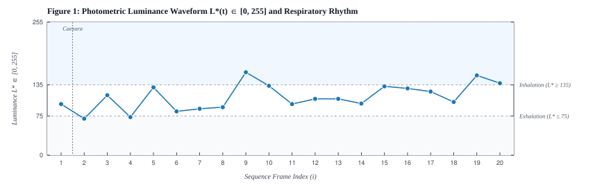

**Figure 1**: Photometric Luminance Waveform `L*(t) ∈ [0, 255]` and Respiratory Rhythm. Shaded regions indicate Inhalation (`L* >= 135`, luminous expansiveness) and Exhalation (`L* <= 75`, chiaroscuro grounding) zones. Vertical dashed lines mark poetic caesuras.

### 1.2 Hamiltonian Pairwise Transition Tension

Pairwise transition energy measures visual friction and cognitive momentum between adjacent frames, decomposed into chromatic distance (ΔE₇₆, 45%), luminance contrast (ΔLum, 35%), and geometric aspect shift (ΔAspect, 20%).

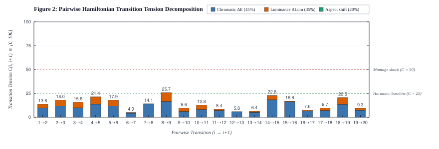

**Figure 2**: Pairwise step cost `C(i, i+1)` decomposed into chromatic, luminance, and aspect variance components. Dashed reference lines define harmonic baseline (`C <= 25`) and montage shock (`C >= 50`) thresholds.

### 1.3 CIELAB Colorimetric Progression & Spatial Cadence

The chromatic spectrum profile charts the physical color evolution across sequential frames alongside metric aspect ratio and spatial framing cadence.

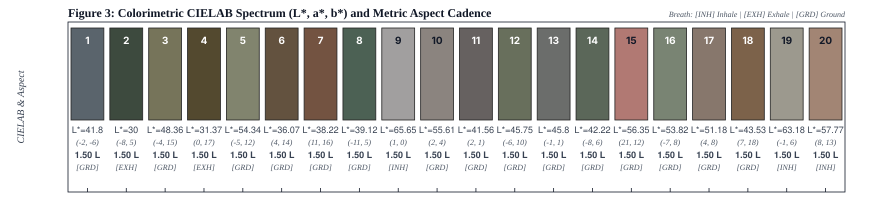

**Figure 3**: Sequential colorimetric profile detailing mean sRGB swatches, CIELAB coordinates (`L*, a*, b*`), aspect ratio, orientation (L/P), and breath type.

## 2. Visual Sequence Journey

### [1/20] DSCF4250-3.jpg

| Attribute                           | Value                                                      |
| :---------------------------------- | :--------------------------------------------------------- |
| **Framing & Aspect**                | `LANDSCAPE` · `2048×1365` (Aspect: `1.50`)                 |
| **Tonality & Breath**               | `L*=41.8` — **Neutral** (CIELAB: `41.8, -1.98, -5.82`)     |
| **Transition to #2 (DSCF4090.jpg)** | `ΔE₇₆: 17.38` (Color) · `ΔLum: 28` · **Step Cost: `13.6`** |

**Curatorial Rationale & Montage Dynamic**:

- _Pacing Role_: Act I: The Overture / The Masked Lineage
- _Visual Subject & Content_: A person in a denim jacket holding an exhibition poster for 'Araki / Daido: 400 Polaroids at Ratio 3' directly over their face, standing before a grid of salon portrait headshots in blue flash light.
- _Thematic Meaning_: Establishes the central thesis: the street photographer as a phantom without a fixed face, honoring Japanese masters of the decisive flash and raw urban grain. The poster acts as a surrogate identity, setting a tone of voyeurism and concealment.
- _Composition & Gaze Vectors_: Central vertical mass of the white poster bordered by two grasping hands, framed by the rigid matrix of portrait tiles behind.
- _Transition Dynamic_: Direct bridge into the Threshold Caesura (Mathurin Régnier's high-noon lantern), leading to the cool, muted observation of the zoo enclosure.

> **[Poetic Caesura: Musical Rest]**
>
> _A hundred and a hundred times_
> _Have I taken up my lantern_
> _Seeking_
> _At high noon_
>
> — **Mathurin Régnier, Les Satires XIV**

---

### [2/20] DSCF4090.jpg

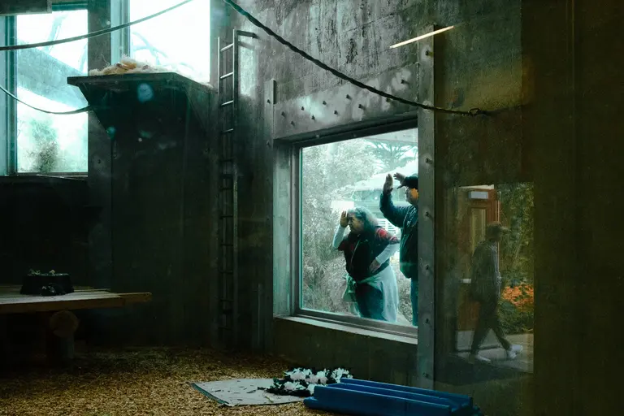

| Attribute                             | Value                                                    |
| :------------------------------------ | :------------------------------------------------------- |
| **Framing & Aspect**                  | `LANDSCAPE` · `2048×1365` (Aspect: `1.50`)               |
| **Tonality & Breath**                 | `L*=30` — **Exhalation** (CIELAB: `30, -7.96, 5.45`)     |
| **Transition to #3 (DSCF7212-2.jpg)** | `ΔE₇₆: 20.95` (Color) · `ΔLum: 45` · **Step Cost: `18`** |

**Curatorial Rationale & Montage Dynamic**:

- _Pacing Role_: Act I: Inversion / The Spectator in the Cage
- _Visual Subject & Content_: View from inside a dim, damp concrete zoo enclosure looking out through heavy glass, where two visitors shield their brows from the glare to peer inside.
- _Thematic Meaning_: Inverts the dynamic of looking: the outside world becomes the exhibit, and the viewers outside become shadowy apparitions pressing against the glass barrier.
- _Composition & Gaze Vectors_: Horizontal concrete partition and vertical steel ladder drawing the gaze into the central illuminated glass portal.
- _Transition Dynamic_: Deep exhalation step (`L*=30.00`, Lum 70) yielding to broad daylight and sharp cast shadows.

---

### [3/20] DSCF7212-2.jpg

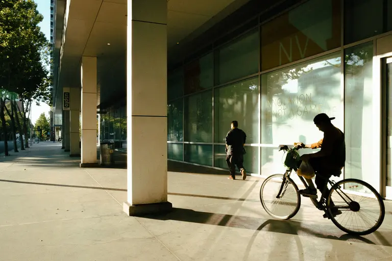

| Attribute                             | Value                                                      |
| :------------------------------------ | :--------------------------------------------------------- |
| **Framing & Aspect**                  | `LANDSCAPE` · `2048×1365` (Aspect: `1.50`)                 |
| **Tonality & Breath**                 | `L*=48.36` — **Neutral** (CIELAB: `48.36, -3.88, 14.68`)   |
| **Transition to #4 (DSCF1897-2.jpg)** | `ΔE₇₆: 17.57` (Color) · `ΔLum: 42` · **Step Cost: `15.6`** |

**Curatorial Rationale & Montage Dynamic**:

- _Pacing Role_: Act I: High Noon / The Corporate Shadow Slash
- _Visual Subject & Content_: Sunlit corporate plaza outside a modern glass building ('INNOVATION IS NOT A GAME'), with a pedestrian walking into deep pillar shadows and a cyclist cutting across the foreground in stark silhouette.
- _Thematic Meaning_: The harsh reality of the urban apparatus at high noon. Geometry and corporate slogans dwarf the human figures, reducing them to anonymous kinetic shadows.
- _Composition & Gaze Vectors_: Dynamic diagonal shadow slash across the concrete sidewalk moving from bottom left to top right, intersecting the cyclist's forward momentum.
- _Transition Dynamic_: Harmonic step from cool architectural concrete into warm, low-angled golden hour amber.

---

### [4/20] DSCF1897-2.jpg

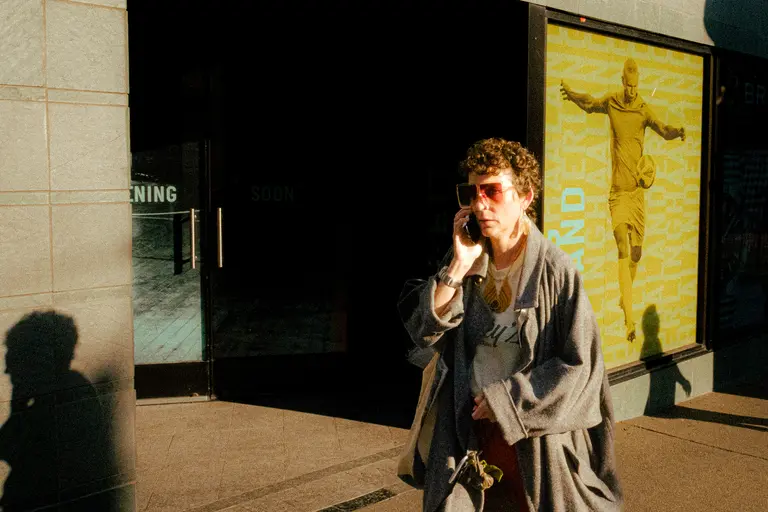

| Attribute                             | Value                                                      |
| :------------------------------------ | :--------------------------------------------------------- |
| **Framing & Aspect**                  | `LANDSCAPE` · `2048×1365` (Aspect: `1.50`)                 |
| **Tonality & Breath**                 | `L*=31.37` — **Exhalation** (CIELAB: `31.37, -0.1, 17.11`) |
| **Transition to #5 (DSCF8552-6.jpg)** | `ΔE₇₆: 24.18` (Color) · `ΔLum: 57` · **Step Cost: `21.4`** |

**Curatorial Rationale & Montage Dynamic**:

- _Pacing Role_: Act I: The Fleeting Golden Hour / Cast Shadow
- _Visual Subject & Content_: Direct low sunlight catching a woman in tinted sunglasses and an oversized grey coat talking on a phone before a dark doorway and a yellow sports billboard, with the distinct silhouette of the photographer cast on the left wall.
- _Thematic Meaning_: A classic street moment where the photographer's presence is betrayed by their own cast shadow. The subject looks past the camera, absorbed in her own invisible conversation.
- _Composition & Gaze Vectors_: Left-to-right eye gaze and golden rim light counterbalanced by the deep black silhouette of the photographer in the lower-left quadrant.
- _Transition Dynamic_: Warm exhalation grounding (`L*=31.37`) before bursting into expansive, airy daylight.

---

### [5/20] DSCF8552-6.jpg

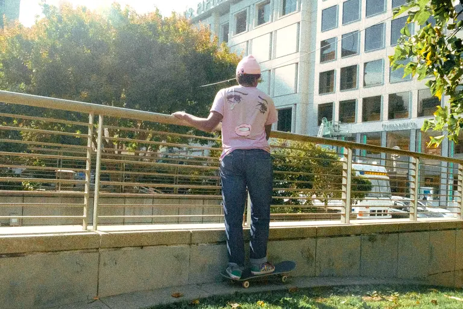

| Attribute                             | Value                                                      |
| :------------------------------------ | :--------------------------------------------------------- |
| **Framing & Aspect**                  | `LANDSCAPE` · `2048×1365` (Aspect: `1.50`)                 |
| **Tonality & Breath**                 | `L*=54.34` — **Neutral** (CIELAB: `54.34, -5.2, 11.52`)    |
| **Transition to #6 (DSCF5453-2.jpg)** | `ΔE₇₆: 20.56` (Color) · `ΔLum: 46` · **Step Cost: `17.9`** |

**Curatorial Rationale & Montage Dynamic**:

- _Pacing Role_: Act II: Narrative Expansion / The Double Gaze
- _Visual Subject & Content_: Skater in a pink beanie standing on a stone balustrade overlooking a city avenue and luxury storefronts, wearing a pink t-shirt printed with giant crying cartoon manga eyes that stare directly back at the viewer.
- _Thematic Meaning_: The street looks back. Even with the subject's back turned, the surrogate face printed on the shirt confronts the camera, turning urban alienation into whimsical pop-art melancholy.
- _Composition & Gaze Vectors_: Vertical spine vector anchored by the skateboard wheels below and the horizontal railing bisecting the sunlit city backdrop.
- _Transition Dynamic_: Smooth chromatic transition from luminous pink backlighting into the warm ochre curves of urban architecture.

---

### [6/20] DSCF5453-2.jpg

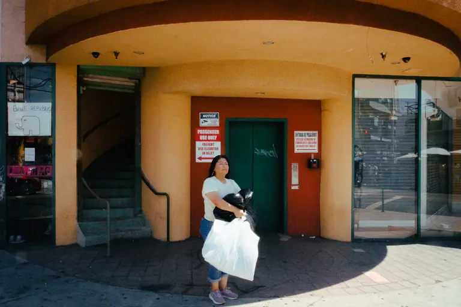

| Attribute                           | Value                                                   |
| :---------------------------------- | :------------------------------------------------------ |
| **Framing & Aspect**                | `LANDSCAPE` · `2048×1365` (Aspect: `1.50`)              |
| **Tonality & Breath**               | `L*=36.07` — **Neutral** (CIELAB: `36.07, 3.95, 13.8`)  |
| **Transition to #7 (DSCF7352.jpg)** | `ΔE₇₆: 7.46` (Color) · `ΔLum: 5` · **Step Cost: `4.9`** |

**Curatorial Rationale & Montage Dynamic**:

- _Pacing Role_: Act II: Architectural Sanctuary / The Trance
- _Visual Subject & Content_: A woman in a white t-shirt and jeans stands centered in front of a curved ochre building entryway and green elevator doors, holding grocery bags with her eyes closed in the warm sunlight.
- _Thematic Meaning_: A suspended moment of stillness in the city. The subject appears in a meditative trance, caught between domestic chore and public exposure.
- _Composition & Gaze Vectors_: Curved sweeping arch overhead framing the central upright figure like a classical niche sculpture.
- _Transition Dynamic_: Harmonic continuity of warm earth tones leading into the compressed diamond geometry of security lattice.

---

### [7/20] DSCF7352.jpg

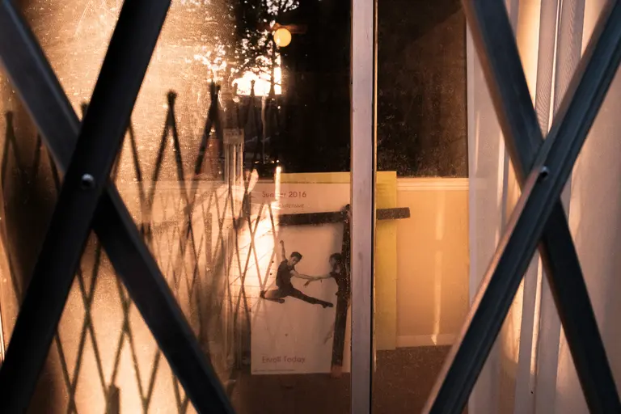

| Attribute                                                       | Value                                                     |
| :-------------------------------------------------------------- | :-------------------------------------------------------- |
| **Framing & Aspect**                                            | `LANDSCAPE` · `2048×1365` (Aspect: `1.50`)                |
| **Tonality & Breath**                                           | `L*=38.22` — **Neutral** (CIELAB: `38.22, 10.81, 15.78`)  |
| **Transition to #8 (940E2644-C690-41F0-9898-0EFB79C69DC5.jpg)** | `ΔE₇₆: 24.34` (Color) · `ΔLum: 3` · **Step Cost: `14.1`** |

**Curatorial Rationale & Montage Dynamic**:

- _Pacing Role_: Act II: Geometric Barrier / The Trapped Dance
- _Visual Subject & Content_: Looking through crisscrossed steel security gate lattice and dust-coated glass at an interior dance academy poster depicting leaping dancers in warm amber light.
- _Thematic Meaning_: The camera encounters layers of physical obstruction: iron diamonds, grimy glass, and frozen photographic memories of physical liberation trapped behind bars.
- _Composition & Gaze Vectors_: Aggressive X-pattern diagonal steel bars crisscrossing the entire frame, compressing the depth into flat graphic layers.
- _Transition Dynamic_: Warm golden tones suddenly plunge into cool, rainy emerald surveillance tones.

---

### [8/20] 940E2644-C690-41F0-9898-0EFB79C69DC5.jpg

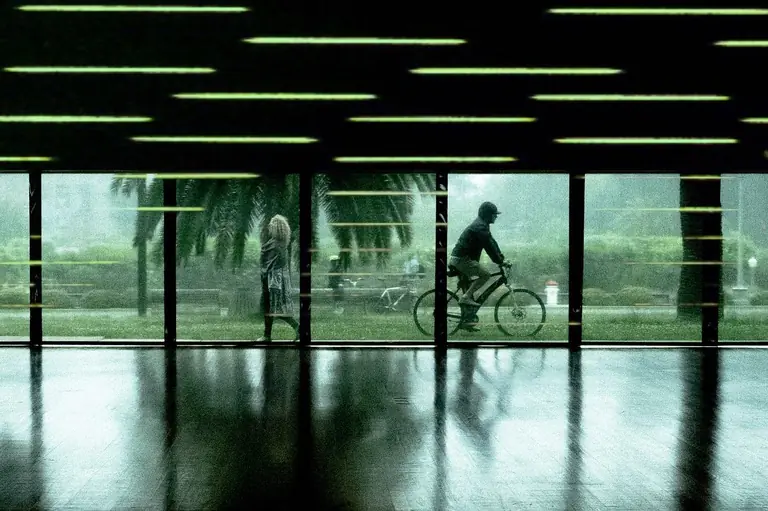

| Attribute                                                       | Value                                                      |
| :-------------------------------------------------------------- | :--------------------------------------------------------- |
| **Framing & Aspect**                                            | `LANDSCAPE` · `1364×908` (Aspect: `1.50`)                  |
| **Tonality & Breath**                                           | `L*=39.12` — **Neutral** (CIELAB: `39.12, -10.9, 4.82`)    |
| **Transition to #9 (18F4C334-BD6B-4C91-8CD8-8615AD7ADF67.jpg)** | `ΔE₇₆: 29.32` (Color) · `ΔLum: 67` · **Step Cost: `25.7`** |

**Curatorial Rationale & Montage Dynamic**:

- _Pacing Role_: Act II: Cinematic Nocturne / The Emerald Scanlines
- _Visual Subject & Content_: A rainy park scene viewed through a wide plate-glass window with horizontal neon green light streaks reflecting across the dark interior floor, as a woman in a coat and a cyclist move in opposite directions outside.
- _Thematic Meaning_: Evokes high-tech urban surveillance and cyber-noir aesthetics. The horizontal green scanning lines transform ordinary pedestrians into digital blips in a matrix.
- _Composition & Gaze Vectors_: Strong horizontal banding of neon green reflections counterpointed by the opposing left-and-right vectors of the walking woman and cyclist.
- _Transition Dynamic_: Dramatic high-contrast jump (ΔE=29.32, ΔLum=67) from cool green obscurity into blinding nocturnal white flash.

---

### [9/20] 18F4C334-BD6B-4C91-8CD8-8615AD7ADF67.jpg

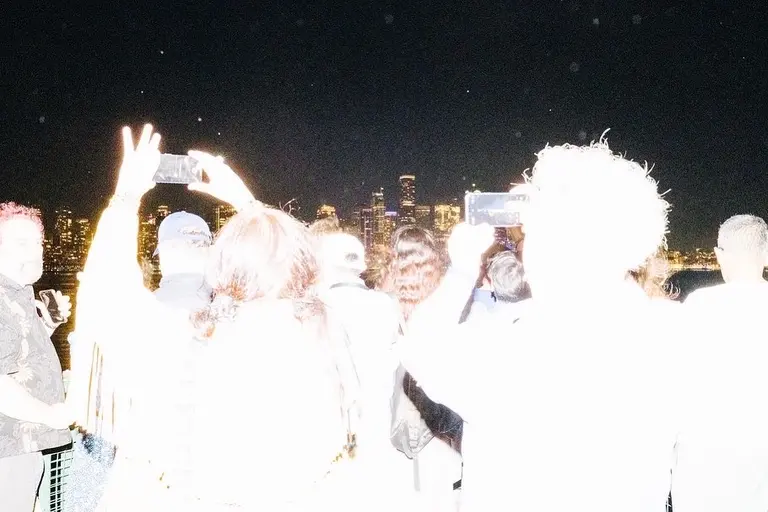

| Attribute                            | Value                                                     |
| :----------------------------------- | :-------------------------------------------------------- |
| **Framing & Aspect**                 | `LANDSCAPE` · `910×607` (Aspect: `1.50`)                  |
| **Tonality & Breath**                | `L*=65.65` — **Inhalation** (CIELAB: `65.65, 0.72, 0.25`) |
| **Transition to #10 (DSCF9185.jpg)** | `ΔE₇₆: 10.64` (Color) · `ΔLum: 26` · **Step Cost: `9.6`** |

**Curatorial Rationale & Montage Dynamic**:

- _Pacing Role_: Act III: The Spectral Flash / The Luminous Inhalation
- _Visual Subject & Content_: Direct high-power flash at night against a crowd on a ferry or observation deck, blowing out their backs and hair into glowing white silhouettes as they hold up glowing phones to record a distant skyline.
- _Thematic Meaning_: The ultimate visual manifestation of 'Das Gespenst': human beings dematerialized by strobe light into luminous ghosts, worshiping the distant glowing city through glowing phone screens.
- _Composition & Gaze Vectors_: Upward-reaching hands and smartphone screens forming a triangular ascension toward the dark night sky.
- _Transition Dynamic_: Harmonic step from blinding white flash to daylight alleyway with high-key fabric obstruction.

---

### [10/20] DSCF9185.jpg

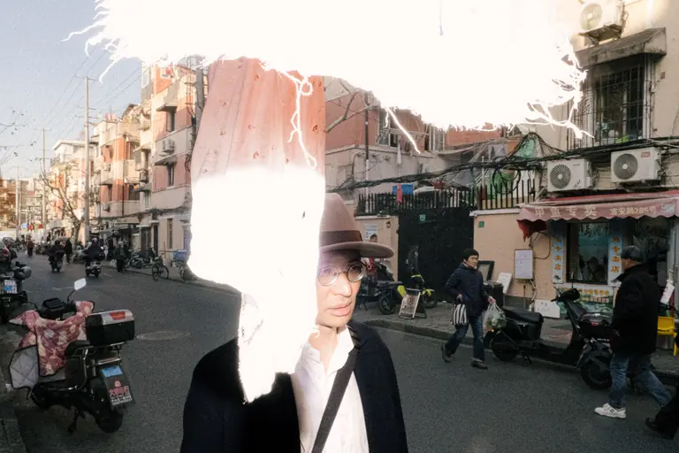

| Attribute                            | Value                                                      |
| :----------------------------------- | :--------------------------------------------------------- |
| **Framing & Aspect**                 | `LANDSCAPE` · `2048×1365` (Aspect: `1.50`)                 |
| **Tonality & Breath**                | `L*=55.61` — **Neutral** (CIELAB: `55.61, 1.7, 3.63`)      |
| **Transition to #11 (DSCF8631.jpg)** | `ΔE₇₆: 14.25` (Color) · `ΔLum: 35` · **Step Cost: `12.8`** |

**Curatorial Rationale & Montage Dynamic**:

- _Pacing Role_: Act III: The Decisive Split / The Torn Veil
- _Visual Subject & Content_: A man wearing a fedora and round glasses walking through a bustling urban alley, his face precisely bisected down the middle by a torn, sunlit white cloth hanging in the immediate foreground.
- _Thematic Meaning_: An extraordinary in-camera surrealist collage. The hanging rag becomes a phantom half-mask, echoing Frame 1's poster while revealing one piercing eye studying the street.
- _Composition & Gaze Vectors_: Vertical split right down the center meridian of the frame, dividing the phantom white obstruction from the deep street perspective.
- _Transition Dynamic_: Smooth tonal continuity into the textured, rain-soaked streets of Chinatown.

---

### [11/20] DSCF8631.jpg

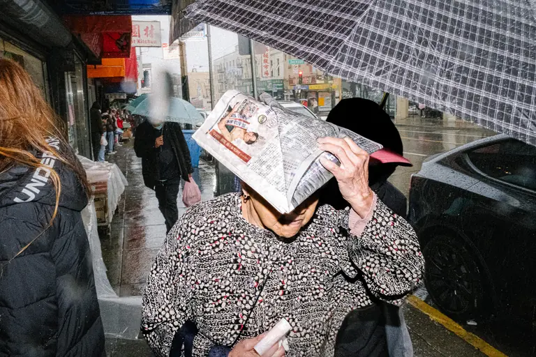

| Attribute                              | Value                                                     |
| :------------------------------------- | :-------------------------------------------------------- |
| **Framing & Aspect**                   | `LANDSCAPE` · `2048×1365` (Aspect: `1.50`)                |
| **Tonality & Breath**                  | `L*=41.56` — **Neutral** (CIELAB: `41.56, 1.78, 1.27`)    |
| **Transition to #12 (DSCF0310-3.jpg)** | `ΔE₇₆: 12.48` (Color) · `ΔLum: 10` · **Step Cost: `8.4`** |

**Curatorial Rationale & Montage Dynamic**:

- _Pacing Role_: Act III: The Chinatown Deluge / The Newsprint Visor
- _Visual Subject & Content_: An elderly woman walking through heavy rain in Chinatown under a plaid umbrella, holding a folded Chinese newspaper over her brow and face to shield herself from the storm.
- _Thematic Meaning_: Everyday urban survival turned into spontaneous street sculpture. The text and images of the daily news become an improvised protective mask.
- _Composition & Gaze Vectors_: Descending rain lines and curved umbrella rib overhead focusing attention onto the folded diagonal origami of the newspaper visor.
- _Transition Dynamic_: Harmonic transition from outdoor wet pavement into the cool, enclosed cabin of the transit system.

---

### [12/20] DSCF0310-3.jpg

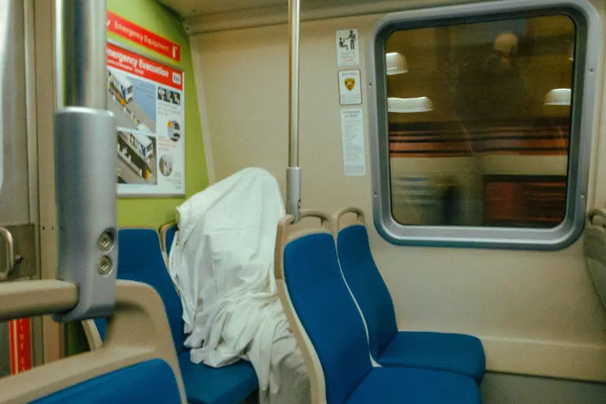

| Attribute                              | Value                                                    |
| :------------------------------------- | :------------------------------------------------------- |
| **Framing & Aspect**                   | `LANDSCAPE` · `2048×1365` (Aspect: `1.50`)               |
| **Tonality & Breath**                  | `L*=45.75` — **Neutral** (CIELAB: `45.75, -6.42, 9.69`)  |
| **Transition to #13 (DSCF6872-5.jpg)** | `ΔE₇₆: 10.29` (Color) · `ΔLum: 0` · **Step Cost: `5.8`** |

**Curatorial Rationale & Montage Dynamic**:

- _Pacing Role_: Act III: The Commuter Phantom / Centerpiece
- _Visual Subject & Content_: Interior of a BART or metro train car with cobalt blue seats, where a solitary passenger is completely covered beneath a white bedsheet, curled in sleep next to the window reflection.
- _Thematic Meaning_: The literal and poetic heart of 'Das Gespenst': an archetypal white-sheet ghost riding public transit. A deeply poignant symbol of urban exhaustion, homelessness, and psychological invisibility.
- _Composition & Gaze Vectors_: Horizontal line of blue bucket seats leading to the rounded, organic shroud slumped against the train window.
- _Transition Dynamic_: Balanced step from the muted blue transit sanctuary back into the lively, satirical sidewalk theater.

---

### [13/20] DSCF6872-5.jpg

| Attribute                              | Value                                                   |
| :------------------------------------- | :------------------------------------------------------ |
| **Framing & Aspect**                   | `LANDSCAPE` · `2047×1365` (Aspect: `1.50`)              |
| **Tonality & Breath**                  | `L*=45.8` — **Neutral** (CIELAB: `45.8, -1.18, 0.84`)   |
| **Transition to #14 (DSCF9642-2.jpg)** | `ΔE₇₆: 9.15` (Color) · `ΔLum: 9` · **Step Cost: `6.4`** |

**Curatorial Rationale & Montage Dynamic**:

- _Pacing Role_: Act III: The Frame-Within-A-Frame / The Painted Shield
- _Visual Subject & Content_: A woman with vibrant emerald-green hair and sunglasses standing on a sidewalk, holding a framed oil painting of the Golden Gate Bridge in front of her torso.
- _Thematic Meaning_: The landscape of San Francisco replaces the human body. The tourist postcard icon is weaponized as a personal shield against the street.
- _Composition & Gaze Vectors_: Direct frontal confrontational stance, with the diagonal perspective of the painted bridge leading inward.
- _Transition Dynamic_: Shift from flat painted canvas to complex multi-layered barber shop reflections.

---

### [14/20] DSCF9642-2.jpg

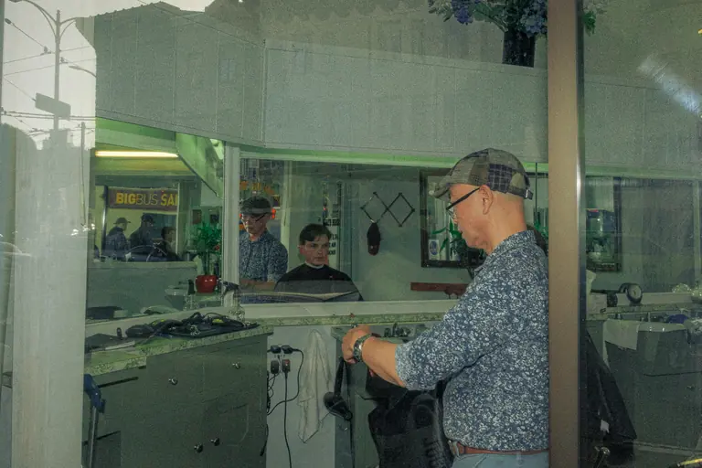

| Attribute                              | Value                                                      |
| :------------------------------------- | :--------------------------------------------------------- |
| **Framing & Aspect**                   | `LANDSCAPE` · `2048×1365` (Aspect: `1.50`)                 |
| **Tonality & Breath**                  | `L*=42.22` — **Neutral** (CIELAB: `42.22, -7.54, 6.36`)    |
| **Transition to #15 (R0001059-4.jpg)** | `ΔE₇₆: 32.46` (Color) · `ΔLum: 33` · **Step Cost: `22.8`** |

**Curatorial Rationale & Montage Dynamic**:

- _Pacing Role_: Act III: The Barber's Mirror Labyrinth
- _Visual Subject & Content_: Looking through a barbershop window at an older barber in a tweed flat cap and floral shirt preparing his shears, with layered reflections of mirrors, a young client, and street signs ('BIGBUS SAN...').
- _Thematic Meaning_: A masterclass in spatial layering and temporal depth (in the tradition of Lee Friedlander). Interior and exterior worlds collapse onto a single glass surface.
- _Composition & Gaze Vectors_: Complex intersecting planes of glass, mirrors, and cabinetry dividing the frame into multiple psychological chambers.
- _Transition Dynamic_: Dramatic chromatic explosion (ΔE=32.46) into saturated vermilion and mint framing.

---

### [15/20] R0001059-4.jpg

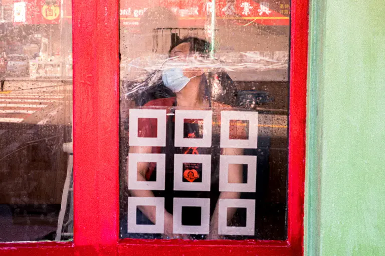

| Attribute                              | Value                                                     |
| :------------------------------------- | :-------------------------------------------------------- |
| **Framing & Aspect**                   | `LANDSCAPE` · `2048×1365` (Aspect: `1.50`)                |
| **Tonality & Breath**                  | `L*=56.35` — **Neutral** (CIELAB: `56.35, 21.1, 12.15`)   |
| **Transition to #16 (DSCF4110-2.jpg)** | `ΔE₇₆: 28.95` (Color) · `ΔLum: 4` · **Step Cost: `16.8`** |

**Curatorial Rationale & Montage Dynamic**:

- _Pacing Role_: Act III: The Stencil Grid / The Masked Portrait
- _Visual Subject & Content_: A person wearing a surgical mask seen through a storefront window framed in vivid red and lime green, structured by a 3x3 geometric grid of white squares with an 'I love service' heart badge at the center.
- _Thematic Meaning_: Claustrophobic pandemic-era visual iconography. The subject is compartmentalized within a rigid geometric matrix, peering out like a captive behind glass.
- _Composition & Gaze Vectors_: Strict 3x3 square matrix imposing mathematical order over the fluid human face behind.
- _Transition Dynamic_: Shift from rigid man-made grid to organic nature and ghostly double reflection.

---

### [16/20] DSCF4110-2.jpg

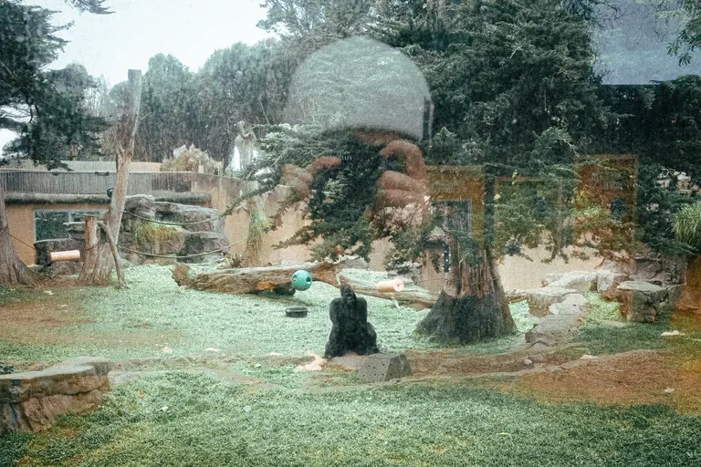

| Attribute                              | Value                                                    |
| :------------------------------------- | :------------------------------------------------------- |
| **Framing & Aspect**                   | `LANDSCAPE` · `2048×1365` (Aspect: `1.50`)               |
| **Tonality & Breath**                  | `L*=53.82` — **Neutral** (CIELAB: `53.82, -7.41, 7.81`)  |
| **Transition to #17 (DSCF6250-6.jpg)** | `ΔE₇₆: 11.99` (Color) · `ΔLum: 6` · **Step Cost: `7.6`** |

**Curatorial Rationale & Montage Dynamic**:

- _Pacing Role_: Act III: The Double Reflection / The Photographer and the Ape
- _Visual Subject & Content_: Looking through zoo viewing glass at a lone black gorilla seated on a grassy mound, overlaid with the ethereal reflection of the photographer in a baseball cap raising a camera.
- _Thematic Meaning_: The meta-reflective encounter: the observer and the observed merge. The ghostly silhouette of the photographer looms like a giant spirit over the solitary captive animal.
- _Composition & Gaze Vectors_: Vertical axis of the gorilla anchored at the base of the frame, enveloped by the ethereal crown of the photographer's reflected silhouette.
- _Transition Dynamic_: Harmonic transition from translucent glass reflections to violent physical glass fracture.

---

### [17/20] DSCF6250-6.jpg

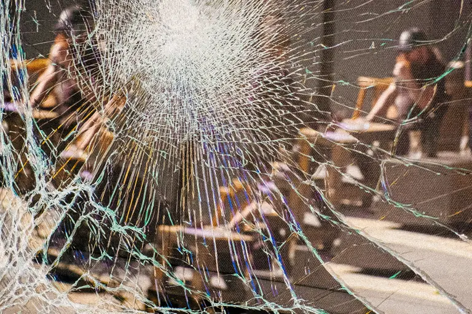

| Attribute                              | Value                                                     |
| :------------------------------------- | :-------------------------------------------------------- |
| **Framing & Aspect**                   | `LANDSCAPE` · `2048×1365` (Aspect: `1.50`)                |
| **Tonality & Breath**                  | `L*=51.18` — **Neutral** (CIELAB: `51.18, 4.28, 8.31`)    |
| **Transition to #18 (DSCF1207-5.jpg)** | `ΔE₇₆: 12.36` (Color) · `ΔLum: 20` · **Step Cost: `9.7`** |

**Curatorial Rationale & Montage Dynamic**:

- _Pacing Role_: Act IV: The Rupture / The Shattered Spectrum
- _Visual Subject & Content_: Intricate web of thousands of radiating cracks across a shattered glass pane centered on a white impact node, with blurry figures in hard hats dimly visible through the prismatic fractures.
- _Thematic Meaning_: The ultimate optical rupture. The pristine window through which the photographer views the world is smashed, refracting reality into a prismatic, chaotic spiderweb.
- _Composition & Gaze Vectors_: Explosive radial spokes detonating outward from the upper-center impact point across all four quadrants.
- _Transition Dynamic_: Step from shattered structural glass to the visceral human gesture of recoiling from the flash.

---

### [18/20] DSCF1207-5.jpg

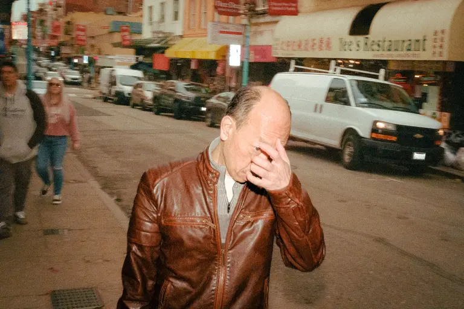

| Attribute                              | Value                                                      |
| :------------------------------------- | :--------------------------------------------------------- |
| **Framing & Aspect**                   | `LANDSCAPE` · `2048×1365` (Aspect: `1.50`)                 |
| **Tonality & Breath**                  | `L*=43.53` — **Neutral** (CIELAB: `43.53, 6.94, 17.65`)    |
| **Transition to #19 (DSCF3446-2.jpg)** | `ΔE₇₆: 24.08` (Color) · `ΔLum: 51` · **Step Cost: `20.5`** |

**Curatorial Rationale & Montage Dynamic**:

- _Pacing Role_: Act IV: The Flash Encounter / The Shielding Hand
- _Visual Subject & Content_: Flash exposure on a dusk street capturing a man in a brown leather jacket holding his hand over his brow in a pained or defensive gesture, with moving cars and pedestrians blurred behind.
- _Thematic Meaning_: The moral tension of the street photographer's flash. The subject shields their eyes from the intrusive beam, echoing the opening zoo visitors and newspaper shield.
- _Composition & Gaze Vectors_: Foreground foreshortening of the subject leaning forward, his raised hand blocking the direct gaze.
- _Transition Dynamic_: Dramatic leap into the climactic inhalation: the confrontation of the searchlight.

---

### [19/20] DSCF3446-2.jpg

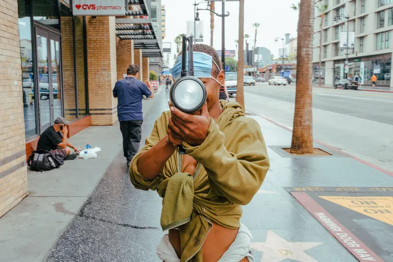

| Attribute                              | Value                                                      |
| :------------------------------------- | :--------------------------------------------------------- |
| **Framing & Aspect**                   | `LANDSCAPE` · `2048×1365` (Aspect: `1.50`)                 |
| **Tonality & Breath**                  | `L*=63.18` — **Inhalation** (CIELAB: `63.18, -0.92, 6.16`) |
| **Transition to #20 (DSCF0896-2.jpg)** | `ΔE₇₆: 12.96` (Color) · `ΔLum: 15` · **Step Cost: `9.3`**  |

**Curatorial Rationale & Montage Dynamic**:

- _Pacing Role_: Act IV: The Climax / The High Noon Searchlight
- _Visual Subject & Content_: On the Hollywood Walk of Fame in full daylight, a hooded figure with a surgical mask pulled down holds up a massive industrial searchlight lantern directly at the camera lens.
- _Thematic Meaning_: The philosophical climax and ultimate fulfillment of the series premise: Mathurin Régnier's quote ('Have I taken up my lantern / Seeking / At high noon'). The street subject turns the spotlight back onto the photographer and viewer in broad daylight.
- _Composition & Gaze Vectors_: Direct frontal vector: the circular glass lens of the lantern forms a bullseye aimed squarely at the viewer's optic nerve.
- _Transition Dynamic_: Luminous, cathartic resolution from blinding optical confrontation to quiet, reverent roadside memorial.

---

### [20/20] DSCF0896-2.jpg

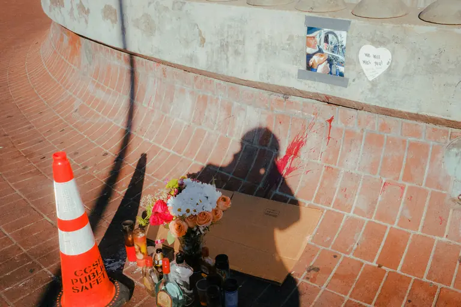

| Attribute             | Value                                                      |
| :-------------------- | :--------------------------------------------------------- |
| **Framing & Aspect**  | `LANDSCAPE` · `2048×1365` (Aspect: `1.50`)                 |
| **Tonality & Breath** | `L*=57.77` — **Inhalation** (CIELAB: `57.77, 8.43, 13.32`) |

**Curatorial Rationale & Montage Dynamic**:

- _Pacing Role_: Act IV: The Coda / The Memorial Shadow
- _Visual Subject & Content_: A street memorial on sunlit terracotta brick steps featuring an orange safety cone, fresh flowers, candles, liquor bottles, a taped photo of a man and dog ('We will Miss you!'), with the long dark shadow of the photographer standing over it.
- _Thematic Meaning_: The poignant final resolution of 'Das Gespenst'. The phantom is no longer an illusion or an optical game—it is the memory of the departed, and the photographer's shadow cast on the brick is a silent, reverent witness to human mortality.
- _Composition & Gaze Vectors_: Long diagonal shadow extending from the bottom center toward the flowers and memorial photo on the upper concrete wall.
- _Transition Dynamic_: Final contemplative resting frame of the visual essay.

---

## 3. Curatorial Proposals & Optimized Sequence Arc

The current sequence displays **optimal rhythmic pacing** (100/100) with harmonic alternation across Inhalation, Exhalation, and Neutral anchor frames.
