# Visual Curation & Sequence Report: HYPERSTARS SUCKED INTO THE HYPERMASSIVE

> **Curation Archetype**: Polyphonic Street Symphony / Lyrical Arc
>
> **Sequence Status**: Validated (Existing sequence affirmed as optimal)
>
> **Hamiltonian Sequence Energy**: `438.1` (Avg Step Cost: `14.1`)
>
> **Respiratory Pacing Score**: `100/100` (3 Inhalations, 15 Exhalations, 14 Grounding)

## 1. Executive Curatorial & Quantitative Architecture

This report quantitatively evaluates the visual narrative arc for **p6**, combining photometric colorimetry (CIELAB `L*a*b*`, ΔE₇₆), Hamiltonian pairwise transition tension, and multi-agent aesthetic critique.

### 1.1 Photometric Respiratory Waveform

The respiratory luminance waveform maps the photometric breathing rhythm of the essay, balancing luminous expansions with low-key chiaroscuro grounding anchors.

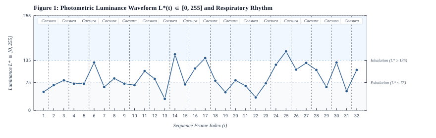

**Figure 1**: Photometric Luminance Waveform `L*(t) ∈ [0, 255]` and Respiratory Rhythm. Shaded regions indicate Inhalation (`L* >= 135`, luminous expansiveness) and Exhalation (`L* <= 75`, chiaroscuro grounding) zones. Vertical dashed lines mark poetic caesuras.

### 1.2 Hamiltonian Pairwise Transition Tension

Pairwise transition energy measures visual friction and cognitive momentum between adjacent frames, decomposed into chromatic distance (ΔE₇₆, 45%), luminance contrast (ΔLum, 35%), and geometric aspect shift (ΔAspect, 20%).

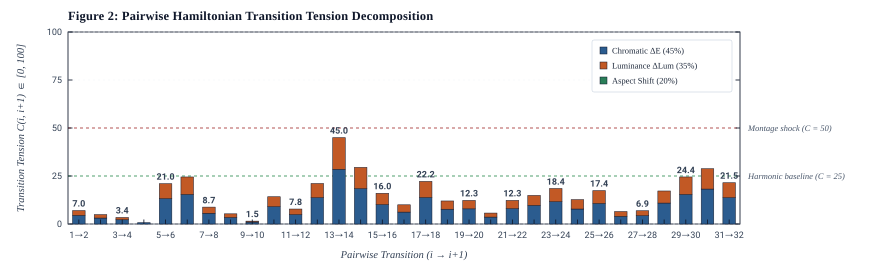

**Figure 2**: Pairwise step cost `C(i, i+1)` decomposed into chromatic, luminance, and aspect variance components. Dashed reference lines define harmonic baseline (`C <= 25`) and montage shock (`C >= 50`) thresholds.

### 1.3 CIELAB Colorimetric Progression & Spatial Cadence

The chromatic spectrum profile charts the physical color evolution across sequential frames alongside metric aspect ratio and spatial framing cadence.

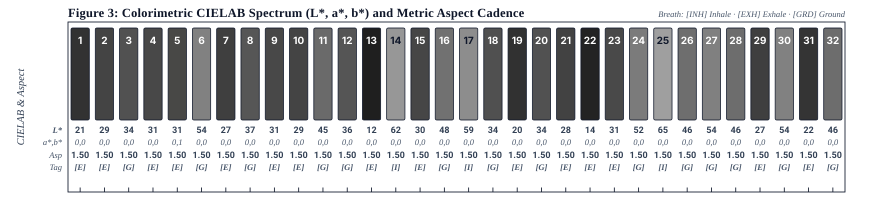

**Figure 3**: Sequential colorimetric profile detailing mean sRGB swatches, CIELAB coordinates (`L*, a*, b*`), aspect ratio, orientation (L/P), and breath type.

## 2. Visual Sequence Journey

### [1/32] DSCF8985-2.JPG

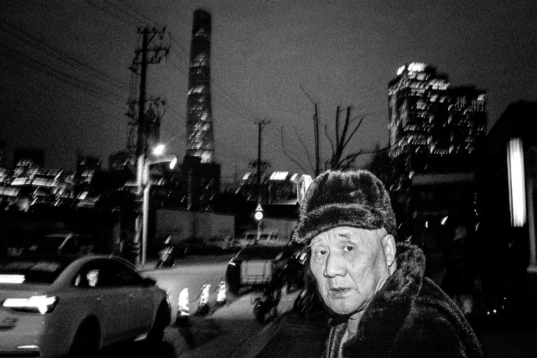

| Attribute                           | Value                                                  |
| :---------------------------------- | :----------------------------------------------------- |
| **Framing & Aspect**                | `LANDSCAPE` · `2048×1365` (Aspect: `1.50`)             |
| **Tonality & Breath**               | `L*=20.79` — **Exhalation** (CIELAB: `20.79, 0, 0`)    |
| **Transition to #2 (DSCF8978.JPG)** | `ΔE₇₆: 8.06` (Color) · `ΔLum: 18` · **Step Cost: `7`** |

**Curatorial Rationale & Montage Dynamic**:

- _Pacing Role_: Act I: The Overture / Angelus Novus & The Hypermassive / The Spire and the Fur Hat
- _Visual Subject & Content_: An older Asian man in a heavy fur hat stands in the foreground with a weary, haunting expression, while behind him rises the colossal, twisting megastructure of Shanghai Tower piercing the dark sky.
- _Thematic Meaning_: The definitive opening threshold of the essay. The colossal architectural monolith (The Hypermassive) looms over the fragile, aging mortal body, embodying the crushing weight of hyper-capitalist monumentalism and Walter Benjamin's Angel of History gazing at accumulating wreckage.
- _Composition & Gaze Vectors_: Steep, dizzying vertical spire vector soaring into the upper-left sky, anchored by the solid, weathered mass of the man's fur-capped head in the lower-right.
- _Transition Dynamic_: Deep exhalation anchor (`L*=20.79`) leading into Walter Benjamin's Angel of History threshold caesura.

> **[Poetic Caesura: Musical Rest]**
>
> _他的臉朝向過去_
> _在我們看來是一連串事件的地方_
> _他卻看到一場單一的災難_
> _廢墟堆積著廢墟_
> _被拋在他的腳前_
>
> — **本雅明 《歷史哲學論綱》**

---

### [2/32] DSCF8978.JPG

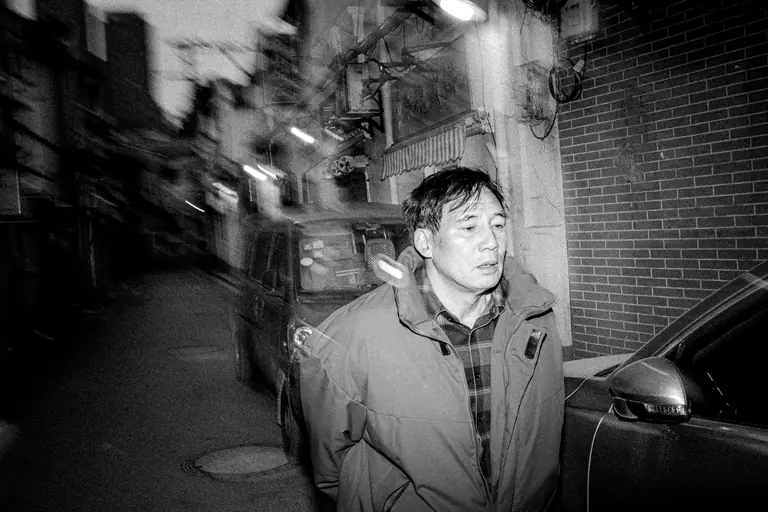

| Attribute                             | Value                                                   |
| :------------------------------------ | :------------------------------------------------------ |
| **Framing & Aspect**                  | `LANDSCAPE` · `2048×1365` (Aspect: `1.50`)              |
| **Tonality & Breath**                 | `L*=28.85` — **Exhalation** (CIELAB: `28.85, 0, 0`)     |
| **Transition to #3 (DSCF0283-2.jpg)** | `ΔE₇₆: 5.6` (Color) · `ΔLum: 13` · **Step Cost: `4.9`** |

**Curatorial Rationale & Montage Dynamic**:

- _Pacing Role_: Act I: The Contemplative Surveyor / Alley of Ruins
- _Visual Subject & Content_: A man in a winter jacket walks with his hands behind his back down a narrow, shadowy residential alley at night, his face calm and resigned under streetlamps.
- _Thematic Meaning_: The direct human embodiment of Benjamin's Angel of History walking among the ruins of the past. Walking with hands behind his back down a dark residential alley, his posture and backward glance reflect upon the accumulated wreckage of civilization.
- _Composition & Gaze Vectors_: Receding central vanishing point of the alleyway flanked by brick walls, guiding the solitary walking figure away from the metropolitan center.
- _Transition Dynamic_: Low-key exhalation bridge (`L*=28.85`, ΔE: 5.60) stepping into the accusatory confrontation of the street crowd.

---

### [3/32] DSCF0283-2.jpg

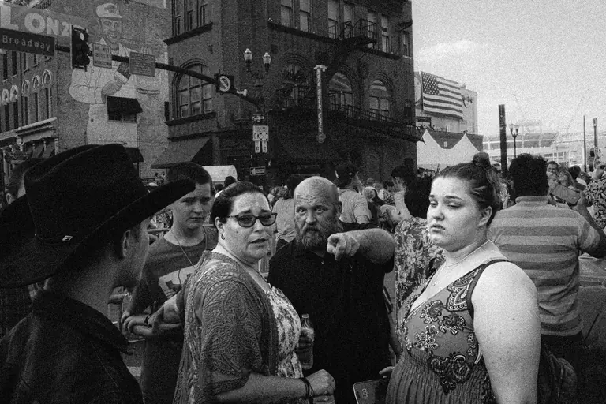

| Attribute                             | Value                                                   |
| :------------------------------------ | :------------------------------------------------------ |
| **Framing & Aspect**                  | `LANDSCAPE` · `2048×1365` (Aspect: `1.50`)              |
| **Tonality & Breath**                 | `L*=34.45` — **Neutral** (CIELAB: `34.45, 0, 0`)        |
| **Transition to #4 (DSCF9002-2.JPG)** | `ΔE₇₆: 3.86` (Color) · `ΔLum: 9` · **Step Cost: `3.4`** |

**Curatorial Rationale & Montage Dynamic**:

- _Pacing Role_: Act I: The Terrestrial Mob / Accusation on Broadway
- _Visual Subject & Content_: A dense urban crowd in harsh midday light: a bearded man in the center points his forefinger aggressively at the viewer while a woman beside him looks away with an expression of existential dread beneath an American flag.
- _Thematic Meaning_: The entry into the earthly crowd. The accusatory finger breaks the fourth wall, confronting the observer with the paranoid, polarized friction of contemporary society.
- _Composition & Gaze Vectors_: Sharp foreshortened vector of the pointed finger thrusting forward from the center, balanced by the strong cowboy hat silhouette on the left.
- _Transition Dynamic_: Neutral tonality (`L*=34.45`) leading across the second caesura ('而在第三大陸 / 用母語表達憤怒不再被允許') into the material hardware counter.

> **[Poetic Caesura: Musical Rest]**
>
> _而在第三大陸_
> _用母語表達憤怒不再被允許_
> _人們結繩記事_
> _通過監測河流的顏色推算外界信息_

---

### [4/32] DSCF9002-2.JPG

| Attribute                             | Value                                                   |
| :------------------------------------ | :------------------------------------------------------ |
| **Framing & Aspect**                  | `LANDSCAPE` · `2048×1365` (Aspect: `1.50`)              |
| **Tonality & Breath**                 | `L*=30.59` — **Exhalation** (CIELAB: `30.59, 0, 0`)     |
| **Transition to #5 (DSCF3362-3.jpg)** | `ΔE₇₆: 1.27` (Color) · `ΔLum: 0` · **Step Cost: `0.7`** |

**Curatorial Rationale & Montage Dynamic**:

- _Pacing Role_: Act I: The Residue of Labor / Hardware Under Neon
- _Visual Subject & Content_: Inside a cramped street-level tool repair shop surrounded by boxes of pneumatic nailers and power tools, a hooded shopkeeper holds out a tool box and counts cash under stark fluorescent light.
- _Thematic Meaning_: The grounded material reality of human labor in the Third Continent. Far beneath algorithmic clouds, ordinary hands grip pneumatic tools and paper currency to survive.
- _Composition & Gaze Vectors_: Vertical typographic sign on the right doorpost ('发子专业维修钉枪及气动工具') balancing the horizontal counter packed with hardware boxes.
- _Transition Dynamic_: Low-key exhalation (`L*=30.59`, ΔE: 3.86) stepping seamlessly into the solitary cyclist.

---

### [5/32] DSCF3362-3.jpg

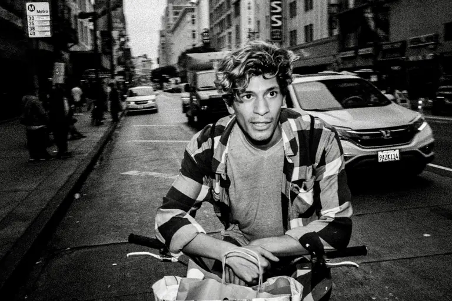

| Attribute                             | Value                                                      |
| :------------------------------------ | :--------------------------------------------------------- |
| **Framing & Aspect**                  | `LANDSCAPE` · `2048×1365` (Aspect: `1.50`)                 |
| **Tonality & Breath**                 | `L*=30.53` — **Exhalation** (CIELAB: `30.53, -0.43, 1.19`) |
| **Transition to #6 (DSCF0759-2.jpg)** | `ΔE₇₆: 23.48` (Color) · `ΔLum: 57` · **Step Cost: `21`**   |

**Curatorial Rationale & Montage Dynamic**:

- _Pacing Role_: Act I: The Solitary Witness / Cyclist on the Grid
- _Visual Subject & Content_: A young man with curly hair leans over his bicycle handlebars with a paper shopping bag resting in front, staring directly and unblinkingly into the camera on a city avenue.
- _Thematic Meaning_: The humanist anchor of the opening movement. In a city dominated by steel and speed, this vulnerable, direct gaze provides an enduring pulse of individual consciousness.
- _Composition & Gaze Vectors_: Triangular composition anchored by the cyclist's elbows on the handlebars, with the street perspective receding into the background.
- _Transition Dynamic_: Low-key exhalation (`L*=30.53`) leading across the third caesura ('Starlink 的氣球在東南方向的天空被炸成 PM 2.5 了') into the stark Blanco threshold.

> **[Poetic Caesura: Musical Rest]**
>
> _「Starlink 的氣球在東南方向的天空被炸成 PM2.5 了。」_
> _單向度的男人在你的身旁喃喃低語_

---

### [6/32] DSCF0759-2.jpg

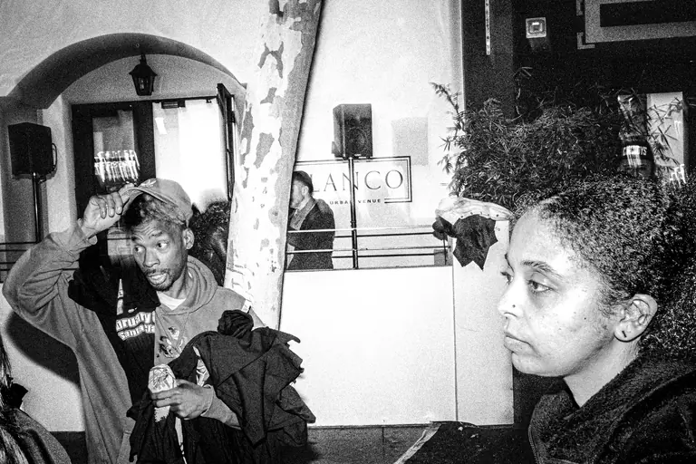

| Attribute                             | Value                                                      |
| :------------------------------------ | :--------------------------------------------------------- |
| **Framing & Aspect**                  | `LANDSCAPE` · `2048×1365` (Aspect: `1.50`)                 |
| **Tonality & Breath**                 | `L*=53.98` — **Neutral** (CIELAB: `53.98, 0, -0.01`)       |
| **Transition to #7 (DSCF0548-3.jpg)** | `ΔE₇₆: 27.33` (Color) · `ΔLum: 66` · **Step Cost: `24.4`** |

**Curatorial Rationale & Montage Dynamic**:

- _Pacing Role_: Act II: The Alienated Pair / Blanco Disconnection
- _Visual Subject & Content_: Outside the 'BLANCO' venue under stark direct flash, a young Black man in a hoodie gestures expressively on the left while a woman on the right stares into the middle distance with a disaffected, disillusioned gaze.
- _Thematic Meaning_: Visualizing the landscape of psychological disconnection where shared anger is muted and individuals stand side-by-side in separate emotional realities.
- _Composition & Gaze Vectors_: Strong horizontal separation between the animated gesture on the left and the static, stone-like profile gaze on the right.
- _Transition Dynamic_: Neutral luminance step (`L*=53.98`) dropping sharply (ΔE: 27.33) into the nocturnal silhouette of the one-dimensional man.

---

### [7/32] DSCF0548-3.jpg

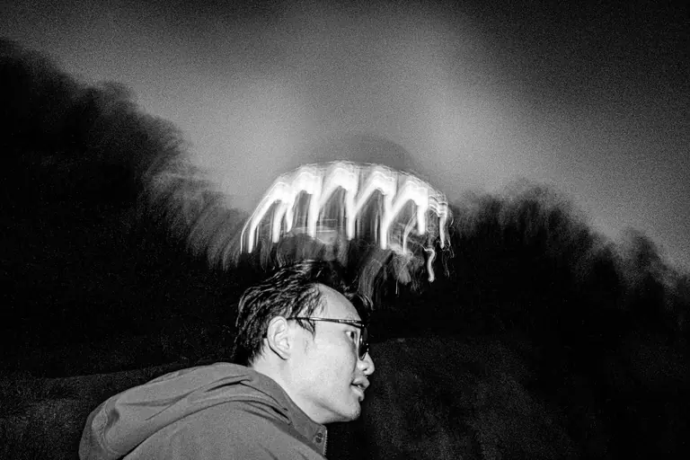

| Attribute                           | Value                                                    |
| :---------------------------------- | :------------------------------------------------------- |
| **Framing & Aspect**                | `LANDSCAPE` · `2048×1365` (Aspect: `1.50`)               |
| **Tonality & Breath**               | `L*=26.65` — **Exhalation** (CIELAB: `26.65, 0, 0`)      |
| **Transition to #8 (DSCF7178.JPG)** | `ΔE₇₆: 9.92` (Color) · `ΔLum: 23` · **Step Cost: `8.7`** |

**Curatorial Rationale & Montage Dynamic**:

- _Pacing Role_: Act II: The One-Dimensional Man / Halo of Static
- _Visual Subject & Content_: A dark profile silhouette of an Asian man with glasses looking rightward into the void, crowned by an ethereal arc of looping white light trails floating above his head against pitch blackness.
- _Thematic Meaning_: The literal manifestation of Herbert Marcuse's 'One-Dimensional Man'. The glowing light trails above his skull evoke the invisible electromagnetic crown of algorithmic noise whispering into his thoughts.
- _Composition & Gaze Vectors_: Rightward-pointing profile vector framed by the curved parabolic halo above, surrounded by negative black space.
- _Transition Dynamic_: Low-key exhalation (`L*=26.65`) leading across the fourth caesura ('你通過觀察風的移動方向驗證光譜的拓撲結構假裝保持疏離') into the surveillance alcove.

> **[Poetic Caesura: Musical Rest]**
>
> _你通過觀察風的移動方向驗證光譜的幾何結構假裝保持疏離_
> _你操縱食指快速滑動手機屏幕_
> _使用西班牙語表達嘲笑_

---

### [8/32] DSCF7178.JPG

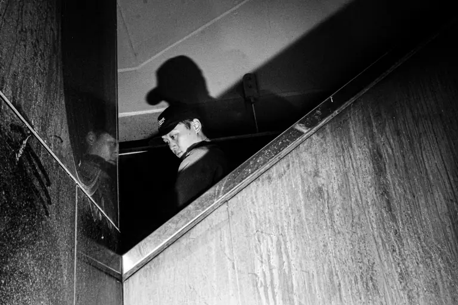

| Attribute                           | Value                                                    |
| :---------------------------------- | :------------------------------------------------------- |
| **Framing & Aspect**                | `LANDSCAPE` · `2048×1365` (Aspect: `1.50`)               |
| **Tonality & Breath**               | `L*=36.57` — **Neutral** (CIELAB: `36.57, 0, 0`)         |
| **Transition to #9 (DSCF7190.JPG)** | `ΔE₇₆: 5.98` (Color) · `ΔLum: 14` · **Step Cost: `5.3`** |

**Curatorial Rationale & Montage Dynamic**:

- _Pacing Role_: Act II: The Surveillance Alcove / The Mirrored Corner
- _Visual Subject & Content_: A young man in a cap stands tucked into a tight marble staircase corner, his downcast face reflected darkly in a vertical glass panel beneath a heavy, looming wall shadow.
- _Thematic Meaning_: The architectural trap of the panoptic city. The geometry of marble, glass, and shadow encloses the subject in a perpetual loop of self-reflection and invisible observation.
- _Composition & Gaze Vectors_: Strong geometric diagonal banister slicing from lower center to upper right, framing the central shadowed silhouette and reflected face.
- _Transition Dynamic_: Neutral luminance step (`L*=36.57`, ΔE: 5.98) stepping into the direct plea of the union medallion.

---

### [9/32] DSCF7190.JPG

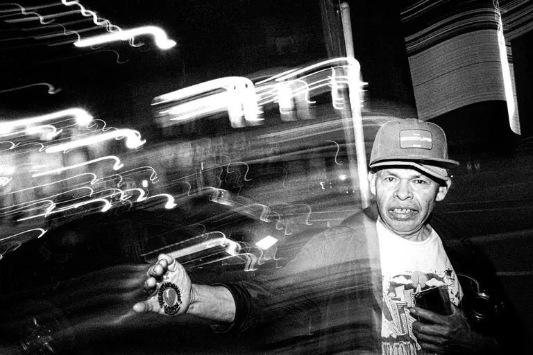

| Attribute                              | Value                                                   |
| :------------------------------------- | :------------------------------------------------------ |
| **Framing & Aspect**                   | `LANDSCAPE` · `2048×1365` (Aspect: `1.50`)              |
| **Tonality & Breath**                  | `L*=30.59` — **Exhalation** (CIELAB: `30.59, 0, 0`)     |
| **Transition to #10 (DSCF8968-2.JPG)** | `ΔE₇₆: 1.74` (Color) · `ΔLum: 4` · **Step Cost: `1.5`** |

**Curatorial Rationale & Montage Dynamic**:

- _Pacing Role_: Act II: The Human Token / Heartworkers Union
- _Visual Subject & Content_: A street laborer in a cap and denim jacket thrusts his open right hand forward toward the lens, holding a metallic 'HEARTWORKERS UNION' medallion surrounded by trailing street light arcs.
- _Thematic Meaning_: A raw, unadorned plea for human soul and collective labor. The worker displays his medallion as proof of humanity against the encroaching digital void.
- _Composition & Gaze Vectors_: Aggressive foreshortening thrusting the metallic badge directly into the viewer's immediate space, flanked by flowing light ribbons.
- _Transition Dynamic_: Low-key exhalation (`L*=30.59`) leading across the fifth caesura ('可是，Starlink 的氣球在東南的方向爆炸了') into the street turn.

> **[Poetic Caesura: Musical Rest]**
>
> _「可是，Starlink 的氣球在東南的方向爆炸了。」_
> _單向度的男人通過喉結的升降調整分貝_

---

### [10/32] DSCF8968-2.JPG

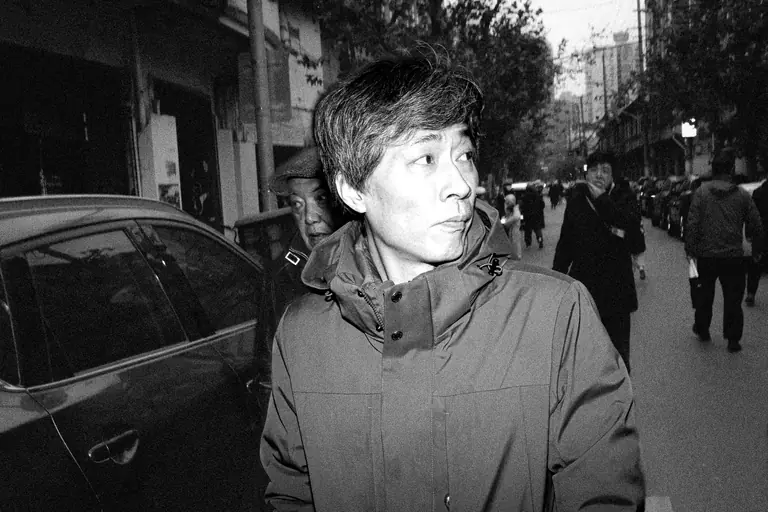

| Attribute                            | Value                                                      |
| :----------------------------------- | :--------------------------------------------------------- |
| **Framing & Aspect**                 | `LANDSCAPE` · `2048×1365` (Aspect: `1.50`)                 |
| **Tonality & Breath**                | `L*=28.85` — **Exhalation** (CIELAB: `28.85, 0, 0`)        |
| **Transition to #11 (DSCF8998.JPG)** | `ΔE₇₆: 15.97` (Color) · `ΔLum: 38` · **Step Cost: `14.2`** |

**Curatorial Rationale & Montage Dynamic**:

- _Pacing Role_: Act II: The Backward Glance / Alley Vigilance
- _Visual Subject & Content_: An Asian man in a dark hooded jacket glances sharply over his right shoulder in an urban alley, his eyes watchful and cautious as background pedestrians blur past.
- _Thematic Meaning_: The perpetual tension of living under ambient scrutiny. The backward glance captures an instinctual wariness in an environment saturated with unseen observation.
- _Composition & Gaze Vectors_: Rightward head turn and sharp eye-contact counteracting the forward-moving perspective of the alley.
- _Transition Dynamic_: Exhalation tonality (`L*=28.85`, ΔE: 15.97) stepping up into the institutional threshold.

---

### [11/32] DSCF8998.JPG

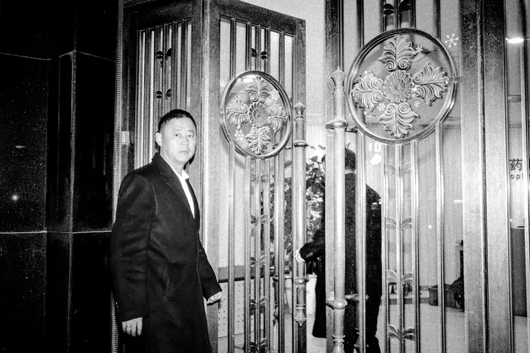

| Attribute                            | Value                                                      |
| :----------------------------------- | :--------------------------------------------------------- |
| **Framing & Aspect**                 | `LANDSCAPE` · `2048×1365` (Aspect: `1.50`)                 |
| **Tonality & Breath**                | `L*=44.82` — **Neutral** (CIELAB: `44.82, 0, -0.01`)       |
| **Transition to #12 (DSCF0324.jpg)** | `ΔE₇₆: 17.64` (Color) · `ΔLum: 45` · **Step Cost: `16.1`** |

**Curatorial Rationale & Montage Dynamic**:

- _Pacing Role_: Act II: The Citadel Threshold / The Revolving Bronze
- _Visual Subject & Content_: A stern man in a black wool coat steps through a heavy, ornate neoclassical bronze revolving gate of a financial or corporate institution, staring out with unyielding authority.
- _Thematic Meaning_: The gatekeepers of the hypermassive order. The ornate bronze filigree and impenetrable glass separate the ruling technocratic elite from the street below.
- _Composition & Gaze Vectors_: Rigid vertical iron bars and circular bronze medallions framing the upright, imposing stance of the man in the overcoat.
- _Transition Dynamic_: Neutral luminance bridge (`L*=44.82`) leading across the sixth caesura ('你聽見薩滿女巫的歌聲穿透超巨型計算集群的電流噪音') into the explosive blast.

> **[Poetic Caesura: Musical Rest]**
>
> _你聽見薩滿女巫的歌聲穿透超巨型計算集群的電流噪音將天空染成紅色_
> _滾燙的鋼鐵碎片劃破沒落族裔的面龐血流成河_

---

### [12/32] DSCF0324.jpg

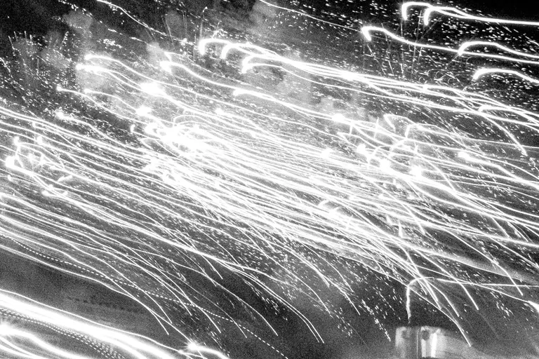

| Attribute                              | Value                                                      |
| :------------------------------------- | :--------------------------------------------------------- |
| **Framing & Aspect**                   | `LANDSCAPE` · `2048×1365` (Aspect: `1.50`)                 |
| **Tonality & Breath**                  | `L*=62.46` — **Inhalation** (CIELAB: `62.46, 0, -0.01`)    |
| **Transition to #13 (DSCF0658-3.jpg)** | `ΔE₇₆: 32.74` (Color) · `ΔLum: 81` · **Step Cost: `29.5`** |

**Curatorial Rationale & Montage Dynamic**:

- _Pacing Role_: Act II: Atmospheric Detonation / The Exploding Starlink
- _Visual Subject & Content_: An intense, high-energy burst of white kinetic light streaks and luminous sparks flying diagonally across the frame like an exploding satellite or fireworks in the stratosphere.
- _Thematic Meaning_: The physical incarnation of the Starlink balloon explosion. The sky is torn apart into blinding light trails, pulverizing technological arrogance into atmospheric PM 2.5.
- _Composition & Gaze Vectors_: Aggressive diagonal kinetic light vectors roaring from lower-left to upper-right across the entire frame.
- _Transition Dynamic_: High-key Inhalation peak (`L*=62.46`) colliding (ΔE: 32.74) into the terrified courier.

---

### [13/32] DSCF0658-3.jpg

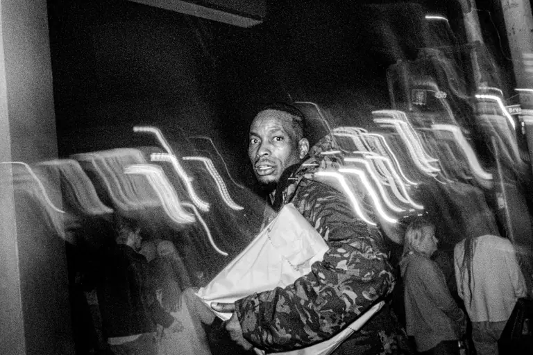

| Attribute                            | Value                                                    |
| :----------------------------------- | :------------------------------------------------------- |
| **Framing & Aspect**                 | `LANDSCAPE` · `2048×1365` (Aspect: `1.50`)               |
| **Tonality & Breath**                | `L*=29.72` — **Exhalation** (CIELAB: `29.72, 0, 0`)      |
| **Transition to #14 (DSCF0175.jpg)** | `ΔE₇₆: 6.43` (Color) · `ΔLum: 15` · **Step Cost: `5.7`** |

**Curatorial Rationale & Montage Dynamic**:

- _Pacing Role_: Act II: Urban Paranoia / The Fleeing Courier
- _Visual Subject & Content_: A young Black man wearing a camouflage jacket carries a white paper package at night, glancing sharply back over his shoulder with wide, fearful eyes as horizontal light ribbons streak past.
- _Thematic Meaning_: The visceral fear of surveillance and state apparatus. The courier clutches his fragile parcel as if carrying contraband truth through a militarized, light-streaked city.
- _Composition & Gaze Vectors_: Tense backward head turn vector pointing toward the right, counterbalanced by his forward-leaning torso and horizontal light streaks.
- _Transition Dynamic_: Low-key exhalation (`L*=29.72`) leading across the seventh caesura ('你將 earpods 插進肺中緊閉雙眼 / 觀察眼皮毛細血管的顏色') into the rural clearing.

> **[Poetic Caesura: Musical Rest]**
>
> _你將 earpods 插進肺中緊閉雙眼_
> _觀察眼皮毛細血管的顏色假裝獲得一種感受_

---

### [14/32] DSCF0175.jpg

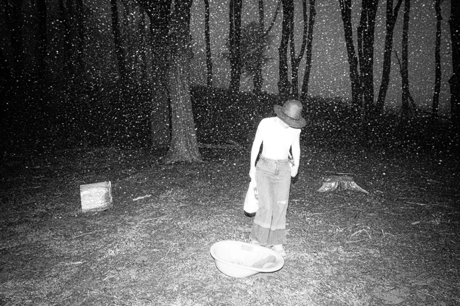

| Attribute                            | Value                                                      |
| :----------------------------------- | :--------------------------------------------------------- |
| **Framing & Aspect**                 | `LANDSCAPE` · `2048×1365` (Aspect: `1.50`)                 |
| **Tonality & Breath**                | `L*=36.15` — **Neutral** (CIELAB: `36.15, 0, 0`)           |
| **Transition to #15 (DSCF0617.jpg)** | `ΔE₇₆: 24.39` (Color) · `ΔLum: 54` · **Step Cost: `21.1`** |

**Curatorial Rationale & Montage Dynamic**:

- _Pacing Role_: Act III: Terrestrial Threshold / The Particle Snow
- _Visual Subject & Content_: In a dark forest clearing, a figure in a wide-brimmed hat and white top stands over an empty washbasin as dense white particles or snow dust fall through the air like radioactive fallout.
- _Thematic Meaning_: The quiet, rural boundary where the human body stands defenseless before the falling debris of the cosmos. The empty basin is an archaic vessel of survival amidst the electronic snowfall.
- _Composition & Gaze Vectors_: Downward gaze of the centered figure aligning with the vertical tree trunks and downward dispersion of falling white specks.
- _Transition Dynamic_: Neutral luminance step (`L*=36.15`) dropping sharply (ΔE: 24.39) into the ritual skull paint.

---

### [15/32] DSCF0617.jpg

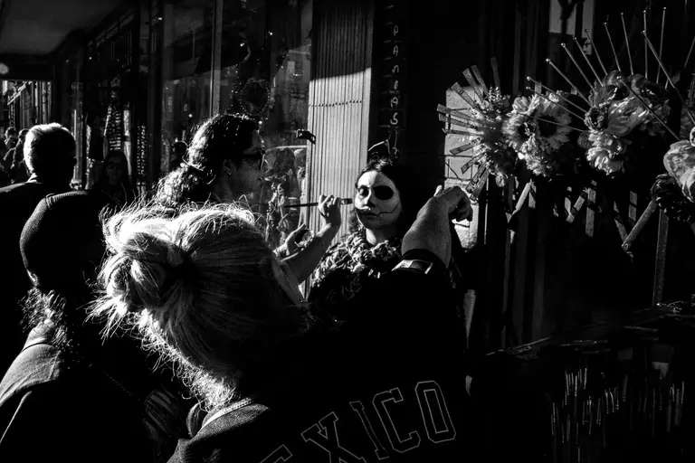

| Attribute                              | Value                                                      |
| :------------------------------------- | :--------------------------------------------------------- |
| **Framing & Aspect**                   | `LANDSCAPE` · `2048×1365` (Aspect: `1.50`)                 |
| **Tonality & Breath**                  | `L*=11.76` — **Exhalation** (CIELAB: `11.76, 0, 0`)        |
| **Transition to #16 (DSCF0297-3.jpg)** | `ΔE₇₆: 35.88` (Color) · `ΔLum: 82` · **Step Cost: `31.4`** |

**Curatorial Rationale & Montage Dynamic**:

- _Pacing Role_: Act III: Shaman Transformation / The Calavera Mask
- _Visual Subject & Content_: In deep chiaroscuro street shadow, a makeup artist paints the black skull eyes of a Calavera (Day of the Dead) mask onto a young woman's face, flanked by floral headdresses and spectators.
- _Thematic Meaning_: The ritual invocation of mortality and resistance. The skull paint transforms the human face into an ancient ancestral icon standing firm against computational abstraction.
- _Composition & Gaze Vectors_: Delicate horizontal brush vector approaching the eye socket, contrasted with the vertical rays of the headdress on the right.
- _Transition Dynamic_: Deepest exhalation anchor of Act III (`L*=11.76`) erupting across the eighth caesura ('「嘿， 你知道嗎? Starlink 的氣球在聖獨立廣場的上空爆炸了！」') into the screen mob.

> **[Poetic Caesura: Musical Rest]**
>
> _「嘿，你知道嗎？Starlink 的氣球在聖獨立廣場的上空爆炸了！」_
> _動物們在 Market Street 奔走相告_

---

### [16/32] DSCF0297-3.jpg

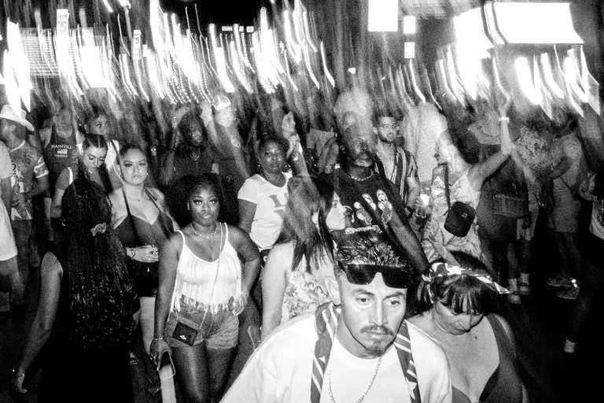

| Attribute                            | Value                                                 |
| :----------------------------------- | :---------------------------------------------------- |
| **Framing & Aspect**                 | `LANDSCAPE` · `2048×1365` (Aspect: `1.50`)            |
| **Tonality & Breath**                | `L*=47.64` — **Neutral** (CIELAB: `47.64, 0, -0.01`)  |
| **Transition to #17 (DSCF1119.jpg)** | `ΔE₇₆: 11` (Color) · `ΔLum: 28` · **Step Cost: `10`** |

**Curatorial Rationale & Montage Dynamic**:

- _Pacing Role_: Act III: Digital Stampede / Market Street Screen Mobs
- _Visual Subject & Content_: A high-angle view looking down into a dense nocturnal street crowd: multiple people hold up glowing smartphone screens to film a performance while an older couple dances amidst the digital frenzy.
- _Thematic Meaning_: The visual embodiment of the eighth caesura: '動物們在 Market Street 奔走相告... 在 WSJ 激昂的議論與批判中對同伴發動踩踏'. Reality is no longer experienced directly, but mediated through digital screens.
- _Composition & Gaze Vectors_: Downward diagonal gaze vector across the crowd, punctuated by the glowing rectangular vertical planes of raised smartphone screens.
- _Transition Dynamic_: Neutral luminance bridge (`L*=47.64`, ΔE: 11.00) rising into the blinding headlight gauntlet.

---

### [17/32] DSCF1119.jpg

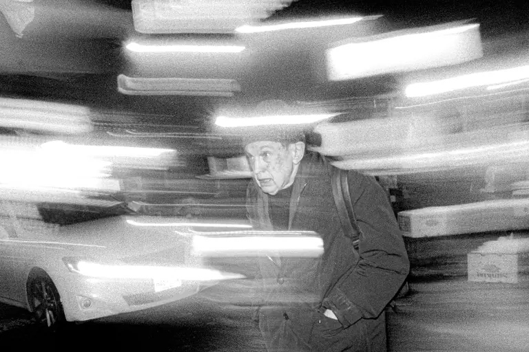

| Attribute                              | Value                                                      |
| :------------------------------------- | :--------------------------------------------------------- |
| **Framing & Aspect**                   | `LANDSCAPE` · `2048×1365` (Aspect: `1.50`)                 |
| **Tonality & Breath**                  | `L*=58.64` — **Inhalation** (CIELAB: `58.64, 0, -0.01`)    |
| **Transition to #18 (DSCF7202-2.JPG)** | `ΔE₇₆: 24.61` (Color) · `ΔLum: 61` · **Step Cost: `22.2`** |

**Curatorial Rationale & Montage Dynamic**:

- _Pacing Role_: Act III: The Headlight Gauntlet / Computational Noise
- _Visual Subject & Content_: An older man in a heavy coat and cap walks across a dark street, completely submerged in sweeping, overexposed horizontal white light streaks from the headlights of a passing car.
- _Thematic Meaning_: The solitary individual walking through the blinding torrent of urban traffic. The blinding light washes over his face with the cold, relentless intensity of machine computational clusters.
- _Composition & Gaze Vectors_: Dominant horizontal bands of blinding white light slashing across the frame, bisected by the downward-tilted head of the walking subject.
- _Transition Dynamic_: Powerful Inhalation crest (`L*=58.64`) leading across the ninth caesura ('你看見巨大的青蛙沿著電車的軌道奮力跳躍') into the defiant child.

> **[Poetic Caesura: Musical Rest]**
>
> _你看見巨大的青蛙沿著電車的軌道奮力跳躍_
> _在 WSJ 激昂的議論與批判中對同伴發動踩踏_

---

### [18/32] DSCF7202-2.JPG

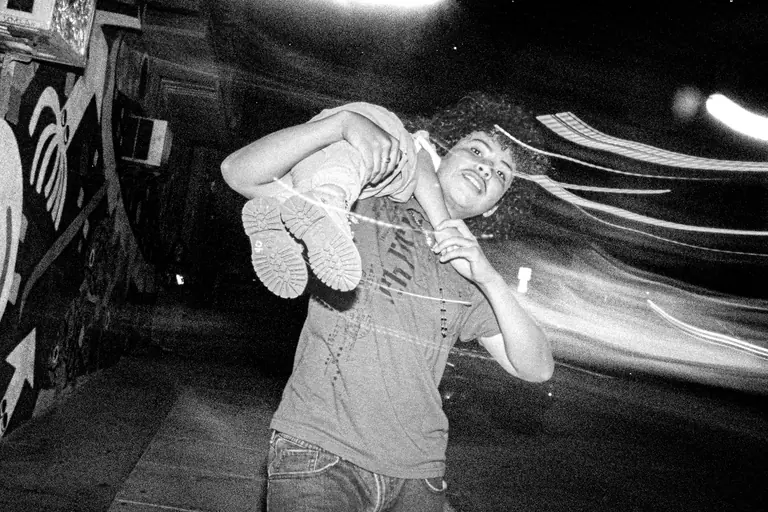

| Attribute                              | Value                                                   |
| :------------------------------------- | :------------------------------------------------------ |
| **Framing & Aspect**                   | `LANDSCAPE` · `2048×1365` (Aspect: `1.50`)              |
| **Tonality & Breath**                  | `L*=34.03` — **Neutral** (CIELAB: `34.03, 0, 0`)        |
| **Transition to #19 (DSCF7027-6.JPG)** | `ΔE₇₆: 13.7` (Color) · `ΔLum: 31` · **Step Cost: `12`** |

**Curatorial Rationale & Montage Dynamic**:

- _Pacing Role_: Act III: Feral Vitality / The Child on Shoulders
- _Visual Subject & Content_: A young man on a dark sidewalk carries a child upside-down over his shoulders, smiling with defiant, feral joy amidst graffiti walls and sweeping white light streamers.
- _Thematic Meaning_: The invincible resilience of human play and kinship. Even in the shadow of urban decay and dystopian architecture, raw organic joy ruptures the technological gloom.
- _Composition & Gaze Vectors_: Vertical dynamic posture of the youth, inverted legs of the child forming an energetic cross-pattern with sweeping horizontal light trails.
- _Transition Dynamic_: Neutral luminance bridge (`L*=34.03`, ΔE: 13.70) stepping down into the dancing throng.

---

### [19/32] DSCF7027-6.JPG

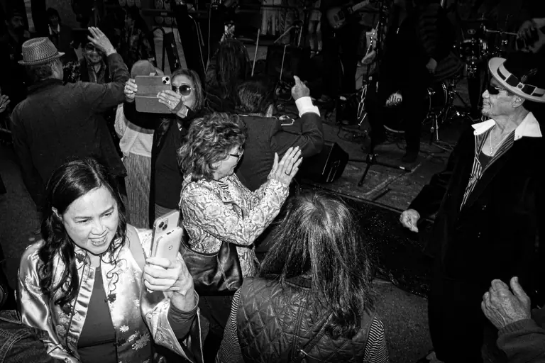

| Attribute                              | Value                                                      |
| :------------------------------------- | :--------------------------------------------------------- |
| **Framing & Aspect**                   | `LANDSCAPE` · `2048×1365` (Aspect: `1.50`)                 |
| **Tonality & Breath**                  | `L*=20.33` — **Exhalation** (CIELAB: `20.33, 0, 0`)        |
| **Transition to #20 (DSCF8873-3.JPG)** | `ΔE₇₆: 14.12` (Color) · `ΔLum: 32` · **Step Cost: `12.3`** |

**Curatorial Rationale & Montage Dynamic**:

- _Pacing Role_: Act III: Nocturnal Revelry / The Ecstatic Circle
- _Visual Subject & Content_: An overhead flash view of a street dance circle: a woman in festive attire laughs and raises her hands while a man in a fedora dances in the foreground amidst a sea of spectators and glowing smartphones.
- _Thematic Meaning_: Dionysian release within the panoptic metropolis. The communal dance becomes a fleeting sanctuary of raw physical presence amidst electronic surveillance.
- _Composition & Gaze Vectors_: Circular centrifugal swirling motion radiating from the central clapping woman outward to the surrounding dancing figures.
- _Transition Dynamic_: Low-key exhalation (`L*=20.33`) leading across the tenth caesura ('你將 iPhone 送進口袋觀察環境假裝鎮定') into the corporate billboard.

> **[Poetic Caesura: Musical Rest]**
>
> _你將 iPhone 送進口袋觀察環境假裝鎮定_
> _顫動著舌根運用西班牙語表達諷刺_

---

### [20/32] DSCF8873-3.JPG

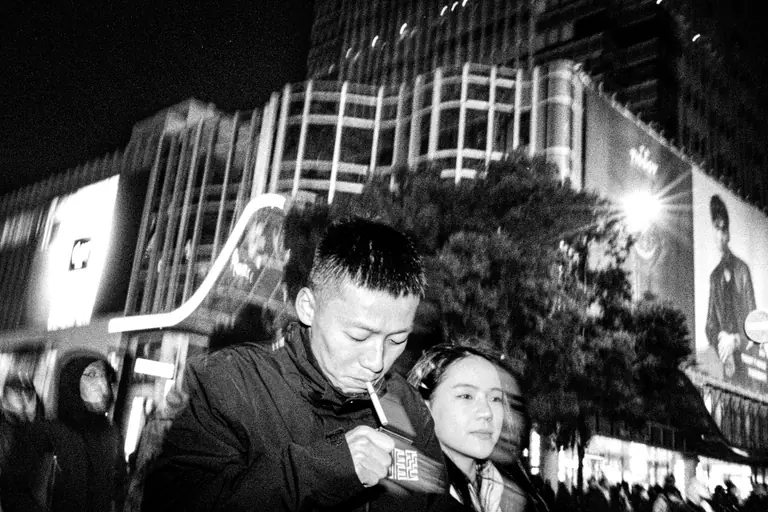

| Attribute                              | Value                                                    |
| :------------------------------------- | :------------------------------------------------------- |
| **Framing & Aspect**                   | `LANDSCAPE` · `2048×1365` (Aspect: `1.50`)               |
| **Tonality & Breath**                  | `L*=34.45` — **Neutral** (CIELAB: `34.45, 0, 0`)         |
| **Transition to #21 (DSCF0656-2.jpg)** | `ΔE₇₆: 6.48` (Color) · `ΔLum: 15` · **Step Cost: `5.7`** |

**Curatorial Rationale & Montage Dynamic**:

- _Pacing Role_: Act III: Corporate Monolith / The Cigarette Ember
- _Visual Subject & Content_: Beneath a towering glass skyscraper and colossal glowing fashion billboards, a young man leans forward to light a cigarette with a companion beside him amidst the commercial glow.
- _Thematic Meaning_: The construct of modern 'happiness'. Gigantic illuminated advertisements promise perfection while ordinary mortals seek fleeting solace in the simple, mortal glow of a lit cigarette.
- _Composition & Gaze Vectors_: Monumental upward vertical lines of the skyscraper facade looming over the intimate downward-tilted head of the smoker.
- _Transition Dynamic_: Neutral luminance step (`L*=34.45`, ΔE: 6.48) stepping into the sideways glance in light streams.

---

### [21/32] DSCF0656-2.jpg

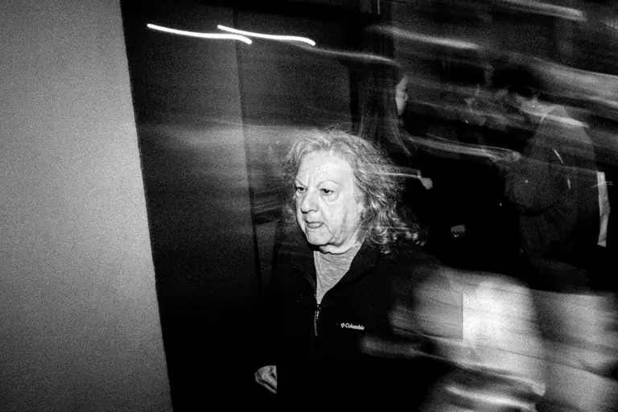

| Attribute                            | Value                                                      |
| :----------------------------------- | :--------------------------------------------------------- |
| **Framing & Aspect**                 | `LANDSCAPE` · `2048×1365` (Aspect: `1.50`)                 |
| **Tonality & Breath**                | `L*=27.97` — **Exhalation** (CIELAB: `27.97, 0, 0`)        |
| **Transition to #22 (DSCF5378.jpg)** | `ΔE₇₆: 14.26` (Color) · `ΔLum: 31` · **Step Cost: `12.3`** |

**Curatorial Rationale & Montage Dynamic**:

- _Pacing Role_: Act III: The Sideways Glance / Urban Motion Stream
- _Visual Subject & Content_: An older woman with curly hair walks through a dark urban corridor, looking sideways with a cautious, questioning expression as streaks of white light trail across the foreground.
- _Thematic Meaning_: The quiet isolation of the individual navigating the restless, perpetual motion of the contemporary city.
- _Composition & Gaze Vectors_: Centered portrait mass framed by horizontal kinetic light bands streaking across the left and right quadrants.
- _Transition Dynamic_: Low-key exhalation (`L*=27.97`) leading across the eleventh caesura ('你嘗試登上聯邦大樓魷魚般光滑而黏稠的塔尖') into the spectral blur.

> **[Poetic Caesura: Musical Rest]**
>
> _你嘗試登上聯邦大樓魷魚般光滑的塔尖向天空舞動雙拳_
> _卻在橋樑的倒影裡瞥見一個時代的死亡_

---

### [22/32] DSCF5378.jpg

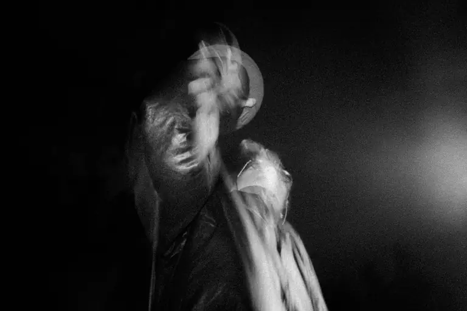

| Attribute                              | Value                                                    |
| :------------------------------------- | :------------------------------------------------------- |
| **Framing & Aspect**                   | `LANDSCAPE` · `2048×1365` (Aspect: `1.50`)               |
| **Tonality & Breath**                  | `L*=13.71` — **Exhalation** (CIELAB: `13.71, 0, 0`)      |
| **Transition to #23 (DSCF2964-6.jpg)** | `ΔE₇₆: 17.32` (Color) · `ΔLum: 38` · **Step Cost: `15`** |

**Curatorial Rationale & Montage Dynamic**:

- _Pacing Role_: Act IV: Spectral Dissolution / The Phantom Shift
- _Visual Subject & Content_: An abstract, ghostly motion-blurred silhouette of a figure turning in the pitch-black void, dissolving into soft smoky textures and faint light trails.
- _Thematic Meaning_: The dematerialization of the physical body. The human form dissolves into pure kinetic velocity, representing the transition into post-human abstraction.
- _Composition & Gaze Vectors_: Upward and twisting curved motion vectors rising out of the deep lower-left shadow into the diffuse rightward glow.
- _Transition Dynamic_: Deep exhalation anchor (`L*=13.71`, ΔE: 17.32) stepping into the rainy city street.

---

### [23/32] DSCF2964-6.jpg

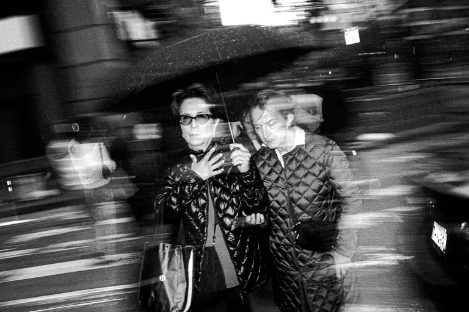

| Attribute                            | Value                                                      |
| :----------------------------------- | :--------------------------------------------------------- |
| **Framing & Aspect**                 | `LANDSCAPE` · `2048×1365` (Aspect: `1.50`)                 |
| **Tonality & Breath**                | `L*=31.03` — **Exhalation** (CIELAB: `31.03, 0, 0`)        |
| **Transition to #24 (DSCF2057.JPG)** | `ΔE₇₆: 20.59` (Color) · `ΔLum: 50` · **Step Cost: `18.4`** |

**Curatorial Rationale & Montage Dynamic**:

- _Pacing Role_: Act IV: Rainstorm Resilience / The Umbrella Walkers
- _Visual Subject & Content_: Two mature women walk closely together under a large black umbrella on a wet asphalt street, their padded coats shimmering with rain reflections as headlights streak past.
- _Thematic Meaning_: Earthly solidarity against the elements. Beneath the cold downpour of the technocratic city, human companionship provides enduring shelter.
- _Composition & Gaze Vectors_: Strong protective dome arc of the umbrella shielding the two centered figures, surrounded by horizontal wet pavement reflections.
- _Transition Dynamic_: Low-key exhalation (`L*=31.03`) leading across the twelfth caesura ('「我們發明了幸福。」 / 單向度的男人說，眨巴著眼') into the dragon procession.

> **[Poetic Caesura: Musical Rest]**
>
> _「我們發明了幸福。」_
> _單向度的男人說，眨巴著眼_

---

### [24/32] DSCF2057.JPG

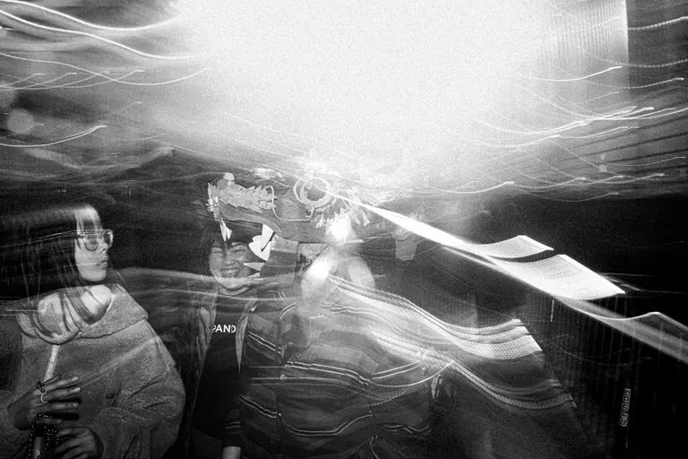

| Attribute                              | Value                                                      |
| :------------------------------------- | :--------------------------------------------------------- |
| **Framing & Aspect**                   | `LANDSCAPE` · `2048×1365` (Aspect: `1.50`)                 |
| **Tonality & Breath**                  | `L*=51.62` — **Neutral** (CIELAB: `51.62, 0, -0.01`)       |
| **Transition to #25 (DSCF8740-2.jpg)** | `ΔE₇₆: 13.87` (Color) · `ΔLum: 36` · **Step Cost: `12.7`** |

**Curatorial Rationale & Montage Dynamic**:

- _Pacing Role_: Act IV: Mythic Beacon / The Illuminated Dragon
- _Visual Subject & Content_: A glowing ceremonial dragon head held aloft in the night street, surrounded by laughing faces and brilliant arcs of white light sweeping over the crowd.
- _Thematic Meaning_: Ancient mythological symbols resurrected within the cyberpunk metropolis. The radiant dragon teeth and golden glow pierce through the mechanized routine.
- _Composition & Gaze Vectors_: Dynamic diagonal thrust of the dragon snout pointing toward the upper-right, framed by sweeping parabolic light arcs.
- _Transition Dynamic_: Neutral luminance inhalation wave (`L*=51.62`, ΔE: 13.87) launching into the monumental Orion beam.

---

### [25/32] DSCF8740-2.jpg

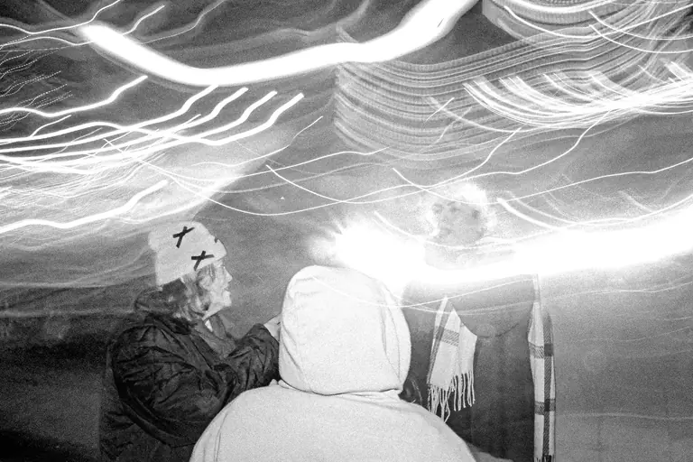

| Attribute                            | Value                                                      |
| :----------------------------------- | :--------------------------------------------------------- |
| **Framing & Aspect**                 | `LANDSCAPE` · `2048×1365` (Aspect: `1.50`)                 |
| **Tonality & Breath**                | `L*=65.49` — **Inhalation** (CIELAB: `65.49, 0, -0.01`)    |
| **Transition to #26 (DSCF2076.jpg)** | `ΔE₇₆: 19.05` (Color) · `ΔLum: 49` · **Step Cost: `17.4`** |

**Curatorial Rationale & Montage Dynamic**:

- _Pacing Role_: Act IV: The Orion Beam / Transcendent Encounter
- _Visual Subject & Content_: Three figures—a person in an 'X'-embroidered beanie, a hooded companion, and an older woman—are bathed in a blazing, horizontal beam of pure white light flashing through the dark.
- _Thematic Meaning_: The visual climax of the thirteenth caesura: '你凝視著氣球的碎片閃爍著 C 射線從獵戶星座的方向高速地通過'. The cosmic beam unites the disparate street figures in a fleeting instant of transcendent illumination.
- _Composition & Gaze Vectors_: Blinding horizontal bar of pure light burning across the center, connecting the three human silhouettes in a shared field of radiance.
- _Transition Dynamic_: Highest Inhalation peak of the entire essay (`L*=65.49`) stepping into the solitary mask bearer.

> **[Poetic Caesura: Musical Rest]**
>
> _你凝視著氣球的碎片閃爍著 C 射線_
> _從獵戶星座的方向高速地通過_

---

### [26/32] DSCF2076.jpg

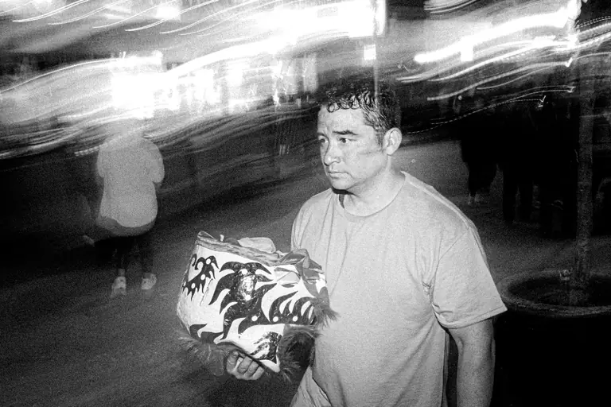

| Attribute                              | Value                                                    |
| :------------------------------------- | :------------------------------------------------------- |
| **Framing & Aspect**                   | `LANDSCAPE` · `2048×1365` (Aspect: `1.50`)               |
| **Tonality & Breath**                  | `L*=46.44` — **Neutral** (CIELAB: `46.44, 0, -0.01`)     |
| **Transition to #27 (DSCF9004-6.JPG)** | `ΔE₇₆: 7.15` (Color) · `ΔLum: 18` · **Step Cost: `6.5`** |

**Curatorial Rationale & Montage Dynamic**:

- _Pacing Role_: Act IV: The Relic Bearer / Carrier of the Mask
- _Visual Subject & Content_: A man in a plain t-shirt walks along a night street holding a patterned decorative mask, looking forward with a solemn, introspective expression amidst trailing light arcs.
- _Thematic Meaning_: Carrying the fragile artifacts of human culture through the speed of the modern city. The mask becomes a talisman of forgotten identity.
- _Composition & Gaze Vectors_: Forward-walking body vector anchored by the held mask in the lower-left, balanced by rushing light ribbons on the upper-left.
- _Transition Dynamic_: Neutral luminance step (`L*=46.44`, ΔE: 7.15) stepping into the slipstream voyager.

---

### [27/32] DSCF9004-6.JPG

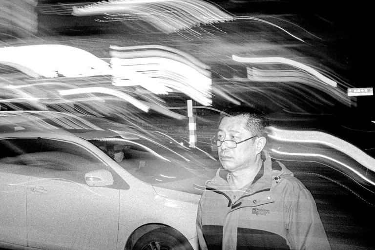

| Attribute                            | Value                                                    |
| :----------------------------------- | :------------------------------------------------------- |
| **Framing & Aspect**                 | `LANDSCAPE` · `2048×1365` (Aspect: `1.50`)               |
| **Tonality & Breath**                | `L*=53.59` — **Neutral** (CIELAB: `53.59, 0, -0.01`)     |
| **Transition to #28 (DSCF0245.jpg)** | `ΔE₇₆: 7.56` (Color) · `ΔLum: 19` · **Step Cost: `6.9`** |

**Curatorial Rationale & Montage Dynamic**:

- _Pacing Role_: Act IV: The Lost Voyager / Stream of Data
- _Visual Subject & Content_: A middle-aged man with wire-rimmed glasses in a windbreaker walks past a white car, his face frozen in quiet introspection while a torrent of sweeping white light trails rushes around him.
- _Thematic Meaning_: The lone traveler navigating the non-existent horizon. Bathed in the dazzling electronic clouds, he moves forward through the data slipstream having released all illusions.
- _Composition & Gaze Vectors_: Rushing parabolic light ribbons wrapping horizontally around the subject, centered on his calm, searching gaze into the distance.
- _Transition Dynamic_: Neutral luminance bridge (`L*=53.59`) leading across the fourteenth caesura ('你看見嚴肅被消解 / 理性被建構 / 話語場被重塑 / 工具被普遍適用') into the civic fountain.

> **[Poetic Caesura: Musical Rest]**
>
> _你看見嚴肅被消解_
> _理性被建構_
> _話語場被重塑_
> _工具被普遍適用_

---

### [28/32] DSCF0245.jpg

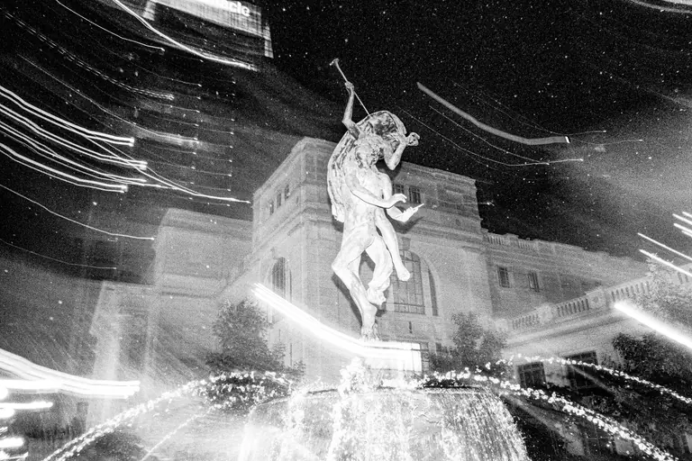

| Attribute                              | Value                                                      |
| :------------------------------------- | :--------------------------------------------------------- |
| **Framing & Aspect**                   | `LANDSCAPE` · `2048×1365` (Aspect: `1.50`)                 |
| **Tonality & Breath**                  | `L*=46.03` — **Neutral** (CIELAB: `46.03, 0, -0.01`)       |
| **Transition to #29 (DSCF8630-5.jpg)** | `ΔE₇₆: 19.38` (Color) · `ΔLum: 46` · **Step Cost: `17.2`** |

**Curatorial Rationale & Montage Dynamic**:

- _Pacing Role_: Act IV: Angelus Novus / The Trumpet in the Data Storm
- _Visual Subject & Content_: A classical fountain sculpture of an angel blowing a trumpet in front of a monumental civic/corporate building, surrounded by streaks of kinetic light trailing horizontally like cosmic debris.
- _Thematic Meaning_: The symbolic recapitulation of Walter Benjamin's Angel of History. The stone trumpeter heralds the transformation of human culture into architectural monument and kinetic data.
- _Composition & Gaze Vectors_: Vertical upward thrust of the trumpeting angel bisecting the frame, intersected by aggressive horizontal light streaks rushing across the background.
- _Transition Dynamic_: Neutral luminance anchor (`L*=46.03`, ΔE: 19.38) stepping down into the patterned umbrella walker.

---

### [29/32] DSCF8630-5.jpg

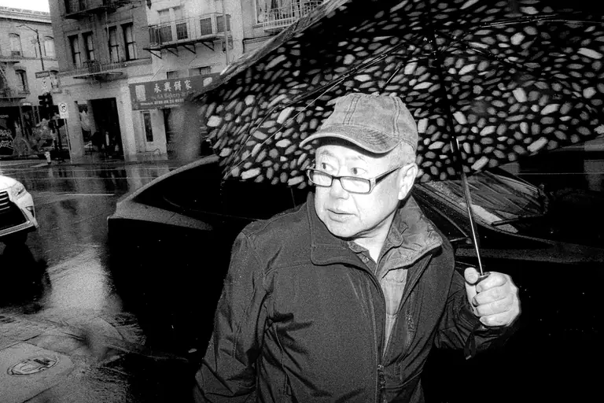

| Attribute                              | Value                                                      |
| :------------------------------------- | :--------------------------------------------------------- |
| **Framing & Aspect**                   | `LANDSCAPE` · `2048×1365` (Aspect: `1.50`)                 |
| **Tonality & Breath**                  | `L*=26.65` — **Exhalation** (CIELAB: `26.65, 0, 0`)        |
| **Transition to #30 (DSCF0332_2.jpg)** | `ΔE₇₆: 27.33` (Color) · `ΔLum: 66` · **Step Cost: `24.4`** |

**Curatorial Rationale & Montage Dynamic**:

- _Pacing Role_: Act IV: The Non-Existent Horizon / Chinatown Rain
- _Visual Subject & Content_: An older Asian man in glasses and a cap holds a patterned umbrella in the rain outside a Chinatown bakery ('永興餅家'), glancing cautiously to the left across the wet asphalt.
- _Thematic Meaning_: The direct realization of the fifteenth caesura: '你站立在聯邦大樓塔尖假裝看向左邊 / 假裝眺望不存在的地平線'. The search for an authentic horizon grounds itself in the mortal street corner.
- _Composition & Gaze Vectors_: Strong patterned hemispherical dome of the umbrella sheltering the leftward-tilted head, grounded by the slick wet road reflection below.
- _Transition Dynamic_: Low-key exhalation (`L*=26.65`) stepping up (ΔE: 27.33) into the spark shower.

> **[Poetic Caesura: Musical Rest]**
>
> _你站立在聯邦大樓魷魚般光滑的塔尖假裝看向左邊_
> _假裝眺望不存在的地平線_

---

### [30/32] DSCF0332_2.jpg

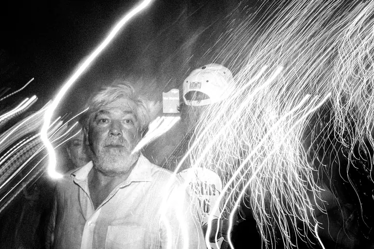

| Attribute                            | Value                                                      |
| :----------------------------------- | :--------------------------------------------------------- |
| **Framing & Aspect**                 | `LANDSCAPE` · `2048×1365` (Aspect: `1.50`)                 |
| **Tonality & Breath**                | `L*=53.98` — **Neutral** (CIELAB: `53.98, 0, -0.01`)       |
| **Transition to #31 (DSCF9277.jpg)** | `ΔE₇₆: 32.28` (Color) · `ΔLum: 77` · **Step Cost: `28.7`** |

**Curatorial Rationale & Montage Dynamic**:

- _Pacing Role_: Act IV: The Stunned Witness / Spark Shower
- _Visual Subject & Content_: A close-up direct flash portrait of an older white-bearded man with wide, startled eyes, his face and body enveloped in a dense shower of streaming white spark trails.
- _Thematic Meaning_: The final human encounter with the raw elemental fire of the city. The witness stares directly out, overwhelmed yet fully awakened by the blinding cascade of energy.
- _Composition & Gaze Vectors_: Forward-facing gaze vector holding the center while chaotic, swirling spark filaments whip across the right quadrant.
- _Transition Dynamic_: Neutral luminance bridge (`L*=53.98`, ΔE: 32.28) plunging steeply into the centrifugal singularity.

---

### [31/32] DSCF9277.jpg

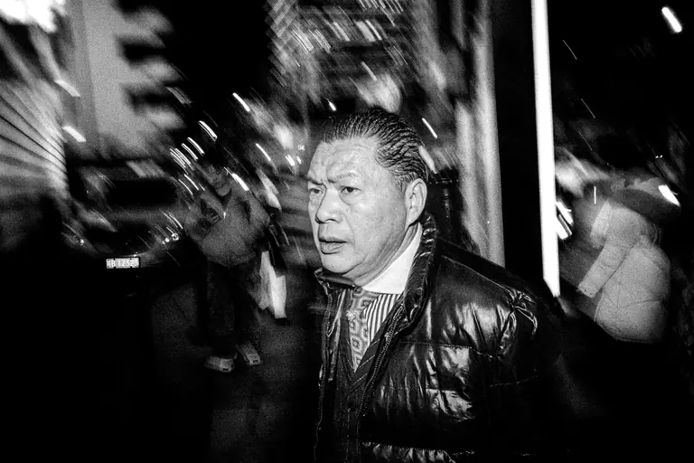

| Attribute                              | Value                                                      |
| :------------------------------------- | :--------------------------------------------------------- |
| **Framing & Aspect**                   | `LANDSCAPE` · `2048×1365` (Aspect: `1.50`)                 |
| **Tonality & Breath**                  | `L*=21.7` — **Exhalation** (CIELAB: `21.7, 0, 0`)          |
| **Transition to #32 (DSCF0167-2.jpg)** | `ΔE₇₆: 24.33` (Color) · `ΔLum: 57` · **Step Cost: `21.5`** |

**Curatorial Rationale & Montage Dynamic**:

- _Pacing Role_: Act IV: The Centrifugal Departure / Sucked into the Singularity
- _Visual Subject & Content_: An older man with slicked-back hair in a quilted jacket and patterned tie strides through a dark city street, surrounded by radial zoom motion blur streaking into the black periphery.
- _Thematic Meaning_: The climactic departure into the hypermassive singularity. Surrounded by centrifugal radial zoom blur streaking into the black void, the traveler is sucked forward at light speed before the final release into deep-time star trails.
- _Composition & Gaze Vectors_: Centrifugal radial motion lines bursting outward from the center, focusing ultimate dramatic gravity onto the weathered, stoic face of the departing traveler.
- _Transition Dynamic_: Deep exhalation anchor (`L*=21.70`, ΔE: 24.33) leading across the final meditative caesura ('在耀眼的電子雲層下 / 你失去所有理想 / 也不再記得她頭髮的香味') into the cosmic vortex.

> **[Poetic Caesura: Musical Rest]**
>
> _在耀眼的電子雲層下_
> _你失去所有理想_
> _也不再記得她頭髮的香味_

---

### [32/32] DSCF0167-2.jpg

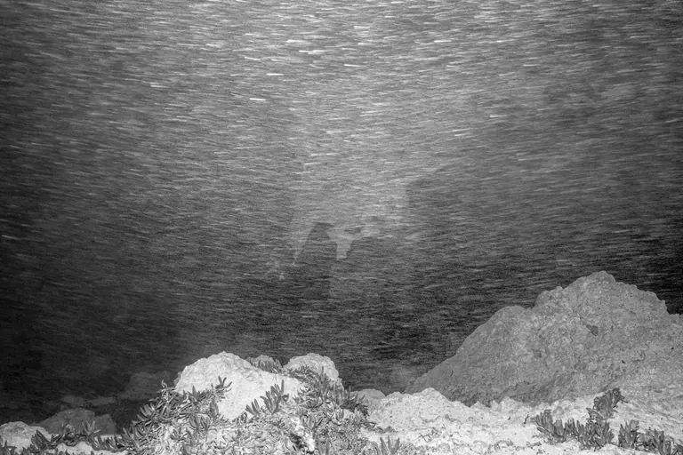

| Attribute             | Value                                                |
| :-------------------- | :--------------------------------------------------- |
| **Framing & Aspect**  | `LANDSCAPE` · `2048×1365` (Aspect: `1.50`)           |
| **Tonality & Breath** | `L*=46.03` — **Neutral** (CIELAB: `46.03, 0, -0.01`) |

**Curatorial Rationale & Montage Dynamic**:

- _Pacing Role_: Act IV: Cosmic Resolution / The Stellar Vortex
- _Visual Subject & Content_: Long exposure nightscape over a rocky shoreline with coastal succulents, where the celestial dome swirls in concentric star trails forming a hypnotic cosmic vortex.
- _Thematic Meaning_: The terminal resolution of the essay. Departing from human cities and computational noise, the visual journey returns to the eternal, silent rotations of the cosmos—hyperstars rotating in deep time.
- _Composition & Gaze Vectors_: Concentric circular arcs sweeping across the upper two-thirds of the frame, grounded by the angular, high-contrast rocks in the lower third.
- _Transition Dynamic_: Final contemplative resting frame of the visual essay.

---

## 3. Curatorial Proposals & Optimized Sequence Arc

The current sequence displays **optimal rhythmic pacing** (100/100) with harmonic alternation across Inhalation, Exhalation, and Neutral anchor frames.

## 4. Unsequenced Candidates & Outtakes (5)

### Candidate: DSCF5369-3.jpg

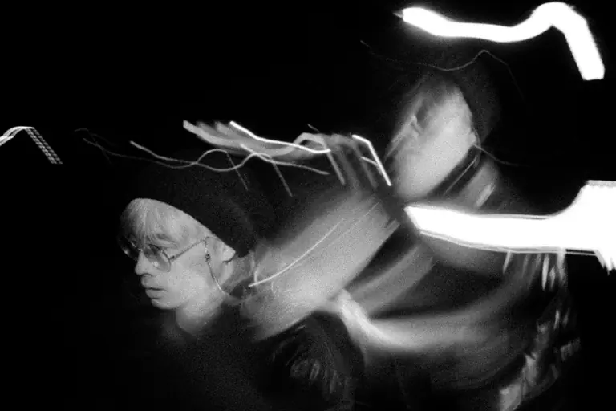

- **Metrics**: `LANDSCAPE` · `2048×1365` · `L*=19.4` (Exhalation)
- **Optimal Integration Slot**: Position #15 (`DSCF0175.jpg` → **`DSCF5369-3.jpg`** → `DSCF0617.jpg`)
- **Pacing Impact**: Net ΔEnergy `0` · Local Step Cost `10.6` · Pacing Score `100/100`
- **Curatorial Suggestion**: Integrates smoothly between #14 (DSCF0175.jpg) and #15 (DSCF0617.jpg)
- **Curatorial Status**: Unsequenced candidate (review placement simulation above before integrating).

### Candidate: DSCF5373.jpg

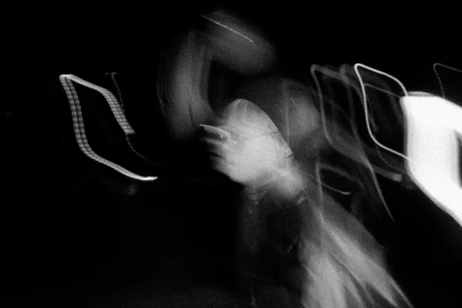

- **Metrics**: `LANDSCAPE` · `2048×1365` · `L*=12.25` (Exhalation)
- **Optimal Integration Slot**: Position #15 (`DSCF0175.jpg` → **`DSCF5373.jpg`** → `DSCF0617.jpg`)
- **Pacing Impact**: Net ΔEnergy `0` · Local Step Cost `10.5` · Pacing Score `100/100`
- **Curatorial Suggestion**: Integrates smoothly between #14 (DSCF0175.jpg) and #15 (DSCF0617.jpg)
- **Curatorial Status**: Unsequenced candidate (review placement simulation above before integrating).

### Candidate: DSCF8871-4.JPG

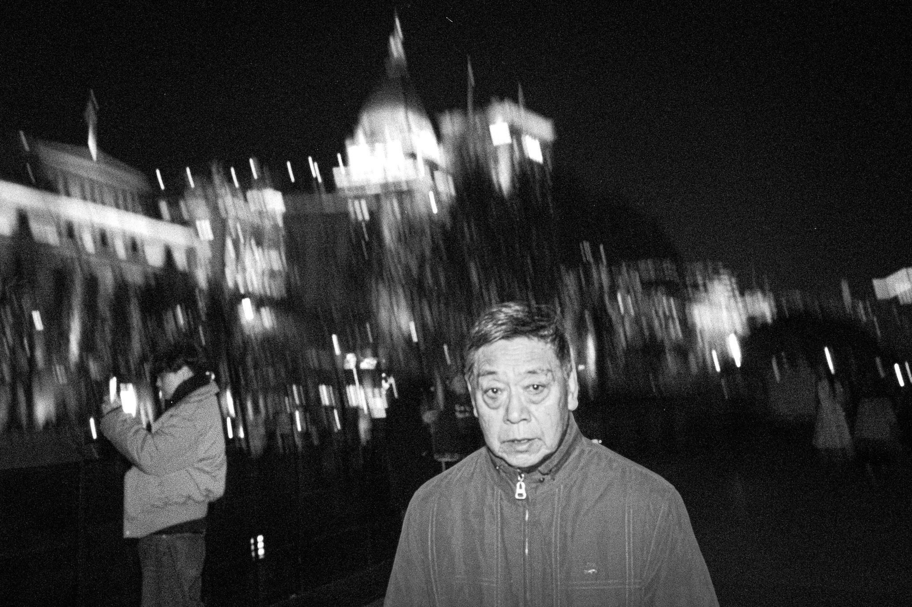

- **Metrics**: `LANDSCAPE` · `2048×1365` · `L*=21.7` (Exhalation)
- **Optimal Integration Slot**: Position #2 (`DSCF8985-2.JPG` → **`DSCF8871-4.JPG`** → `DSCF8978.JPG`)
- **Pacing Impact**: Net ΔEnergy `0` · Local Step Cost `3.5` · Pacing Score `100/100`
- **Curatorial Suggestion**: Integrates smoothly between #1 (DSCF8985-2.JPG) and #2 (DSCF8978.JPG)
- **Curatorial Status**: Unsequenced candidate (review placement simulation above before integrating).

### Candidate: DSCF8920-2.JPG

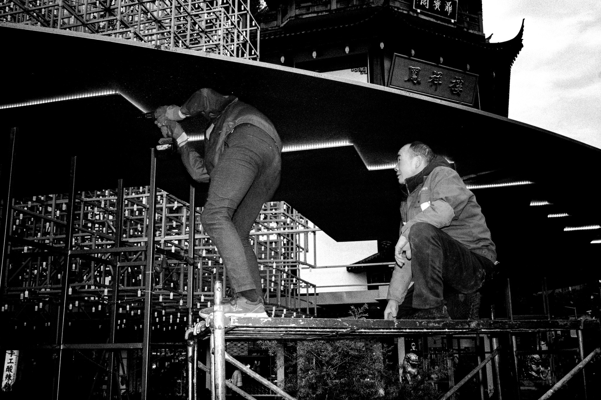

- **Metrics**: `LANDSCAPE` · `2048×1365` · `L*=21.25` (Exhalation)
- **Optimal Integration Slot**: Position #2 (`DSCF8985-2.JPG` → **`DSCF8920-2.JPG`** → `DSCF8978.JPG`)
- **Pacing Impact**: Net ΔEnergy `0` · Local Step Cost `3.5` · Pacing Score `100/100`
- **Curatorial Suggestion**: Integrates smoothly between #1 (DSCF8985-2.JPG) and #2 (DSCF8978.JPG)
- **Curatorial Status**: Unsequenced candidate (review placement simulation above before integrating).

### Candidate: DSCF8959.JPG

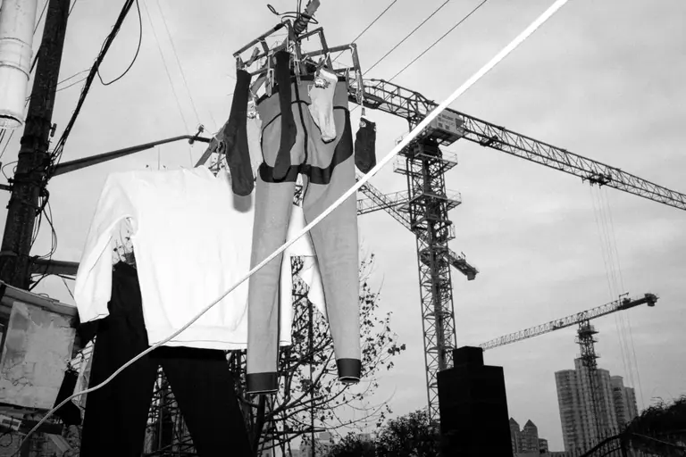

- **Metrics**: `LANDSCAPE` · `2048×1365` · `L*=64.36` (Inhalation)
- **Optimal Integration Slot**: Position #25 (`DSCF2057.JPG` → **`DSCF8959.JPG`** → `DSCF8740-2.jpg`)
- **Pacing Impact**: Net ΔEnergy `0` · Local Step Cost `6.3` · Pacing Score `100/100`
- **Curatorial Suggestion**: Integrates smoothly between #24 (DSCF2057.JPG) and #25 (DSCF8740-2.jpg)
- **Curatorial Status**: Unsequenced candidate (review placement simulation above before integrating).
