# Visual Curation & Sequence Report: HYPERSTARS SUCKED INTO THE HYPERMASSIVE

> **Curation Archetype**: Polyphonic Street Symphony / Lyrical Arc
>
> **Sequence Status**: Validated (Existing sequence affirmed as optimal)
>
> **Hamiltonian Sequence Energy**: `453.4` (Avg Step Cost: `14.6`)
>
> **Respiratory Pacing Score**: `100/100` (4 Inhalations, 11 Exhalations, 17 Grounding)

## 1. Executive Curatorial & Quantitative Architecture

This report quantitatively evaluates the visual narrative arc for **p6**, combining photometric colorimetry (CIELAB `L*a*b*`, ΔE₇₆), Hamiltonian pairwise transition tension, and multi-agent aesthetic critique.

### 1.1 Photometric Respiratory Waveform

The respiratory luminance waveform maps the photometric breathing rhythm of the essay, balancing luminous expansions with low-key chiaroscuro grounding anchors.

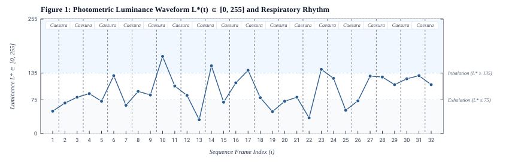

**Figure 1**: Photometric Luminance Waveform `L*(t) ∈ [0, 255]` and Respiratory Rhythm. Shaded regions indicate Inhalation (`L* >= 135`, luminous expansiveness) and Exhalation (`L* <= 75`, chiaroscuro grounding) zones. Vertical dashed lines mark poetic caesuras.

### 1.2 Hamiltonian Pairwise Transition Tension

Pairwise transition energy measures visual friction and cognitive momentum between adjacent frames, decomposed into chromatic distance (ΔE₇₆, 45%), luminance contrast (ΔLum, 35%), and geometric aspect shift (ΔAspect, 20%).

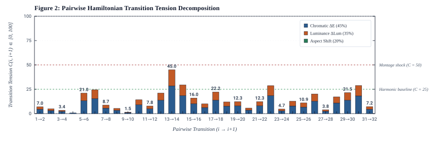

**Figure 2**: Pairwise step cost `C(i, i+1)` decomposed into chromatic, luminance, and aspect variance components. Dashed reference lines define harmonic baseline (`C <= 25`) and montage shock (`C >= 50`) thresholds.

### 1.3 CIELAB Colorimetric Progression & Spatial Cadence

The chromatic spectrum profile charts the physical color evolution across sequential frames alongside metric aspect ratio and spatial framing cadence.

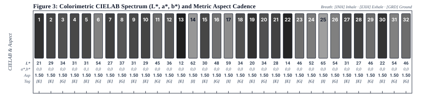

**Figure 3**: Sequential colorimetric profile detailing mean sRGB swatches, CIELAB coordinates (`L*, a*, b*`), aspect ratio, orientation (L/P), and breath type.

## 2. Visual Sequence Journey

### [1/32] DSCF8985-2.JPG

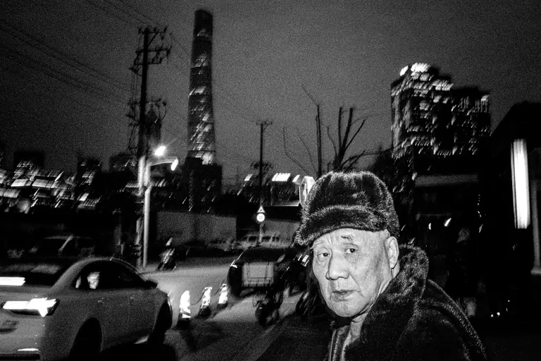

| Attribute                           | Value                                                  |
| :---------------------------------- | :----------------------------------------------------- |
| **Framing & Aspect**                | `LANDSCAPE` · `2048×1365` (Aspect: `1.50`)             |
| **Tonality & Breath**               | `L*=20.79` — **Exhalation** (CIELAB: `20.79, 0, 0`)    |
| **Transition to #2 (DSCF8978.JPG)** | `ΔE₇₆: 8.06` (Color) · `ΔLum: 18` · **Step Cost: `7`** |

**Curatorial Rationale & Montage Dynamic**:

- _Pacing Role_: Act I: The Overture / The Angel of History / The Spire and the Fur Hat
- _Visual Subject & Content_: An older man in a heavy fur hat turns a weary, haunted face into the direct flash on a night street, while behind him a colossal illuminated spire and motion-blurred towers tear across the dark sky and ghosted pedestrians drift through the traffic.
- _Thematic Meaning_: The definitive opening threshold. The hypermassive monument looms over the fragile aging body, embodying Walter Benjamin's Angel of History blown backward into the future while the wreckage of the city accumulates at his feet.
- _Composition & Gaze Vectors_: Steep vertical spire soaring upper-center, anchored by the solid weathered mass of the fur-capped head in the lower-right, with diagonal kinetic streaks sweeping the background.
- _Transition Dynamic_: Deep exhalation opener (`L*=20.79`) leading into the Benjamin 'Angel of History' threshold caesura.

> **[Poetic Caesura: Musical Rest]**
>
> _他的臉朝向過去_
> _在我們看來是一連串事件的地方_
> _他卻看到一場單一的災難_
> _廢墟堆積著廢墟_
> _被拋在他的腳前_
>
> — **本雅明 《歷史哲學論綱》**

---

### [2/32] DSCF8978.JPG

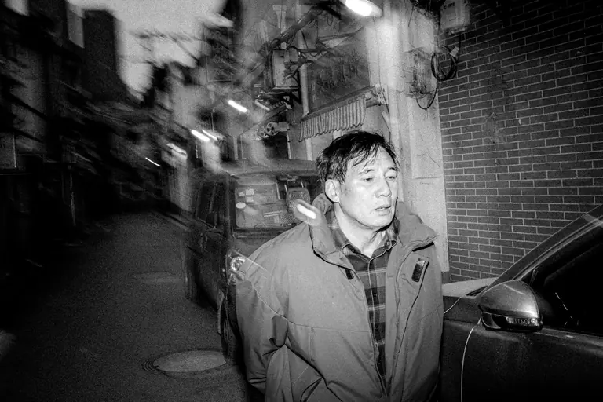

| Attribute                             | Value                                                   |
| :------------------------------------ | :------------------------------------------------------ |
| **Framing & Aspect**                  | `LANDSCAPE` · `2048×1365` (Aspect: `1.50`)              |
| **Tonality & Breath**                 | `L*=28.85` — **Exhalation** (CIELAB: `28.85, 0, 0`)     |
| **Transition to #3 (DSCF0283-2.jpg)** | `ΔE₇₆: 5.6` (Color) · `ΔLum: 13` · **Step Cost: `4.9`** |

**Curatorial Rationale & Montage Dynamic**:

- _Pacing Role_: Act I: The Contemplative Surveyor / Alley of Ruins
- _Visual Subject & Content_: A man in a winter jacket stands at the mouth of a narrow night alley beside a parked car, his face calm and resigned under hard flash, while slow-shutter streaks dissolve the brick walls and tangled wires behind him.
- _Thematic Meaning_: The human embodiment of the threshold caesura: a solitary witness standing among the ruins of the old city, hands clasped in withdrawn contemplation as history blurs past him.
- _Composition & Gaze Vectors_: Receding alley vanishing point on the left counterbalanced by the static frontal body mass on the right, smeared light diagonals binding the two halves.
- _Transition Dynamic_: Low exhalation bridge (`L*=28.85`, ΔE: 5.6) stepping quietly into the daylight accusation of the crowd.

---

### [3/32] DSCF0283-2.jpg

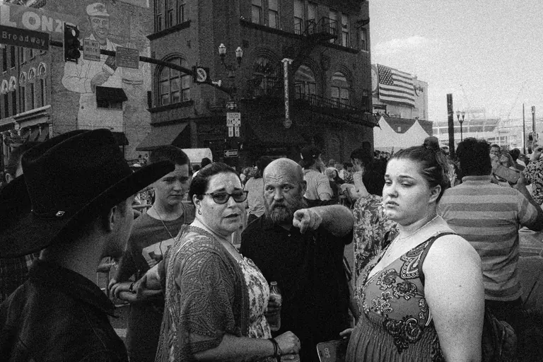

| Attribute                           | Value                                                 |
| :---------------------------------- | :---------------------------------------------------- |
| **Framing & Aspect**                | `LANDSCAPE` · `2048×1365` (Aspect: `1.50`)            |
| **Tonality & Breath**               | `L*=34.45` — **Neutral** (CIELAB: `34.45, 0, 0`)      |
| **Transition to #4 (DSCF1649.jpg)** | `ΔE₇₆: 3.37` (Color) · `ΔLum: 8` · **Step Cost: `3`** |

**Curatorial Rationale & Montage Dynamic**:

- _Pacing Role_: Act I: The Terrestrial Mob / Accusation on Broadway
- _Visual Subject & Content_: A dense street-fair crowd in harsh daylight: a bald bearded man thrusts his forefinger directly at the viewer while the women beside him stare with guarded dread, an American flag and faded wall advertisements rising behind them.
- _Thematic Meaning_: The entry into the earthly crowd. The accusatory finger breaks the fourth wall and indicts the observer, introducing the paranoid collective friction of the Third Continent.
- _Composition & Gaze Vectors_: Foreshortened pointing arm jabbing out of center-frame, flanked by the black cowboy-hat silhouette at left and the flag pole vertical at right.
- _Transition Dynamic_: Neutral daylight plateau (`L*=34.45`) leading across the '第三大陸' caesura into the trance of the embroidered dress.

> **[Poetic Caesura: Musical Rest]**
>
> _而在第三大陸_
> _用母語表達憤怒不再被允許_
> _人們結繩記事_
> _通過監測河流的顏色推算外界信息_

---

### [4/32] DSCF1649.jpg

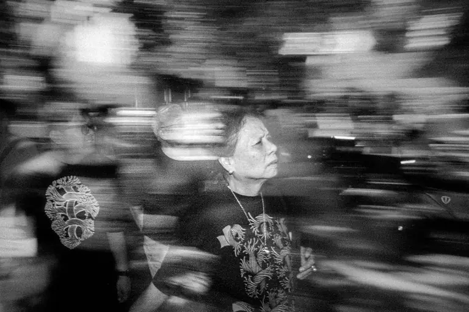

| Attribute                             | Value                                                    |
| :------------------------------------ | :------------------------------------------------------- |
| **Framing & Aspect**                  | `LANDSCAPE` · `2048×1365` (Aspect: `1.50`)               |
| **Tonality & Breath**                 | `L*=37.82` — **Neutral** (CIELAB: `37.82, 0, 0`)         |
| **Transition to #5 (DSCF9002-2.JPG)** | `ΔE₇₆: 7.23` (Color) · `ΔLum: 17` · **Step Cost: `6.4`** |

**Curatorial Rationale & Montage Dynamic**:

- _Pacing Role_: Act II: The Trance / Embroidered Apparition
- _Visual Subject & Content_: A woman in a traditional floral-embroidered dress drifts through a pan-blurred night crowd, her eyes closed and face lifted in serene absorption while the city smears into horizontal ribbons around her.
- _Thematic Meaning_: The first interior state of the sequence: a private trance held intact inside public chaos, the body moving with the crowd while consciousness withdraws elsewhere.
- _Composition & Gaze Vectors_: Violent horizontal pan streaks wrapping a still, softly lit central profile; the embroidered bodice holds micro-detail against macro-blur.
- _Transition Dynamic_: Neutral tonality (`L*=37.82`) stepping down into the material labor of the hardware counter.

---

### [5/32] DSCF9002-2.JPG

| Attribute                             | Value                                                    |
| :------------------------------------ | :------------------------------------------------------- |
| **Framing & Aspect**                  | `LANDSCAPE` · `2048×1365` (Aspect: `1.50`)               |
| **Tonality & Breath**                 | `L*=30.59` — **Exhalation** (CIELAB: `30.59, 0, 0`)      |
| **Transition to #6 (DSCF0759-2.jpg)** | `ΔE₇₆: 23.39` (Color) · `ΔLum: 57` · **Step Cost: `21`** |

**Curatorial Rationale & Montage Dynamic**:

- _Pacing Role_: Act II: The Residue of Labor / Hardware Under Neon
- _Visual Subject & Content_: A hooded shopkeeper stares into the flash from a cramped night street stall, holding out a boxed tool amid cash, cardboard, and pneumatic nailers, a vertical Chinese repair sign glowing on the doorpost beside him.
- _Thematic Meaning_: Grounded material reality of the Third Continent: ordinary hands gripping tools and paper currency far beneath the algorithmic clouds, labor persisting in the interstices of the hypermassive city.
- _Composition & Gaze Vectors_: Vertical typographic sign column on the right balancing the horizontal counter of boxes; the outstretched arm bridges commerce and viewer.
- _Transition Dynamic_: Low exhalation (`L*=30.59`) leading across the first Starlink caesura ('炸成 PM2.5') into the alienated venue pair.

> **[Poetic Caesura: Musical Rest]**
>
> _「Starlink 的氣球在東南方向的天空被炸成 PM2.5 了。」_
> _失去景深的男人在你的身旁喃喃低語_

---

### [6/32] DSCF0759-2.jpg

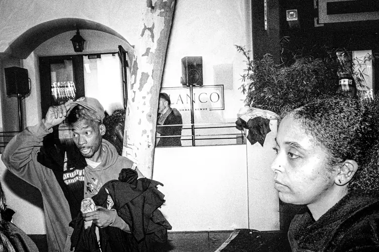

| Attribute                             | Value                                                      |
| :------------------------------------ | :--------------------------------------------------------- |
| **Framing & Aspect**                  | `LANDSCAPE` · `2048×1365` (Aspect: `1.50`)                 |
| **Tonality & Breath**                 | `L*=53.98` — **Neutral** (CIELAB: `53.98, 0, -0.01`)       |
| **Transition to #7 (DSCF0548-3.jpg)** | `ΔE₇₆: 27.33` (Color) · `ΔLum: 66` · **Step Cost: `24.4`** |

**Curatorial Rationale & Montage Dynamic**:

- _Pacing Role_: Act II: The Alienated Pair / The Blanco Disconnection
- _Visual Subject & Content_: Under stark flash at a night venue, a young man tips his cap with a direct performative gaze on the left while a woman in the right foreground stares past him into the middle distance, a third face framed through a rear window.
- _Thematic Meaning_: Side-by-side solitude: two bodies sharing one frame and zero emotional reality, the first visualization of the poem's landscape of muffled, privatized feeling.
- _Composition & Gaze Vectors_: Hard horizontal split between the animated left gesture and the stone-still right profile; the arched doorway frames a recessed third plane.
- _Transition Dynamic_: Bright neutral step (`L*=53.98`, ΔE: 27.33) plunging into the spectral halo portrait.

---

### [7/32] DSCF0548-3.jpg

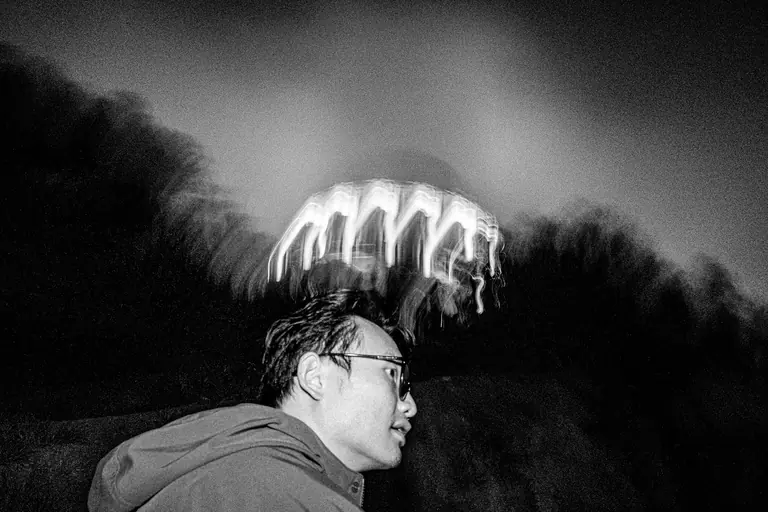

| Attribute                           | Value                                                      |
| :---------------------------------- | :--------------------------------------------------------- |
| **Framing & Aspect**                | `LANDSCAPE` · `2048×1365` (Aspect: `1.50`)                 |
| **Tonality & Breath**               | `L*=26.65` — **Exhalation** (CIELAB: `26.65, 0, 0`)        |
| **Transition to #8 (DSCF1741.jpg)** | `ΔE₇₆: 13.25` (Color) · `ΔLum: 31` · **Step Cost: `11.7`** |

**Curatorial Rationale & Montage Dynamic**:

- _Pacing Role_: Act II: The One-Dimensional Man / Halo of Static
- _Visual Subject & Content_: A man in glasses turns a rightward profile against pitch blackness, crowned by an ethereal looping arc of white light trails that hovers above his skull like a jellyfish or a burning thought.
- _Thematic Meaning_: Marcuse's one-dimensional man made literal: the electromagnetic crown of algorithmic noise whispering above the passive head, perfectly rhyming the caesura that follows about verifying spectral geometry while pretending detachment.
- _Composition & Gaze Vectors_: Rightward profile vector beneath a floating parabolic halo, suspended in total negative black space.
- _Transition Dynamic_: Deep exhalation (`L*=26.65`) leading across the '光譜的幾何結構' caesura into the double-exposed skyline.

> **[Poetic Caesura: Musical Rest]**
>
> _你通過觀察風的移動方向驗證光譜的幾何結構假裝保持疏離_
> _你操縱食指快速滑動手機屏幕_
> _使用西班牙語表達嘲笑_

---

### [8/32] DSCF1741.jpg

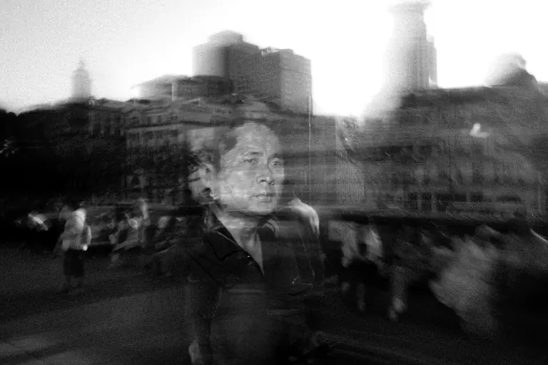

| Attribute                           | Value                                                 |
| :---------------------------------- | :---------------------------------------------------- |
| **Framing & Aspect**                | `LANDSCAPE` · `2048×1365` (Aspect: `1.50`)            |
| **Tonality & Breath**               | `L*=39.9` — **Neutral** (CIELAB: `39.9, 0, -0.01`)    |
| **Transition to #9 (DSCF7178.JPG)** | `ΔE₇₆: 3.33` (Color) · `ΔLum: 8` · **Step Cost: `3`** |

**Curatorial Rationale & Montage Dynamic**:

- _Pacing Role_: Act II: The Urban Palimpsest / Skyline Ghost
- _Visual Subject & Content_: A man's translucent face floats superimposed over a blurred historic waterfront skyline, ghost pedestrians passing through his body in a slow-shutter double exposure.
- _Thematic Meaning_: The citizen as palimpsest: identity overwritten by the city image, the private face dissolved into the monumental facade — the 'loss of depth of field' given visual form.
- _Composition & Gaze Vectors_: Diffuse skyline horizontals pierced by the forward-staring spectral face at center, motion streaks dragging the periphery.
- _Transition Dynamic_: Neutral luminance (`L*=39.9`) settling into the hard geometry of the marble corner.

---

### [9/32] DSCF7178.JPG

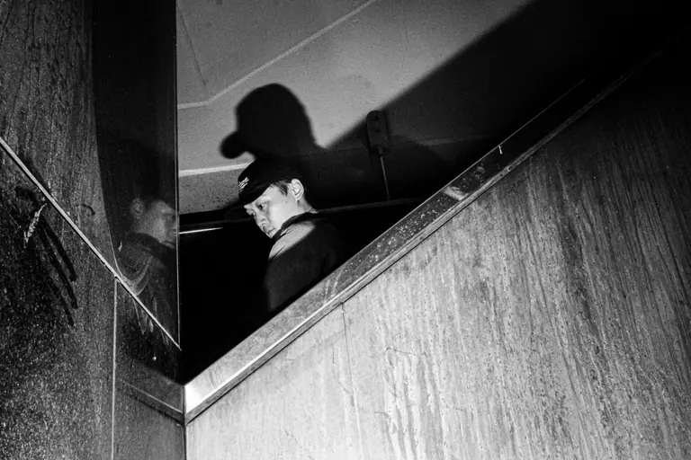

| Attribute                            | Value                                                      |
| :----------------------------------- | :--------------------------------------------------------- |
| **Framing & Aspect**                 | `LANDSCAPE` · `2048×1365` (Aspect: `1.50`)                 |
| **Tonality & Breath**                | `L*=36.57` — **Neutral** (CIELAB: `36.57, 0, 0`)           |
| **Transition to #10 (DSCF1664.jpg)** | `ΔE₇₆: 33.78` (Color) · `ΔLum: 86` · **Step Cost: `30.8`** |

**Curatorial Rationale & Montage Dynamic**:

- _Pacing Role_: Act II: The Surveillance Alcove / The Mirrored Descent
- _Visual Subject & Content_: A man in a cap descends into a marble stairwell corner sliced by a harsh diagonal banister, his downcast face doubled in a dark glass reflection beneath a looming hat-shaped shadow on the ceiling.
- _Thematic Meaning_: The panoptic trap: marble, mirror, and shadow fold the subject into a loop of self-observation, the architecture itself performing the surveillance.
- _Composition & Gaze Vectors_: Aggressive diagonal rail from lower-left to upper-right framing the shadowed figure; the ceiling shadow echoes the cap as a second watcher.
- _Transition Dynamic_: Neutral step (`L*=36.57`) leading across the second Starlink caesura ('喉結的升降調整分貝') into the blinding whiteout.

> **[Poetic Caesura: Musical Rest]**
>
> _「可是，Starlink 的氣球在東南的方向爆炸了。」_
> _失去景深的男人通過喉結的升降調整分貝_

---

### [10/32] DSCF1664.jpg

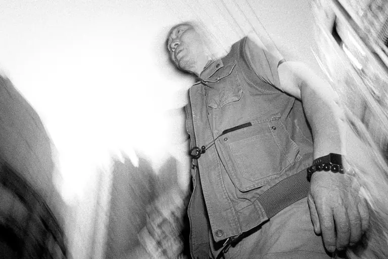

| Attribute                            | Value                                                      |
| :----------------------------------- | :--------------------------------------------------------- |
| **Framing & Aspect**                 | `LANDSCAPE` · `2048×1365` (Aspect: `1.50`)                 |
| **Tonality & Breath**                | `L*=70.35` — **Inhalation** (CIELAB: `70.35, 0, -0.01`)    |
| **Transition to #11 (DSCF8998.JPG)** | `ΔE₇₆: 25.53` (Color) · `ΔLum: 66` · **Step Cost: `23.4`** |

**Curatorial Rationale & Montage Dynamic**:

- _Pacing Role_: Act II: The Whiteout / Cowboy in the Flash Storm
- _Visual Subject & Content_: A man in a western denim vest with a beaded bracelet is engulfed by a tidal wave of overexposed motion-blurred light, his face tilted back, half-erased by the luminance surge.
- _Thematic Meaning_: The first great inhalation of the essay: the individual swallowed by pure technological luminance, the mythic frontier figure of the vest dissolved inside the electronic cloud.
- _Composition & Gaze Vectors_: Vertical body column standing against a diagonal avalanche of white streaks pouring from the upper frame.
- _Transition Dynamic_: Inhalation crest (`L*=70.35`, ΔE: 25.53) descending into the noir threshold of the bronze gate.

---

### [11/32] DSCF8998.JPG

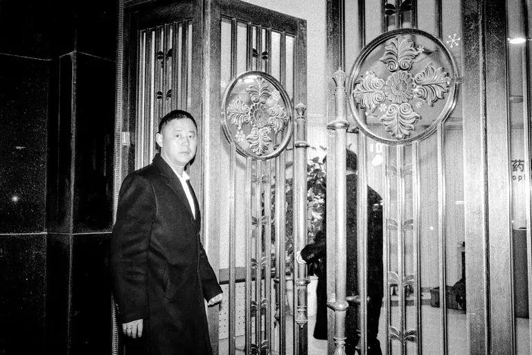

| Attribute                            | Value                                                    |
| :----------------------------------- | :------------------------------------------------------- |
| **Framing & Aspect**                 | `LANDSCAPE` · `2048×1365` (Aspect: `1.50`)               |
| **Tonality & Breath**                | `L*=44.82` — **Neutral** (CIELAB: `44.82, 0, -0.01`)     |
| **Transition to #12 (DSCF0175.jpg)** | `ΔE₇₆: 8.67` (Color) · `ΔLum: 21` · **Step Cost: `7.8`** |

**Curatorial Rationale & Montage Dynamic**:

- _Pacing Role_: Act II: The Citadel Threshold / The Revolving Bronze
- _Visual Subject & Content_: A stern man in a black wool coat glances back over his shoulder beside an ornate art-deco bronze gate, its circular floral medallions and rigid vertical bars gleaming under flash.
- _Thematic Meaning_: The gatekeeper of the hypermassive order: institutional filigree and impenetrable glass separating the technocratic interior from the street, the backward glance measuring who may pass.
- _Composition & Gaze Vectors_: Rigid vertical bar grid and twin circular medallions framing the upright body; the over-shoulder gaze cuts back against the entry vector.
- _Transition Dynamic_: Neutral bridge (`L*=44.82`) leading across the AirPods caesura ('眼皮毛細血管的顏色') into the particle snow.

> **[Poetic Caesura: Musical Rest]**
>
> _你將 AirPods 插進肺中緊閉雙眼_
> _觀察眼皮毛細血管的顏色假裝獲得一種感受_

---

### [12/32] DSCF0175.jpg

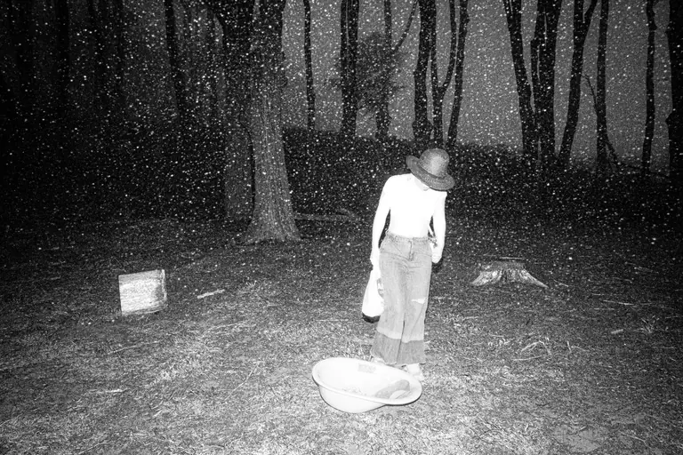

| Attribute                            | Value                                                      |
| :----------------------------------- | :--------------------------------------------------------- |
| **Framing & Aspect**                 | `LANDSCAPE` · `2048×1365` (Aspect: `1.50`)                 |
| **Tonality & Breath**                | `L*=36.15` — **Neutral** (CIELAB: `36.15, 0, 0`)           |
| **Transition to #13 (DSCF0617.jpg)** | `ΔE₇₆: 24.39` (Color) · `ΔLum: 54` · **Step Cost: `21.1`** |

**Curatorial Rationale & Montage Dynamic**:

- _Pacing Role_: Act III: The Fallout / Child in the Particle Snow
- _Visual Subject & Content_: In a dark forest clearing, a small figure in a wide-brimmed hat stands with its back to the camera over an empty basin, while dense white particles hang in the flash-lit air like radioactive snowfall among black tree trunks.
- _Thematic Meaning_: The quiet threshold of catastrophe: an archaic vessel and a child-like body standing defenseless beneath the falling debris of the sky, the PM2.5 of the poem made visible as cosmic snow.
- _Composition & Gaze Vectors_: Vertical tree trunks and downward-drifting specks converging on the centered, back-turned figure; the empty basin anchors the lower frame.
- _Transition Dynamic_: Neutral step (`L*=36.15`, ΔE: 24.39) dropping into the darkest frame of the essay, the calavera.

---

### [13/32] DSCF0617.jpg

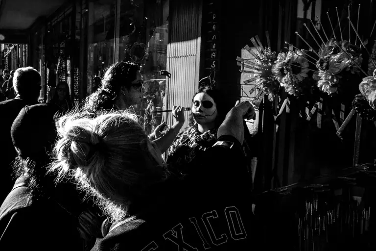

| Attribute                            | Value                                                    |
| :----------------------------------- | :------------------------------------------------------- |
| **Framing & Aspect**                 | `LANDSCAPE` · `2048×1365` (Aspect: `1.50`)               |
| **Tonality & Breath**                | `L*=11.76` — **Exhalation** (CIELAB: `11.76, 0, 0`)      |
| **Transition to #14 (DSCF0324.jpg)** | `ΔE₇₆: 50.7` (Color) · `ΔLum: 120` · **Step Cost: `45`** |

**Curatorial Rationale & Montage Dynamic**:

- _Pacing Role_: Act III: The Shaman Mask / The Calavera
- _Visual Subject & Content_: In deep chiaroscuro, a young woman with half-painted sugar-skull makeup holds still amid floral headdresses and spiked ornaments, spectators reduced to black silhouettes in the foreground, the word 'MEXICO' glinting from a jacket.
- _Thematic Meaning_: The ritual invocation of mortality at the bottom of the tonal curve: the ancestral skull mask summoned as resistance exactly before the shaman caesura and the detonation — death worn on the living face.
- _Composition & Gaze Vectors_: Rim-lit profile and painted eye socket glowing at center-right, ringed by the radial spikes of the headdress; foreground heads mass into black vignette.
- _Transition Dynamic_: Absolute exhalation floor (`L*=11.76`) erupting across the shaman/blood caesura into the total light abstraction (cost 45, the essay's maximum shock).

> **[Poetic Caesura: Musical Rest]**
>
> _你聽見薩滿女巫的歌聲穿透超巨型計算集群的電流噪音將天空染成紅色_
> _滾燙的鋼鐵碎片劃破沒落族裔的面龐血流成河_

---

### [14/32] DSCF0324.jpg

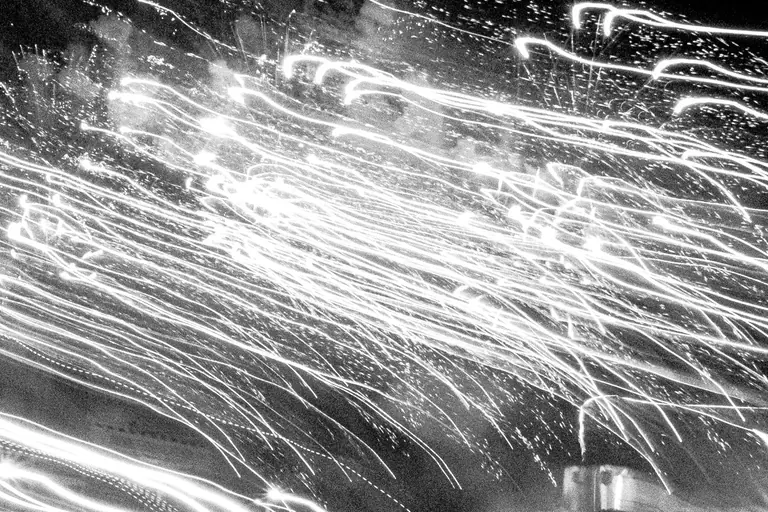

| Attribute                              | Value                                                      |
| :------------------------------------- | :--------------------------------------------------------- |
| **Framing & Aspect**                   | `LANDSCAPE` · `2048×1365` (Aspect: `1.50`)                 |
| **Tonality & Breath**                  | `L*=62.46` — **Inhalation** (CIELAB: `62.46, 0, -0.01`)    |
| **Transition to #15 (DSCF0658-3.jpg)** | `ΔE₇₆: 32.74` (Color) · `ΔLum: 81` · **Step Cost: `29.5`** |

**Curatorial Rationale & Montage Dynamic**:

- _Pacing Role_: Act III: The Detonation / Starlink Abstraction
- _Visual Subject & Content_: Pure kinetic abstraction: hundreds of white light trails and spark filaments tear diagonally across the entire black frame, an explosion with no ground, no figure, no horizon.
- _Thematic Meaning_: The Starlink balloon exploding — the poem's central event rendered as pure energy. The sky itself is pulverized into PM2.5; for one frame the human world disappears entirely.
- _Composition & Gaze Vectors_: Dense diagonal light ribbons roaring from lower-left to upper-right, total field composition with no resting point.
- _Transition Dynamic_: Inhalation detonation (`L*=62.46`, ΔE: 32.74) collapsing back onto the human casualty of the sling.

---

### [15/32] DSCF0658-3.jpg

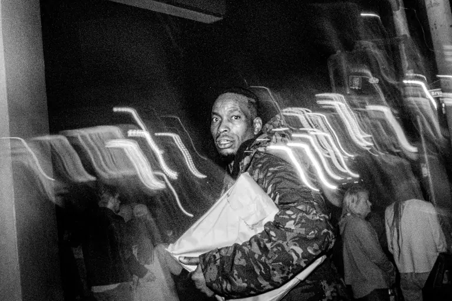

| Attribute                              | Value                                                    |
| :------------------------------------- | :------------------------------------------------------- |
| **Framing & Aspect**                   | `LANDSCAPE` · `2048×1365` (Aspect: `1.50`)               |
| **Tonality & Breath**                  | `L*=29.72` — **Exhalation** (CIELAB: `29.72, 0, 0`)      |
| **Transition to #16 (DSCF0297-3.jpg)** | `ΔE₇₆: 17.92` (Color) · `ΔLum: 43` · **Step Cost: `16`** |

**Curatorial Rationale & Montage Dynamic**:

- _Pacing Role_: Act III: The Casualty / The Sling in the Streaks
- _Visual Subject & Content_: A man with his arm in a white sling stares directly into the flash with wide alarmed eyes, camouflage jacket half-wrapped in swirling ribbons of street light, ghost pedestrians passing behind him.
- _Thematic Meaning_: The first wounded survivor after the blast: the injured body re-emerging from the abstraction, carrying the shock of the explosion back into the human register.
- _Composition & Gaze Vectors_: Direct frontal gaze anchoring center while serpentine light trails whip horizontally around the torso.
- _Transition Dynamic_: Low exhalation (`L*=29.72`) leading across the Union Square caesura ('動物們在 Market Street 奔走相告') into the screen mob.

> **[Poetic Caesura: Musical Rest]**
>
> _「嘿，你知道嗎？Starlink 的氣球在聯合廣場的上空爆炸了！」_
> _動物們在 Market Street 奔走相告_

---

### [16/32] DSCF0297-3.jpg

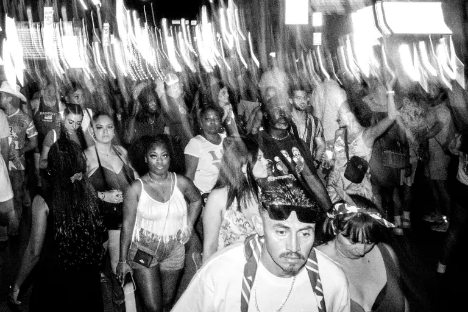

| Attribute                            | Value                                                 |
| :----------------------------------- | :---------------------------------------------------- |
| **Framing & Aspect**                 | `LANDSCAPE` · `2048×1365` (Aspect: `1.50`)            |
| **Tonality & Breath**                | `L*=47.64` — **Neutral** (CIELAB: `47.64, 0, -0.01`)  |
| **Transition to #17 (DSCF1119.jpg)** | `ΔE₇₆: 11` (Color) · `ΔLum: 28` · **Step Cost: `10`** |

**Curatorial Rationale & Montage Dynamic**:

- _Pacing Role_: Act IV: The Screen Mob / Market Street Stampede
- _Visual Subject & Content_: A packed nocturnal crowd under flash: a foreground man with sunglasses and suspenders grimaces downward while behind him faces, phones, and raised arms pile up beneath light dripping from the ceiling like static rain.
- _Thematic Meaning_: The animals of Market Street: the crowd as a single mediated organism, experience replaced by screens and performative grimace, the CNBC stomping ground given faces.
- _Composition & Gaze Vectors_: Layered depth stack of bodies receding upward; the foreground grimace anchors the bottom third against the dripping vertical light.
- _Transition Dynamic_: Neutral bridge (`L*=47.64`) rising into the headlight gauntlet.

---

### [17/32] DSCF1119.jpg

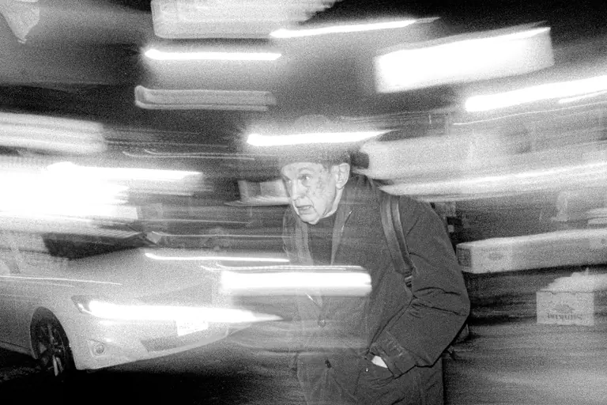

| Attribute                              | Value                                                      |
| :------------------------------------- | :--------------------------------------------------------- |
| **Framing & Aspect**                   | `LANDSCAPE` · `2048×1365` (Aspect: `1.50`)                 |
| **Tonality & Breath**                  | `L*=58.64` — **Inhalation** (CIELAB: `58.64, 0, -0.01`)    |
| **Transition to #18 (DSCF7202-2.JPG)** | `ΔE₇₆: 24.61` (Color) · `ΔLum: 61` · **Step Cost: `22.2`** |

**Curatorial Rationale & Montage Dynamic**:

- _Pacing Role_: Act IV: The Headlight Gauntlet / Washed by the Machine
- _Visual Subject & Content_: An older man in a flat cap crosses a dark street completely submerged in horizontal bands of blinding headlight streaks, his face floating half-erased above the ghost of a white sedan.
- _Thematic Meaning_: The solitary body walking through the computational torrent: traffic light washes over him with the cold indifference of the server cluster, the individual rendered translucent by machine velocity.
- _Composition & Gaze Vectors_: Dominant horizontal white bands slashing edge to edge, bisected by the downward-tilted head at center-right.
- _Transition Dynamic_: Inhalation crest (`L*=58.64`) leading across the giant-frog caesura ('CNBC...踩踏') into the feral joy of the child.

> **[Poetic Caesura: Musical Rest]**
>
> _你看見巨大的青蛙沿著電車的軌道奮力跳躍_
> _在 CNBC 激昂的議論與批判中對同伴發動踩踏_

---

### [18/32] DSCF7202-2.JPG

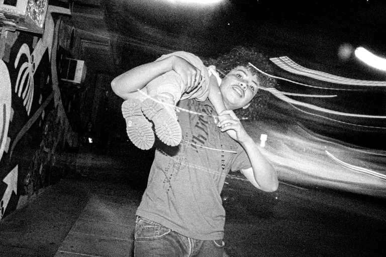

| Attribute                              | Value                                                   |
| :------------------------------------- | :------------------------------------------------------ |
| **Framing & Aspect**                   | `LANDSCAPE` · `2048×1365` (Aspect: `1.50`)              |
| **Tonality & Breath**                  | `L*=34.03` — **Neutral** (CIELAB: `34.03, 0, 0`)        |
| **Transition to #19 (DSCF7027-6.JPG)** | `ΔE₇₆: 13.7` (Color) · `ΔLum: 31` · **Step Cost: `12`** |

**Curatorial Rationale & Montage Dynamic**:

- _Pacing Role_: Act IV: Feral Vitality / The Child on Shoulders
- _Visual Subject & Content_: A young man carries a small child upside-down over his shoulder on a graffiti-lined night sidewalk, both grinning with wild delight as white light streamers pour past them.
- _Thematic Meaning_: The rupture of organic joy inside the dystopia: kinship and play proving invincible against the electronic gloom, the emotional counterweight to the surrounding alienation.
- _Composition & Gaze Vectors_: Vertical carrier and inverted child legs forming a living cross, sliced by horizontal light trails streaming right.
- _Transition Dynamic_: Neutral bridge (`L*=34.03`, ΔE: 13.7) stepping into the phone-lit dance circle.

---

### [19/32] DSCF7027-6.JPG

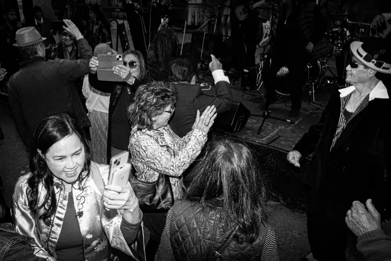

| Attribute                              | Value                                                     |
| :------------------------------------- | :-------------------------------------------------------- |
| **Framing & Aspect**                   | `LANDSCAPE` · `2048×1365` (Aspect: `1.50`)                |
| **Tonality & Breath**                  | `L*=20.33` — **Exhalation** (CIELAB: `20.33, 0, 0`)       |
| **Transition to #20 (DSCF3362-3.jpg)** | `ΔE₇₆: 10.28` (Color) · `ΔLum: 23` · **Step Cost: `8.9`** |

**Curatorial Rationale & Montage Dynamic**:

- _Pacing Role_: Act IV: The Ecstatic Panopticon / Phones at the Concert
- _Visual Subject & Content_: A street concert crowd seen from above: a woman in the foreground grimaces at her own iPhone screen while arms around her raise glowing phones toward the stage, a suited man in a striped hat performing at the edge.
- _Thematic Meaning_: Celebration already converted into content: the communal dance filmed rather than felt, the exact behavioral rhyme of the iPhone caesura that follows ('送進口袋觀察環境假裝鎮定').
- _Composition & Gaze Vectors_: Radial cluster of raised arms and glowing rectangles orbiting the central foreground face; the performer's profile closes the right edge.
- _Transition Dynamic_: Deep exhalation (`L*=20.33`) leading across the iPhone caesura into the solitary cyclist.

> **[Poetic Caesura: Musical Rest]**
>
> _你將 iPhone 送進口袋觀察環境假裝鎮定_
> _顫動著舌根使用西班牙語表達諷刺_

---

### [20/32] DSCF3362-3.jpg

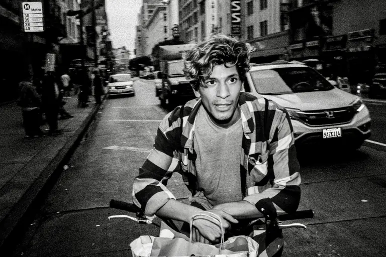

| Attribute                              | Value                                                      |
| :------------------------------------- | :--------------------------------------------------------- |
| **Framing & Aspect**                   | `LANDSCAPE` · `2048×1365` (Aspect: `1.50`)                 |
| **Tonality & Breath**                  | `L*=30.53` — **Exhalation** (CIELAB: `30.53, -0.43, 1.19`) |
| **Transition to #21 (DSCF8873-3.JPG)** | `ΔE₇₆: 4.12` (Color) · `ΔLum: 9` · **Step Cost: `3.6`**    |

**Curatorial Rationale & Montage Dynamic**:

- _Pacing Role_: Act IV: The Solitary Witness / Cyclist on the Grid
- _Visual Subject & Content_: A young man with curly hair leans motionless over his bicycle handlebars on a downtown avenue, staring unblinkingly into the lens, a paper bag on the bars, buses and a Metro sign dissolving behind him.
- _Thematic Meaning_: The humanist anchor of the fourth movement: one vulnerable, unwavering gaze holding individual consciousness steady amid the acceleration of the grid.
- _Composition & Gaze Vectors_: Triangular elbow-and-handlebar base anchoring the foreground, street perspective rushing to a central vanishing point behind the stare.
- _Transition Dynamic_: Low exhalation (`L*=30.53`, ΔE: 4.12) gliding into the cigarette ember beneath the billboards.

---

### [21/32] DSCF8873-3.JPG

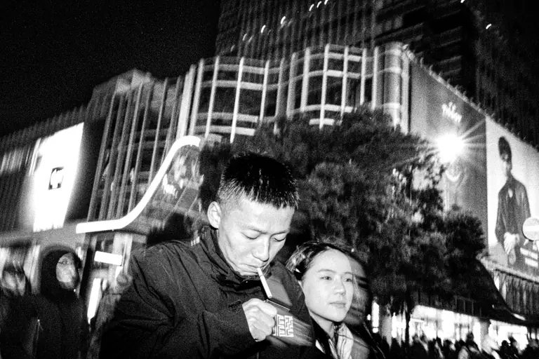

| Attribute                            | Value                                                    |
| :----------------------------------- | :------------------------------------------------------- |
| **Framing & Aspect**                 | `LANDSCAPE` · `2048×1365` (Aspect: `1.50`)               |
| **Tonality & Breath**                | `L*=34.45` — **Neutral** (CIELAB: `34.45, 0, 0`)         |
| **Transition to #22 (DSCF5378.jpg)** | `ΔE₇₆: 20.74` (Color) · `ΔLum: 46` · **Step Cost: `18`** |

**Curatorial Rationale & Montage Dynamic**:

- _Pacing Role_: Act IV: The Corporate Monolith / The Cigarette Ember
- _Visual Subject & Content_: Beneath a looming glass tower and colossal glowing fashion billboards, a young man bends to light a cigarette, a woman leaning close beside him, light trails arcing through the commercial night.
- _Thematic Meaning_: Intimacy at the foot of the monument: two mortals sharing a small flame directly under the giant illuminated promises of luxury — the quiet setup for the Salesforce Tower volta that follows.
- _Composition & Gaze Vectors_: Monumental vertical facade and billboard diagonals towering over the intimate downward arc of the lighting gesture.
- _Transition Dynamic_: Neutral step (`L*=34.45`) leading across the Salesforce Tower volta caesura ('一個時代的死亡') into the spectral void.

> **[Poetic Caesura: Musical Rest]**
>
> _你嘗試登上 Salesforce Tower 魷魚般光滑的塔尖向天空舞動雙拳_
> _卻在海灣大橋白得發黑的倒影裡瞥見一個時代的死亡_

---

### [22/32] DSCF5378.jpg

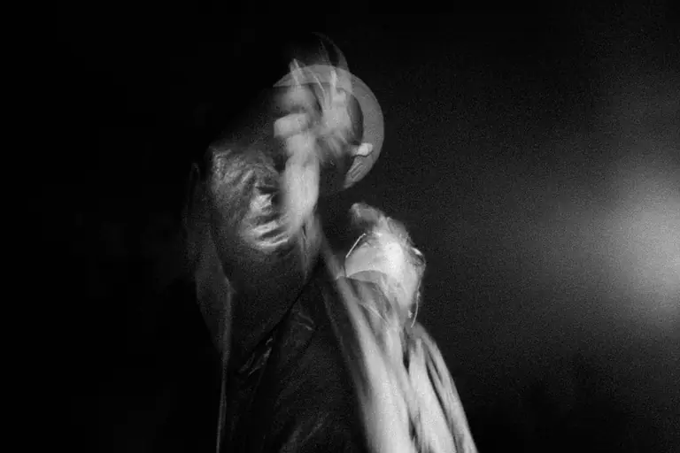

| Attribute                            | Value                                                       |
| :----------------------------------- | :---------------------------------------------------------- |
| **Framing & Aspect**                 | `LANDSCAPE` · `2048×1365` (Aspect: `1.50`)                  |
| **Tonality & Breath**                | `L*=13.71` — **Exhalation** (CIELAB: `13.71, 0, 0`)         |
| **Transition to #23 (DSCF1924.jpg)** | `ΔE₇₆: 45.69` (Color) · `ΔLum: 108` · **Step Cost: `40.5`** |

**Curatorial Rationale & Montage Dynamic**:

- _Pacing Role_: Act V: The Death of the Era / The Phantom Shift
- _Visual Subject & Content_: Near-total blackness: a ghostly double-exposed face and turning body barely surface from the void, features smeared into smoke, one faint lamp glowing at the right edge.
- _Thematic Meaning_: The volta made visible: the death of an era as the dematerialization of the body itself, the human form dissolving into pure kinetic after-image at the bottom of the essay's second great tonal abyss.
- _Composition & Gaze Vectors_: A twisted ascending motion spiral rising out of the lower-left dark toward the single diffuse glow at right.
- _Transition Dynamic_: Abyssal exhalation (`L*=13.71`) erupting (cost 40.5, the essay's second maximum shock) into the haunted crossing.

---

### [23/32] DSCF1924.jpg

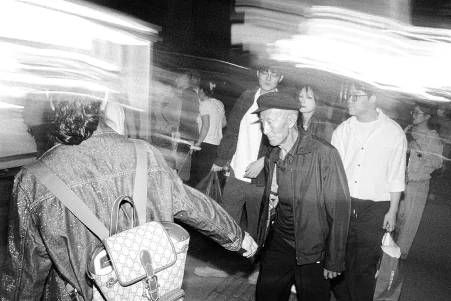

| Attribute                            | Value                                                    |
| :----------------------------------- | :------------------------------------------------------- |
| **Framing & Aspect**                 | `LANDSCAPE` · `2048×1365` (Aspect: `1.50`)               |
| **Tonality & Breath**                | `L*=59.4` — **Inhalation** (CIELAB: `59.4, 0, -0.01`)    |
| **Transition to #24 (DSCF2057.JPG)** | `ΔE₇₆: 7.78` (Color) · `ΔLum: 20` · **Step Cost: `7.1`** |

**Curatorial Rationale & Montage Dynamic**:

- _Pacing Role_: Act V: The Haunted Crossing / Ghosts of the Crowd
- _Visual Subject & Content_: An old man in a cap crosses a night street in sharp flash focus while the crowd around him — a denim jacket with a white monogram backpack, faces in mid-stride — streaks into translucent ghosts beneath rivers of light.
- _Thematic Meaning_: The survivor walking among phantoms: one lucid body inside a crowd already half-uploaded into motion blur, the living and the dissolved sharing one crosswalk.
- _Composition & Gaze Vectors_: Leftward walking vector of the sharp central figure against rightward-streaming ghost trails; the turned back of the foreground figure closes the left edge.
- _Transition Dynamic_: Inhalation crest (`L*=59.4`) leading across the '我們發明了幸福' caesura into the manufactured euphoria.

> **[Poetic Caesura: Musical Rest]**
>
> _「我們發明了幸福。」_
> _失去景深的男人說，眨巴著眼_

---

### [24/32] DSCF2057.JPG

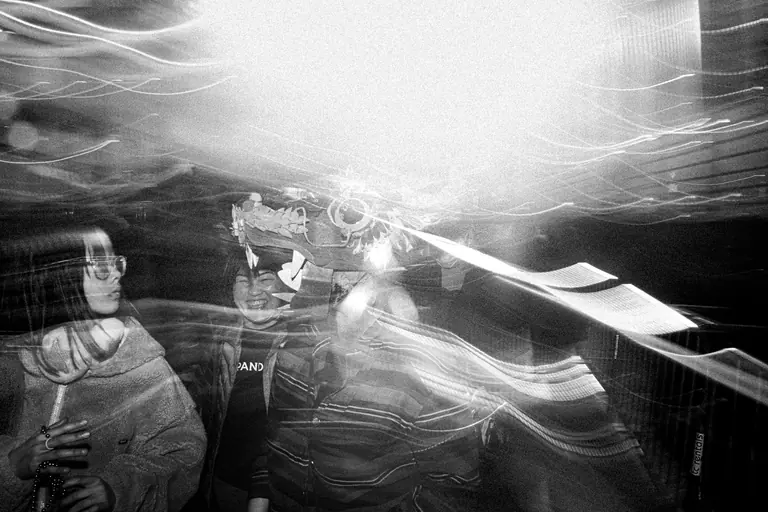

| Attribute                            | Value                                                      |
| :----------------------------------- | :--------------------------------------------------------- |
| **Framing & Aspect**                 | `LANDSCAPE` · `2048×1365` (Aspect: `1.50`)                 |
| **Tonality & Breath**                | `L*=51.62` — **Neutral** (CIELAB: `51.62, 0, -0.01`)       |
| **Transition to #25 (DSCF9277.jpg)** | `ΔE₇₆: 29.92` (Color) · `ΔLum: 71` · **Step Cost: `26.6`** |

**Curatorial Rationale & Montage Dynamic**:

- _Pacing Role_: Act V: Manufactured Happiness / The White Blast
- _Visual Subject & Content_: Two young women grin beneath an enormous detonation of white light that floods the upper frame, serpentine trails pouring over them, one clutching a drink, the other half-erased by the glare.
- _Thematic Meaning_: The punchline of the volta: 'we invented happiness' rendered as a blinding spectacle the subjects both enjoy and are consumed by — euphoria as overexposure.
- _Composition & Gaze Vectors_: Massive overhead luminance mass pressing down on the two upturned faces; horizontal light rivers binding the edges.
- _Transition Dynamic_: High neutral plateau (`L*=51.62`, ΔE: 29.92) dropping into the centrifugal departure.

---

### [25/32] DSCF9277.jpg

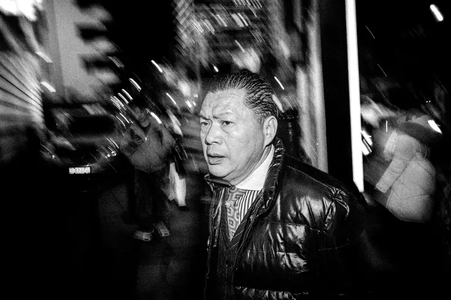

| Attribute                              | Value                                                    |
| :------------------------------------- | :------------------------------------------------------- |
| **Framing & Aspect**                   | `LANDSCAPE` · `2048×1365` (Aspect: `1.50`)               |
| **Tonality & Breath**                  | `L*=21.7` — **Exhalation** (CIELAB: `21.7, 0, 0`)        |
| **Transition to #26 (DSCF2964-6.jpg)** | `ΔE₇₆: 9.33` (Color) · `ΔLum: 21` · **Step Cost: `8.1`** |

**Curatorial Rationale & Montage Dynamic**:

- _Pacing Role_: Act V: The Centrifugal Departure / Sucked into the Singularity
- _Visual Subject & Content_: A man with slicked-back hair in a shiny puffer jacket strides forward with a stunned expression while radial zoom-burst streaks suck the entire street backward into the black periphery around him.
- _Thematic Meaning_: The title made literal: the traveler sucked into the hypermassive, the city collapsing into gravitational streaks around one accelerating body.
- _Composition & Gaze Vectors_: Centrifugal radial burst lines exploding outward from behind the head, focusing all gravity onto the striding face.
- _Transition Dynamic_: Deep exhalation (`L*=21.7`) leading across the C-ray/Orion caesura into the umbrella walkers.

> **[Poetic Caesura: Musical Rest]**
>
> _你凝視 Starlink 氣球的碎片閃爍著 C 射線_
> _從獵戶星座的方向高速地通過_
> _巨大的青蛙吸附著 Salesforce Tower 冰冷的曲面_
> _在劇烈的痙攣與震顫中將坐標系剝落_

---

### [26/32] DSCF2964-6.jpg

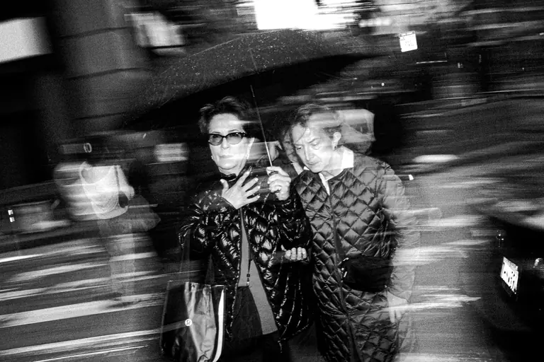

| Attribute                              | Value                                                      |
| :------------------------------------- | :--------------------------------------------------------- |
| **Framing & Aspect**                   | `LANDSCAPE` · `2048×1365` (Aspect: `1.50`)                 |
| **Tonality & Breath**                  | `L*=31.03` — **Exhalation** (CIELAB: `31.03, 0, 0`)        |
| **Transition to #27 (DSCF9004-6.JPG)** | `ΔE₇₆: 22.56` (Color) · `ΔLum: 55` · **Step Cost: `20.2`** |

**Curatorial Rationale & Montage Dynamic**:

- _Pacing Role_: Act V: Earthly Solidarity / The Umbrella Walkers
- _Visual Subject & Content_: Two women in quilted coats share one black umbrella on a wet night street, leaning into each other as pan blur liquefies the cars and streetlights around them.
- _Thematic Meaning_: Companionship as the last shelter: beneath the cosmic debris of the poem, two bodies refuse dissolution by simply holding on to one another.
- _Composition & Gaze Vectors_: Protective dome arc of the umbrella over the paired figures, horizontal wet-street streaks streaming past on both sides.
- _Transition Dynamic_: Low exhalation (`L*=31.03`) stepping up into the lost voyager in the data slipstream.

---

### [27/32] DSCF9004-6.JPG

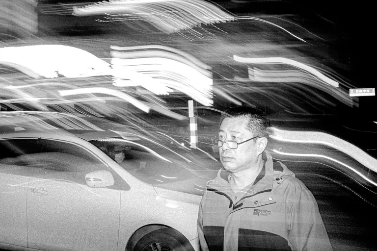

| Attribute                              | Value                                                   |
| :------------------------------------- | :------------------------------------------------------ |
| **Framing & Aspect**                   | `LANDSCAPE` · `2048×1365` (Aspect: `1.50`)              |
| **Tonality & Breath**                  | `L*=53.59` — **Neutral** (CIELAB: `53.59, 0, -0.01`)    |
| **Transition to #28 (DSCF1906-2.jpg)** | `ΔE₇₆: 0.79` (Color) · `ΔLum: 2` · **Step Cost: `0.7`** |

**Curatorial Rationale & Montage Dynamic**:

- _Pacing Role_: Act V: The Lost Voyager / Stream of Data
- _Visual Subject & Content_: A middle-aged man in wire-rimmed glasses and a windbreaker stands beside a white sedan while an entire sky of parabolic white light ribbons rushes over and around his calm, searching face.
- _Thematic Meaning_: The voyager inside the electronic cloud: unmoved, quietly introspective, having already released his illusions as the data slipstream pours past.
- _Composition & Gaze Vectors_: Sweeping parabolic light ribbons wrapping the frame, the static head holding center-right as the still point.
- _Transition Dynamic_: Neutral bridge (`L*=53.59`) leading across the '嚴肅被消解' thesis caesura into the dissolved laughter.

> **[Poetic Caesura: Musical Rest]**
>
> _你看見嚴肅被消解_
> _理性被建構_
> _話語場被重塑_
> _工具被普遍適用_

---

### [28/32] DSCF1906-2.jpg

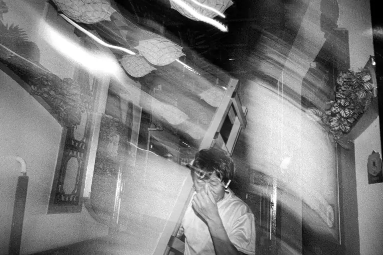

| Attribute                            | Value                                                    |
| :----------------------------------- | :------------------------------------------------------- |
| **Framing & Aspect**                 | `LANDSCAPE` · `2048×1365` (Aspect: `1.50`)               |
| **Tonality & Breath**                | `L*=52.8` — **Neutral** (CIELAB: `52.8, 0, -0.01`)       |
| **Transition to #29 (DSCF0245.jpg)** | `ΔE₇₆: 6.77` (Color) · `ΔLum: 17` · **Step Cost: `6.1`** |

**Curatorial Rationale & Montage Dynamic**:

- _Pacing Role_: Act V: Seriousness Dissolved / The Laughing Man
- _Visual Subject & Content_: A man in glasses doubles over laughing into his own hand inside a blurred interior, chandelier light and ceiling ornaments smeared into soft streaks above him.
- _Thematic Meaning_: The embodiment of the thesis caesura: solemnity dissolved into helpless laughter, the only honest response left inside the rebuilt discourse field.
- _Composition & Gaze Vectors_: Curled forward body arc at lower-center beneath the sweeping overhead light smear; the covered mouth hides the punchline.
- _Transition Dynamic_: Neutral step (`L*=52.8`) rising into the monumental trumpet angel.

---

### [29/32] DSCF0245.jpg

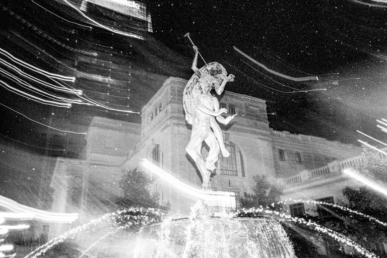

| Attribute                              | Value                                                    |
| :------------------------------------- | :------------------------------------------------------- |
| **Framing & Aspect**                   | `LANDSCAPE` · `2048×1365` (Aspect: `1.50`)               |
| **Tonality & Breath**                  | `L*=46.03` — **Neutral** (CIELAB: `46.03, 0, -0.01`)     |
| **Transition to #30 (DSCF1916-2.jpg)** | `ΔE₇₆: 5.19` (Color) · `ΔLum: 13` · **Step Cost: `4.7`** |

**Curatorial Rationale & Montage Dynamic**:

- _Pacing Role_: Act V: Angelus Novus Recapitulated / The Trumpet in the Data Storm
- _Visual Subject & Content_: A classical stone angel blows a trumpet atop a monumental fountain before a grand civic building, while violent horizontal light trails and falling particles tear the night sky around the statue.
- _Thematic Meaning_: The Benjamin rhyme returns as architecture: the Angel of History cast in corporate stone, heralding the conversion of culture into monument and data, the sequence's urban monumentalism at its peak.
- _Composition & Gaze Vectors_: Vertical statue and fountain jet bisecting the frame, intersected by aggressive horizontal light streaks rushing across the facade.
- _Transition Dynamic_: Neutral anchor (`L*=46.03`) leading across the '不存在的地平線' caesura into the secular saints.

> **[Poetic Caesura: Musical Rest]**
>
> _你站立在 Salesforce Tower 魷魚般光滑的塔尖假裝看向左邊_
> _假裝眺望不存在的地平線_

---

### [30/32] DSCF1916-2.jpg

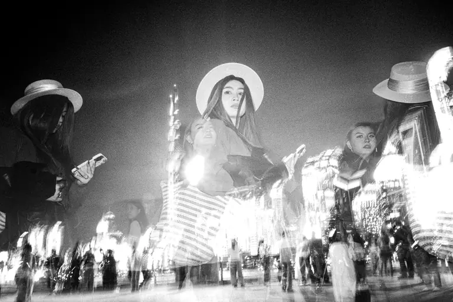

| Attribute                              | Value                                                   |
| :------------------------------------- | :------------------------------------------------------ |
| **Framing & Aspect**                   | `LANDSCAPE` · `2048×1365` (Aspect: `1.50`)              |
| **Tonality & Breath**                  | `L*=51.22` — **Neutral** (CIELAB: `51.22, 0, -0.01`)    |
| **Transition to #31 (DSCF0332_2.jpg)** | `ΔE₇₆: 2.76` (Color) · `ΔLum: 7` · **Step Cost: `2.5`** |

**Curatorial Rationale & Montage Dynamic**:

- _Pacing Role_: Act V: The Secular Saints / Halos on the Horizon
- _Visual Subject & Content_: Women in wide-brimmed festival hats move through a flash-lit night crowd, one face ringed by a perfect circular halo of a white hat brim, phone glow and blurred bodies streaming between them.
- _Thematic Meaning_: Beatification by millinery and flash: ordinary revelers elevated into icons on the non-existent horizon, the human image persisting as secular religious painting.
- _Composition & Gaze Vectors_: Scattered figure cluster across the mid-band, the central halo-disc pulling the eye; foreground phone hand intrudes from the left edge.
- _Transition Dynamic_: Neutral step (`L*=51.22`) gliding into the stunned witness of the spark shower.

---

### [31/32] DSCF0332_2.jpg

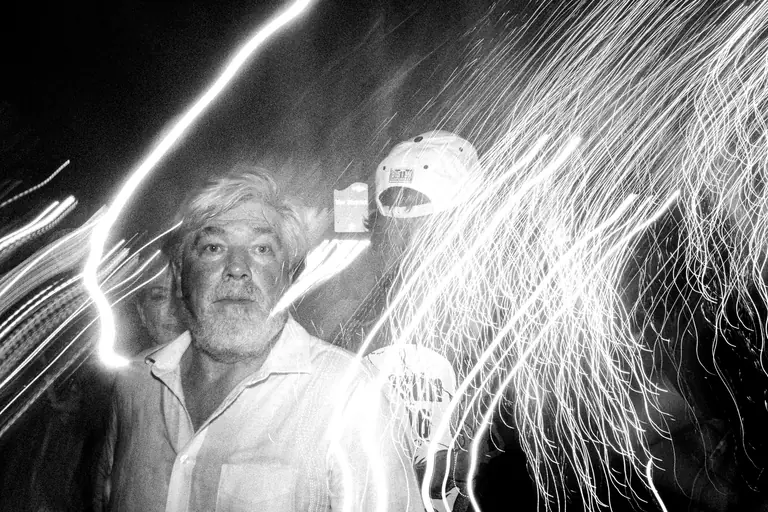

| Attribute                              | Value                                                    |
| :------------------------------------- | :------------------------------------------------------- |
| **Framing & Aspect**                   | `LANDSCAPE` · `2048×1365` (Aspect: `1.50`)               |
| **Tonality & Breath**                  | `L*=53.98` — **Neutral** (CIELAB: `53.98, 0, -0.01`)     |
| **Transition to #32 (DSCF0167-2.jpg)** | `ΔE₇₆: 7.95` (Color) · `ΔLum: 20` · **Step Cost: `7.2`** |

**Curatorial Rationale & Montage Dynamic**:

- _Pacing Role_: Act V: The Stunned Witness / The Spark Shower
- _Visual Subject & Content_: An older man with tousled pale hair stares upward and outward with wide startled eyes as a dense shower of white spark filaments rains across the frame, a floating cap and light ribbons suspended around him.
- _Thematic Meaning_: The final human: the witness fully awakened beneath the electronic cloud, receiving the falling fire of the city with neither ideal nor defense — the last face before the cosmos.
- _Composition & Gaze Vectors_: Forward-upward gaze vector holding center-left while chaotic spark rain whips across the right two-thirds.
- _Transition Dynamic_: Neutral bridge (`L*=53.98`) leading across the final meditative caesura ('你失去所有理想') into the stellar coda.

> **[Poetic Caesura: Musical Rest]**
>
> _在耀眼的電子雲層下_
> _你失去所有理想_
> _也不再記得她頭髮的香味_

---

### [32/32] DSCF0167-2.jpg

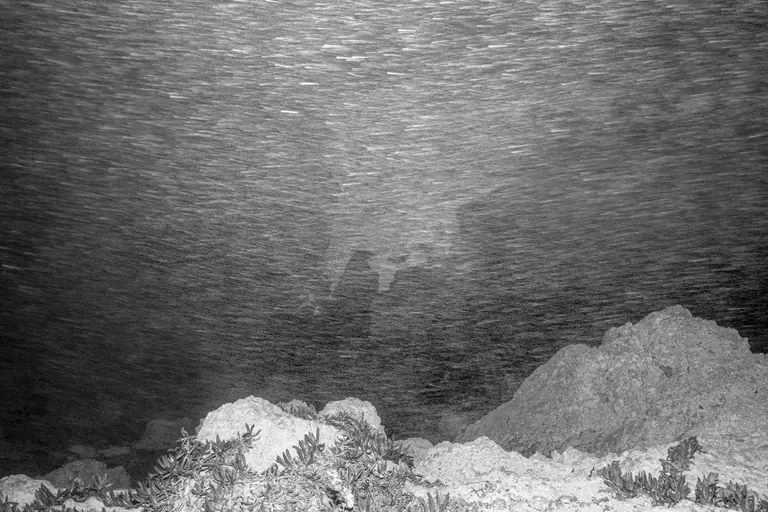

| Attribute             | Value                                                |
| :-------------------- | :--------------------------------------------------- |
| **Framing & Aspect**  | `LANDSCAPE` · `2048×1365` (Aspect: `1.50`)           |
| **Tonality & Breath** | `L*=46.03` — **Neutral** (CIELAB: `46.03, 0, -0.01`) |

**Curatorial Rationale & Montage Dynamic**:

- _Pacing Role_: Coda: Cosmic Resolution / Hyperstars over the Sea
- _Visual Subject & Content_: A long-exposure nightscape: concentric star trails wheel across the entire sky above a dark sea, white cliffs and coastal succulents glowing in the lower frame, no human presence anywhere.
- _Thematic Meaning_: The terminal release: after the last ideal is surrendered, the essay exits the city entirely into deep time — hyperstars rotating in silence above the indifferent ocean, the hypermassive finally still.
- _Composition & Gaze Vectors_: Concentric circular arcs sweeping the upper two-thirds, grounded by the angular bright rocks along the bottom edge.
- _Transition Dynamic_: Final contemplative resting frame of the visual essay.

---

## 3. Curatorial Proposals & Optimized Sequence Arc

The current sequence displays **optimal rhythmic pacing** (100/100) with harmonic alternation across Inhalation, Exhalation, and Neutral anchor frames.

## 4. Unsequenced Candidates & Outtakes (11)

### Candidate: DSCF0656-2.jpg

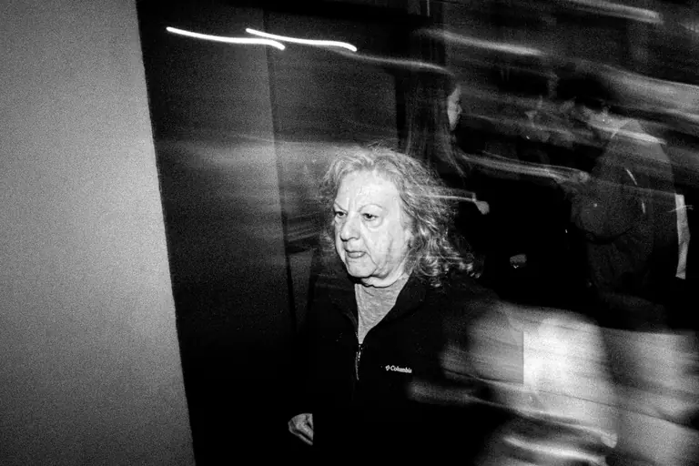

- **Metrics**: `LANDSCAPE` · `2048×1365` · `L*=27.97` (Exhalation)
- **Optimal Integration Slot**: Position #19 (`DSCF7202-2.JPG` → **`DSCF0656-2.jpg`** → `DSCF7027-6.JPG`)
- **Pacing Impact**: Net ΔEnergy `-0.1` · Local Step Cost `5.9` · Pacing Score `100/100`
- **Curatorial Suggestion**: Integrates smoothly between #18 (DSCF7202-2.JPG) and #19 (DSCF7027-6.JPG)
- **Curatorial Status**: Unsequenced candidate (review placement simulation above before integrating).

### Candidate: DSCF2076.jpg

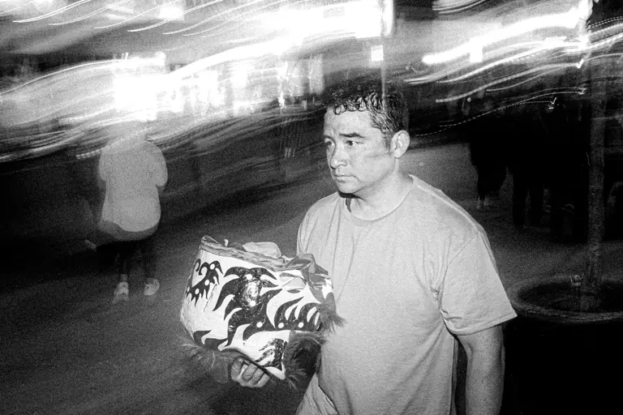

- **Metrics**: `LANDSCAPE` · `2048×1365` · `L*=46.44` (Neutral)
- **Optimal Integration Slot**: Position #6 (`DSCF9002-2.JPG` → **`DSCF2076.jpg`** → `DSCF0759-2.jpg`)
- **Pacing Impact**: Net ΔEnergy `-0.1` · Local Step Cost `10.4` · Pacing Score `100/100`
- **Curatorial Suggestion**: Integrates smoothly between #5 (DSCF9002-2.JPG) and #6 (DSCF0759-2.jpg)
- **Curatorial Status**: Unsequenced candidate (review placement simulation above before integrating).

### Candidate: DSCF5369-3.jpg

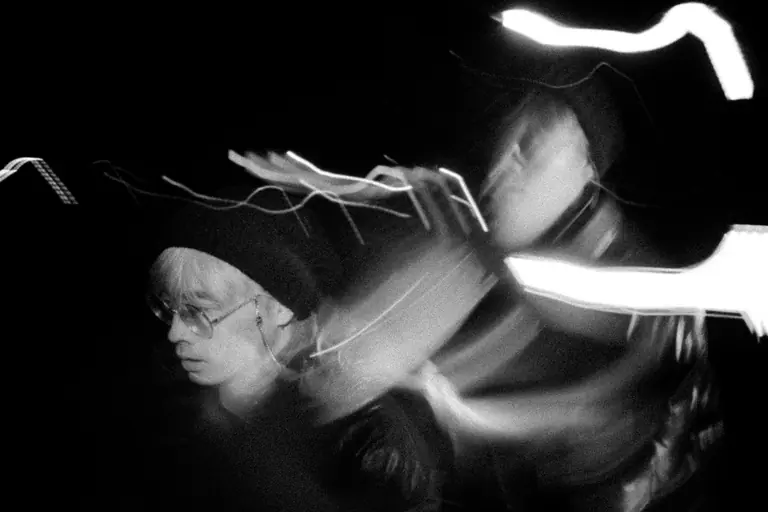

- **Metrics**: `LANDSCAPE` · `2048×1365` · `L*=19.4` (Exhalation)
- **Optimal Integration Slot**: Position #22 (`DSCF8873-3.JPG` → **`DSCF5369-3.jpg`** → `DSCF5378.jpg`)
- **Pacing Impact**: Net ΔEnergy `-0.1` · Local Step Cost `8.9` · Pacing Score `100/100`
- **Curatorial Suggestion**: Integrates smoothly between #21 (DSCF8873-3.JPG) and #22 (DSCF5378.jpg)
- **Curatorial Status**: Unsequenced candidate (review placement simulation above before integrating).

### Candidate: DSCF5373.jpg

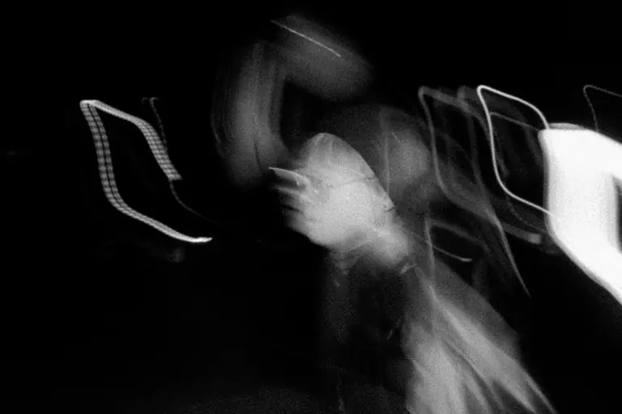

- **Metrics**: `LANDSCAPE` · `2048×1365` · `L*=12.25` (Exhalation)
- **Optimal Integration Slot**: Position #13 (`DSCF0175.jpg` → **`DSCF5373.jpg`** → `DSCF0617.jpg`)
- **Pacing Impact**: Net ΔEnergy `0` · Local Step Cost `10.5` · Pacing Score `100/100`
- **Curatorial Suggestion**: Integrates smoothly between #12 (DSCF0175.jpg) and #13 (DSCF0617.jpg)
- **Curatorial Status**: Unsequenced candidate (review placement simulation above before integrating).

### Candidate: DSCF7190.JPG

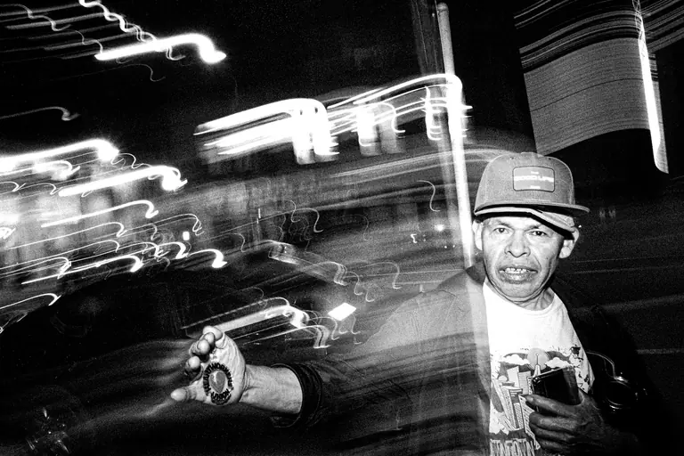

- **Metrics**: `LANDSCAPE` · `2048×1365` · `L*=30.59` (Exhalation)
- **Optimal Integration Slot**: Position #19 (`DSCF7202-2.JPG` → **`DSCF7190.JPG`** → `DSCF7027-6.JPG`)
- **Pacing Impact**: Net ΔEnergy `-0.1` · Local Step Cost `6` · Pacing Score `100/100`
- **Curatorial Suggestion**: Integrates smoothly between #18 (DSCF7202-2.JPG) and #19 (DSCF7027-6.JPG)
- **Curatorial Status**: Unsequenced candidate (review placement simulation above before integrating).

### Candidate: DSCF8630-5.jpg

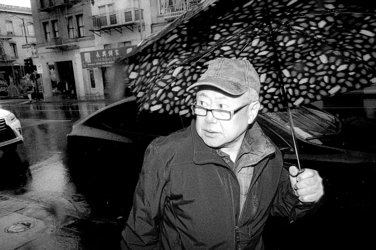

- **Metrics**: `LANDSCAPE` · `2048×1365` · `L*=26.65` (Exhalation)
- **Optimal Integration Slot**: Position #2 (`DSCF8985-2.JPG` → **`DSCF8630-5.jpg`** → `DSCF8978.JPG`)
- **Pacing Impact**: Net ΔEnergy `0` · Local Step Cost `3.5` · Pacing Score `100/100`
- **Curatorial Suggestion**: Integrates smoothly between #1 (DSCF8985-2.JPG) and #2 (DSCF8978.JPG)
- **Curatorial Status**: Unsequenced candidate (review placement simulation above before integrating).

### Candidate: DSCF8740-2.jpg

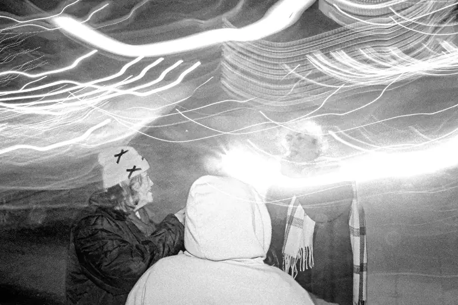

- **Metrics**: `LANDSCAPE` · `2048×1365` · `L*=65.49` (Inhalation)
- **Optimal Integration Slot**: Position #10 (`DSCF7178.JPG` → **`DSCF8740-2.jpg`** → `DSCF1664.jpg`)
- **Pacing Impact**: Net ΔEnergy `0` · Local Step Cost `15.4` · Pacing Score `100/100`
- **Curatorial Suggestion**: Integrates smoothly between #9 (DSCF7178.JPG) and #10 (DSCF1664.jpg)
- **Curatorial Status**: Unsequenced candidate (review placement simulation above before integrating).

### Candidate: DSCF8871-4.JPG

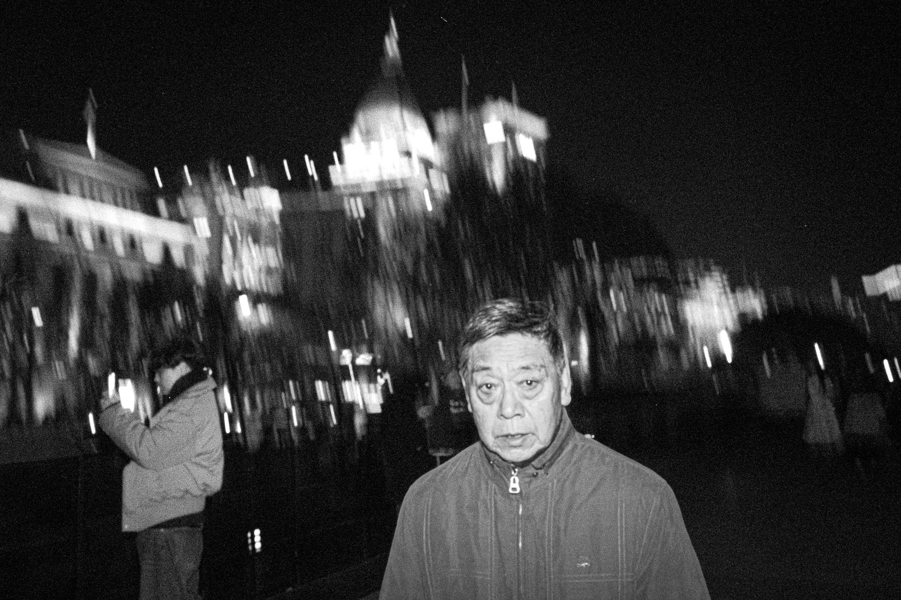

- **Metrics**: `LANDSCAPE` · `2048×1365` · `L*=21.7` (Exhalation)
- **Optimal Integration Slot**: Position #2 (`DSCF8985-2.JPG` → **`DSCF8871-4.JPG`** → `DSCF8978.JPG`)
- **Pacing Impact**: Net ΔEnergy `0` · Local Step Cost `3.5` · Pacing Score `100/100`
- **Curatorial Suggestion**: Integrates smoothly between #1 (DSCF8985-2.JPG) and #2 (DSCF8978.JPG)
- **Curatorial Status**: Unsequenced candidate (review placement simulation above before integrating).

### Candidate: DSCF8920-2.JPG

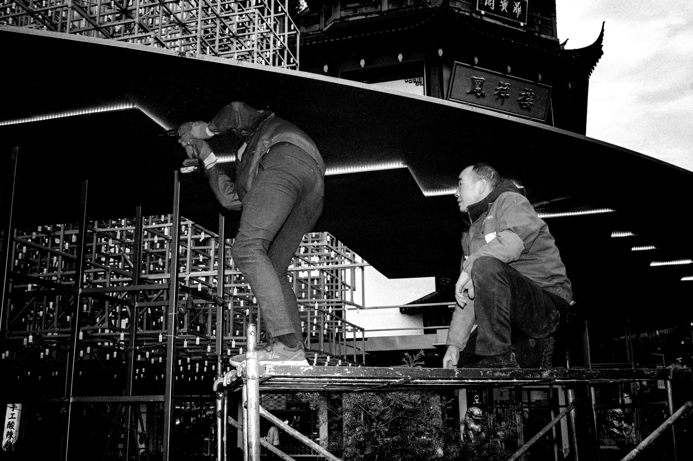

- **Metrics**: `LANDSCAPE` · `2048×1365` · `L*=21.25` (Exhalation)
- **Optimal Integration Slot**: Position #22 (`DSCF8873-3.JPG` → **`DSCF8920-2.JPG`** → `DSCF5378.jpg`)
- **Pacing Impact**: Net ΔEnergy `-0.1` · Local Step Cost `8.9` · Pacing Score `100/100`
- **Curatorial Suggestion**: Integrates smoothly between #21 (DSCF8873-3.JPG) and #22 (DSCF5378.jpg)
- **Curatorial Status**: Unsequenced candidate (review placement simulation above before integrating).

### Candidate: DSCF8959.JPG

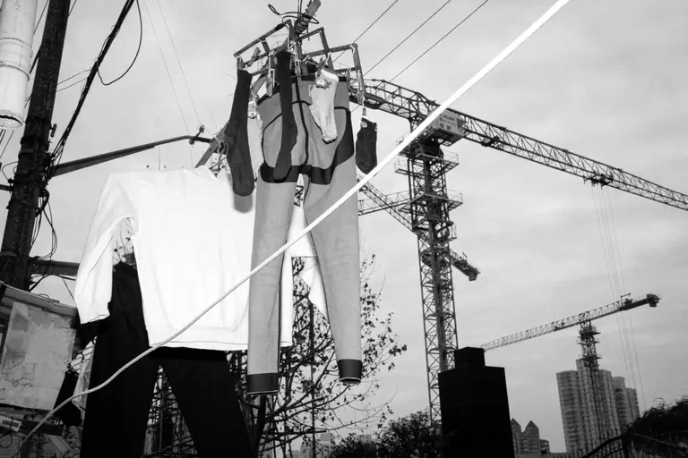

- **Metrics**: `LANDSCAPE` · `2048×1365` · `L*=64.36` (Inhalation)
- **Optimal Integration Slot**: Position #10 (`DSCF7178.JPG` → **`DSCF8959.JPG`** → `DSCF1664.jpg`)
- **Pacing Impact**: Net ΔEnergy `0` · Local Step Cost `15.4` · Pacing Score `100/100`
- **Curatorial Suggestion**: Integrates smoothly between #9 (DSCF7178.JPG) and #10 (DSCF1664.jpg)
- **Curatorial Status**: Unsequenced candidate (review placement simulation above before integrating).

### Candidate: DSCF8968-2.JPG

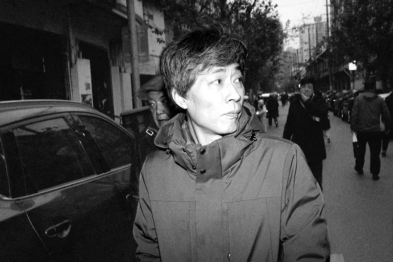

- **Metrics**: `LANDSCAPE` · `2048×1365` · `L*=28.85` (Exhalation)
- **Optimal Integration Slot**: Position #22 (`DSCF8873-3.JPG` → **`DSCF8968-2.JPG`** → `DSCF5378.jpg`)
- **Pacing Impact**: Net ΔEnergy `-0.1` · Local Step Cost `8.9` · Pacing Score `100/100`
- **Curatorial Suggestion**: Integrates smoothly between #21 (DSCF8873-3.JPG) and #22 (DSCF5378.jpg)
- **Curatorial Status**: Unsequenced candidate (review placement simulation above before integrating).
